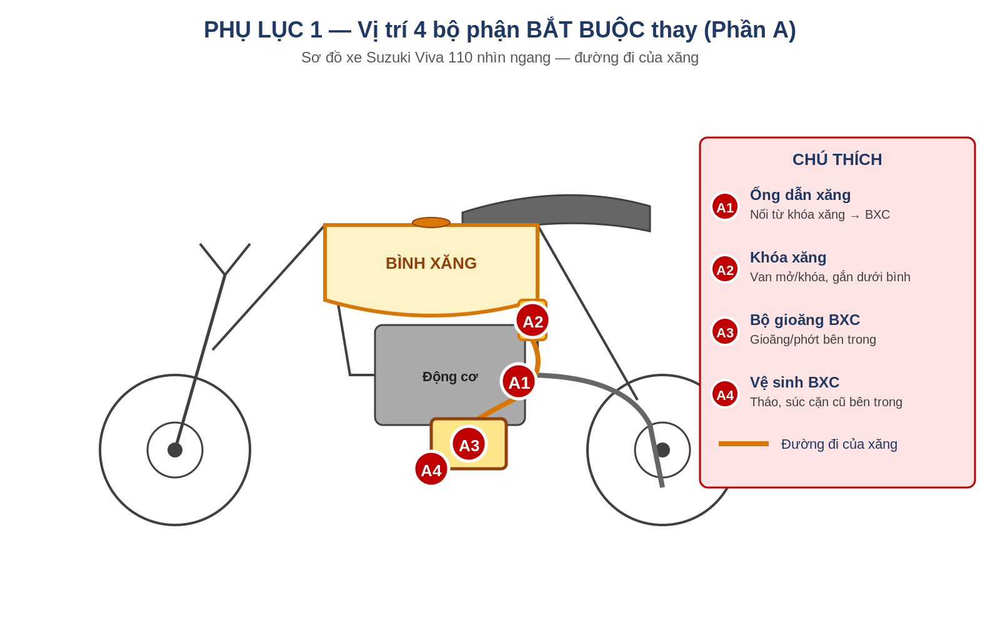
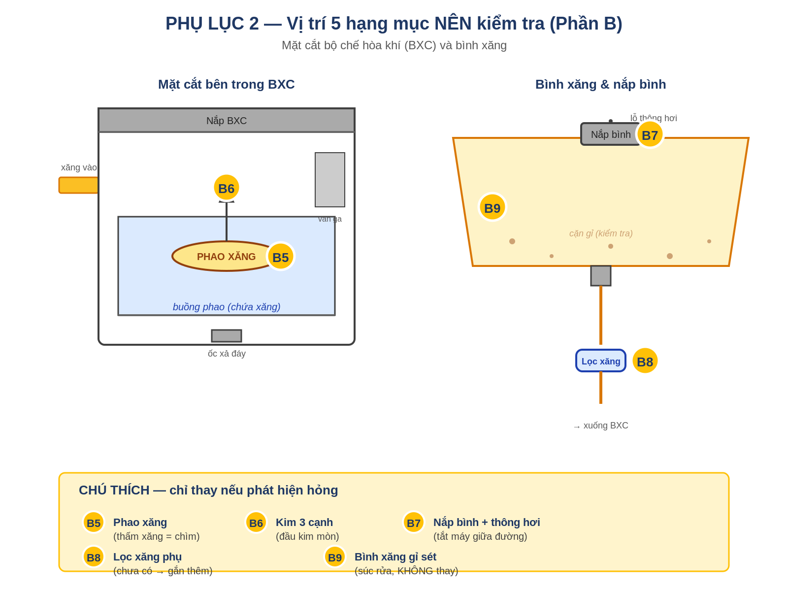

# CHECKLIST PHỤ TÙNG SUZUKI VIVA 2004
*Chuẩn bị xe để sử dụng xăng sinh học E5 RON 92 / E10 RON 95*

*Mục đích: Đảm bảo các chi tiết cao su, gioăng trong hệ thống nhiên liệu không bị ethanol ăn mòn → tránh rò rỉ xăng và nguy cơ cháy nổ. Đây là tài liệu để bạn cầm ra tiệm sửa xe, nắm rõ những việc CẦN làm và những việc KHÔNG cần — tránh bị tính thêm những hạng mục không liên quan.*

## PHẦN A — Bắt buộc làm (ưu tiên cao nhất)
*Nhóm này là việc CẦN thiết để xe an toàn với xăng E5/E10. Nên yêu cầu thợ làm cả 4 mục cùng một lần để tiết kiệm công.*

<table>
<tbody>
<tr class="odd">
<td><strong>STT</strong></td>
<td><strong>Hạng mục</strong></td>
<td><strong>Vì sao cần làm</strong></td>
<td><strong>Phụ tùng cần</strong></td>
</tr>
<tr class="even">
<td><strong>1</strong></td>
<td><strong>Thay ống dẫn xăng</strong></td>
<td>Đây là điểm rò rỉ nguy hiểm nhất. Cao su cũ + ethanol = nứt, rò xăng → nguy cơ cháy nổ.</td>
<td>
<strong>0.5–1m ống chịu cồn. Tham khảo theo thứ tự ưu tiên:</strong>

① Viton (FKM) — tốt nhất, đặt qua Hose Power VN

② Tygon F-4040-A — chuẩn vàng, đặt Shopee Global/Amazon

③ Cao su NBR có in "SAE J30 R7" hoặc "R9" — dễ mua nhất

④ Ống xăng zin Honda/Suzuki Wave/Dream (Shopee/Lazada)

<em>✗ Tránh: ống trong suốt loại rẻ không in tiêu chuẩn</em>
</td>
</tr>
<tr class="odd">
<td><strong>2</strong></td>
<td><strong>Thay khóa xăng hoặc gioăng khóa xăng</strong></td>
<td>Gioăng cao su cũ rò rỉ xăng khi xe nghiêng. Đây là điểm rò xăng phổ biến thứ hai sau ống dẫn.</td>
<td>Khóa xăng tự động Centa (loại dành cho Suzuki Viva) hoặc bộ gioăng khóa xăng riêng</td>
</tr>
<tr class="even">
<td><strong>3</strong></td>
<td><strong>Thay bộ gioăng đại tu bình xăng con (BXC)</strong></td>
<td>Gioăng nắp BXC, gioăng đáy buồng phao, phớt kim phao, O-ring nơi ống xăng cắm vào — đều là cao su lâu năm.</td>
<td>1 bộ gioăng đại tu BXC cho Suzuki Viva (đồ zin Suzuki tốt nhất)</td>
</tr>
<tr class="odd">
<td><strong>4</strong></td>
<td><strong>Vệ sinh BXC</strong></td>
<td>Cặn cũ trong BXC có thể bị ethanol bong tróc, gây nghẹt khi chuyển sang E5/E10.</td>
<td>Không cần phụ tùng — chỉ tính công thợ (làm cùng lúc với mục 3)</td>
</tr>
</tbody>
</table>

## PHẦN B — Nên kiểm tra (chỉ thay nếu phát hiện hỏng)
*Nhóm này KHÔNG bắt buộc thay. Yêu cầu thợ kiểm tra trong lúc tháo BXC, nếu phát hiện hư hỏng thì báo trước để bạn quyết định.*

|         |                                           |                                                                                        |                                                 |
| ------- | ----------------------------------------- | -------------------------------------------------------------------------------------- | ----------------------------------------------- |
| **STT** | **Hạng mục**                              | **Khi nào nên thay**                                                                   | **Phụ tùng (nếu cần)**                          |
| **5**   | **Phao xăng**                             | Khi phao bị thấm xăng (chìm xuống) thay vì nổi đều.                                    | Phao xăng Suzuki Viva                           |
| **6**   | **Kim 3 cạnh (needle valve)**             | Khi đầu kim bị mòn, không khít → xăng tràn ra ngoài qua ống xả.                        | Kim 3 cạnh Suzuki Viva                          |
| **7**   | **Nắp bình xăng + lỗ thông hơi**          | Khi nắp bị hỏng gioăng hoặc lỗ thông hơi bị tắc (xe có hiện tượng tắt máy giữa đường). | Nắp bình xăng Viva (nếu cần thay)               |
| **8**   | **Lọc xăng phụ**                          | Nếu xe chưa gắn, nên gắn thêm. Nếu có rồi → thay mới.                                  | Lọc xăng phổ thông cho xe số (gắn trên ống dẫn) |
| **9**   | **Bình xăng (kiểm tra gỉ sét bên trong)** | Mở nắp soi đèn vào: có cặn vàng/đỏ thì cần SÚC RỬA bình. KHÔNG cần thay bình mới.      | Chỉ tính công súc rửa, không cần phụ tùng       |

## PHẦN C — KHÔNG cần làm (cảnh giác "vẽ việc")
*Các hạng mục dưới đây KHÔNG liên quan đến việc chuyển xăng E5/E10. Nếu thợ đề xuất kèm theo, hãy hỏi rõ lý do và đừng đồng ý ngay.*

|                                                    |                                                                                                                   |
| -------------------------------------------------- | ----------------------------------------------------------------------------------------------------------------- |
| **Hạng mục thợ có thể đề xuất**                    | **Vì sao KHÔNG liên quan E5/E10**                                                                                 |
| **Thay nguyên BỘ chế hòa khí mới**                 | Chỉ cần thay BỘ GIOĂNG bên trong + vệ sinh. Thân BXC bằng nhôm, không bị ethanol ảnh hưởng.                       |
| **Đại tu máy / xoáy nòng / thay piston, xéc măng** | Đây là cơ khí động cơ. E5/E10 không gây hỏng máy. Chỉ làm nếu máy có triệu chứng riêng (xanh khói, yếu máy).      |
| **Thay phớt máy / phớt cốt máy**                   | Liên quan đến rò dầu nhớt, không phải xăng. Không liên quan E5/E10.                                               |
| **"Cân chỉnh ECU" / "Reset máy tính"**             | Suzuki Viva 2004 KHÔNG có ECU. Đây là xe chế hòa khí, không có phun xăng điện tử. Nếu thợ nói câu này → đổi tiệm. |
| **Thay bơm xăng**                                  | Viva 2004 không có bơm xăng điện. Xăng tự chảy từ bình xuống BXC bằng trọng lực.                                  |
| **Thay bugi, dây ga, dây côn, má phanh, lốp**      | Đây là hao mòn cơ khí thông thường, không liên quan E5. Chỉ thay nếu xe có triệu chứng cụ thể.                    |
| **Thay nhớt máy / dầu phanh**                      | Lịch định kỳ. Không cần làm cùng dịp thay phụ tùng cho E5 trừ khi đến hạn.                                        |

## PHẦN D — Kịch bản giao tiếp với thợ
### Câu nói mở đầu khi đến tiệm
> *Anh ơi, em có xe Suzuki Viva 2004 muốn chuẩn bị cho xăng E5/E10. Em muốn làm 4 việc chính: (1) thay ống dẫn xăng loại chịu cồn, (2) thay khóa xăng hoặc gioăng khóa xăng, (3) thay bộ gioăng đại tu bình xăng con, và (4) vệ sinh BXC. Anh kiểm tra giúp em xem phao xăng và kim 3 cạnh có cần thay không — nếu có, báo em biết trước khi làm. Em không cần làm gì khác liên quan đến máy, phanh, hay điện.*

### Câu hỏi nên hỏi trước khi đồng ý
  - **Ống dẫn xăng anh dùng loại gì?** Có in chữ "Fuel Resistant" hoặc "SAE J30" trên thân ống không?

  - **Bộ gioăng BXC có phải đồ zin Suzuki không?** Cho em xem vỏ hộp / bao bì được không?

  - **Nếu phát sinh phụ tùng cần thay thêm, anh báo em trước khi làm nhé.** Em muốn được duyệt từng món.

  - **Anh có bảo hành không?** Bao lâu, áp dụng cho phụ tùng hay cả công?

### Các câu nói "đỏ cờ" cần cảnh giác
  - **"Phải thay nguyên bộ chế hòa khí mới" →** KHÔNG cần. Chỉ cần thay gioăng bên trong + vệ sinh.

  - **"Phải làm lại máy / xoáy nòng / thay piston" →** KHÔNG liên quan E5/E10. Chỉ làm nếu máy có triệu chứng riêng.

  - **"Phải canh lại ECU / máy tính" →** Viva 2004 KHÔNG có ECU. Đổi tiệm khác.

  - **"Phải đại tu cả động cơ" →** Không liên quan E5. Tổng chi phí riêng việc này không nên vượt 1 triệu.

## PHẦN E — Chi phí ước tính (tham khảo)
*Giá ở Hà Nội năm 2026, có thể chênh lệch theo tiệm. Đây là khung tham khảo để bạn so sánh khi nhận báo giá.*

|                                |                       |                       |
| ------------------------------ | --------------------- | --------------------- |
| **Hạng mục**                   | **Phụ tùng (VNĐ)**    | **Công thợ (VNĐ)**    |
| Ống dẫn xăng chịu cồn (\~1m)   | 30.000 – 80.000       | 20.000 – 50.000       |
| Khóa xăng Centa                | 60.000 – 150.000      | 20.000 – 50.000       |
| Bộ gioăng đại tu BXC + vệ sinh | 80.000 – 200.000      | 100.000 – 200.000     |
| Lọc xăng phụ (nếu gắn thêm)    | 20.000 – 50.000       | 10.000 – 20.000       |
| Phao xăng (chỉ nếu cần)        | 50.000 – 100.000      | gộp vào công BXC      |
| Kim 3 cạnh (chỉ nếu cần)       | 30.000 – 80.000       | gộp vào công BXC      |
| **TỔNG ƯỚC TÍNH**              | **300.000 – 500.000** | **150.000 – 300.000** |

**Tổng cộng dự kiến: 450.000đ — 800.000đ** (phụ tùng + công)

**Nếu báo giá vượt 1.000.000đ** cho riêng phần chuẩn bị E5/E10 (không kèm việc khác như thay nhớt, lốp...), hãy yêu cầu xem chi tiết từng món hoặc tham khảo tiệm khác.

## PHẦN F — Lưu ý vận hành sau khi thay phụ tùng
  - Không để bình xăng đầy E5/E10 đứng yên quá 30 ngày — ethanol hút ẩm gây tách lớp xăng-nước, dẫn đến gỉ bình và nghẹt BXC.

  - Nếu cất xe lâu (đi công tác, về quê...): đổ đầy bình 100% hoặc xả gần cạn. Khoảng trống chứa hơi ẩm là nguyên nhân chính.

  - Kiểm tra mắt thường mỗi 1-2 tuần: nhìn các đoạn ống dẫn xăng, đặc biệt chỗ uốn cong và chỗ kẹp. Phát hiện sớm vết ướt, mùi xăng, hoặc nứt "chân chim".

  - Tránh đậu xe gần nguồn lửa/nhiệt cao trong 1-2 giờ đầu sau khi chạy. BXC nóng + rò rỉ nhẹ = nguy hiểm.

  - Ưu tiên đổ E5 RON 92-II khi còn bán (đến hết 31/12/2030) thay vì E10. Xe Viva 2004 không cần RON 95 — đổ RON 92 là đủ.

## PHẦN G — Địa chỉ tham khảo tại Hà Nội
### Mua phụ tùng zin
  - Suzuki Khang Thịnh — 284 Phố Vọng, Thanh Xuân. Hotline: 024.2211.9119

  - Suzuki An Việt — QL1A Vĩnh Quỳnh, Thanh Trì. 0968 567 922

### Tiệm tư nhân chuyên xe đời cũ / Suzuki
  - Xưởng Dũng "Lò Rèn" — 6 Hàng Gà, Hoàn Kiếm (chuyên xe đời cũ)

  - Trung Hiếu Motor — chuyên Suzuki, có sửa lưu động

  - Sửa xe Gia Sơn — 99 Giảng Võ, Ba Đình

  - Cứu hộ xe máy Viva 24h — 58 Phố Huế, 104 Đội Cấn, 65 Khâm Thiên

### Cộng đồng để tham vấn / mua phụ tùng zin tháo xe
  - Hội phụ tùng Suzuki Viva — facebook.com/groups/phutungsuzukiviva (group lớn nhất, hỏi gì cũng có người trả lời)

  - Suzuki Viva 110 — facebook.com/groups/suzukiviva110

## PHỤ LỤC — Hình minh họa vị trí các bộ phận
*Hai sơ đồ dưới đây minh họa vị trí 4 bộ phận BẮT BUỘC thay (Phần A) và 5 hạng mục NÊN kiểm tra (Phần B) — để bạn dễ hình dung khi nói chuyện với thợ.*

### Phụ lục 1 — Vị trí các bộ phận thuộc Phần A (BẮT BUỘC thay)

*A1 (Ống dẫn xăng) là đoạn ống cao su màu cam trong hình, nối từ khóa xăng xuống bộ chế hòa khí. A2 (Khóa xăng) là van nhỏ gắn ngay dưới bình xăng. A3 và A4 cùng nằm trong bộ chế hòa khí — bộ phận hình hộp gắn bên hông động cơ.*

### Phụ lục 2 — Vị trí các hạng mục thuộc Phần B (NÊN kiểm tra)

*Bên trái là mặt cắt bên trong bộ chế hòa khí: B5 (Phao xăng) là cục nổi hình bầu dục, B6 (Kim 3 cạnh) là cây kim đóng mở lỗ xăng vào theo mức phao. Bên phải là bình xăng nhìn từ ngoài: B7 (Nắp bình) gồm cả gioăng nắp và lỗ thông hơi, B8 (Lọc xăng phụ) gắn trên đường ống nếu chưa có, B9 (kiểm tra gỉ sét bên trong bình) — chỉ súc rửa, không thay bình.*

### Phụ lục 3 — Kinh nghiệm mua phụ tùng (case study)
*Phần này ghi lại quá trình đặt hàng thực tế từ đại lý Suzuki Hải Hoàng Phát (hpsuzuki.net) — tham khảo cho lần sau hoặc cho người dùng Viva khác cùng cảnh ngộ.*

**Phụ tùng đã đặt (Suzuki Hải Hoàng Phát — chính hãng, có VAT)**

*Tổng đơn 623.700đ. Liên hệ Mr. Phát — Zalo/Hotline 0945.675.425. Bảo hành 1 đổi 1, ship Vĩnh Long → Hà Nội \~2-3 ngày.*

|         |                                                                              |                   |                |
| ------- | ---------------------------------------------------------------------------- | ----------------- | -------------- |
| **STT** | **Tên phụ tùng (theo hóa đơn shop)**                                         | **Đơn giá (VNĐ)** | **Thành tiền** |
| 1       | Lọc xăng ống điếu — Đa Dụng                                                  | 11.000            | 11.000         |
| 2       | Lọc xăng — Đa Dụng (mua dư — thực tế chỉ cần 1 loại)                         | 25.000            | 25.000         |
| 3       | Ống xăng Zin 45cm — Đa Dụng                                                  | 36.000            | 36.000         |
| 4       | Nắp bình xăng lớn — Suzuki Đa Dụng                                           | 66.000            | 66.000         |
| 5       | Bông Tu BXC — Đa Dụng (= kim 3 cạnh, mục B6)                                 | 90.000            | 90.000         |
| 6       | Van Khóa Xăng Tự Động — 3 chân — Viva 09G, Smash, Revo, Shogun, Xbike, Axelo | 256.000           | 256.000        |
| 7       | Combo Sin Bình Xăng Con — Viva (mã COMBOSINBXCVIVA)                          | 110.000           | 110.000        |
|         | **Tổng tiền hàng**                                                           |                   | **594.000**    |
|         | VAT 5%                                                                       |                   | 29.700         |
|         | **TỔNG CỘNG**                                                                |                   | **623.700**    |

**5 bài học quan trọng từ lần mua này**

**1. PHẢI tự kiểm tra trên xe trước khi đặt phụ tùng có biến thể**

Ban đầu một số nguồn online nói Viva 110 dùng khóa xăng "4 chân". Nhưng kiểm tra thực tế xe (variant Viva 09G) thì khóa xăng là loại "3 chân" — dùng chung nhóm với Smash, Revo, Shogun, Xbike, Axelo. Suzuki có nhiều phiên bản Viva 110 theo năm/lô sản xuất.

→ Trước khi đặt khóa xăng (và các phụ tùng có biến thể), ra tiệm tháo ra ĐẾM số "chân" (đầu nối kim loại) hoặc chụp hình thật gửi shop xác nhận.

**2. Không phải mọi phụ tùng đều bán lẻ**

Phao xăng (mục B5) tại hpsuzuki KHÔNG bán lẻ — chỉ bán nguyên cụm BXC giá 2.737.000đ. Cách xử lý:

  - Bỏ qua như mục này — chỉ thay khi tiệm tháo BXC ra và xác nhận phao xăng cũ bị thấm xăng (chìm xuống)

  - Nếu cần thay, tìm trên group Facebook "Hội phụ tùng Suzuki Viva" — đồ zin tháo xe cũ, giá rẻ

  - Hoặc đặt từ shop nhỏ trên Shopee với keyword "phao xăng Suzuki Viva 110"

**3. Phụ tùng "Đa Dụng" KHÁC phụ tùng "zin theo xe"**

Trên hóa đơn nhiều món ghi "Đa Dụng" (universal) — như Lọc xăng, Ống xăng Zin, Bông Tu BXC, Nắp bình xăng. Đây là phụ tùng phổ thông sản xuất chuẩn cho nhiều dòng xe.

Quan trọng: dù là "Đa Dụng", nếu mua từ kênh chính hãng Suzuki thì chất lượng vẫn đảm bảo. Lý do shop dùng "Đa Dụng" thường là: hết hàng zin Viva (do đời 2004 đã lâu), HOẶC đó vốn là chi tiết tiêu chuẩn dùng chung được (như lọc xăng, ống xăng).

**4. Mua chính hãng có VAT — dấu hiệu shop hợp pháp**

Hpsuzuki xuất hóa đơn VAT 5% kèm theo. Đây là dấu hiệu đại lý hợp pháp, có pháp nhân, có thể yêu cầu hóa đơn đỏ nếu cần xuất công ty. Khi gặp shop chỉ chuyển khoản cá nhân, không xuất hóa đơn — nên cẩn trọng.

**5. Lọc xăng: chỉ cần 1 loại**

Trong đơn này có 2 loại lọc xăng (Lọc ống điếu 11k + Lọc đa dụng 25k) — thực tế chỉ cần 1. Khi mang phụ tùng ra tiệm, hỏi thợ loại nào phù hợp với xe và CHỈ GẮN 1 LOẠI.

  - Lọc xăng ống điếu = lọc inline đơn giản, gắn giữa đoạn ống dẫn xăng

  - Lọc xăng đa dụng (có vỏ) = lọc có vỏ kim loại/nhựa cứng, hiệu quả cao hơn

Lọc còn dư có thể giữ lại làm phụ tùng dự phòng.

**Kinh nghiệm tham khảo từ shop (chia sẻ cá nhân)**

Một yếu tố đã giúp mình tự tin chọn khóa xăng zin Suzuki (256k) thay vì Centa (\~150k) là phản hồi của chính shop hpsuzuki:

> *Shop đã chạy thử các phụ tùng cùng loại với xăng E10 trong khoảng 1 tháng, đi được \~200km và không thấy dấu hiệu ảnh hưởng (rò rỉ, biến dạng, mòn bất thường).*

**Cách hiểu đúng về thông tin này:**

  - Đây là CHIA SẺ CÁ NHÂN từ shop, không phải kiểm nghiệm chính thức của Suzuki hay tổ chức kỹ thuật độc lập.

  - Mẫu thử 200km / 1 tháng là tín hiệu tích cực, nhưng chưa đủ dài để đánh giá ảnh hưởng dài hạn của ethanol (cao su có thể phồng/lão hóa từ từ sau 6-12 tháng).

  - Phù hợp coi như "không có cảnh báo đỏ" — kết hợp với chính sách bảo hành 1 đổi 1 của shop, đủ cơ sở để chọn zin.

  - KHÔNG nên dựa duy nhất vào thông tin này để khẳng định "đồ zin chịu E10 vô thời hạn" với người khác.

*Trong trường hợp của xe đời 22 năm tuổi, việc đầu tư zin (đắt hơn \~100k) đổi lấy độ bền dài hạn và giảm rủi ro phải thay lại sớm là một quyết định hợp lý — đặc biệt khi shop sẵn sàng bảo hành.*

**So sánh chi phí ước tính ban đầu vs thực tế**

*Để bạn (hoặc người khác) có chuẩn so sánh cho lần sau:*

|                           |                      |                    |                    |
| ------------------------- | -------------------- | ------------------ | ------------------ |
| **Hạng mục**              | **Ước tính ban đầu** | **Thực tế đã mua** | **Ghi chú**        |
| Ống dẫn xăng              | 30k – 80k            | 36.000             | Đúng               |
| Khóa xăng                 | 60k – 150k           | 256.000            | Cao hơn (chọn zin) |
| Bộ gioăng BXC (Combo Sin) | 80k – 200k           | 110.000            | Đúng               |
| Lọc xăng                  | 20k – 50k            | 36.000             | Mua dư 1 cái       |
| Nắp bình xăng             | 80k – 200k           | 66.000             | Tốt hơn dự kiến    |
| Kim 3 cạnh (Bông Tu)      | 30k – 80k            | 90.000             | Cao hơn chút       |
| Phao xăng                 | 50k – 100k           | Không mua          | Shop không lẻ      |
| VAT 5%                    | —                    | 29.700             | Chính hãng         |
| **TỔNG PHỤ TÙNG**         | **300k – 760k**      | **623.700**        |                    |

*Thực tế nằm gần đầu trên của ước tính vì chọn khóa xăng zin Suzuki (256k) thay vì Centa (\~150k). Quyết định chọn zin dựa trên 2 cơ sở: (1) độ bền dài hạn so với chênh lệch giá \~100k là chấp nhận được cho xe 22 năm tuổi, (2) tham khảo chia sẻ cá nhân của shop về việc đã test phụ tùng với E10 \~200km không thấy vấn đề (xem chi tiết ở phần trên). Nếu ưu tiên giá rẻ, chọn Centa thì tổng giảm còn \~470-500k.*

**Các bước tiếp theo**

  - Nhận hàng tại Hà Nội (ship Vĩnh Long → HN \~2-3 ngày)

  - Mang phụ tùng + xe đến tiệm tin cậy ở Hà Nội (tham khảo Phần G — Địa chỉ tham khảo)

  - Yêu cầu thợ thay theo Phần A. CHỈ thay phao xăng nếu tiệm tháo BXC ra và xác nhận hỏng — nếu hỏng thì đặt riêng sau từ kênh Facebook

  - Chỉ gắn 1 loại lọc xăng (loại nào do thợ tư vấn), giữ loại còn lại làm dự phòng

  - Yêu cầu thợ in/ghi rõ những gì đã thay vào biên nhận để có hồ sơ bảo dưỡng

  - Công thợ dự kiến: 150k – 300k. Tổng cuối: 800k – 1.000k

*Tài liệu này được tổng hợp từ thông tin VAMM, các báo Tuổi Trẻ, Dân Trí, VnExpress và cộng đồng người dùng Suzuki Viva. Là tài liệu tham khảo, bạn nên xác minh với thợ/đại lý trước khi thực hiện.*
