Trong một góc khuất giữa đô thị phồn hoa Hong Kong lưu truyền một câu chuyện huyền thoại kéo dài hơn nửa thế kỷ — về một bậc thầy phong thủy được tôn xưng là “quân sư của giới siêu giàu” Trần Lãng cùng người con trai sau này kế thừa y bát của ông là Trần Gia Long. Câu chuyện của họ không chỉ là lịch sử truyền thừa của một gia tộc, mà còn là bức tranh độc đáo phản ánh sự biến chuyển của xã hội Hong Kong và thăng trầm của tầng lớp giàu có.
Trong dân gian có câu: “Người nghèo xem số mệnh, người giàu xem phong thủy.” Câu nói này dường như đúng ở khắp châu Á: càng giàu có thì càng tin vào phong thủy.
Hong Kong cũng không ngoại lệ. Nhìn lại quá khứ, Hong Kong từng có rất nhiều thầy phong thủy lợi hại, nhưng người được xem là xuất sắc nhất vẫn là Trần Lãng.
Nghe nói Trần Lãng là người khiêm tốn, sâu sắc, thường giúp không ít nhân vật lớn trong giới kinh doanh và giới giải trí Hong Kong xem tướng, đoán mệnh, cải vận, xem phong thủy, và kết quả đều rất linh nghiệm.
Hôm nay, xin chia sẻ câu chuyện truyền thừa thuật phong thuỷ của hai cha con Trần Lãng – Trần Gia Long.

> @V盟文史 @月下灰 © Dịch từ bài viết của trên Sohu, kết hợp cùng một số nguồn khác như: bài viết của @野兽派娱乐 @一波说 trên Zhihu, bài viết của trên Sohu, bài viết của trên Xueqiu.

> @V盟文史 Bài viết của trên Sohu được đăng tải ngày 28 tháng 6 năm 2025 với tiêu đề “Một đại sư phong thủy nổi tiếng ở Hong Kong, được xếp ngang hàng với Bạch Long Vương, là người được các tỷ phú hàng đầu tin tưởng, từng theo học một nhân vật thuộc hoàng thân quốc thích thực thụ.”

> @野兽派娱乐 Bài viết của trên Sohu được đăng tải ngày 28 tháng 5 năm 2017 với tiêu đề “Những câu chuyện của 3 vị thầy phong thuỷ này tuyệt đối còn ly kỳ hơn cả giới giải trí”.

> @一波说 Bài viết của trên Xueqiu được đăng tải ngày 3 tháng 12 năm 2025 với tiêu đề “Mỉm cười nhìn sự đổi thay của giới hào môn, truyền kỳ phong thủy của hai cha con Trần Lãng – Trần Gia Long, quân sư ruột của Lý Gia Thành”.

> © Bài dịch gốc của Facebook page [Hôm nay giới thượng lưu có gì?](https://www.facebook.com/Homnaygioithuongluucogi "Hôm nay giới thượng lưu có gì?")

## Trần Lãng — Xuất thân và con đường tu đạo

Trần Lãng sinh năm 1925 trong một gia đình giàu có ở Tứ Xuyên.
Sau này, nhờ có trình độ uyên thâm trong các lĩnh vực phong thuỷ và mệnh lý, ông được người đời tôn Bá[^1]”. kính gọi là “Trần
Tương truyền, khi Trần Lãng còn nhỏ, có một ngày tình cờ đi ngang qua một sạp xem bói, đối diện là một người phụ nữ đang ngồi xem. Chỉ thấy thầy bói hỏi vài câu về bát tự ngày sinh của bà ta, liền tính ra rõ ràng bà bao nhiêu tuổi thì đến kỳ kinh nguyệt, bao nhiêu tuổi kết hôn, sinh mấy người con, thậm chí có mấy người con trai mấy, con gái cũng nói rành rọt. Người phụ nữ nghe xong liên tục gật đầu xác nhận.

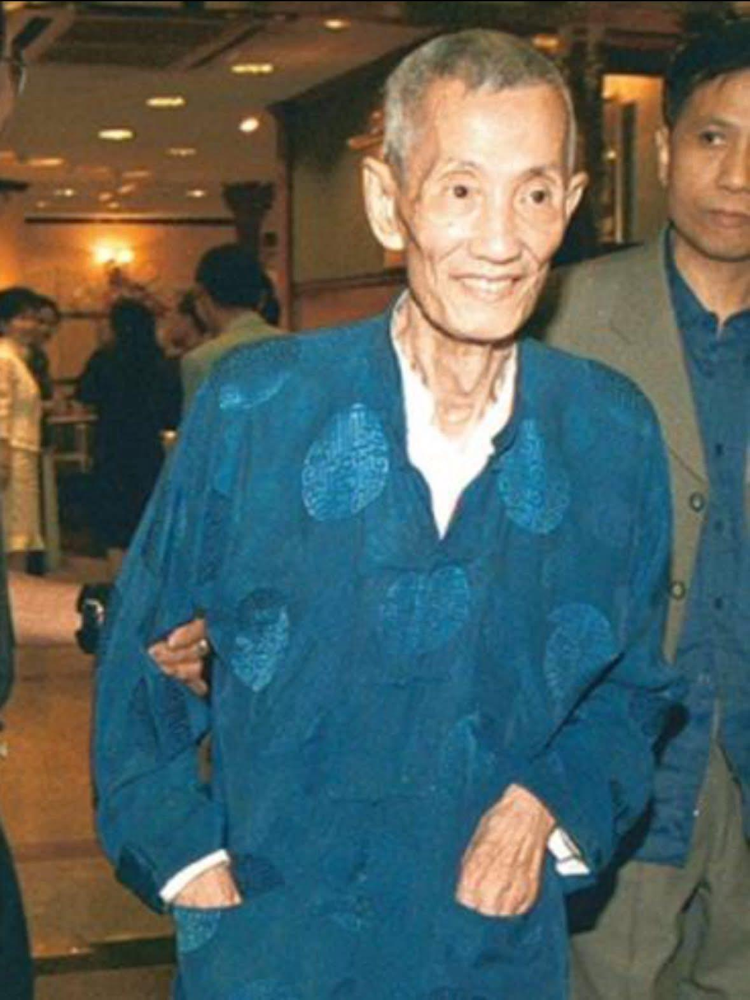

Chứng kiến cảnh tượng kỳ diệu ấy, cậu bé Trần Lãng lập tức bị huyền học mê hoặc. Về đến nhà, Trần Lãng cứ nằng nặc đòi học xem mệnh.
Cha Trần Lãng vốn là một danh sĩ có tiếng trong vùng, từ nhỏ đã được hun đúc trong môi trường gia học, tinh thông Kinh Dịch, bát quái, phong thủy và tướng số. Thấy con trai cũng yêu thích con đường này, ông liền mời hai vị đại sư mệnh lý nổi danh đến tận nhà để trực tiếp truyền dạy.
Chẳng bao lâu, khả năng luận mệnh của Trần Lãng đã vượt xa những quầy bói ven đường. Khi lớn hơn một chút, ông còn lên núi Thanh Thành tu hành chuyên tâm suốt nhiều năm liền.
Bản thân ông vốn nghĩ sau này mình cũng chỉ trở thành một thầy phong thủy biết xem quẻ, tính toán mà thôi. Thế nhưng nhà họ Trần là danh gia vọng tộc tại địa phương, nên khi Trần Lãng tu hành trở về, gia đình đã sớm mời cho ông một vị đại sư quốc học thực thụ — Phổ Tâm Dư.
Phổ Tâm Dư nhận Trần Lãng làm đệ tử.
Xuất thân của Phổ Tâm Dư không hề tầm thường. Ông là cháu nội của Cung Thân Vương Dịch Hân triều Thanh, là anh em họ với Phổ Nghi, đúng nghĩa hoàng thân quốc thích. Không chỉ vậy, ông từng du học

[^1]: Bá (伯) ở đây là cách gọi tôn kính dành cho bậc trưởng giả có địa vị, có học vấn, được nhiều người kính trọng.
châu Âu, tinh thông cả Đông lẫn Tây, trình độ nghệ thuật vô cùng cao, đương thời cùng Trương Đại Thiên được xưng tụng là “Nam Trương Bắc Phổ”.
Chính vì thế, Trần Lãng xuất thân từ danh môn chính phái, so với những kẻ giang hồ thuật sĩ như Vương Lâm về sau, quả thực khác biệt rất lớn.
Dưới sự chỉ dạy tận tâm của Phổ Tâm Dư, Trần Lãng có được sự lĩnh hội sâu sắc hơn đối với văn hóa truyền thống, nền tảng học vấn ngày càng dày dặn, cuối cùng trở thành một bậc thầy phong thủy thực thụ. Điều này hoàn toàn không thể so sánh với những thầy bói tầm thường khác.
Đến năm 1949, Trần Lãng khi ấy 24 tuổi theo gia đình sang Hong Kong định cư.

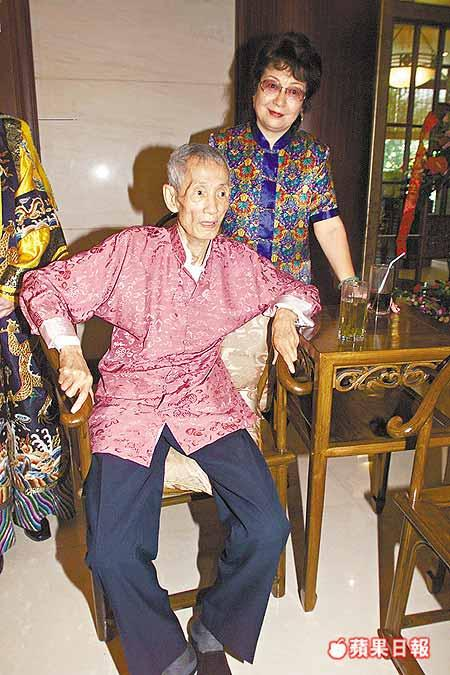

Vừa đặt chân đến nơi đất khách, là con nhà giàu nhưng ông cũng chẳng biết làm gì khác, chỉ có thể dựa vào việc bán chút tranh chữ để mưu sinh, đồng thời tiện thể xem tướng, xem phong thủy cho người khác.
Khi đó ở Hong Kong, thầy phong thủy nhiều vô kể, Trần Lãng lúc còn trẻ gần như không có cơ hội nổi danh.

## Cuộc gặp định mệnh với Lý Gia Thành

Mãi đến năm 1956, sự xuất hiện của một người đã hoàn toàn thay đổi vận mệnh của Trần Lãng.
Người ấy chính là Lý Gia Thành.
Thời điểm đó, Lý Gia Thành còn lâu mới là người giàu nhất. Xưởng nhựa của ông đang lâm vào cảnh khó khăn, phải dựa vào việc người vợ xuất thân danh gia — Trang Nguyệt Minh — đem bán trang sức để cầm cự, vì thế khi ấy Lý Gia Thành vô cùng chán nản.
Tình cờ thay, trong một buổi tiệc nọ, Lý Gia Thành gặp được Trần Lãng, người am hiểu phong thủy.
Trần Lãng vừa nhìn đã nhận ra ông chủ nhỏ trước mặt này có diện mạo khác thường, liền nhất quyết đòi xem tướng cho Lý Gia Thành.
Trước đó không lâu, Lý Gia Thành từng bị người ta xem tướng một lần. Khi ấy cha ông vừa qua đời, tâm trạng đau buồn khôn xiết, tinh thần sa sút. Đúng lúc ấy có một người đồng hương biết xem tướng đi ngang qua, nói rằng Lý Gia Thành hai mắt vô thần, sau này khó mà làm nên đại sự.

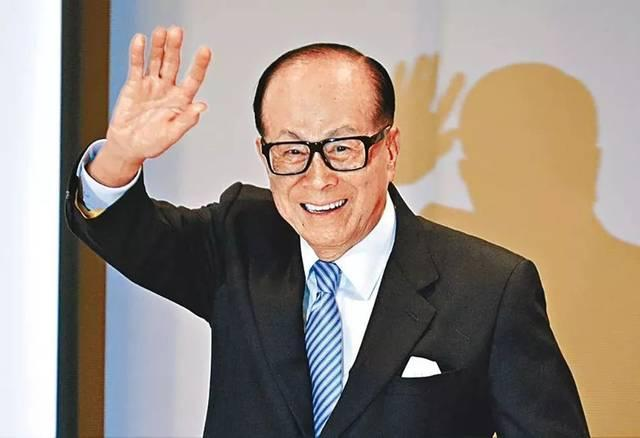

Câu nói đó khiến Lý Gia Thành vô cùng tức giận, từ đó về sau không thích qua lại với thầy bói, hễ gặp là tìm cách tránh đi thật nhanh.
Nhưng lần này thì khác, mọi người cùng chung một bàn tiệc, trước sự nhiệt tình khó chối từ, ông đành miễn cưỡng để Trần Lãng xem qua một lần.
Trần Lãng hỏi: “Cả đời này có bao nhiêu tiền thì ông mới thấy thỏa mãn?”
Khi ấy Lý Gia Thành vẫn đang chật vật nơi thương trường, ông rất thẳng thắn đáp: “30 triệu, chỉ cần 30 triệu là đủ rồi.”
Nghe vậy, Trần Lãng bật cười lớn, nói: “Ngài Lý thiên phú khác thường, chỉ riêng cái trán đã rộng tròn vô hạn, là mệnh đại phú đại quý hiếm có ngàn năm. 30 triệu chẳng qua chỉ là muối bỏ bể, sau này ông nhất định sẽ trở thành người giàu nhất!”
Những lời ấy đã tiếp thêm cho Lý Gia Thành lúc đang lâm vào cảnh tiến thoái lưỡng nan một niềm tin vô cùng lớn. Từ đó về sau, trong những trận chém giết khốc liệt nơi thương trường, ông càng đánh càng hăng, từng khoản 30 triệu lần lượt lọt vào túi, và chẳng bao lâu đã trở thành “Vua hoa nhựa” của Hong Kong.
Sau trải nghiệm kỳ lạ này, Lý Gia Thành gần như xem Trần Lãng như tri kỷ, đối với lời ông nói thì răm rắp nghe theo, có việc hay không có việc cũng đều mời Trần Lãng đến xem xét.
Không chỉ những dự án địa ốc quan trọng phải được Trần Lãng gật đầu thì ông mới yên tâm, mà ngay cả căn đại trạch nhà họ Lý cũng phải để Trần Lãng làm lễ khai quang xong, Lý Gia Thành mới dám dọn vào ở.
Nói thẳng ra, Trần Lãng chính là “viên thuốc an thần” về mặt tinh thần của Lý Gia Thành. Việc gì Lý Gia Thành làm cũng phải hỏi ý Trần Lãng trước, rồi mới làm theo lời ông.
Không rõ là có thật sự liên quan trực tiếp hay không, chỉ biết rằng dưới sự “hộ tống” của Trần Lãng, 28 năm sau,

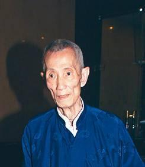

Lý Gia Thành cuối cùng đã trở thành huyền thoại tỷ phú số một của Hong Kong.
Năm 1983, Trần Lãng đã sớm trở thành thầy phong thủy riêng của Lý Gia Thành và Lý Triệu Cơ.
Trần Lãng còn từng nói với Lý Gia Thành rằng ông ít nhất có thể sống đến 96 tuổi, nên sớm phân chia tài sản cho hai người con trai, tránh để sau này giống như con cháu các gia tộc giàu có khác tranh giành tài sản, như vậy sẽ phòng ngừa việc người nhà kiện tụng lẫn nhau.
Trên thực tế, đối với thành công của Lý Gia Thành, Trần Lãng không hoàn toàn quy về may mắn hay số mệnh. Ông từng thẳng thắn nhấn mạnh: “Những đại gia này không phải chỉ trong một sớm một chiều mà có được phúc phần, mà là bắt nguồn từ thiện hạnh và nghĩa cử ở kiếp trước, từ việc hiếu kính cha mẹ, tôn trọng bậc trưởng bối, làm nhiều việc thiện để tích đức.”
Chính Lý Gia Thành cũng từng nói: “Tiểu phú nhờ nỗ lực, đại phú do trời định.”
Cổ nhân có câu: “Nhà tích thiện ắt có dư phúc.” Quan niệm luân hồi đã ăn sâu vào văn hóa truyền thống Trung Hoa, và con đường phát đạt của Lý Gia Thành cũng là minh chứng cho trí tuệ cổ xưa ấy.
Nhờ sự quảng bá mạnh mẽ của Lý Gia Thành, danh tiếng của Trần Lãng gần như vang khắp toàn bộ Đông Nam Á. Giới nhà giàu, danh nhân các nơi đều thành kính tìm đến bái kiến, ai cũng muốn tận mắt thấy
dung mạo thật của Trần đại sư. Trong số những người giàu ấy, có cả nhân vật sau này vô cùng nổi tiếng — ông chủ tập đoàn Anh Hoàng, Dương Thụ Thành.

## Dương Thụ Thành — Từ phá sản đến tỷ phú

Vào năm 1983, khi đó Dương Thụ Thành nhờ kinh doanh bất động sản, đồng hồ và các ngành nghề khác, đã trở thành một đại gia có tiếng ở Hong Kong.
Có tiền rồi, ông chủ Dương bắt đầu có phần ngông cuồng: ngày ngày ăn chơi trác táng, đêm đêm yến tiệc ca múa; ông còn khắp nơi tìm nữ minh tinh để yêu đương, hở một chút là tặng xe sang, tặng trang sức, tiêu tiền như nước.

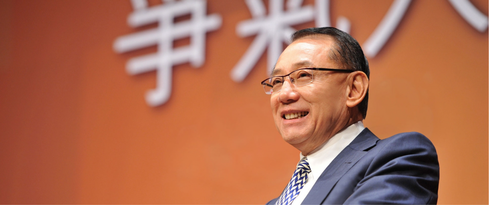

Sau đó, nghe nói có một thầy phong thủy họ Trần có thể dự đoán họa phúc, ông không kìm được lòng hiếu kỳ, liền nhờ vả khắp nơi tìm mối quan hệ, mong được làm quen với vị Trần Lãng lừng danh ấy.
Thông qua sự giới thiệu của một người bạn họ Lâm, Trần Lãng và Dương Thụ Thành đã “tình cờ” gặp nhau trong một buổi tiệc.
Khi ấy Dương Thụ Thành đang lúc lên như diều gặp gió, những gì ông gặp và nghe được đều là lời tâng bốc và người tâng bốc mình.
Lần gặp gỡ này, Dương Thụ Thành vốn nghĩ Trần Lãng cũng sẽ giống như khi nói với Lý Gia Thành, ít nhiều gì cũng nói vài câu cát tường để ông nghe cho vui.
Không ngờ Trần Lãng lại buông lời khiến người ta kinh hãi, vẻ mặt nghiêm nghị nói: “Ông chủ Dương, năm nay ông nhất định sẽ gặp một trận sóng gió dữ dội. Không phải là kiểu trắc trở nhỏ nhặt, mà là tai họa có thể nhấn chìm tất cả.”
Quen được người khác nịnh nọt, Dương Thụ Thành lập tức nổi giận, trong lòng thầm nghĩ: Nói nhăng nói cuội gì thế này? Toàn nói những lời xui xẻo ấy rốt cuộc là có ý gì?
Nghe xong, Dương Thụ Thành rất khó chịu, cho rằng đây chỉ là mánh khóe hù dọa của mấy người giang hồ. Ông cười đáp: “Trần Lãng, ông nhìn tôi bi quan quá rồi!”
Nhưng Trần Lãng vẫn giữ vẻ nghiêm túc: “Tôi nói thật lòng. Nếu muốn lấy lòng ông, tôi đã nói toàn lời tốt đẹp. Nhưng ông là người có bản lĩnh, tôi không thể nói dối. Năm nay ông chắc chắn sẽ gặp nạn, lớn thì phá sản, nhỏ thì tổn thất nặng. Mong ông cẩn thận.”
Thấy Dương Thụ Thành vẫn không tin, Trần Lãng nói thêm: “Không sao. Bây giờ ông không tin cũng bình thường. Ông là người không dễ gục ngã, chỉ cần giữ bình tĩnh, ông vẫn có cơ hội trở mình. Khi tai họa xảy đến, nếu còn nhớ đến tôi, hãy quay lại tìm tôi.”
Dương Thụ Thành nghe xong cực kỳ bực bội. Ông âm thầm tính toán lại tình hình làm ăn của mình khi đó, cảm thấy hoàn toàn không có vấn đề gì, liền cho rằng Trần Lãng chỉ là kẻ có tiếng mà không có miếng, chẳng qua là một tay giang hồ lừa đảo. Ông “hừ” một tiếng, quay người định bỏ đi.
Trong bụng Dương Thụ Thành nghĩ: Đừng có ở đây giả thần giả quỷ với tôi. Hôm nay coi như bố thí cho kẻ ăn xin vậy. Nghĩ thế, ông móc từ túi ra mấy tờ tiền có mệnh giá lớn, tức tối ném xuống đất rồi phẩy tay áo bỏ đi.
Kết quả là lời đó ứng nghiệm trước cả khi năm cũ qua đi. Chuyện đời quả thật lắm khi trùng hợp đến lạ.
Không bao lâu sau vụ việc ấy, cơn khủng hoảng tài chính Hong Kong bùng nổ.
8 giờ sáng ngày 30/8/1983, điện thoại reo, bên kia là ngân hàng HSBC gọi cho Dương Thụ Thành, yêu cầu Dương Thụ Thành lập tức đến gặp quản lý bộ phận nợ xấu Hàn Quốc Kính.
Tại HSBC, vị quản lý trao ông một lá thư: Công ty đầu tư Hảo Thế Giới dưới trướng Dương Thụ Thành vì sử dụng đòn bẩy quá mức, nợ hơn 300 triệu HKD mà không thể trả, ngân hàng HSBC quyết định ngừng hỗ trợ, trực tiếp tuyên bố mất khả năng thanh toán, lập tức thu hồi toàn bộ tài sản của ông và chỉ định kế toán làm người tiếp quản.
Lúc này, Dương Thụ Thành chỉ còn hai con đường: hoặc tuyên bố phá sản, ra đi tay trắng; hoặc trong vòng 8 năm phải trả sạch khoản nợ 320 triệu HKD, để chuộc lại toàn bộ tài sản. Hơn nữa, trong thời gian trả nợ, tiền lương của ông chỉ được cố định ở mức 20.000 HKD, còn mọi khoản thu nhập của công ty đều phải nộp cho HSBC để trừ nợ.
Một quản lý khác của bộ phận nợ là Phan Khải Phu nói với Dương Thụ Thành bằng giọng rất gay gắt: “Nếu muốn đưa toàn bộ doanh nghiệp mang tên ngài Dương ra tòa xin phá sản, chúng tôi hoàn toàn có quyền làm thế và có thể làm bất cứ lúc nào. Nhưng đó không phải lựa chọn ưu tiên của chúng tôi. Chỉ cần trong 8 năm trả nợ, các vị hoàn trả đủ 320 triệu HKD, chúng tôi sẽ giao trả tài sản lại cho các vị. Bây giờ, chúng tôi cho các vị một phương án: Để 3 anh em các vị tạm thời quản lý mảng bán lẻ đồng hồ & trang sức của Anh Hoàng, như vậy 3 người sẽ không thất nghiệp, cũng không phải ra đường ngủ. Thời gian đi làm là từ 9 giờ sáng đến 5 giờ chiều, không được đi sớm về trễ. Chỉ khác là trước đây các vị là ông chủ, nhưng từ hôm nay trở đi, xin 3 người hãy chấp nhận… làm nhân viên cho HSBC. Toàn bộ hệ thống đồng hồ & trang sức của Anh Hoàng hiện do ngân hàng chúng tôi toàn quyền sở hữu.”
Phan Khải Phu tiếp tục tuyên bố: “Dương Thụ Thành, Dương Siêu Thành và Dương Bảo Xuân sẽ ở lại hệ thống đồng hồ & trang sức Anh Hoàng giữ chức quản lý kinh doanh. Dương Thụ Thành lương tháng 20.000 HKD, 2 người em mỗi người 15.000 HKD. Ngoài ra, ngài Dương phải ký thỏa thuận: Trong suốt 8 năm trả nợ, phải dốc hết sức vận hành Anh Hoàng, và toàn bộ lợi nhuận phải dùng để trả nợ.”
Khi tài sản của Dương Thụ Thành bị thanh lý, giám đốc HSBC từng gửi cho ông một bức thư, đại ý rằng xe Mercedes là phương tiện của người thành đạt, và Dương Thụ Thành khi đó đã không còn xứng đáng sở hữu Mercedes nữa. Sau khi vực dậy sau biến cố, Dương Thụ Thành từ đó không ngồi Mercedes nữa mà trực tiếp tậu một chiếc Rolls-Royce, còn gắn cho nó biển số đắt nhất thế giới — biển số 9 mua với giá 13 triệu HKD.
Sau khi HSBC tiếp quản hệ thống đồng hồ & trang sức Anh Hoàng, chế độ quản lý vô cùng khắc nghiệt.
Dương Thụ Thành chịu đựng vài tháng, cảm thấy cứ thế này mãi thì không xong. Bỗng nhiên, ông nhớ đến vị thầy phong thủy từng nói những lời “kỳ quái” với mình hồi đầu năm — Trần Lãng. Đã có duyên gặp một bậc cao nhân huyền học, sao lại không tranh thủ thỉnh giáo? Ông lập tức gọi cho ông Lâm, nhờ sắp xếp

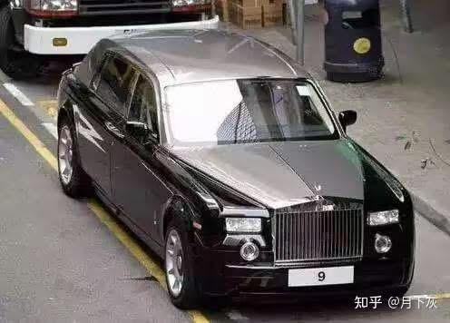

gặp Trần Lãng, bất kể thời gian hay địa điểm.
Bị dồn đến đường cùng, Dương Thụ Thành đành gạt bỏ thể diện, đích thân đến nhà Trần Lãng. Vừa gặp mặt, Dương Thụ Thành đã cúi người vái thật sâu trước Trần Lãng, miệng không ngừng nói xin lỗi, khẩn cầu Trần Lãng bỏ qua hiềm khích, chỉ đường dẫn lối cho mình: “Hồi đó tôi còn quá trẻ, nóng nảy, không nghe lời tiên sinh. Hôm nay tôi đến đây để xin lỗi.”
Không ngờ Trần Lãng hoàn toàn không để bụng.
Trần Lãng mỉm cười, đáp: “Dù ông gặp sóng gió, tôi vẫn tin ông. Thứ nhất, mệnh ông không đến mức tuyệt. Thứ hai, ông là người đánh không 𝗰𝗵𝗲̂́𝘁 – càng khó khăn càng quật cường. Ông đối xử khiêm nhường nhưng trong lòng rất kiêu hãnh. Nếu ông bình tĩnh kiên trì vượt qua, cơn bão này không thể đánh đổ ông. Ngoài ra, tôi biết ông trời sẽ đặc biệt ưu ái ông, vì khi ông thành công và kiếm được tiền, người hưởng lợi không chỉ có mình ông. Những người quanh ông vì ông mà được hưởng phúc.”
Nghe những lời ấy, Dương Thụ Thành mừng rỡ trong lòng, vội hỏi mình nên làm thế nào, dù sao hiện giờ ông vẫn đang nợ ngập đầu.
Trần Lãng nói tiếp: “Ông có vận tái khởi, có mệnh tái quang. Nhưng muốn lật ngược tình thế, ông không nên chỉ bám vào chút việc trước mắt. Vận của ông đến từ hướng Tây, phải rời khỏi cảng Victoria, đi về phía Tây.”
Trần Lãng giải thích thêm rằng “Tây” ở đây không nhất thiết là châu Âu, mà là vùng nằm phía Tây Hong Kong – trước châu Âu là cả một khu vực giàu dầu mỏ và tài chính sôi động: Trung Đông, như bán đảo Ả Rập.
Thời điểm đó, người Hong Kong biết rất ít về các nước Trung Đông. Việc sang đó làm ăn nghe qua tưởng như không tưởng.
Nhưng Dương Thụ Thành nhanh chóng tìm hiểu và biết rằng Trung Đông thật sự có một “mỏ vàng” – giao dịch ngoại hối.
Nhờ bạn bè giới thiệu, ông quen một người họ hàng xa của gia đình hoàng tộc Kuwait. Người này đồng ý hợp tác kinh doanh ngoại hối.
Thế là ông chủ Dương giao toàn bộ việc kinh doanh trong tay cho các em trai em gái quản lý, còn bản thân thì một mạch hướng về phía Tây, chạy thẳng sang Kuwait.
Nhờ sự giúp đỡ của người họ hàng này, Dương Thụ Thành dựa vào bản năng nhạy bén trong thị trường ngoại hối, ông đầu cơ vàng và ngoại hối. Trời không phụ lòng người, chỉ trong 2-3 năm, lợi nhuận giao dịch ngoại hối của Dương Thụ Thành đã lên tới hơn 10-20 triệu USD.
Đúng vào lúc ấy, việc Hong Kong sắp được trao trả cho Trung Quốc đã trở thành điều chắc chắn, kinh tế Hong Kong cũng chuẩn bị chuyển từ u ám sang sáng sủa. Những khoản đầu tư bất động sản mà Dương Thụ Thành thực hiện trước đó lập tức tăng vọt.
Cộng thêm lợi nhuận từ hệ thống đồng hồ & trang sức Anh Hoàng, khoản nợ 320 triệu HKD mà HSBC yêu cầu trả trong 8 năm đã được Dương Thụ Thành trả xong chỉ trong hơn 2 năm.
Cuối cùng, Dương Thụ Thành lấy lại toàn bộ sự nghiệp của mình.
Sau đó, Dương Thụ Thành cũng giống như Lý Gia Thành, đối với lời Trần Lãng nói đều răm rắp nghe theo.
Có tiền trở lại, “bệnh cũ” của Dương Thụ Thành lại tái phát, vẫn ngày ngày yến tiệc rượu chè, đêm đêm ca múa linh đình.
Trần Lãng có phần không tán thành lối sống ấy.
Một ngày nọ, khi ông đang ở nhà Trần Lãng, Trần Lãng bỗng nói: “Ông Dương, ông độc thân nhiều năm rồi. Đã đến lúc chim mỏi biết đường về tổ. Nếu năm nay ông kết hôn, sự nghiệp của ông sẽ có được trợ lực rất mạnh.”

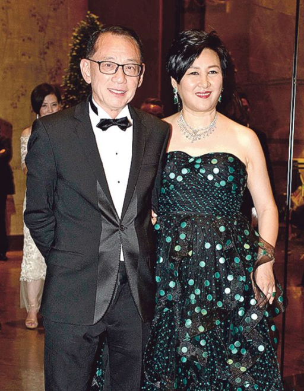

Câu nói này hợp ý Dương Thụ Thành. Với giới nhà giàu, sợ nhất là phá sản, còn điều thích nhất chính là kiếm tiền.
Năm 20 tuổi, Dương Thụ Thành từng kết hôn với người vợ trước là Nhậm Mạn Linh, nhưng hai người đã ly hôn năm 1973 vì chuyện ngoại tình. Sau khi ly hôn, Dương Thụ Thành vẫn luôn độc thân. Dĩ nhiên, một đại gia độc thân thì xung quanh chưa bao giờ thiếu phụ nữ.
Nghe nói kết hôn là có thể sinh tài, thì cuộc hôn nhân này nhất định phải cưới cho thật nhanh. Nhưng vấn đề là gấp gáp thế này, biết tìm ai để cưới?
Dương Thụ Thành nảy ra một ý. Mỗi lần mời Trần Lãng ăn cơm, uống trà, Dương Thụ Thành đều dẫn theo những bạn gái khác nhau để Trần Lãng xem mặt, xem trong số đó ai là người “vượng phu” nhất. Nhưng Trần Lãng luôn lắc đầu… cho đến khi gặp Lục Tiểu Mạn, cô gái vừa từ Canada về, ông mới mỉm cười gật đầu và nói: “Ông Dương, nếu cô gái này là người ông chọn, thì hãy cưới ngay đi. Cuộc hôn nhân này không chỉ hạnh phúc, mà cô ấy còn sẽ sinh quý tử cho ông. Sự nghiệp của ông sẽ tiến thêm một bước nữa.”
Trần Lãng nhìn một lượt, không ai lọt vào mắt, chỉ riêng Lục Tiểu Mạn là người duy nhất khiến ông gật đầu.
Năm 1985, theo sự chỉ dẫn của Trần Lãng, Dương Thụ Thành và Lục Tiểu Mạn kết hôn.
Quả thật nhìn lại sau này, phải nói Trần Lãng chọn người rất chuẩn.
Bởi Lục Tiểu Mạn không chỉ là trí thức du học về, có học vấn rất cao, mà còn có năng lực kinh doanh xuất chúng: tốt nghiệp Đại học Toronto, được cấp bằng Cử nhân Thương mại, từng làm việc trong ngành ngân hàng gần 10 năm.
Sau khi kết hôn, cô một lòng lo việc gia đình, làm tròn vai trò người vợ hiền hậu; đối với những chuyện trăng hoa bên ngoài của Dương Thụ Thành, cô chỉ giả vờ như không nghe, không thấy, cũng chẳng truy hỏi nhiều. Trong một khoảng thời gian khá dài, tỷ lệ cổ phần mà Lục Tiểu Mạn nắm giữ tại tập đoàn Anh Hoàng thậm chí còn nhiều hơn cả Dương Thụ Thành.
Dương Thụ Thành vô cùng hài lòng với cách cư xử của Lục Tiểu Mạn, liên tục khen Trần Lãng “có con mắt nhìn người”.
Trần Lãng dự đoán rằng Dương Thụ Thành không chỉ có hôn nhân viên mãn, mà còn sinh được quý tử, sự nghiệp sẽ càng lên cao hơn nữa.
Dương Thụ Thành hỏi: “Tiên sinh bảo tôi sang Trung Đông, tôi đi rồi, quả nhiên gặt hái được nhiều, còn lấy lại được cả cơ nghiệp. Vậy bước tiếp theo, tôi nên đi hướng nào?”
Trần Lãng đáp: “Vận tài lộc và công đức cả đời của ông vẫn chưa tròn. Hết khổ lại đến chỗ sáng, phía trước còn một khu rừng lớn rậm rạp và tươi tốt. Theo tôi, mục tiêu sự nghiệp tiếp theo của ông nằm ở phương Nam.”
Dương Thụ Thành vô cùng bối rối, không biết “phương Nam” mà Trần Lãng nói là các quốc gia ở phía Nam đường xích đạo như Úc, New Zealand hay những nơi không thích hợp làm ăn.
Trần Lãng giải thích: “Phương Nam tức là Nam Dương — Singapore, Malaysia, Thái Lan, Indonesia. Tin tôi đi, hướng tài lộc kế tiếp của ông nằm ở phía Nam.”
Người được xem là quý nhân thì nói chuyện không dài dòng, chỉ vài chữ là đủ, phần còn lại phải tự mình ngộ ra.
Cuối cùng, Dương Thụ Thành chọn Thái Lan làm nơi phát triển tiếp theo — vì cộng đồng người Hoa ở Thái Lan có rất nhiều người gốc Triều Châu, mà bản thân ông cũng là người Triều Châu, nên việc liên lạc, giao tiếp trở nên dễ dàng hơn.
Năm 1989, chính sách thắt chặt kép về tài chính và tín dụng được thực thi, siết chặt việc phát hành tiền tệ, khiến kinh tế rơi vào suy thoái. Để thu hồi vốn, Tập đoàn Việt Hải quyết định bán khách sạn White Orchid ở Bangkok. Một người bạn tại địa phương báo tin cho Dương Thụ Thành, ông lập tức bay sang Bangkok để xem khách sạn.
Khách sạn này quy mô không lớn, chỉ hơn 200 phòng, giá bán tương đối rẻ. Tuy nhiên, bên bán đang cần tiền gấp, yêu cầu phải quyết định trong vòng 2 ngày, ký hợp đồng phải đặt cọc 20%, và trả toàn bộ số tiền trong vòng một tháng. Nhiều tập đoàn lớn thấy thời gian quá gấp nên đều bỏ cuộc.
Dương Thụ Thành nhớ lời Trần Lãng từng nói rằng vận của ông nằm ở phương Nam, mà lúc đó ông lại có sẵn tiền mặt kiếm được từ Trung Đông, nên không do dự, bỏ ra 15 triệu USD mua khách sạn.
Một năm sau, ông bán lại khách sạn White Orchid cho một doanh nhân Ấn Độ với giá 25 triệu USD, lời 10 triệu USD, mở màn đầy thuận lợi cho việc mở rộng sang thị trường phía Nam.
Trong tự truyện “Tranh Khí”, Dương Thụ Thành từng nói những lời chỉ dẫn khai sáng của Trần Lãng là công lao không nhỏ đối với tài sản và danh vọng ông có được trong đời, còn khen Trần Lãng là ân nhân đầu tiên của mình.
Thấy Dương Thụ Thành tiếp thu rất nhanh và làm đúng ý mình, Trần Lãng cũng mừng thay cho ông, liền

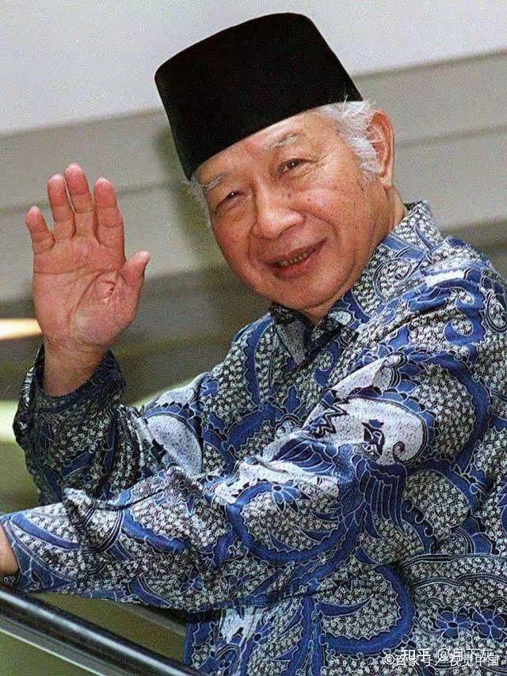

nảy ý định đích thân dẫn ông chủ Dương sang Indonesia để mở mang cơ nghiệp.
Có Trần Lãng — một bậc cao nhân — đứng ra che chở, Dương Thụ Thành vui mừng khôn xiết, lập tức lên đường.
Nhưng đến Indonesia rồi mới phát hiện ra rằng, hóa ra Trần Lãng đã sớm nổi danh khắp Đông Nam Á. Tại Indonesia, Trần Lãng có mạng lưới quan hệ rất rộng cả về chính trị lẫn thương mại, thậm chí còn được Tổng thống Indonesia Suharto xem như quốc sư.

## Quốc sư của Tổng thống Suharto

Thời gian quay ngược về thập niên 1960, Indonesia do Tổng thống Suharto nắm quyền.
Suharto là một nhân vật cực kỳ quyền lực, từng thông qua một cuộc đảo chính quân sự để lật đổ Tổng thống Sukarno – người được tôn là “quốc phụ” của Indonesia.
Chính con người như vậy lại rất hứng thú với huyền học và thuật xem tướng của Trung Quốc, hơn nữa còn vô cùng tin tưởng. Ông đã sớm nghe danh Trần Lãng ở Hong Kong, bèn nhờ một chuyên gia ngân hàng người Hoa tại Indonesia đứng ra mời Trần Lãng sang Jakarta xem tướng cho mình.
Trần Lãng khó từ chối thịnh tình, liền sang Indonesia và ở đâu cũng được tiếp đãi như thượng khách.
Con người ta vốn luôn có lòng hiếu kỳ, hễ ai đó được cho là rất giỏi thì ai cũng muốn thử xem rốt cuộc giỏi đến mức nào.
Suharto tiếp đãi Trần Lãng tại phủ tổng thống, gọi 3 người con trai của mình đến, nhờ Trần Lãng nhận xét khí chất và tiền đồ của họ.
Đối với con trai cả và con trai thứ, Trần Lãng đều nói những lời khen ngợi. Nhưng khi xem kỹ cậu con trai út mới 8 tuổi, vừa gặp mặt Trần Lãng đã nói: “Tam công tử của ngài chính là quý nhân của cả đời ngài.”
Suharto nghe vậy thì lấy làm lạ, nói rằng cậu con trai thứ 3 của ông năm nay mới có 8 tuổi, thì lấy đâu ra quý mà nói?
Suharto vô cùng nghi hoặc: “Đứa trẻ nhỏ như vậy thì sao có thể là quý nhân của tôi được?”
Nghĩ mãi không ra, Trần Lãng liền gợi ý rằng sau khi cậu út chào đời, có phải từng xảy ra biến cố lớn nào không?
Lúc đó Suharto mới nhớ ra, sau khi đứa con này sinh ra từng bị bỏng nặng phải nhập viện, ông đã vội vã đến bệnh viện thăm con. Đúng thời điểm ấy, có một tư lệnh lục quân phản loạn, bao vây phủ tổng thống. Vì Suharto đang ở bệnh viện thăm con út nên phe phản loạn vồ hụt. Sau đó ông kịp thời chỉnh đốn lực lượng, dập tắt cuộc nổi loạn.
Chẳng phải chính đứa con trai nhỏ đã cứu ông một mạng đó sao?
Việc cấp dưới tạo phản vốn là chuyện không vẻ vang, Suharto đã xếp nó vào bí mật quốc gia, chưa từng nhắc đến với người ngoài.
Sự thần kỳ của Trần Lãng khiến Suharto khâm phục sát đất. Từ đó, hai người thường xuyên giữ liên lạc với nhau qua những kênh đặc biệt.
Lần thứ hai Trần Lãng được mời đến Jakarta, Suharto đã giới thiệu cho ông những nhân vật vừa có quyền vừa có tiền lúc bấy giờ.
Đến cả tổng thống còn coi Trần Lãng như thần thánh, huống chi là những người do chính tổng thống tiến cử.
Không có việc gì mà tự nhiên lại ân cần, ắt hẳn có điều cầu xin. Tổng thống Suharto cũng không ngoại lệ. Ông nghi ngờ trong số các tướng lĩnh thân tín của mình có kẻ phản bội, nên cần Trần Lãng chỉ ra.
Trần Lãng được sắp xếp ở trong một căn phòng kín, có thể quan sát toàn bộ tình hình trong văn phòng tổng thống. Suharto lần lượt triệu kiến nhiều tướng lĩnh cao cấp để Trần Lãng xem tướng từng người.
Sau đó, Trần Lãng chỉ ra hai vị tướng. Quả nhiên, tại dinh thự của họ đã lục soát được chứng cứ phản nghịch.
Trần Lãng còn thể hiện thêm vài lần ở những chuyện khác, lần nào cũng đoán trúng, tính đúng, khiến Suharto lúc này mới thực sự tâm phục khẩu phục.
Từ đó về sau, Suharto gần như xem Trần Lãng như quốc sư.
Nhờ sự quảng bá của vị tổng thống, danh tiếng của Trần Lãng vang dội khắp giới thượng lưu Indonesia, ai nấy đều vô cùng tin cậy ông.
Chuyến đi Indonesia lần này của Dương Thụ Thành có Trần Lãng đi cùng, quả đúng là như cá gặp nước. Ông nhanh chóng làm quen khắp giới thượng lưu địa phương, lại còn hợp tác với một đại gia Indonesia tên Lý Văn Chính, đầu tư 3 triệu vào lĩnh vực tài chính, cuối cùng kiếm lời tới 1 tỷ đô la Mỹ.
Có một ngày, Dương Thụ Thành cầm theo một giấy phép sòng bạc tại Việt Nam mà ông đã mua với giá 1 triệu đô la Mỹ. Ông không đưa giấy phép ra ngay, mà trước hết hỏi Trần Lãng xem mình có thể kinh doanh sòng bạc hay không.
Trần Lãng dứt khoát nói là không được, thời cơ chưa tới.
Thế là Dương Thụ Thành lấy giấy phép ra, vẻ mặt đắc ý, nói rằng: “Lần này Trần Bá thua rồi nhé, đây là giấy phép sòng bạc.”
Trần Lãng nhìn Dương Thụ Thành đang hả hê, sắc mặt vẫn không hề thay đổi, lại lắc đầu nói: “Dù thế nào đi nữa, bây giờ cũng chưa phải lúc mở sòng bạc. Cho dù có thể làm, thì cũng không phải là lúc này.”
Cuối cùng, Dương Thụ Thành đã bán lại giấy phép đó cho “Vua sòng bạc” Hà Hồng Sân với giá 2 triệu đô la Mỹ.
Sau khi kiếm đủ tiền ở Đông Nam Á, Dương Thụ Thành dự định quay về trong nước phát triển, nhưng vẫn chưa nghĩ ra sẽ làm gì.

## Khai quật Tạ Đình Phong và Dung Tổ Nhi

Lúc này, Trần Lãng đề nghị ông tiến vào giới giải trí, còn nói rằng muốn công ty bùng nổ thì nhất định phải tìm được một cặp kim đồng ngọc nữ, để chính cặp kim đồng ngọc nữ ấy kéo cả công ty lên. Hơn nữa, cặp kim đồng ngọc nữ này nhất định phải do chính tay Dương Thụ Thành khai quật.
Nghe xong, Dương Thụ Thành liên tục tán thành, liền tất bật khắp nơi tìm kiếm nhân tố triển vọng, chuẩn bị ký hợp đồng.
Nhưng mỗi lần ông dẫn người tới cho Trần Lãng xem, Trần Lãng đều không hài lòng, cảm thấy vẫn còn thiếu một chút gì đó.
Cho đến một cơ duyên tình cờ, Trần Lãng gặp được ngôi sao lớn trong tương lai — Tạ Đình Phong.
Hôm ấy, Dương Thụ Thành mời Trần Lãng đi ăn, đúng lúc người bạn thân của ông là Tạ Hiền cũng có mặt, lại còn dẫn theo cậu con trai 13 tuổi của mình — Tạ Đình Phong.
Kết quả, Trần Lãng vừa nhìn đã ưng ý cậu bé Tạ Đình Phong, khẳng định đứa trẻ này sau này nhất định sẽ trở thành siêu sao, mà thành tựu còn vượt xa cha mình không chỉ 10 lần.
Thế là Trần Lãng thúc giục Dương Thụ Thành mau chóng ký hợp đồng với cậu bé này.
Ban đầu, Tạ Hiền không đồng ý. Bản thân ông đã lăn lộn trong giới giải trí cả đời, hiểu rõ những gian nan của nghề này hơn ai hết. Vì vậy mặc cho Dương Thụ Thành hết lần này đến lần khác tới nhà thuyết phục, Tạ Hiền vẫn kiên quyết không đồng ý.
Sau đó, Dương Thụ Thành cắn răng chấp nhận giúp Tạ Hiền trả hết khoản nợ khổng lồ khi phá sản. Tạ Hiền lúc này mới mừng rỡ khôn xiết, gật đầu đồng ý cho con trai ký hợp đồng.
Kim đồng đã tìm được, chỉ còn thiếu một ngọc nữ.

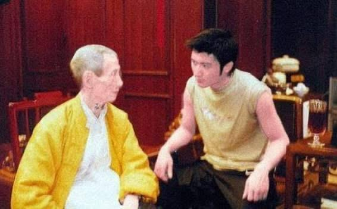

Ngọc nữ này lại càng khó tìm. Những người Dương Thụ Thành đưa tới, Trần Lãng nhìn đi nhìn lại vẫn không ưng. Cuối cùng Dương Thụ Thành sốt ruột, gom một loạt ảnh các cô gái khắp nơi, nhờ Trần Lãng chọn giúp một người.
Trần Lãng xem rất lâu, rồi rút ra một tấm ảnh, nói: “Chính là cô ấy.”
Cô gái trong ảnh ấy chính là Dung Tổ Nhi.
Ngày trước, vì ngoại hình không quá nổi bật, lúc mới vào nghề cô không được trọng dụng trong công ty. Sau đó, Trần Lãng khen đôi mắt Dung Tổ Nhi “có linh khí”. Dương Thụ Thành nghe vậy liền bất chấp dị nghị, nâng đỡ hết mình.
Có lẽ nếu không có con mắt chọn người của Trần Lãng và sự kiên trì của Dương Thụ Thành, thì hôm nay giới nhạc Hoa ngữ đã thiếu đi một nữ hoàng nhạc pop vừa hát vừa nhảy như Dung Tổ Nhi.
Trần Lãng còn dặn dò Dương Thụ Thành hết lần này đến lần khác, rằng 2 đứa trẻ này nhất định phải được nâng đỡ cho thật tốt, sau này ắt sẽ thành danh lớn.
Quả nhiên, dưới sự nâng đỡ mạnh mẽ của Dương Thụ Thành, cặp kim đồng ngọc nữ này nhanh chóng nổi tiếng khắp toàn bộ Hong Kong, thậm chí cho đến tận bây giờ vẫn còn rất ăn khách. Đồng thời, công ty Anh Hoàng của Dương Thụ Thành cũng nhờ 2 ngôi sao lớn ấy mà vụt sáng theo.
Những năm đầu, khi Anh Hoàng vướng kiện tụng dây dưa, nghe nói cũng là Trần Lãng hiến kế, bảo nghệ sĩ công ty mặc đồ màu vàng để tránh xui, cầu may.
Sau đó, công ty Anh Hoàng tung hoành trong giới giải trí Hong Kong, thế như chẻ tre, vượt hẳn China Star của nhà họ Hướng — vốn đang ở thời kỳ đỉnh cao — để trở thành bá chủ mới của làng giải trí.
2 công thần là Tạ Đình Phong và Dung Tổ Nhi, vì có mối quan hệ đặc biệt ấy, nên địa vị trong Anh Hoàng vô cùng vững chắc. Dù về sau lớp nghệ sĩ mới liên tục xuất hiện, cũng không ai có thể lay chuyển vị thế của họ.
Khi vụ “gánh tội thay vụ tai nạn” của Tạ Đình Phong nổ ra, anh cũng nhận được chỉ dẫn của Trần Lãng là đi Tứ Xuyên – chùa Phổ Chiếu hấp thu linh khí, và cuối cùng thoát nạn thành công.
Ngày 12/4/2002, nam diễn viên Tạ Đình Phong đã bị Ủy ban chống tham nhũng Hong Kong (ICAC) bắt giữ vì gây tai nạn giao thông. Trước đó, khoảng 5 giờ sáng ngày 23/3/2002, Tạ Đình Phong lái chiếc xe Ferrari 360 Modena và đâm phải giải phân cách tại trung tâm Hong Kong. Vì đường vắng không có ai nên nam diễn viên đã tự ý rời khỏi hiện trường và gọi điện cho tài xế riêng đến gặp cảnh sát để thế thân, bởi khi đó Tạ Đình Phong đang kẹt giờ cho buổi diễn sắp tới tại Thái Lan.
Năm 2003, trước khi Tạ Đình Phong tái xuất, anh lại đến chùa Phổ Chiếu trả lễ, phóng sinh.
Nói đến đây, muốn hỏi mọi người: Hai chuyện nhỏ về Tạ Đình Phong và Dung Tổ Nhi này, bạn có tin không?
Dù sao thì đến bây giờ, Tạ Đình Phong và Dung Tổ Nhi vẫn luôn rất biết ơn Trần Lãng.

## Những lời chứng về Trần Lãng

Dương Thụ Thành từng trả lời phỏng vấn tạp chí Nhân Vật rằng:
“Trần Lãng không phải là một thầy bói giang hồ, mà là một cao nhân thực sự. Nếu muốn gặp ông ấy, cậu không được rửa mặt, không được tắm, chỉ được đánh răng, lau qua đôi mắt rồi đi gặp ông ấy. Ông ấy nhìn khí sắc của cậu, thấy khí sắc thế nào thì biết cậu tốt ở điểm nào, kém ở chỗ nào, đã từng xảy ra chuyện gì, tương lai sẽ xảy ra chuyện gì, ông ấy đều nói cho cậu nghe.”
Điều kỳ lạ hơn nữa là Trần Lãng chưa từng lấy tiền của Dương Thụ Thành, nói rằng nếu nhận tiền thì sẽ mất linh khí. Ông còn căn dặn Dương Thụ Thành: “Sau này khi ông có tiền, kiếm được nhiều tiền rồi thì nhất định phải giúp đỡ thật nhiều người.”

## Những thân chủ cuối đời

Tết Nguyên đán năm 2003, Dương Thụ Thành và Trần Lãng ăn trưa tại khách sạn Tuấn Cảnh ở Trường đua Mã Địa.
Các mối quan hệ của Dương Thụ Thành vô cùng rộng. Khi ấy, vợ của Chu Chính Nghị (người được xem là đại gia số một Thượng Hải lúc bấy giờ) là Mao Ngọc Bình, đã đến chào hỏi, nói một câu “cung hỉ phát tài”.
Trần Lãng nhìn thấy Mao Ngọc Bình liền nói với Dương Thụ Thành rằng ông muốn gặp chồng Mao Ngọc Bình, cho rằng vợ chồng họ sẽ xảy ra vấn đề nghiêm trọng, và

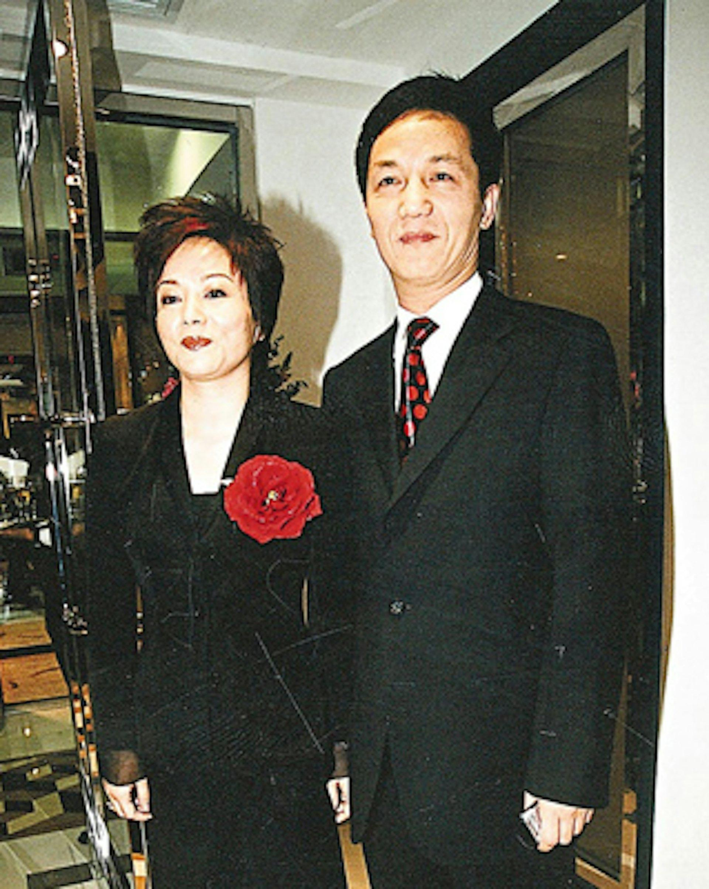

yêu cầu Chu Chính Nghị đích thân đến gặp mình.
Mao Ngọc Bình dĩ nhiên cũng biết danh tiếng lừng lẫy của Trần Lãng, liền vội vàng liên lạc với chồng, để Chu Chính Nghị bay sang Hong Kong vào ngày hôm sau.
Khi Chu Chính Nghị đến gặp, Trần Lãng nói thẳng: “Anh sắp gặp họa ngồi tù và sẽ mất một khoản tiền lớn.”
Chu Chính Nghị nghe xong vô cùng sợ hãi, liền hỏi có cách nào hóa giải hay không.
Chùa Phổ Chiếu.
Trần Lãng nói: “Cách duy nhất để tránh được kiếp nạn này là lập tức đến chùa Phổ Chiếu trên núi Thanh Thành, Thành Đô, ở đó tĩnh tu, không hỏi chuyện thế gian, ít nhất 3 tháng đến nửa năm.”
Nghe vậy, Chu Chính Nghị lắc đầu: “Không thể được! Tôi đang điều hành bất động sản và ngân hàng ở

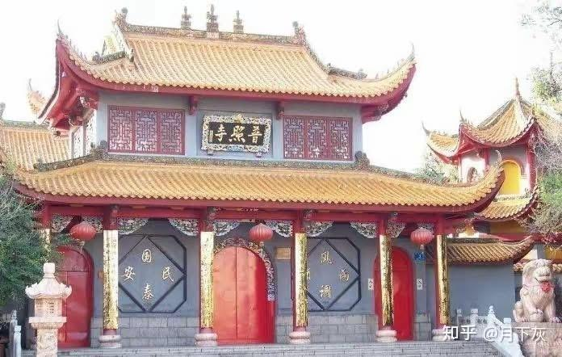

Thượng Hải, ngày nào cũng phải gặp khách và xã giao. Nếu tôi đột nhiên biến mất, tin đồn sẽ đầy thành phố, sau này làm sao tiếp tục kinh doanh?”
Trần Lãng kiên trì khuyên: “Dù anh kiếm bao nhiêu tiền, thì mạng sống và tự do vẫn là quan trọng nhất. Nếu không rời Thượng Hải đến chùa Phổ Chiếu, kiếp nạn này không thể hóa giải.”
Chu Chính Nghị lấy lý do hằng ngày phải gặp khách hàng, xã giao liên miên, không thể đột nhiên biến mất, nên đã không nghe theo lời Trần Lãng.
Vài tháng sau, Chu Chính Nghị bị bắt vì tình nghi khai khống vốn đăng ký và thao túng giá giao dịch chứng khoán. Mao Ngọc Bình cùng một số người khác cũng bị ICAC (Ủy ban Chống Tham nhũng Hong Kong) bắt giữ.
Năm 2007, Chu Chính Nghị bị kết án 16 năm tù.
Đại gia số một Thượng Hải từ đó sụp đổ. Tham luyến phú quý, rốt cuộc trắng tay.
Dương Thụ Thành là người trực tiếp chứng kiến toàn bộ sự việc, vì thế lại càng thêm kính phục Trần Lãng.
Dưới sự nâng đỡ và tôn sùng của Dương Thụ Thành, Trần Lãng lại mở ra một cục diện mới trong giới giải trí Hong Kong.
Rất nhiều ngôi sao đều mong được Trần đại sư chỉ điểm con đường sự nghiệp, xem rốt cuộc khi nào mình mới có thể nổi tiếng. Thành Long, Lê Tư, Dung Tổ Nhi… cùng hàng loạt minh tinh khác đều là fan ruột của Trần Lãng.

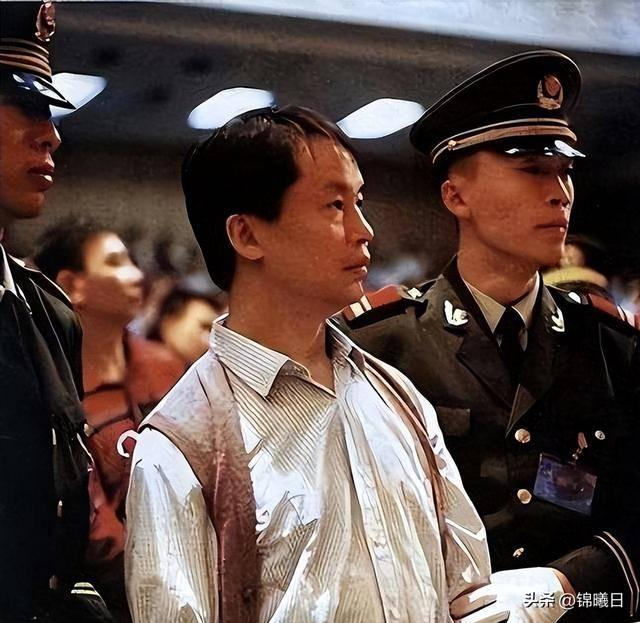

Thậm chí, Trần Lãng còn từng xem tướng cho “siêu trộm thế kỷ” Trương Tử Cường, nói rằng anh ta có diện mạo đặc biệt, sau này có thể kiếm được rất nhiều tiền. Nhưng sau khi kiếm được tiền thì nhất định không được ở lại Hong Kong, phải đi về phía Đông, nhất định phải ghi nhớ, ghi nhớ!
Về sau, Trương Tử Cường bắt cóc con trai của Lý Gia Thành, lấy được khoản tiền chuộc khổng lồ rồi liền bỏ ngoài tai lời của Trần Lãng. Anh ta đúng là đã rời khỏi Hong Kong, nhưng không đi về phía Đông mà lại trực tiếp ra Bắc, vào đại lục, cuối cùng rơi vào kết cục bị xử bắn.
Năm 2001, ông chủ Tập đoàn Kim Quang là Hoàng Dịch Thông, người giàu nhất Indonesia, với khối tài sản ước tính 8 tỷ đô la Mỹ.

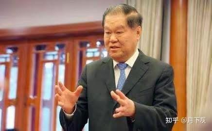

Cái tên Hoàng Dịch Thông có thể hơi xa lạ với nhiều người. Nhưng nhãn giấy vệ sinh Thanh Phong thì chắc hẳn ai cũng từng dùng qua. 3 thương hiệu giấy sinh hoạt Thanh Phong, Chân Chân và Duy Khiết Nhã đều thuộc Tập đoàn Giấy Kim Hồng Diệp — một trong những tập đoàn sản xuất và tiêu thụ giấy lớn nhất châu Á. Mà phía sau Kim Hồng Diệp lại là một tập đoàn còn lớn hơn nữa: đại tài phiệt Indonesia — Tập đoàn Kim Quang.
Có một ngày, ông mời Trần Lãng đến nhà làm khách. Trong bữa ăn, ông tiện thể nhờ Trần Lãng xem tướng mạo cho mấy người con của mình.
Trần Lãng chỉ nói với mấy người con vài câu xã giao, không mặn không nhạt. Đột nhiên ông quay sang cô con gái lớn Hoàng Tú Hoa, hỏi: “Cô Hoàng, sao không thấy chồng cô đâu? Có thể mời anh ấy tới gặp được không?”
Cha mẹ Hoàng Tú Hoa nghe Trần Lãng nói muốn gặp con rể là Lại Văn Huy, trong lòng liền dấy lên cảm giác bất an.
Lại Văn Huy dung mạo đường hoàng, chẳng mấy chốc đã tới nơi. Sau khi chào hỏi vài câu với mọi người, anh đứng trước mặt Trần Lãng, để Trần Lãng quan sát một lúc.
Trần Lãng nói: “Anh Lại tiên sinh, anh có bệnh kín trong người, hơn nữa bệnh này không nhẹ. Ngày mai anh nhất định phải tới bệnh viện kiểm tra.”
Lại Văn Huy có phần không tin. Hơn 40 tuổi, cơ thể vẫn rất khỏe mạnh, bệnh kín từ đâu ra chứ?
Nhưng vì thận trọng, anh vẫn đi kiểm tra. Không ngờ Trần Lãng nói trúng phóc: Lại Văn Huy bị ung thư tuyến tụy.
Gia đình họ Hoàng vội hỏi Trần Lãng có cách nào giúp vượt qua kiếp nạn hay không.
Trần Lãng nói với vợ chồng Lại Văn Huy rằng: nhất định phải rời khỏi Indonesia, đi về hướng Tây Bắc, tự nhiên sẽ có danh y dốc sức cứu chữa. Nhưng cần đặc biệt lưu ý, cho dù ca phẫu thuật có thành công hay không, trong vòng 6 tháng tuyệt đối không được quay về.
Trước đây Lại Văn Huy từng du học ở Anh, mà nước Anh lại đúng ở hướng Tây Bắc. Hoàng Tú Hoa cũng bỏ công việc, theo chồng sang Anh chữa bệnh.
Hai tháng sau, Lại Văn Huy cảm thấy bệnh tình đã chuyển biến tốt, không kìm được mà quay về Indonesia. Lúc ấy Trần Lãng đang ở Hong Kong, vừa nghe tin Lại Văn Huy đã trở lại Indonesia liền lập tức can ngăn, yêu cầu anh mau chóng quay lại Anh.
Lại Văn Huy không nghe theo lời khuyên của Trần Lãng, ở lại Indonesia thêm một tháng thì bệnh cũ tái phát. Anh lập tức quay về Anh điều trị nhưng đã quá muộn, cuối cùng qua đời tại London.
Có lẽ vì cảm thấy mình đã tiết lộ quá nhiều thiên cơ, nên những năm cuối đời, Trần Lãng quay trở lại quê nhà Tứ Xuyên, lên núi Thanh Thành tiếp tục ẩn cư tu hành.
Năm 2002, khi đã ẩn cư tại quê nhà núi Thanh Thành, Trần Lãng lâm trọng bệnh.
Dương Thụ Thành hay tin liền lập tức liên hệ các mối quan hệ cấp cao tại địa phương, trong đêm thuê chuyên cơ đưa Trần Lãng về Hong Kong cấp cứu trong bệnh viện Pháp tại đường Thái Tử, Cửu Long. Ngày hôm sau đến thăm thì không thấy người đâu, khiến Dương Thụ Thành vô cùng lo lắng.
Bệnh viện Dưỡng Hoà Hong Kong.
Hỏi ra mới biết, Trần Lãng đã được một người bạn thân khác là Lý Gia Thành đón đi. Lý Gia Thành cho rằng bệnh viện Dưỡng Hòa có bác sĩ và trang thiết bị tốt hơn, nên đã đưa Trần Lãng sang đó để tĩnh dưỡng.
Lý Gia Thành nói: “Ngài Dương quả là người nhiệt tình. Anh đã bỏ công sức, vậy thì để tôi lo tiền bạc. Toàn bộ chi phí này cứ để tôi đảm nhận. Anh không phản đối chứ?”
Nghe nói trong thời gian đó đã tiêu tốn đến hàng chục triệu đô la Hong Kong, nhưng Lý Gia Thành không hề phàn nàn nửa lời.

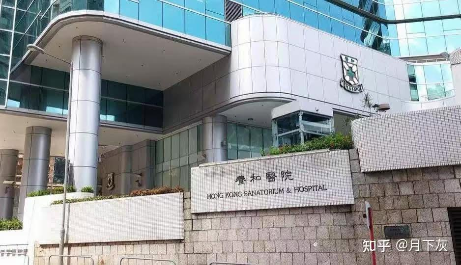

Khi ấy vẫn chưa phải thời kỳ SARS, đủ thấy giới nhà giàu Hong Kong coi trọng Trần Lãng đến mức nào.
Tuy nhiên, sau 3 lần phẫu thuật, Trần Lãng đã điều trị tại Bệnh viện Dưỡng Hòa suốt 7-8 tháng, chịu đựng vô vàn đau đớn, cuối cùng vẫn không qua khỏi.
Trước lúc lâm chung, Trần Lãng nói với Dương Thụ Thành rằng, thực ra không nên cố giữ thêm mấy tháng sinh mệnh để rồi phải chịu khổ như vậy. Có lẽ đó là sự trừng phạt vì đã tiết lộ quá nhiều thiên cơ, là sự trừng phạt của ông trời dành cho ông.
Chiều tối ngày 29 tháng 11 năm 2003, Trần Lãng qua đời tại Bệnh viện Dưỡng Hòa, hưởng thọ 78 tuổi.
Khi Trần Lãng qua đời, Lý Gia Thành cũng đích thân đến viếng.
Người thân của Trần Lãng, dựa theo nguyên tắc phong thủy, đã chọn núi Thanh Thành gần Thành Đô làm nơi an táng ông.
Núi Thanh Thành là thánh địa của Đạo giáo, cảnh sắc thanh u, cũng rất phù hợp với thân phận một bậc thầy phong thủy như Trần Lãng.

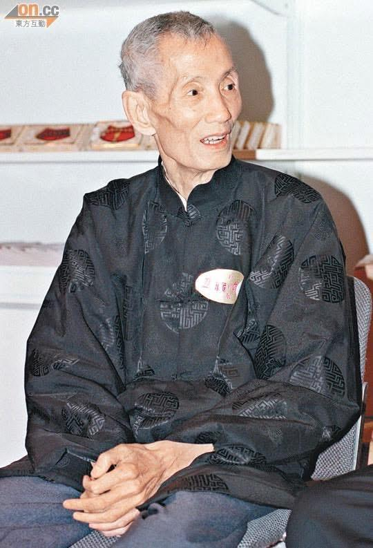

Đầu năm 2004, Dương Thụ Thành dẫn theo Tạ Đình Phong và Dung Tổ Nhi đến núi Thanh Thành, Tứ Xuyên để tế bái cố nhân, và sau đó còn nhiều lần quay lại bái tế Trần Lãng.
Theo lời tự thuật của Dương Thụ Thành, Trần Lãng không chỉ có ảnh hưởng quan trọng đến quỹ đạo cuộc đời của nhiều đại gia trong giới giải trí và thương giới Hong Kong mà còn nhiều lần chỉ dẫn ông trong những lúc sự nghiệp sa sút. Vì vậy, mối quan hệ giữa ông và Trần Lãng là vô cùng đặc biệt.
Ngoài ra, còn có một câu nói của Trần Lãng cũng khiến Dương Thụ Thành suy ngẫm rất nhiều.
Trần Lãng từng nói: “Vì sao tôi phải tiết lộ thiên cơ để giúp các vị? Là bởi vì các vị có thể giúp được nhiều người hơn nữa.”
Quan điểm này cũng hoàn toàn trùng hợp với suy nghĩ của Dương Thụ Thành. Ông cũng cho rằng: “Người giàu cần phải làm nhiều việc thiện, đó là sự tái phân bổ giữa quyền lợi và trách nhiệm.”
Trần Lãng cũng từng thừa nhận rằng ông đã giúp Lý Gia Thành và các đại gia khác thay đổi “duyên”, khiến họ công thành danh toại; nhưng đồng thời ông cũng chỉ rõ: “Con đường làm giàu thực sự nằm ở việc gieo trồng nhân quả, phúc đức. Chỉ có hành thiện tích đức, hiếu kính cha mẹ thầy cô, phổ độ chúng sinh, mới có thể tích lũy kho tài dồi dào.”
Làm từ thiện không chỉ giúp xây dựng hình ảnh “trách nhiệm xã hội” cho doanh nghiệp, gián tiếp nâng cao thiện cảm của công chúng, mà bản thân người làm còn nhận được sự an ủi về mặt tinh thần. Dương Thụ Thành cũng hiểu rõ rằng ngày thường mình đã “gieo không ít nghiệp”, nên càng muốn thông qua các hoạt động từ thiện để chuộc lại phần nào.
Dưới đây là lời căn dặn sau cùng của Trần Lãng:
“Bây giờ rất nhiều người đi sai đường, muốn dùng thủ đoạn, quyền thế hoặc kiến thức – kỹ thuật hiện đại để kiếm tiền. Đó là bởi họ không hiểu rằng tất cả những thứ ấy chỉ là ‘duyên’. Còn thứ quyết định vẫn là mình có ‘nhân’ hay không (làm việc thiện tích đức, hiếu kính cha mẹ, tôn sư trọng đạo, cứu giúp chúng sinh). Nếu không có ‘nhân’, thì tôi cũng chẳng giúp được gì.”
“Làm ăn thì phải đi đường ngay, bản thân có ‘nhân’ (phúc đức), thành công sớm hay muộn chỉ là vấn đề thời gian. Phúc dày thì duyên tự nhiên đến nhanh, không nên nóng vội. Đi đường thẳng (làm ăn đàng hoàng, đúng quy củ) cũng là tích phúc, dựng nên một tấm gương tốt để người khác noi theo. Loại phúc này không thể lấy vài tỷ ra mà đo được. Tuyệt đối đừng nghĩ đến chuyện đi đường tà, nếu không phúc sẽ nhanh chóng bị hao tổn. Vốn dĩ trong mệnh có phúc đến cả vạn tỷ, đi đường sai, hao dần chỉ còn vài chục tỷ, bản thân còn tưởng mình thành công, nào ngờ sau này phải gánh quả báo, thật sự là lỗ nặng.”

## Trần Gia Long — Người kế thừa

Con trai Trần Lãng là Trần Gia Long kế thừa y bát, đồng thời, bảo vật gia truyền là con tỳ hưu có niên đại từ thời Nam Tống cũng được truyền lại cho Trần Gia Long.
Người con trai từng khao khát biển khơi, từng rời xa sự nghiệp gia tộc, cuối cùng đã tiếp nhận sứ mệnh của cha mình, trở thành một nhà mệnh lý – phong thủy xuất sắc của Hong Kong.
Khi Trần Lãng qua đời, Chương Tiểu Huệ, Lê Tư, Tạ Đình Phong, Lương Cẩm Tùng (Cựu Cục trưởng Cục Tài chính Hong Kong),… đều đến đưa ông chặng đường cuối cùng.
Lê Tư là con gái nuôi của Trần Lãng.
Năm 2007, em trai cô là Lê Anh gặp tai nạn giao thông nghiêm trọng, cận kề cái chết. Lê Tư đã tìm đến con trai của Trần Lãng là Trần Gia Long để “hóa giải”.
Trần Gia Long đến chùa Phổ Chiếu trên núi Thanh Thành, Tứ Xuyên làm pháp sự cho Lê Anh, đồng thời thắp Đèn Thất Tinh để kéo dài sinh mệnh.
Khi phóng viên hỏi về chuyện này, Lê Tư chỉ nói không rõ lắm.
Tạp chí Đông Châu từng đưa tin rằng lúc đó, trong Đại Hùng Bảo Điện và phòng Dưỡng Tâm Trai của chùa Phổ Chiếu đều có đặt Đèn Thất Tinh, trên đó ghi rõ tên Lê Anh và 8 chữ “Phật quang phổ chiếu, tiêu tai kỳ phúc”, đồng thời ghi chú cầu cho Lê Anh sớm bình phục.
Trong chùa còn có cao tăng tụng kinh niệm Phật, làm nghi thức hóa sớ cầu phúc cho Lê Anh.
Trụ trì Thích Quả Chứng cũng thừa nhận từng nhận được cuộc gọi đường dài của Lê Tư, khóc kể về tình trạng của em trai. Vì vậy, ngài đã sắp xếp 3 ngày pháp sự liên tiếp, thắp Đèn Thất Tinh cầu phúc tiêu tai cho Lê Anh.
Nghe nói để thắp Đèn Thất Tinh như vậy, phải có thầy trụ trì tụng kinh giữ đèn ít nhất 3 ngày 3 đêm, lâu nhất có thể 7 ngày 7 đêm, trong thời gian đó không được để đèn tắt.

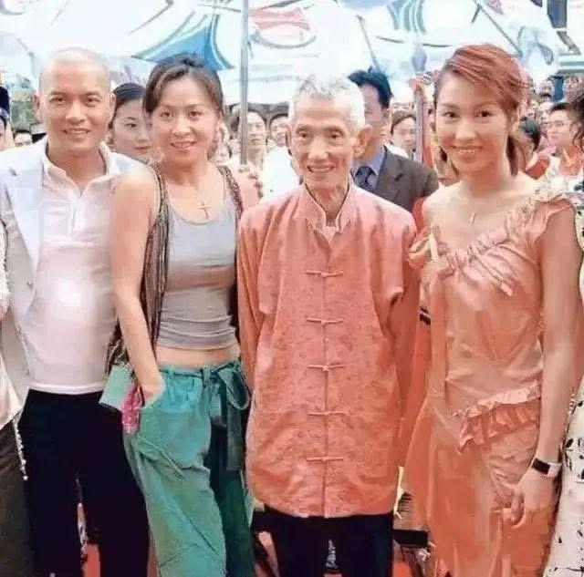

Từ trái sang phải: Lữ Lương Vỹ, Lưu Gia Linh, Trần Lãng, Lê Tư.
Trần Gia Long nói: Khi thắp Đèn Thất Tinh cho một người, trước tiên phải căn cứ năm tháng ngày giờ sinh của người đó, xem mệnh số có “chưa đến số chết” hay không. Thông thường, những người hôn mê bất tỉnh hoặc bị bệnh tim nặng cũng hay dùng Đèn Thất Tinh để kéo dài mạng sống.
“Thực ra phong thủy không phải là mê tín. Quan sát tinh tượng để hiểu thiên mệnh là một điều rất khoa học.” Trần Gia Long, qua hơn 20 năm thực hành, đã hình thành cách lý giải của riêng mình: “Khi hiểu được những điều huyền diệu bên trong, con người sẽ tránh được rất nhiều vòng vo không cần thiết.”
Sau khi kế thừa sự nghiệp của cha, Trần Gia Long đã phát triển phong cách riêng độc đáo. Ông không chỉ vận dụng kiến thức phong thủy truyền thống, mà còn dung hợp các khái niệm khoa học hiện đại, khiến hệ thống này trở nên mạch lạc và mang tính lý luận hơn. Theo ông, phong thủy thực chất là nghiên cứu mối
quan hệ giữa môi trường và trường năng lượng của con người, là kết tinh trí tuệ của cổ nhân, không nên bị đơn giản hóa thành mê tín.

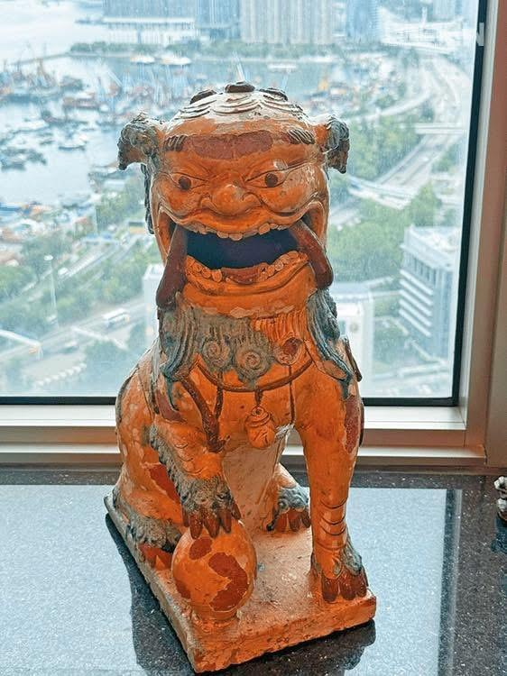

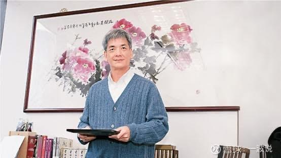

Bảo vật gia truyền mà Trần Lãng truyền lại cho con trai — con tỳ hưu từ thời Nam Tống. Vật này được xem như ngọc tỷ của hoàng đế, truyền từ đời này sang đời khác, là biểu tượng của gia tộc họ Trần. Trần Gia Long đặt nó trong đại sảnh nhà mình, ngày thường đều dùng vải đỏ bọc lại, vô cùng quý giá.
Trần Lãng có 3 người vợ, Trần Gia Long là con trai út trong cặp song sinh do Trần Lãng và người vợ cả sinh ra. Ông cũng là người con duy nhất được Trần Lãng trực tiếp dẫn theo đến tư gia của những đại gia hàng đầu như Lý Gia Thành, Lý Triệu Cơ, Vinh Trí Kiện,… để xem phong thủy.

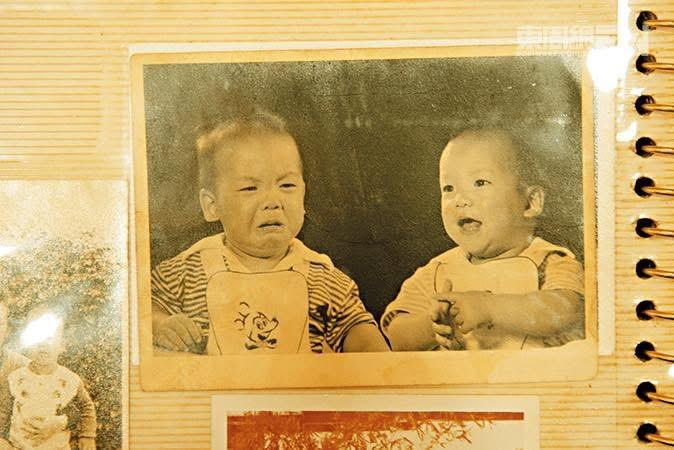

Trần Gia Long (bên trái) là người em trong cặp song sinh. Hai anh em một cười một khóc, hòa quyện tạo nên khung cảnh đầy thú vị.
Trần Gia Long, từ năm 7

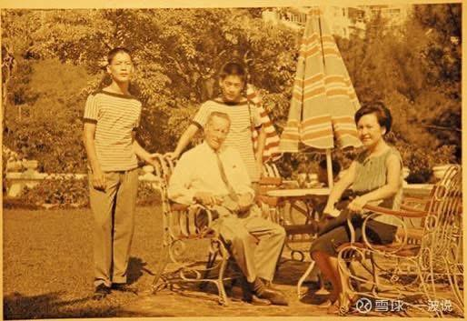

tuổi đã theo cha là Trần Lãng học phong thủy huyền học. Khác với người cha luôn khoác lên mình một lớp màn bí ẩn, ông chủ động xuất hiện trước công chúng, đặc biệt là mở chuyên mục “Diệu toán ‘Trần’ huyền” trên tạp chí Đông Chu của Hong Kong, qua đó quảng bá và truyền thừa môn phong thuỷ học — một tinh hoa của văn hóa Trung Hoa.
Vào những năm 1950-1960 của thế kỷ trước, khi phần lớn người dân Hong Kong vẫn còn chìm trong giấc ngủ, trên đỉnh núi Đại Mạo luôn thấp thoáng bóng dáng hai cha con. Trần Gia Long khi ấy mới 7 tuổi, được
cha là Trần Lãng nhẹ nhàng gọi dậy, dụi đôi mắt ngái ngủ, theo cha lần mò trong bóng tối lên núi ngắm sao. Xem xong, hai cha con lại cùng nhau đi uống trà, rồi Trần Gia Long mới quay về trường đi học.
“Con nhà người ta còn đang chơi xe mô hình, thì tôi đã phải dậy lúc 4 giờ sáng để học ngắm sao.” Trần Gia Long, nay đã tóc bạc trắng, khi trả lời phỏng vấn truyền thông Hong Kong, hồi tưởng lại như vậy.
Trong những buổi bình minh tĩnh lặng ấy, Trần Lãng dạy con nhận biết các vì sao, giảng giải mối liên hệ huyền diệu giữa tinh tượng và vận thế nhân gian.
“Khi đó tôi còn chưa hiểu Tử Vi Đẩu Số là gì, chỉ biết rằng những dự đoán của cha đều rất chuẩn.” Trần Gia Long kể.
Mãi đến năm 12 tuổi, Trần Gia Long mới dần ý thức được rằng cha mình là người rất nổi tiếng.
“Tôi hỏi cha vì sao lúc nào cũng quan sát tinh tú, ông nói tinh tượng sẽ ảnh hưởng đến vận thế của con người. Khi đó tôi chưa hiểu phong thủy là gì, chỉ biết những dự đoán của cha rất chuẩn. Mỗi khi có người đến tìm, cha tôi thường bảo: ‘Sáng mai hãy quay lại, tốt nhất đừng rửa mặt đánh răng, để xem khí sắc của anh thế nào đã.’”
Trần Lãng thường nói với con trai: “Đời người có rất nhiều quỹ đạo, đi lệch rồi thì vận may sẽ không đến. Tác dụng của phong thủy là giúp con người quay lại đúng quỹ đạo, để cuộc đời không còn thăng trầm bất định.”
Sự khai mở đặc biệt ấy đã đặt nền móng vững chắc cho việc Trần Gia Long kế thừa sự nghiệp của cha sau này. Tuy nhiên, khi còn nhỏ, điều khiến ông hứng thú hơn có lẽ là việc được theo cha gặp gỡ những nhân vật lớn.
“Mỗi ngày bước lên những bậc thang dẫn vào nhà chúng tôi trên đồi Gia Đa Lợi, người ra kẻ vào toàn là đại gia, minh tinh, nhiều đến mức tôi không nhớ nổi mặt. Bàn ăn thường xuyên có hơn chục người ngồi quây quần, ai cũng không quen biết nhau, nhưng bên cạnh cha tôi nhất định luôn có một chỗ trống, chờ ai đó ngồi xuống hỏi han.” Trần Gia Long hồi tưởng.
“Vào dịp Tết, cha tôi không nhận tiền mừng tuổi, vì ông nói mình là bậc trưởng bối, chỉ có phát chứ không nhận. Có lần ông còn bảo tôi ra ngân hàng đổi 300,000 HKD tiền mệnh giá 1000 HKD để lì xì. Thời đó, bao lì xì của giới thượng lưu đều rất lớn.”
Trong ký ức tuổi thơ của Trần Gia Long, còn có một “nhiệm vụ” đặc biệt: suốt một tháng liền, mỗi sáng đều mua sữa đậu nành và bánh quẩy, mang đến khách sạn Tuyết Viên khi ấy để đưa cho một cụ già.
Ông cụ ấy chính là Phổ Tâm Dư — người anh em họ của vị hoàng đế cuối cùng Phổ Nghi, đồng thời là bậc thầy quốc họa lừng danh, cùng Trương Đại Thiên được xưng tụng là “Nam Trương Bắc Phổ”.
“Tôi thấy ông ấy liếm đầu bút bằng lưỡi, nói rằng phải cảm nhận được khí vận của lông bút rồi mới hạ bút. Năm đó cha tôi từng theo ông ấy học vẽ, khi rời đi, ông ấy còn tặng cho cha tôi 4 bức tranh treo tượng trưng cho xuân, hạ, thu, đông.” Trần Gia Long cười nói: “Lúc ấy tôi đâu biết phải học theo ông ấy, giờ nghĩ lại thì cần gì học, chỉ cần xin ông ấy vài bức tranh là đã phát đạt rồi!”
Khả năng dự đoán của Trần Lãng có danh tiếng rất lớn trong giới thượng lưu.

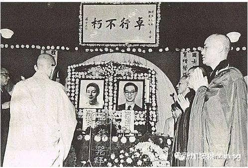

Trần Gia Long nhớ lại: “Thời đó, đi máy bay là chuyện rất ghê gớm, người giàu thường tìm thầy phong thủy xem khí sắc như mua bảo hiểm, thấy không có vấn đề mới lên máy bay, cha tôi cũng từng xem cho người không[^2]. khác. Năm 1964, Đài Loan xảy ra một vụ tai nạn hàng Thực ra có người từng khuyên ông trùm

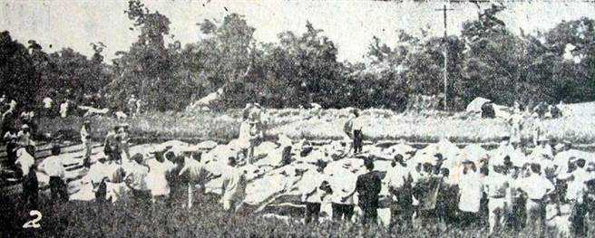

điện ảnh Lục Vận Đào đừng lên máy bay. Vận số của ông ấy vốn chưa đến mức phải chết, nhưng phía trước ông 2 hàng ghế có một người vận khí cực xấu, giống như ‘đi chung con tàu đắm’, khiến cả máy bay rơi.”
Dù Trần Lãng hết lòng bồi dưỡng, mong con trai nối nghiệp, nhưng Trần Gia Long khi còn trẻ lại khao khát tự do.

[^2]: Chuyến bay số 106 của hãng Hàng không Dân dụng (CT106), còn được gọi là “thảm họa hàng không Thần Cương”, là một chuyến bay định kỳ từ Đài Trung đi Đài Bắc. Ngày 20/6/1964, một chiếc máy bay vận tải C-46 mang số hiệu B-908 cất cánh từ Đài Trung không lâu thì rơi, khiến toàn bộ 57 người trên máy bay thiệt mạng.
Năm 20 tuổi, Trần Gia Long dứt khoát chọn trở thành một thủy thủ, và chuyến đi ấy kéo dài hơn 10 năm.
Trần Gia Long hồi tưởng về quãng đời làm thủy thủ năm xưa: “Giữa biển cả mênh mông, lần trải nghiệm nguy hiểm nhất của tôi là vào năm 1979, khi gặp cơn bão David.” Ông kể: “Khi đó ở ngoài khơi nước Úc, rõ ràng là bão đã đi qua, vậy mà nó lại quay đầu đuổi theo chúng tôi, còn cuốn con tàu vào thẳng tâm bão. Chúng tôi vật lộn suốt 3 ngày 3 đêm, sóng gió dữ dội, các thủy thủ lão luyện không ngừng niệm ‘Nam mô

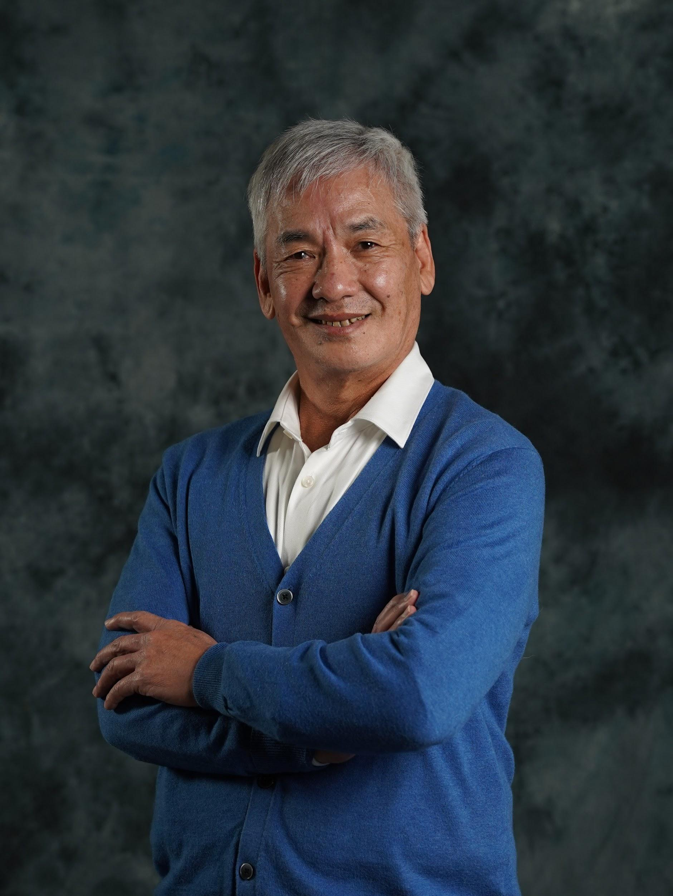

A Di Đà Phật’. Con tàu lắc lư như chiếc bập bênh, hoàn toàn không thể tiến lên.”
Sau khi bão tan, các thủy thủ lập tức xác định vị trí, mới phát hiện con tàu đã bị thổi lệch khỏi bờ tới 60 hải lý. “Nếu gió thổi lệch sang phía bên kia, cả con tàu đã sớm bị hất thẳng lên bờ, chắc chắn không còn đường sống.” Trải nghiệm này khiến Trần Gia Long cảm nhận sâu sắc sức mạnh của thiên nhiên, đồng thời giúp ông hiểu rõ hơn lời cha thường nói về “thiên mệnh”.
Những năm tháng lênh đênh trên biển giúp Trần Gia Long trải qua đủ phong ba bão táp, cũng cho ông rất nhiều cơ hội quan sát tinh tú, nhưng ông chưa từng liên hệ những điều đó với phong thủy huyền học. Mãi đến hơn 10 năm sau, khi trở về Hong Kong, dưới sự sắp xếp của cha, Trần Gia Long mới bắt đầu tiếp xúc với sự nghiệp gia tộc.
Sau khi trở về Hong Kong, Trần Lãng trước tiên sắp xếp cho Trần Gia Long quản lý một cửa hàng đồ cổ. Chính tại đây, ông lần đầu gặp Lý Gia Thành.
“Lúc đó tôi không biết ông ấy là ai, trò chuyện một lúc, ông ấy biết tôi từng đi tàu biển nên bảo tôi sang công ty của ông giúp lo mảng vận tải biển. Nhưng tất nhiên tôi từ chối, vì thủy thủ và tầng lớp quản lý là hai chuyện khác nhau.” Trần Gia Long cười nói. “Nếu lúc ấy tôi đồng ý, biết đâu lại vào làm ở Wheelock cũng nên!”
Trần Lãng và Lý Gia Thành có mối giao hảo rất sâu đậm, thường tặng ông những món đồ cổ trị giá hàng triệu đô la Hong Kong, để ông tùy ý chọn, nói rằng “không sao cả”. Với vai trò là thầy phong thủy riêng của Lý Gia Thành, Trần Lãng không thể đồng thời phục vụ nhiều đại gia hàng đầu, nên đã giới thiệu sư đệ của
mình là Nhậm Pháp Dung (nguyên Chủ tịch Hiệp hội Đạo giáo Trung Quốc, nay đã qua đời) đến trợ giúp “Chú Tư” Lý Triệu Cơ.
10 năm sau, Trần Gia Long từng đến đài quan sát ở Thiểm Tây thăm Nhậm Pháp Dung, được ông tặng 4 chữ “Vô vi nhi trị[^3]”, và đến nay vẫn trân trọng gìn giữ.

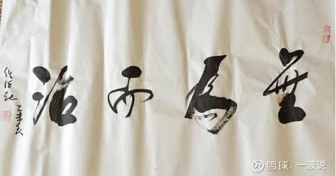

Trần Gia Long được Nhậm Pháp Dung đích thân đề bút 4 chữ “Vô vi nhi trị”, vô cùng quý giá.

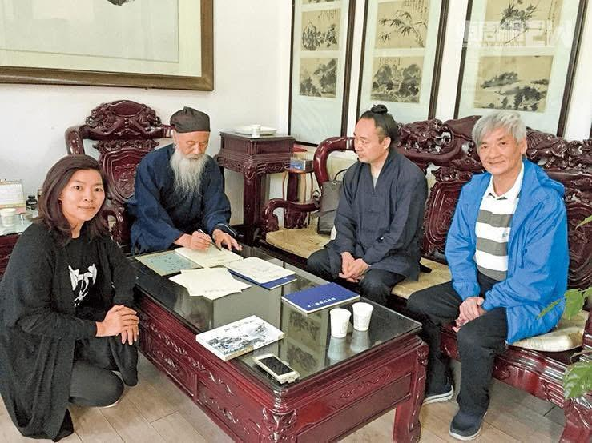

3 (無為而治) Vô vi nhi trị có nghĩa là cai trị bằng cách không cưỡng cầu, thuận theo quy luật tự nhiên và lòng người, ít can thiệp nhưng đặt đúng nền tảng, để mọi sự tự vận hành mà vẫn đạt hiệu quả. Trong đó, vô vi (無為) là không làm gì trái với tự nhiên, không cưỡng ép, không can thiệp thô bạo; nhi trị (而治) là vẫn cai trị, quản lý tốt. Khái niệm này xuất phát từ Đạo gia, đặc biệt trong tư tưởng Lão Tử – Trang Tử.
10 năm trước, Trần Gia Long (ngoài cùng bên phải) từng đến thăm Nhậm Pháp Dung (thứ hai từ trái sang) — sư đệ của Trần Lãng. “Ông ấy đã kể cho tôi nghe rất nhiều chuyện xưa của cha tôi.”
Không mấy hứng thú với đồ cổ, Trần Gia Long sau đó chuyển sang làm việc tại một công ty du lịch. Trong thời gian rảnh, ông bắt đầu theo cha học cách xem khí sắc và phong thủy.
Lúc này, Trần Gia Long mới thực sự thấu hiểu lời cha thường nói: “Khi một người vừa mới ngủ dậy, nhìn dưới ánh nắng thì khí sắc là rõ ràng nhất. Khuôn mặt chia làm thượng, trung, hạ tam đình; phải quan sát tổng thể sắc da, thần thái của con người — những điều này đều phải học theo thầy, sách vở không hề ghi chép.”
Đáng chú ý là cuộc hôn nhân của Trần Gia Long cũng là mối lương duyên do chính cha ông lựa chọn.

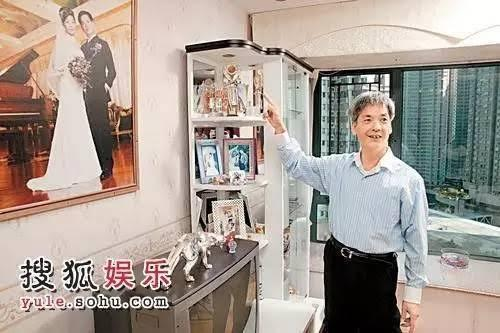

Trần Gia Long từng có một cuộc hôn nhân trước khi gắn bó lâu dài với người vợ hiện tại. Ông và người vợ hiện tại là Lê Bảo Quân đã chung sống hơn 20 năm và có 2 cô con gái. Trong ngày phỏng vấn, hai người ăn mặc giản dị theo phong cách đồ đôi khi cùng đến, bà Lê Bảo Quân còn ân cần chỉnh lại cổ áo cho chồng, chăm sóc rất chu đáo.
Nhắc đến mối nhân duyên này, nghe nói người con dâu ấy năm xưa chính là do Trần Lãng “đích thân chọn lựa”, dặn con trai rằng “không phải cô ấy thì không cưới”.
Nghe vậy, Trần Gia Long chỉ vào vợ cười nói: “Anh hỏi cô ấy đi, cô ấy biết rõ lắm. Lần đầu tôi dẫn cô ấy về gặp cha, chúng tôi đã quen nhau hơn 1-2 năm rồi. Cô ấy không biết cha tôi là Trần Lãng rất khó gặp, mà cha tôi cũng không biết cô ấy là bạn gái của tôi.”
Bà Lê Bảo Quân, tiếp lời: “Tôi biết đó là cha anh ấy mà! Hôm đó tôi cùng Chủ tịch Sở Giao dịch Chứng khoán Hong Kong lên nhà Trần Lãng. Tôi chỉ nghĩ là ghé ngồi một lát rồi đi dự tiệc. Sau khi Chủ tịch Sở Giao dịch hỏi xong chuyện, cha anh ấy liền hỏi tôi có điều gì muốn hỏi không. Tôi học ngành vật lý, lại không tin mấy chuyện này, nên trả lời là không, rồi định đi về. Không ngờ ông ấy tiễn tôi ra tận cửa. Sau
này tôi mới biết, đó là lần đầu tiên bố chồng tôi tiễn khách ra tới cửa, ông còn hỏi tôi có thể ở lại trò chuyện thêm chút nữa không, nhưng tôi nói để lần sau vậy, ha ha!”
Ai ai cũng mong có thể trò chuyện thêm đôi câu với Trần Lãng, vậy mà Lê Bảo Quân lại rất táo bạo, trực tiếp từ chối ngay trước mặt ông.
Lê Bảo Quân hồi tưởng: “Sau này tôi nghe một người bạn kể rằng, bố chồng nhìn ra được tôi sau này có thể giúp đỡ sư phụ (tức Trần Gia Long). Đến lần gặp thứ hai, coi như là ra mắt gia đình rồi, ông ấy đưa cho tôi một bao lì xì rất lớn, còn tặng thêm một chiếc bình hoa. Hôm đó ăn tối xong, đi dạo chợ hoa Tết mua hoa về, đêm khuya rồi, tôi chỉ định ghé cửa hàng Japan Home mua tạm một cái bình để cắm hoa là xong. Không ngờ bố chồng lại bảo tôi vào phòng tùy ý chọn

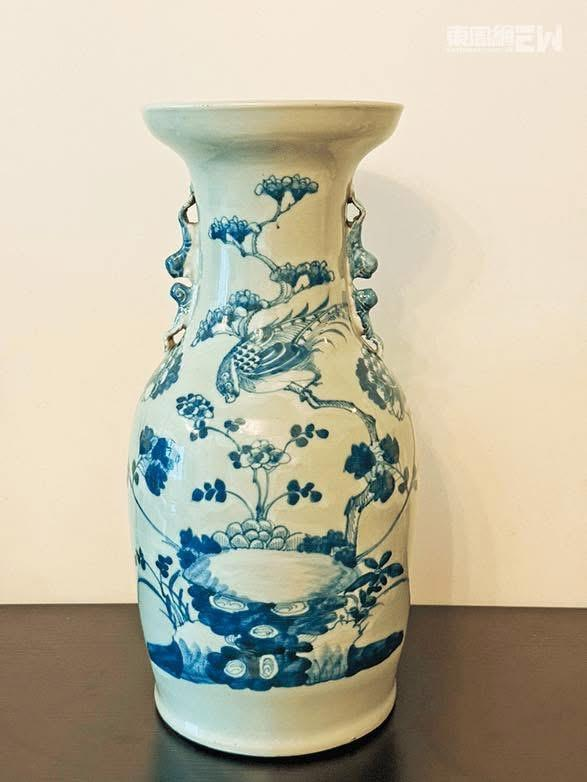

một cái, kết quả tôi lấy một chiếc bình hoa thời nhà Minh. Cho đến hôm nay, chiếc bình ấy vẫn còn được trưng bày trong nhà!”
Trần Lãng tính toán như thần, đã sớm đoán được con trai mình có mối lương duyên tốt đẹp. Còn Trần Gia Long cũng không phụ lòng mong đợi ấy, trân trọng “sao phu thê” của đời mình, cùng vợ nắm tay bước tiếp chặng đường sau của cuộc đời.
Tính đến nay đã hơn 20 năm kể từ khi chính thức kế thừa gia nghiệp, Trần Gia Long mỉm cười dõi theo mây trời biến đổi, chứng kiến bao thăng trầm của giới thượng lưu. Theo ông, nguyên nhân khiến họ thành công, ngoài năng lực cá nhân và cơ hội, còn nằm ở việc biết thuận theo thời thế, điều chỉnh mối quan hệ giữa bản thân và môi trường xung quanh.
“Phong thủy không phải là phép thuật biến đá thành vàng, mà là giúp con người, vào đúng thời điểm, ở đúng vị trí, đưa ra những lựa chọn đúng đắn.”
Trần Gia Long kế thừa tệp khách hàng của cha mình, đồng thời cũng phát triển những nét riêng. Ông chú trọng hơn vào việc kết hợp phong thủy truyền thống với đời sống hiện đại, nhằm đưa ra cho khách hàng những lời khuyên thiết thực, có thể áp dụng ngay. Theo ông, các lý thuyết phong thủy cổ đại cần được điều chỉnh cho phù hợp với đặc điểm kiến trúc và lối sống ngày nay thì mới có thể phát huy tác dụng thực sự.
Trần Gia Long cho rằng, nhiều nguyên lý trong phong thủy truyền thống thực chất có thể được giải thích bằng khoa học hiện đại.
“Ví dụ như hướng nhà, sự thông gió và ánh sáng tự nhiên đều ảnh hưởng trực tiếp đến sức khỏe và trạng thái tâm lý của người ở; trường năng lượng của môi trường tương tác với từ sinh học của cơ thể con người sẽ tạo ra những hiệu quả khác nhau. Người xưa dùng hệ thống ngôn ngữ của họ để mô tả những quy luật này, còn ngày nay chúng ta có thể diễn giải lại bằng ngôn ngữ khoa học.”
Ông đặc biệt nhấn mạnh rằng phong thủy không nên bị thần thánh hóa, mà cần được nhìn nhận một cách lý tính.
“Đó là sự vận dụng tổng hợp của môi trường học, năng lượng học và tâm lý học, với mục đích giúp con người kiến tạo một môi trường sống và làm việc hài hòa.”
Trần Gia Long của hiện tại vừa là người kế thừa, vừa là người đổi mới của văn hóa phong thủy truyền thống. Trong khi gìn giữ những lý luận cốt lõi của cha mình, ông cũng dung hợp cách hiểu và kinh nghiệm thực tiễn của bản thân. Trần Gia Long còn thường xuyên tổ chức các buổi thuyết giảng và hội thảo, phổ biến kiến thức phong thủy đến công chúng, loại bỏ màu sắc mê tín, nhấn mạnh giá trị ứng dụng thực tế.
“Tôi mong nhiều người hơn nữa hiểu rằng phong thủy không phải là huyền học thần bí mà là một dạng trí tuệ sống.”
Truyền kỳ của hai cha con Trần Lãng – Trần Gia Long không chỉ là câu chuyện kế thừa của một gia tộc, mà còn là một lát cắt vi mô của lịch sử biến chuyển xã hội Hong Kong. Họ đã chứng kiến vô số lần tài sản được tạo dựng rồi mất đi, đồng thời giúp nhiều người tìm được phương hướng giữa những biến động không ngừng của thời cuộc.
