Tứ đại gia tộc cận đại của Vô Tích là tập đoàn doanh nghiệp công thương dân tộc hình thành vào đầu thế kỷ XX, lấy 4 gia tộc họ Vinh, họ Đường, họ Dương và họ Tiết làm nòng cốt. Cơ cấu sản nghiệp của họ cấu thành chủ thể kinh tế địa phương Vô Tích, đồng thời đại diện cho mô hình điển hình của sự phát triển công thương nghiệp dân tộc Trung Quốc thời cận đại.
Hồ sơ tư liệu về doanh nghiệp của tứ đại gia tộc này đã được đưa vào danh mục dự án quốc gia bảo tồn, cứu hộ năm 2009, cung cấp nguồn tư liệu gốc quan trọng cho việc nghiên cứu lịch sử kinh tế cận đại.
Gia tộc họ Vinh do anh em Vinh Tông Kính và Vinh Đức Sinh sáng lập, lấy Nhà máy bột mì Mậu Tân và Nhà máy dệt Thân Tân làm trụ cột, giữ vai trò chủ đạo trong ngành bột mì và sợi bông trong nước.
Gia tộc họ Đường có nhiều thành viên tốt nghiệp Học viện Công nghệ Massachuses (MIT). Các doanh nghiệp do Đường Tinh Hải và Đường Quân Viễn điều hành, tiêu biểu là Nhà máy dệt – nhuộm Khánh Phong, đã hình thành mạng lưới sản nghiệp liên vùng. Hậu duệ Đường Tường Thiên sau này tham gia sâu vào giới chính trị và thương mại tại Hong Kong.
Gia tộc họ Tiết lấy Tiết Phúc Thành và Tiết Nam Minh làm đại diện, các thế hệ sau như Tiết Mộ Kiều và Tôn Dã Phương trở thành những người đặt nền móng cho kinh tế học Trung Quốc thời kỳ mới.
Gia tộc họ Dương sáng lập Nhà máy sợi Nghiệp Cần — doanh nghiệp cận đại đầu tiên của Vô Tích — thúc đẩy quá trình chuyển đổi công nghiệp hóa tại địa phương. Các hậu duệ như Dương Ấm Du và Dương Giáng sau đó chuyển hướng sang lĩnh vực giáo dục và học thuật.

> @蓝小姐和黄小姐 @精英说 © Lược dịch từ bài viết của trên Sohu kết hợp cùng bài viết của trên The Paper.

> @蓝小姐和黄小姐 Bài viết của trên Sohu được đăng tải ngày 10 tháng 12 năm 2021 trong chuyên mục “Danh lưu” với tiêu đề “Quyên góp 125 triệu cho thành phố lớn — bối cảnh của gia tộc old money này rốt cuộc sâu dày đến mức nào, thật khó mà đo lường…”

> @精英说 Bài viết của trên The Paper được đăng tải ngày 3 tháng 2 năm 2022 với tiêu đề “Vợ chồng người Hoa hào phóng quyên góp 800 triệu nhân dân tệ, gia tộc họ Đường giàu suốt 16 đời có câu chuyện gì?”

> © Bài dịch gốc của Facebook page [Hôm nay giới thượng lưu có gì?](https://www.facebook.com/Homnaygioithuongluucogi "Hôm nay giới thượng lưu có gì?")

> ‧₊˚❀༉‧₊˚

Doanh nhân người Mỹ gốc Hoa Đường Lưu Thiên (Oscar Tang) và vợ là Từ Tâm Mi (Agnes Hsu-Tang) đã quyên góp kỷ lục 125 triệu USD cho Bảo tàng Nghệ thuật Metropolitan New York, nhằm phục vụ việc cải tạo không gian trưng bày các bộ sưu tập nghệ thuật hiện đại và đương đại.
Phía Metropolitan cho biết, để đáp lại nghĩa cử này, khu không gian sau khi được cải tạo sẽ mang tên hai vợ chồng họ, với thời hạn ít nhất 50 năm.
Dù tên tuổi của họ với nhiều người nghe còn khá xa lạ, nhưng nếu lần theo bối cảnh gia tộc, thì gần như có thể xâu chuỗi cả mạng lưới giao du thượng lưu của lịch sử cận đại Trung Quốc.
Cha của Đường Lưu Thiên là ông trùm ngành dệt len Đường Bính Nguyên, ông ngoại là Ôn Bỉnh Trung – dượng của 3 chị em họ Tống, mẹ vợ trước của ông là Nghiêm Ấu Vận — được mệnh danh là “quý bà trường thọ nhất”.
Đến thế hệ của Đường Lưu Thiên, anh trai ông từng là Chủ tịch người Hoa đầu tiên của Tổng hội Thương mại Hong Kong. Còn bản thân Đường Lưu Thiên là nhà đầu tư, nhà sưu tầm, nhà từ thiện,… với mái tóc bạc thanh nhã, lời nói lúc nào cũng điềm đạm, chậm rãi.
Ở lớp hậu bối, cháu gọi ông bằng chú là Đường Anh Niên – cựu Bộ trưởng Bộ Tài chính Hong Kong.
Người vợ hiện tại của ông — Từ Tâm Mi — cũng có xuất thân không hề tầm thường.
Từ Tâm Mi sinh ra tại Đài Loan (Trung Quốc), năm 15 tuổi sang Mỹ du học. Bà theo học tại Bryn Mawr College, chuyên ngành khảo cổ nghệ thuật Hy Lạp – La Mã cổ đại và lịch sử văn học Anh, lấy bằng cử nhân. Sau đó tiếp tục học lên tại Đại học Pennsylvania, nhận bằng thạc sĩ và tiến sĩ.
Theo Baidu, Từ Tâm Mi từng giữ chức Giám đốc hành chính Học viện Khổng Tử thuộc China Institute in America, giảng dạy khảo cổ học Trung Quốc tại Đại học Brown, đồng thời là học giả nghiên cứu tại Đại học Stanford và Đại học Cambridge trong khuôn khổ Quỹ Mellon và Viện Nghiên cứu Joseph Needham.
Ngoài ra, bà còn đảm nhiệm vai trò cố vấn cho Trung tâm Di sản Thế giới của UNESCO, Chủ tịch Hội đồng Nghệ thuật và Văn hóa Toàn cầu của Asia Society, cùng nhiều vị trí học thuật và văn hóa khác.
Sắc vóc và tài năng song toàn, bà toát lên sự tự tin mạnh mẽ nhưng không phô trương. Sau khi tốt nghiệp, Từ Tâm Mi trở thành người dẫn chương trình ký hợp đồng với History Channel của Mỹ. Có lẽ nhờ nền giáo dục tinh hoa và môi trường gia đình cởi mở, bà chưa từng bận tâm đến khoảng cách tuổi tác giữa mình và Đường Lưu Thiên, còn Đường Lưu Thiên thì bị thu hút sâu sắc bởi sự tự tin và xuất sắc của bà.
Sau khi kết hôn, Đường Lưu Thiên và Từ Tâm Mi thường xuyên xuất hiện cùng nhau tại các sự kiện từ thiện và hoạt động công ích. Có thể thấy, họ chia sẻ chung hệ giá trị, vì thế mới có thể hấp dẫn lẫn nhau và trân trọng nhau đến vậy.
Đầu tháng 12/2021, vợ chồng Đường Lưu Thiên đã quyên góp khoản tiền lên tới 800 triệu nhân dân tệ cho Bảo tàng Nghệ thuật Metropolitan. Với họ, số tiền này dĩ nhiên không thể xem là “chuyện nhỏ”, nhưng so với ý nghĩa của việc làm thiện nguyện và đền đáp xã hội thì việc dùng số tiền ấy cho nghệ thuật còn đáng giá hơn nhiều so với việc để yên trong tài khoản ngân hàng.
Từ Tâm Mi còn nhìn nhận vấn đề từ góc độ nghệ thuật để lý giải mục đích chung của hai vợ chồng: “Nghệ thuật là hình thức cao nhất của hy vọng. Chúng tôi mong có thể truyền tải niềm hy vọng ấy tới toàn thế giới.”
Ở tuổi 74, Đường Lưu Thiên tóc đã bạc trắng, sánh đôi cùng Từ Tâm Mi đầy khí chất, hai người vô cùng gắn bó, yêu thương. Ngoài việc tham dự các buổi lễ quyên góp, vợ chồng họ còn khởi xướng phong trào “còi vàng”, mạnh mẽ phản đối phân biệt chủng tộc và bạo lực chống người châu Á, phát hành 500.000 chiếc còi vàng in dòng chữ “We Belong” (Chúng ta thuộc về nơi này).
Thực ra, Đường Lưu Thiên từ nhỏ đã được đưa sang Mỹ du học, khả năng tiếng Trung không tốt (chỉ nói được một chút tiếng Thượng Hải), khi trả lời phỏng vấn hầu như đều dùng tiếng Anh. Nếu cùng Từ Tâm Mi nhận phỏng vấn bằng tiếng Trung, thì đa phần do vợ ông đứng ra trả lời.
Câu chuyện của họ thực sự có thể kể liên tục 3 ngày 3 đêm vẫn chưa hết. Vì nội dung quá đồ sộ, nên chúng tôi sẽ chia thành 2 phần để bàn luận. Hôm nay, trước tiên hãy nói về gia tộc họ Đường với mạng lưới nhân vật sâu rộng, mênh mông khó dò.

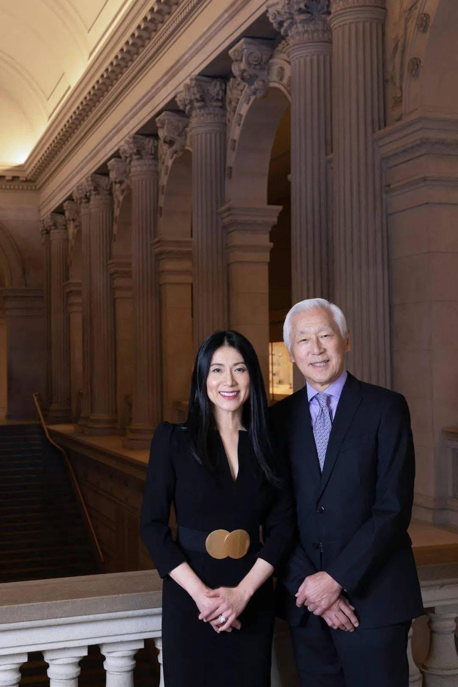

Đường Lưu Thiên và Từ Tâm Mi chính là cặp vợ chồng nho nhã, điềm đạm xuất hiện trong bức ảnh trên đây. Muốn hiểu khí chất của tầng lớp thượng lưu người Hoa, chỉ cần nhìn vào cặp vợ chồng này là có thể hình dung phần nào…
⊹✦⊹
Tổ quán của họ Đường là huyện Vũ Tiến, phủ Thường Châu, thường được gọi là Tỳ Lăng Đường thị. Trong số tổ tiên có nhiều nhân vật nổi tiếng, tiêu biểu như Đường Thuận Chi — nhà văn học đời Minh, đồng thời là danh tướng chống giặc Oa, hiệu Kinh Xuyên. Ở Thường Châu hiện vẫn có Công viên Kinh Xuyên, được đặt tên để tưởng niệm ông.

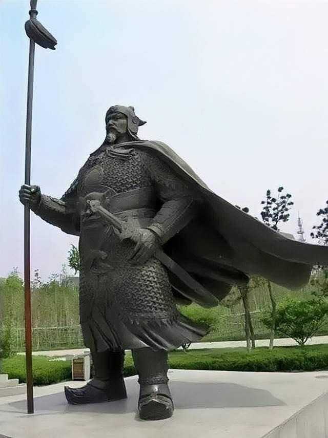

Tượng anh hùng kháng Oa Đường Kinh Xuyên.
Đến cuối đời Minh, một nhánh của đời thứ 11 họ Đường đã dời sang Vô Tích, thành phố nằm cạnh Thường Châu. Vì vậy, ngày nay khi nhắc đến họ Đường, phần lớn đều là đang nói tới Đường Thị Vô Tích.
Lần ngược về trước có thể thấy, họ Đường từ nhiều đời đã là phú hộ một phương, sớm phá vỡ cái gọi là “giàu không quá 3 đời”. Người đặt nền móng vững chắc cho gia tộc là Cảnh Khê Công Đường Mậu Huân, thuộc đời thứ 16 của nhà họ Đường.
Đường Mậu Huân rất giỏi kinh doanh. Năm xưa, ông mở Đường Thị Trường Bố Trang tại Vô Tích, làm ăn phát đạt, tiền của dồi dào. Ông có 8 người con trai — người theo nghiệp buôn bán, người theo con đường quan trường, người gắn bó với nông nghiệp.

Năm 1860, quân Thái Bình bắt đầu tiến công Nam Kinh, chiến sự nhanh chóng lan khắp vùng Giang Nam.
Để tránh loạn lạc, Đường Mậu Huân dẫn theo người con thứ 6 Đường Hồng Bồi và người con thứ 7 Đường Tăng Nguyên[^1] — đều có năng khiếu kinh doanh — cùng toàn bộ gia quyến, già trẻ lớn bé, chuyển đến cầu Nghiêm Gia.
Đường Mậu Huân chọn cầu Nghiêm Gia bởi nơi đây vừa yên tĩnh vừa sầm uất, là chốn tránh binh đao lý tưởng, đồng thời cũng là điểm khởi đầu cho kế hoạch phát triển lâu dài của gia tộc. Sau đó, tại đầu cầu Song Bản ở trung tâm chợ, ông mở Xuân Nguyên Bố Trang. Chỉ sau vài năm, cửa hàng đã thu lợi nhuận lớn, từ đó đánh dấu bước đi đầu tiên của nhà họ Đường trên vùng đất phong thủy cầu Nghiêm Gia — nơi gia tộc này chính thức phát tích và làm giàu.
Sau khi bén rễ tại vùng đất này, Đường Mậu Huân cùng 2 người con trai kinh doanh bông, sợi bông và vải thô, quản lý rất hiệu quả. Đồng thời, ông mua một lượng lớn ruộng đất, sở hữu hơn 6000 mẫu, tích trữ lương thực, không ngừng mở rộng cơ nghiệp. Chẳng bao lâu sau, gia tộc họ Đường đã trở thành người giàu nhất vùng nông thôn phía Đông Bắc Vô Tích, uy danh vang dội khắp làng quê và thị trấn.
Quê hương phát tích của gia tộc họ Đường là cầu Nghiêm Gia, trấn Dương Tiêm, thành phố Vô Tích.
Đường Tăng Nguyên cũng chính là ông nội của Đường Anh Niên, cựu Bộ trưởng Bộ Tài chính Hong Kong.
Theo tư liệu, ông có 8 người con trai. Trong đó, một nhánh sinh ra Đường Hồng Bồi, chính là ông cố của nhân vật trung tâm bài viết này — Đường Lưu Thiên. Nhánh khác lại là tổ tiên cao đời của Đường Anh Niên, cựu Bộ trưởng Bộ Tài chính Hong Kong.
Trong sơ đồ còn lược bỏ một nhánh chưa nhắc tới: Đường Tuấn Bồi (hoặc Đường Tước Bồi) sinh ra Đường Bảo Trấn, Đường Bảo Trấn lại có con gái là Đường Tu Oanh. Đường Tu Oanh không ai khác chính là mẹ của Giáng2 Thư[^3]. Dương — phu nhân của Tiền Chung Tính như vậy, Dương Giáng và Đường Lưu Thiên thực chất là hậu duệ cùng thế hệ của họ Đường.

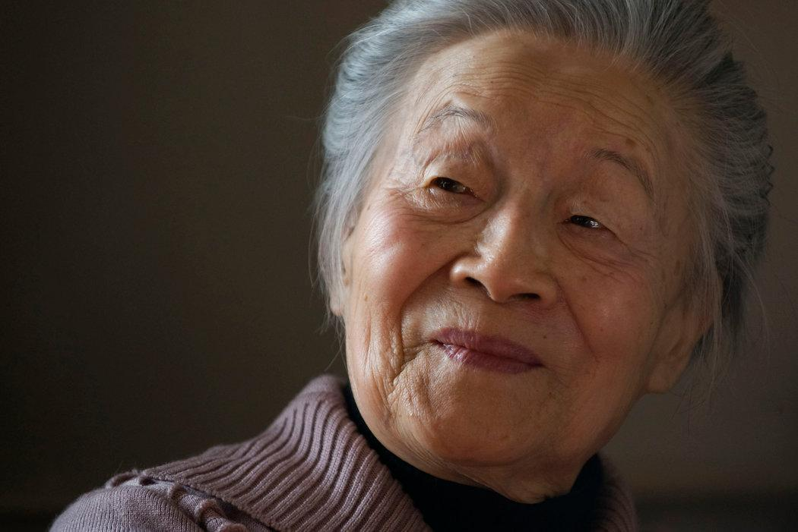

Dương Giáng – phu nhân của Tiền Chung Thư.
Dương Giáng từng nhận xét về mẹ mình rằng bà có tính tình ôn hòa: “Mẹ tôi xưa nay không hề sắc sảo, phản ứng trước con người và sự việc lúc nào cũng chậm rãi. Nếu có ai đó mắng bà ngay trước mặt, bà dường như chẳng hay biết gì, đến sau này mới cười nói: ‘Người ta coi như là mắng mình rồi.’ Bà không phản kích kịp thời, mà sau đó cũng chẳng để bụng.”
Dương Giáng (17/7/1911 — 25/5/2016), tên khai sinh là Dương Quý Khang, quê ở Vô Tích, Giang Tô, là nhà văn hiện đại Trung Quốc, nhà dịch thuật văn học, nhà nghiên cứu văn học nước ngoài, ủy viên danh dự của Học bộ Viện Khoa 《Ghi bộ》, 《Tắm rửa》, 《Ba học Xã hội Trung Quốc. Các tác phẩm tiêu biểu của bà gồm chép 6 năm ở trường cán người chúng tôi》. 3 Tiền Chung Thư (21/11/1910 — 19/12/1998), tên khai sinh là Ngưỡng Tiên, tự Triết Lương, sau đổi tên thành Chung Thư, tự Mặc Tồn, hiệu Hòe Tụ, bút danh Trung Thư Quân, quê ở Vô Tích, Giang Tô. Ông là học giả, nhà văn Trung Quốc hiện đại, được tôn vinh là “bác học hồng nho”, “Côn Luân của giới văn hóa”, và cùng với Nhiêu Tông Di được xưng tụng là “Nam Nhiêu, Bắc Tiền”.
Sau khi Cảnh Khê Công Đường Mậu Huân qua đời, thế hệ thứ 3 của gia tộc mang chữ lót “Trấn” và thế hệ thứ 4 mang chữ lót “Nguyên” — những người từ nhỏ đã được giáo dục gia đình rất bài bản — bắt đầu nỗ lực vươn lên.
Trong bối cảnh xã hội khi ấy coi việc đỗ đạt làm quan là mục tiêu hàng đầu, hậu duệ nhà họ Đường, vốn nhiều đời theo nghiệp kinh doanh, vẫn luôn ghi nhớ di huấn của tổ tiên, không ngừng củng cố và mở rộng thế lực gia tộc, trong đó có người từng đảm nhiệm các chức vụ quan trọng trong chính quyền.
Tuy nhiên, hai cha con Đường Tư Trấn (Bảo Khiêm) & Đường Bính Nguyên (Tinh Hải) cùng với cụ tổ của Đường Anh Niên là Đường Điện Trấn (Tương Đình) và ông nội là Đường Tăng Nguyên (Quân Viễn) đều không thỏa mãn với cơ nghiệp sẵn có của gia tộc họ Đường. Khi vừa tròn 20 tuổi, những hậu duệ này đã rời cầu Nghiêm Gia, tiến ra Vô Tích, Thượng Hải — những vùng đất rộng lớn hơn — để bôn ba lập nghiệp.
Quay lại với ông nội của Đường Lưu Thiên — Đường Bảo Khiêm. Ông sở hữu đầu óc kinh doanh cực kỳ nhạy bén, không đi theo con đường cũ của cha mình là tiếp tục buôn bán vải vóc, mà chọn một nước cờ táo bạo: hợp tác với Thái Giam, một phú hộ có tiềm lực kinh tế mạnh tại huyện Vô Tích, để mở hiệu gạo Vĩnh Nguyên Sinh. Mỗi năm, cơ sở này cung cấp hơn 100.000 thạch gạo nếp cho ngành rượu Thiệu Hưng nổi tiếng khắp cả nước. Điều này đã giúp tích lũy một lượng lớn vốn liếng và kinh nghiệm, tạo nền tảng cho việc bước vào lĩnh vực công nghiệp sau này.
Sau đó, ông tiếp tục cùng các cộng sự lâu năm thành lập Nhà máy bột mì Cửu Phong — nhà máy bột mì cơ giới thứ hai tại Vô Tích, với sản lượng hằng ngày hơn 5000 bao bột mì nhãn hiệu “Sơn Lộc”. Đây cũng là dấu mốc cho thấy gia tộc họ Đường chính thức bước chân vào lĩnh vực công nghiệp.
Khi đã có thực lực tài chính, ông lại thành lập Nhà máy sợi Khánh Phong Vô Tích. Sản phẩm sợi bông mang thương hiệu “Song Ngư Cát Khánh” do nhà máy này sản xuất nhanh chóng trở thành mặt hàng bán chạy trên tuyến Thượng Hải – Nam Kinh.
Đến thời điểm này, Tập đoàn Đường – Thái đã phát triển thành một tổ hợp tư bản lớn, trải rộng trên 3 trụ cột công nghiệp: dệt bông, tơ tằm và bột mì. Với bản lĩnh và mưu lược vượt trội, Đường Bảo Khiêm đã không ngừng mở rộng bản đồ kinh doanh của gia tộc họ Đường.
Cùng thời kỳ đó, em họ của Đường Bảo Khiêm là Đường Tương Đình (ông cố của Đường Anh Niên) hợp tác với Trình Kính Đường, sáng lập nhà máy nhuộm dệt Lệ Tân.
Đúng vào năm 1920, khi Đường Bảo Khiêm thành lập nhà máy dệt Khánh Phong, người con trai thứ hai của ông là Đường Tinh Hải (còn gọi là Đường Bính Nguyên) — cũng chính là cha của Đường Lưu Thiên — đã lên đường sang Mỹ du học. Tốt nghiệp Học đường Thanh Hoa, ông khi ấy nhận học bổng từ khoản bồi thường Canh Tý để tiếp tục con đường học vấn.
Quá trình học tập của Đường Tinh Hải: ban đầu theo học kỹ thuật dệt may tại Lowell, đến năm thứ ba đại học thì chuyển sang MIT học quản lý kỹ thuật. Ông rất năng động trong các câu lạc bộ, từng đảm nhiệm
chức Chủ tịch Câu lạc bộ Trung Quốc. Năm 1923, ông được bầu làm đại diện của MIT, tổ chức “Văn phòng Thông tin” cho sinh viên Trung Quốc địa phương tại Boston.
Trong quãng thời gian theo học tại MIT, Đường Tinh Hải luôn tích cực cầu tiến và gặt hái được nhiều thành tựu. Ngoài việc hoàn thành chương trình học, ông còn là thành viên của các câu lạc bộ bắn súng, Metropolitan và Hội Kỹ thuật Cơ khí. Đến năm cuối đại học, ông được bầu làm Chủ tịch Hội sinh viên Trung Quốc.
Với nền tảng học vấn và trải nghiệm như vậy, nếu về nước tham gia chính trường, có lẽ ông sẽ có nhiều lợi thế. Thế nhưng, trong ông lại ẩn giấu tham vọng khác. Ngay từ khi mới sang Mỹ, ông đã theo học chuyên ngành kỹ thuật dệt. Đến khi chuyển sang MIT, ông học quản trị kỹ thuật. Những dấu hiệu ấy cho thấy ông vẫn luôn nuôi ý định gắn bó với việc kinh doanh của gia tộc.
Theo lẽ thường, sau khi lấy bằng cử nhân kỹ thuật, Đường Tinh Hải lẽ ra sẽ tiếp tục học lên thạc sĩ. Tuy nhiên, việc người anh cả Đường Triệu Nông đột ngột qua đời khiến ông buộc phải quay về Thượng Hải, phụ giúp gia đình quản lý công việc kinh doanh.
Khi nhận được điện báo, Đường Tinh Hải vừa đúng lúc đã lấy được bằng tốt nghiệp. Sau đó, ông thu xếp hành lý, từ biệt thầy bạn. Năm ấy là mùa hè rực nắng của năm 1923.
Trên thực tế, lúc đó người ông hỗ trợ là người chú thứ 6 của mình — Đường Kỷ Vân, cùng với em trai ruột là Đường Diệp Như.
Theo các tư liệu về sau, dù anh cả mất sớm, nhưng với thân phận con trai thứ 2, Đường Tinh Hải vẫn không được cha coi trọng hay đặt nhiều kỳ vọng. Nguyên nhân là từ nhỏ ông đã được nhận làm con thừa tự cho nhánh Đường Nhược Xuyên. Dù Đường Nhược Xuyên đã mất từ sớm, trên danh nghĩa vẫn được tính là một nhánh riêng. Vì vậy, dù ăn ở, sinh hoạt trong gia đình ruột, Đường Tinh Hải vẫn phải gọi cha ruột Đường Bảo Khiêm là “bác cả”.
Bản thân Đường Bảo Khiêm cũng là con thứ, vậy vì sao ông chưa từng đặt mình vào vị trí của người con thứ để cho Đường Tinh Hải cơ hội kế thừa sự nghiệp gia tộc? Nhiều tư liệu lịch sử không đưa ra được câu trả lời rõ ràng. Có lẽ, sự thiên vị trong tình cảm của cha mẹ chỉ có thể cảm nhận qua những chi tiết nhỏ, còn độ sâu của tình thân rốt cuộc cũng chỉ là một chữ “duyên”.
Nhận ra mình không có cơ hội kế thừa gia nghiệp, Đường Tinh Hải hiểu rằng tương lai chỉ có thể dựa vào chính bản thân mình, và con đường học vấn chính là lối thoát tốt nhất.

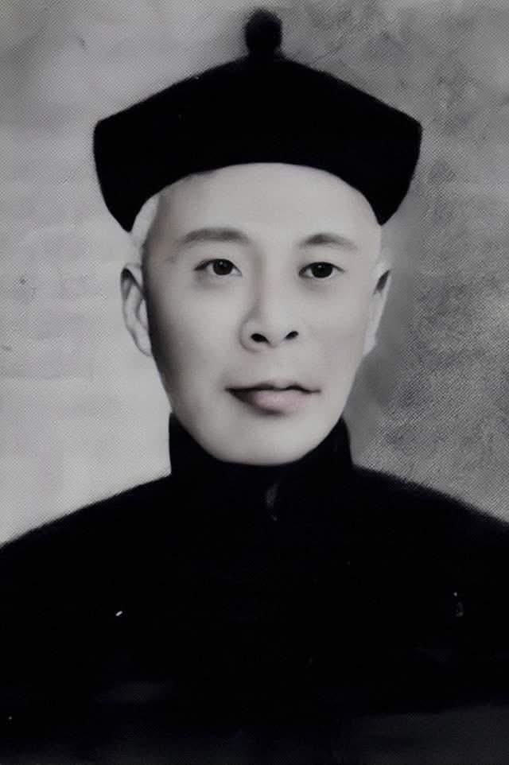

Đường Tư Trấn, hay còn gọi là Đường Bảo Khiêm.
© Nguồn: Bài viết “Nhà máy sợi Khánh Phong năm 1943” của @顾征 đăng trên Vô Tích Văn Bác.

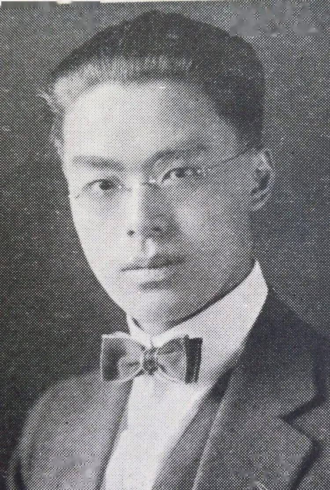

Đường Tinh Hải thời trẻ — tư liệu từ Kho Lưu trữ và Bộ sưu tập Đặc biệt của Viện Công nghệ Massachuses (MIT).

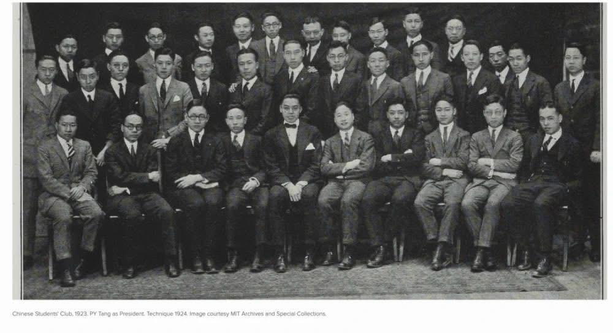

Hội sinh viên Trung Quốc tại Viện Công nghệ Massachuses (MIT) năm 1923, ảnh do Kho Lưu trữ và Bộ sưu tập Đặc biệt của MIT cung cấp.

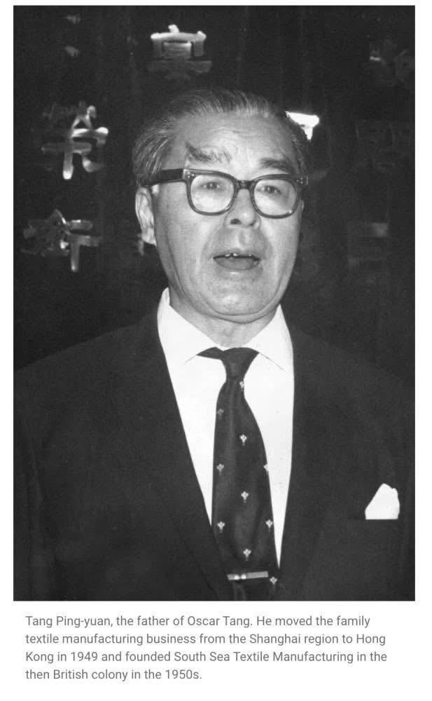

Nghĩ như vậy, có thể thấy: một người từng không được đánh giá cao lại từng bước vượt qua thử thách, trở thành người thừa kế chính danh, còn có thể giữ vững tài sản gia tộc trong thời loạn, tiếp tục phát triển sự nghiệp họ Đường.

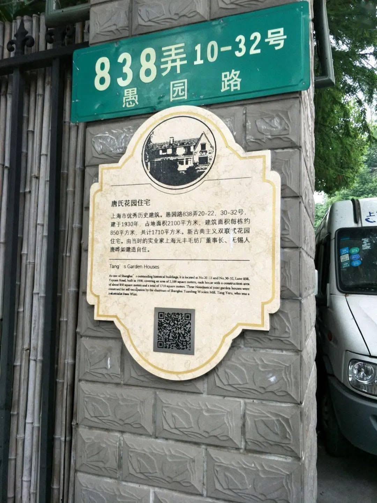

Cuộc đời của ông phong phú đến mức nào, chỉ nghĩ thôi cũng đủ hiểu.
Đầu những năm 1940, Đường Tinh Hải từng xảy ra mâu thuẫn gay gắt với em trai ruột Đường Diệp Như, thậm chí vì tranh chấp gia sản mà đưa nhau ra tòa.
Tư liệu về Đường Diệp Như trong dân gian không nhiều, chỉ biết “Vườn hoa Đường Thị” trên đường Ngu Viên ở Thượng Hải là do ông xây dựng để ở.
Tại ngõ 838 đường Ngu Viên, Thượng Hải, “Vườn hoa Đường Thị” có diện tích lên tới 2100m².

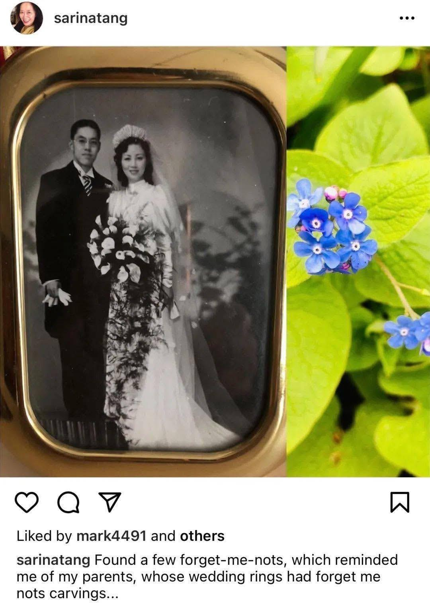

Thông qua việc tìm được tài khoản Instagram của Đường Khải Phượng (Sarina Tang) — con gái của Đường Diệp Như — người ta đã phát hiện một bức ảnh cưới của Đường Diệp Như, nhờ đó có thể thoáng nhìn diện mạo của ông thời trẻ.
Dù trong gia tộc không được trọng dụng, nhưng cuộc hôn nhân của Đường Tinh Hải lại mang đến cho ông một mạng lưới quan hệ to lớn từ phía gia đình vợ. Đây có lẽ chính là then chốt giúp ông có thể vươn lên dẫn đầu về sau.
Năm 1923, vừa trở về nước không lâu, Đường Tinh Hải đã gặp gỡ định mệnh trong một buổi dạ vũ với Ôn Kim Mỹ — con gái của Ôn Bỉnh Trung, khi ấy là Thứ trưởng Bộ Ngoại giao Phủ Đại Nguyên Soái Quảng Đông. Bà chính là mẹ của Đường Lưu Thiên.

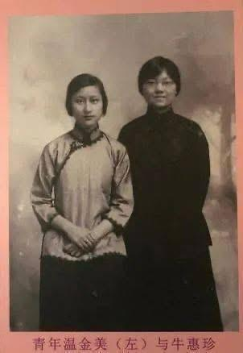

Ôn Kim Mỹ (trong ảnh, bên trái) chụp cùng chị họ là Ngưu Huệ Trân, có thể thấy rõ bà là một mỹ nhân thực thụ.
Thời bấy giờ, gia đình họ Ôn ở Thượng Hải được xem là giàu có, dù chưa thuộc hàng quyền quý bậc nhất. Ôn Bỉnh Trung làm việc trong ngành ngoại giao, rất hài lòng với cuộc hôn nhân này, cho rằng dù con trai thứ không kế thừa gia nghiệp thì cũng có thể an nhàn làm rể nhà giàu.
Có lẽ Đường Tinh Hải chưa ý thức được rằng, cuộc hôn nhân “tạm ổn” trong mắt cha ông sau này lại mang đến cho ông sự trợ lực lớn đến nhường nào. Nhiều người từng nhận định rằng cha vợ của Đường Tinh Hải — Ôn Bỉnh Trung — tuyệt đối không phải nhân vật tầm thường. Nếu thiếu vắng Ôn Bỉnh Trung, lịch sử cận đại Trung Quốc có thể đã rẽ sang hướng khác.
Ôn Bỉnh Trung là một trong những thiếu niên thuộc nhóm thứ hai được cử sang Mỹ du học vào năm Đồng Trị thứ 12 (1873). Trong thời gian học tập ở nước ngoài, ông quen biết Tống Gia Thụ, khi đó đang làm nhân
viên tại một cửa hàng buôn tơ lụa và trà ở Boston. Ôn Bỉnh Trung nhiều lần khuyên Tống Gia Thụ đề đạt với cậu ruột nguyện vọng được đi học. Khi bị từ chối, chính ông lại xúi giục Tống Gia Thụ bỏ trốn để theo đuổi con đường học vấn.
Người họ hàng của Ôn Bỉnh Trung — Ngưu Thượng Chu — cũng là bạn thân của họ từ thời du học. Sau này,

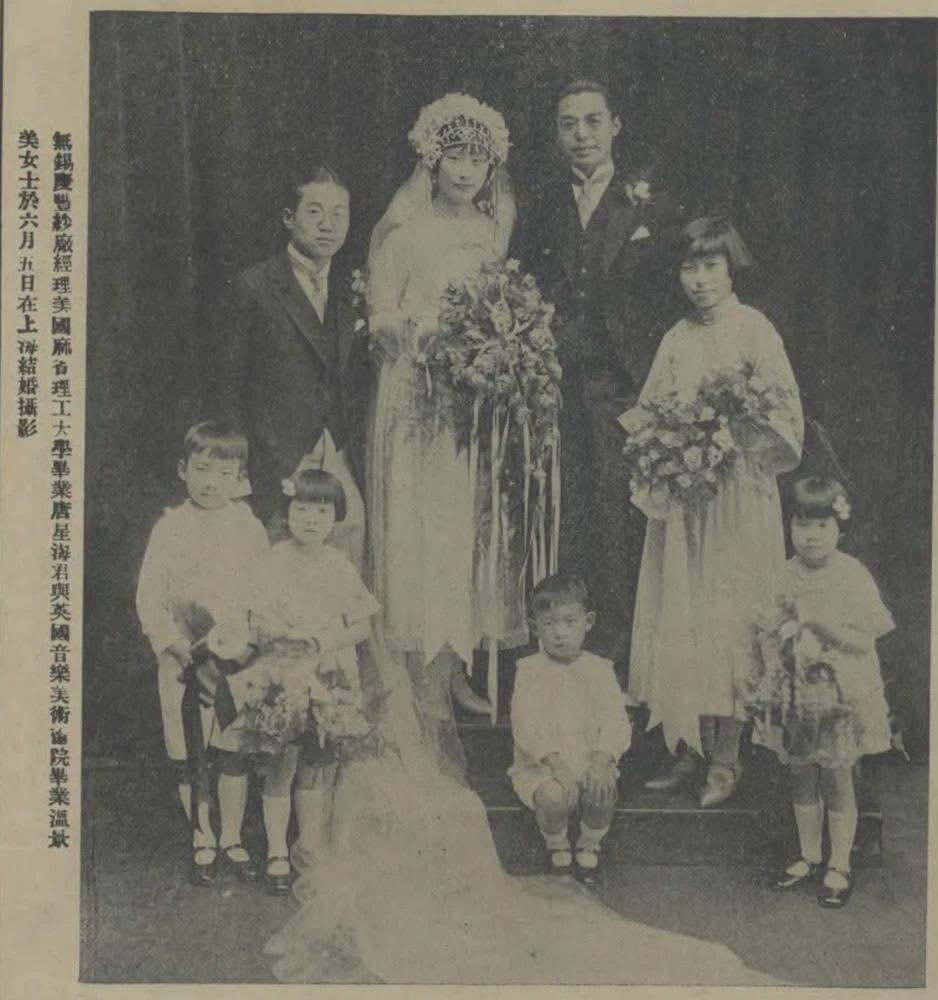

3 chàng trai hiếu học và cầu tiến ấy lần lượt kết hôn với 3 chị em họ Nghê:
Tống Gia Thụ cưới Nghê Quế Trân, sinh ra 3 người con gái có ảnh hưởng sâu rộng đến lịch sử Trung Quốc là Tống Ái Linh, Tống Khánh Linh và Tống Mỹ Linh.
Ảnh cưới của Ôn Kim Mỹ và Đường Tinh Hải.
Người tác thành cho cuộc hôn nhân này chính là Ngưu Thượng Chu – người cưới chị gái của Nghê Quế Trân là Nghê Quế Thanh. Còn Ôn Bỉnh Trung thì cưới em gái của Nghê Quế Trân là Nghê Quế Thục. Vì vậy, hai người kia đều trở thành anh em cột chèo của ông.
Nhờ mối quan hệ này, Ôn Kim Mỹ trở thành em họ của 3 chị em họ Tống, còn Đường Tinh Hải là em rể họ. Mạng lưới quan hệ chính trị hùng hậu ấy đã giúp con đường kinh doanh của ông bớt đi rất nhiều trở ngại, thậm chí trong những thời khắc then chốt, còn cứu ông thoát khỏi nguy hiểm đến tính mạng.
Trong quá trình quản lý sản nghiệp của gia tộc, dù phải đối mặt với tư duy bảo thủ từ người em trai và các thế lực cũ, Đường Tinh Hải vẫn kiên quyết vượt qua mọi ý kiến phản đối, mạnh dạn áp dụng mô hình quản lý hiện đại và tiến hành cải tiến kỹ thuật. Chẳng hạn, ông thuê các nhà quản lý chuyên nghiệp, bỏ ra khoản tiền lớn để mời Ngụy Diệc Cửu — giám đốc nhà máy bông của doanh nghiệp Nhật — về làm việc.
Sau đó, ông còn trực tiếp tổ chức “Học viện đào tạo nhân sự dệt Khánh Phong Vô Tích”, nhằm bồi dưỡng công nhân kỹ thuật mới. Chương trình đào tạo kéo dài 3 năm, sau khi tốt nghiệp có thể được tăng lương. Mô hình này khi ấy đã gây tiếng vang lớn: chỉ tuyển 36 học viên nhưng có tới hơn 1000 người nộp đơn dự tuyển.
Qua các bộ phim tư liệu có thể thấy, thời đó các nhà máy sợi thường dùng còi hơi để báo hiệu giờ vào ca và tan ca. Đường Tinh Hải đã mua từ Mỹ hệ thống máy chấm công bằng thẻ để quản lý thời gian làm việc. Ông cũng xây dựng chế độ phúc lợi cho công nhân, bao gồm nhà tắm, y tế, trường học, ký túc xá và suất ăn tập thể. Chẳng hạn, khi ăn tại căn-tin, quy định công nhân nam ngồi 7 người/bàn, công nhân nữ 8 người/bàn, mỗi bữa đều gồm 1 món mặn, 2 món rau và 1 canh. Cách sắp xếp này thể hiện rõ tư tưởng bình đẳng giữa các bàn ăn, cũng như bình đẳng nam nữ.
Sau khi tiếp quản Nhà máy Dệt bông Khánh Phong, chỉ trong vòng 10 năm, ông đã biến nơi đây thành mô hình tiêu biểu của Vô Tích. Sự nghiệp của ông phát triển như tàu sân bay, tăng trưởng theo cấp số nhân. Tuy nhiên, rốt cuộc người em trai mới là người được cha ông chọn làm người kế thừa, vì thế mâu thuẫn tranh chấp tài sản giữa hai anh em trở nên không thể tránh khỏi.
Sau khi kiện tụng với em trai, lại trải qua bối cảnh chính trị rối ren thời Dân Quốc, Đường Tinh Hải suýt chút nữa mất mạng. May mắn thay, người vợ Ôn Kim Mỹ đã bảo vệ ông. Nhờ mối quan hệ với gia đình họ Tống, ông cuối cùng cũng vượt qua được cửa ải này.

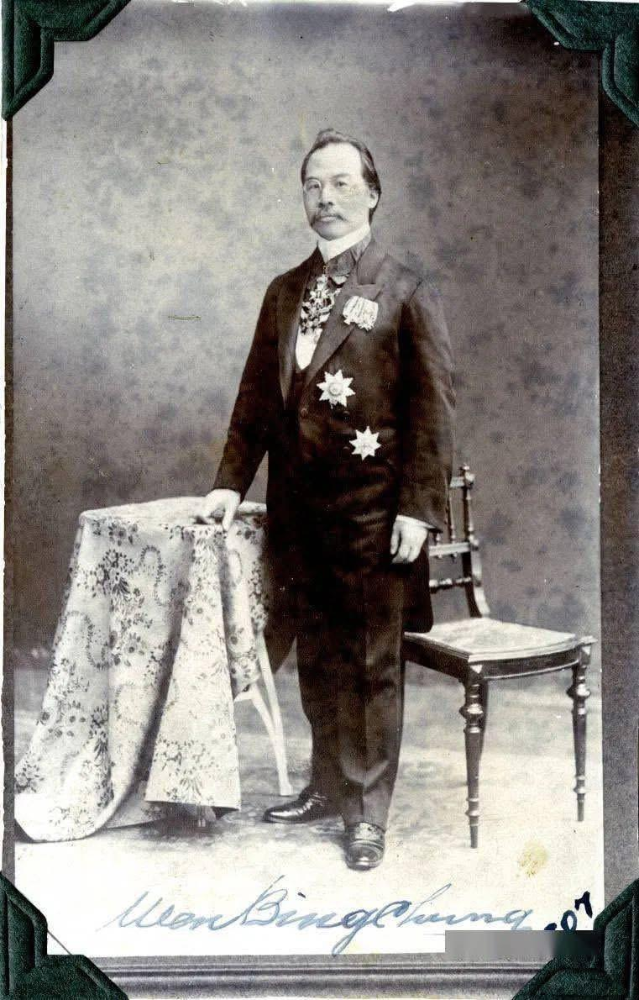

Hình chụp Ôn Bỉnh Trung vào năm 1907.
Câu chuyện Tống Ái Linh khi mới mười mấy tuổi đã “đối đáp thẳng thắn” với Tổng thống Mỹ thường được báo chí Hoa ngữ nhắc đến chính là xảy ra trong chuyến đi Mỹ, khi bà theo người dượng Ôn Bỉnh Trung tham dự một buổi quốc yến tại Nhà Trắng.
Dựa theo năm sinh của người con trai cả Đường Ký Thiên của Đường Tinh Hải và Ôn Kim Mỹ, có thể suy đoán rằng hai người quen biết và yêu nhau không lâu thì kết hôn. Sau đó, họ sinh được 4 con trai và 3 con gái, lần lượt là: Đường Ký Thiên, Đường Tuấn Thiên, Đường Hoa Thiên, Đường Lưu Thiên, Đường Chí Tĩnh (có thuyết cho rằng tên là Đường Bỉ Hà, cũng có thuyết cho rằng người này không tồn tại), Đường Chí Minh và Đường Chí Vân.
Năm 1947, gia đình họ Đường chuyển cả nhà sang Hong Kong.
Tại Tsuen Wan, Đường Tinh Hải đã xây dựng Nhà máy sợi Nam Hải.
Khu nhà xưởng có diện tích 18 mẫu Anh (khoảng hơn 70.000 m²), sở hữu thương hiệu sản phẩm riêng mang tên “Phi Ngư”.
Năm 1964, nhà máy này được niêm yết trên Sở Giao dịch Chứng khoán Hong Kong. Cũng trong năm đó, ông được chính quyền Anh tại Hong Kong bổ nhiệm làm nghị viên đầu tiên của Hội đồng Lập pháp có xuất thân từ Thượng Hải.
Nhờ những đóng góp trong lĩnh vực công ích, năm 1967 Đường Tinh Hải được trao Huân chương Đế quốc Anh (OBE), 3 năm sau tiếp tục được phong Huân chương Chỉ huy Đế quốc Anh (CBE).
Cũng trong giai đoạn này, người em trai từng kiện tụng với ông là Đường Diệp Như thực chất cũng đã sang Hong Kong, nhưng đến năm sau lại lấy lý do Hong Kong quá chật chội nên chuyển sang São Paulo (Brazil).
Năm 1976, Đường Diệp Như nghỉ hưu và dọn về New York, đến ngày 14/11/1986 qua đời tại Manhaan, hưởng thọ 78 tuổi.
Cùng thời với Đường Tinh Hải lập nghiệp trong ngành dệt may tại Hong Kong, còn có Đường Tường Thiên, con trai của người anh họ Đường Quân Viễn — cũng chính là cha của cựu Tư lệnh Tài chính Hong Kong Đường Anh Niên.
Năm 1950, sau khi tốt nghiệp cử nhân Đại học Manchester (Anh) và thạc sĩ Đại học Illinois (Mỹ), Đường Tường Thiên theo sự sắp xếp của cha đã đến Hong Kong phát triển sự nghiệp.
Trong cuốn “Đường Tường Thiên truyện” do Tưởng Tiểu Hinh chấp bút có nhắc rằng, cha ông là Đường Quân Viễn đã gửi gắm Đường Tường Thiên cho Vưu Dần Chiếu, một đồng hương người Vô Tích đang làm ăn tại Hong Kong, chứ không phải cho họ hàng ruột thịt Đường Tinh Hải.
Nếu chi tiết này là sự thật thì cũng không khó lý giải — bởi quan hệ trong dòng họ đã phân nhánh từ nhiều đời trước, dù cùng huyết thống nhưng chưa chắc thân thiết bằng bạn bè. Tuy nhiên, lợi ích gia tộc lại là một thứ rất đặc biệt: huyết thống luôn có khả năng kết nối lại những thành viên tưởng chừng rời rạc.
Chính nhờ quá trình tự thân xông pha trên thương trường Hong Kong, Đường Tường Thiên đã trở thành một nhân vật xuất sắc, đủ để được đem so sánh ngang hàng với người bác họ Đường Tinh Hải.

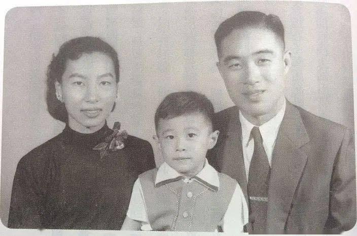

Con gái của người đồng hương Vưu Dần Chiếu là Vưu Thục Kỳ (trái) chính là vợ của Đường Tường Thiên (phải).
Đường Tường Thiên và Vưu Thục Kỳ có tổng cộng 3 con trai và 1 con gái. Người con trai út Đường Khánh Niên trùng tên với con trai của Đường Lưu Thiên, hiện sinh sống tại Mỹ.
Năm 2018, Đường Tường Thiên qua đời, thọ 95 tuổi. Có thể nói nhà họ Đường thực sự mang gen trường thọ: cha của ông là Đường Quân Viễn, người cả đời sống ở nội địa, cũng thọ tới 91 tuổi.
Nhánh Đường Tường Thiên xin không bàn sâu thêm ở đây. Ai quan tâm có thể tìm đọc cuốn “Bách niên Tỳ Lăng Đường thị” do hậu duệ họ Đường là Đường Sư Tăng biên soạn, trong đó Đường Anh Niên có viết lời tựa.

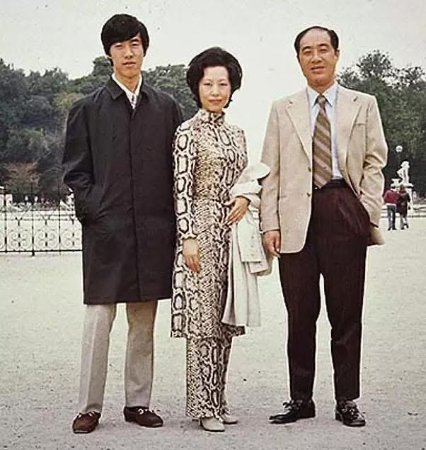

Vưu Thục Kỳ (giữa) và Đường Tường Thiên (phải) kết hôn năm 1951 tại Khách sạn Hong Kong, năm sau sinh con trai trưởng Đường Anh Niên (trái) — nguyên Thư ký Hành chính và Thư ký Tài chính của Hong Kong.
Trong số các con của Đường Tinh Hải, những người hoạt động nổi bật hơn cả là con trai trưởng Đường Ký Thiên và con trai út Đường Lưu Thiên.
Đường Ký Thiên giống cha, tốt nghiệp Viện Công nghệ Massachuses (MIT), sau đó học MBA tại Đại học Harvard. Trở về Hong Kong, ông tiếp quản nhà máy dệt Nam Hải của cha, đồng thời sáng lập Tập đoàn Liên Á, chuyên về sản xuất may mặc.
Năm 1984, Đường Ký Thiên trở thành Chủ tịch người Hoa đầu tiên của Phòng Thương mại Tổng hợp Hong Kong. Cũng trong năm đó, ông cùng người anh họ Đường Tường Thiên và 6 doanh nhân Hong Kong khác trở thành đoàn doanh nghiệp Hong Kong thăm Bắc Kinh, và đã được đồng chí Đặng Tiểu Bình thân mật tiếp kiến tại Đại lễ đường Nhân dân.
Tuy nhiên, cùng với sự thoái trào của thời đại công nghiệp dệt may, bước sang thập niên 1990, Đường Ký Thiên lần lượt chấm dứt các hoạt động kinh doanh tại Hong Kong: nhà máy dệt Nam Hải bán đất, bán vỏ, Tập đoàn Liên Á cũng được gia tộc họ Uông của Công ty Johnson Electric mua lại. Sau đó, ông bắt đầu cuộc sống nghỉ hưu đi lại giữa Mỹ và Hong Kong.
Năm 2012, Đường Ký Thiên tham dự lễ khánh thành quảng trường mang tên cha ông — Đường Bính Nguyên (Đường Tinh Hải) tại Đại học Bách khoa Hong Kong. Chính vì từng giữ chức Chủ tịch đầu tiên của Ủy ban Quy hoạch trường, nên các thế hệ sau của nhà họ Đường cũng đã đóng góp rất nhiều cho sự phát triển của ngôi trường này.
Đường Ký Thiên còn có một câu chuyện bên lề về đời sống riêng tư: khi về già, ông lựa chọn ly hôn với người vợ đầu là Hoàng Nguyệt Mai, rồi kết hôn với Phan Tĩnh Quân, người kém ông gần 20 tuổi.

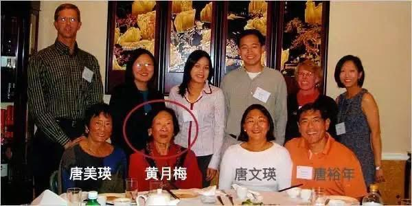

Hoàng Nguyệt Mai — người vợ đầu — cùng 3 người con mà bà sinh cho Đường Ký Thiên. Hàng dưới, từ trái sang phải: Đường Mỹ Anh, Hoàng Nguyệt Mai, Đường Văn Anh, Đường Dụ Niên.

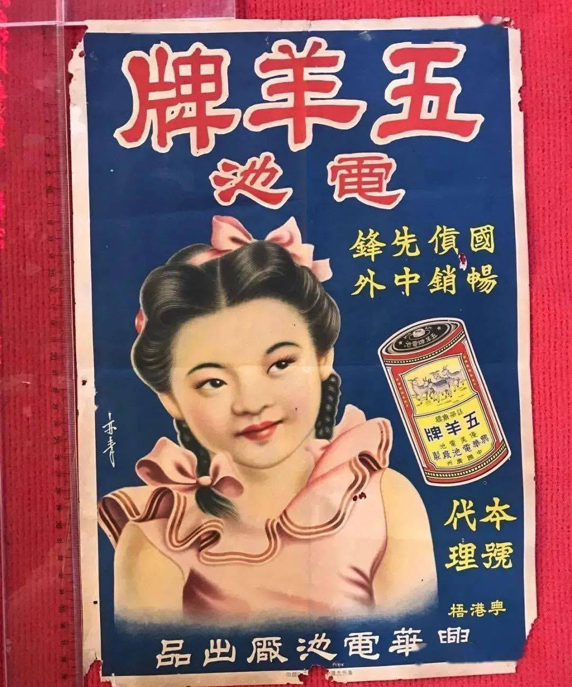

Nhà máy pin Hưng Hoa nổi tiếng với thương hiệu Ngũ Dương.
Phan Tĩnh Quân cũng xuất thân từ gia đình thương nhân. Cha bà là Phan Vĩnh Khải, ông chủ nhà máy pin Hưng Hoa, nổi tiếng với thương hiệu Ngũ Dương.
Chồng cũ của Phan Tĩnh Quân lại càng là cái tên quen thuộc hơn: Vinh Trí Quyền, con trai của Vinh Hồng Khánh (còn gọi là Vinh Cương Nhân), mà Vinh Hồng Khánh là con trai út của Vinh Tông Kính — anh cả trong “anh em họ Vinh” trứ danh. Khi còn tại Hong Kong, Vinh Hồng Khánh từng mở nhà máy dệt Nam Dương, chỉ khác nhà máy dệt Nam Hải của nhà họ Đường đúng một chữ.
Nói cách khác, Phan Tĩnh Quân, vốn sinh ra trong gia đình hào môn, đã rời một hào môn để bước vào một hào môn khác.

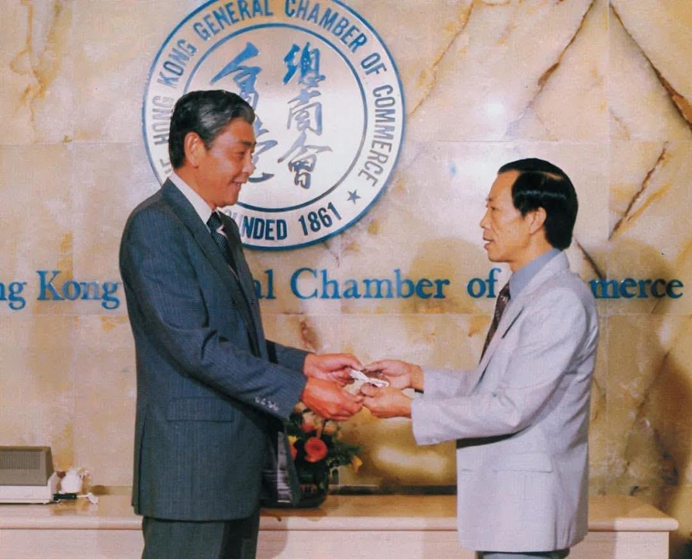

Năm 1984, Đường Ký Thiên (trong ảnh, bên trái) trở thành Chủ tịch người Hoa đầu tiên của Phòng Thương mại Tổng hợp Hong Kong.
Về những năm cuối đời, người thường xuyên tháp tùng Đường Ký Thiên tham dự các hoạt động xã hội chủ yếu chính là Phan Tĩnh Quân.
Năm 2014, Đường Ký Thiên qua đời vì bệnh tại Trung tâm Y học Đại học California, San Diego (UC San Diego), Hoa Kỳ.
Về tuổi thọ, trong nhật ký của cháu ngoại ông ghi là 87 tuổi, nhiều tài liệu cũng xác nhận con số này, nhưng truyền thông Hoa ngữ lại đồng loạt đưa tin là 89 tuổi.
Nhân đây nói thêm vài lời về nhánh gia đình Đường Ký Thiên: cũng giống như em trai ông là Đường Lưu Thiên, rất tích cực trong việc quyên góp, làm từ thiện…
Năm 1993, ông quyên tặng 4,7 triệu USD cho Viện Công nghệ Massachuses (MIT). Tại MIT có Trung tâm Giáo dục Quản lý Jack C. Tang mang tên ông, cùng với học bổng Tang. Cũng trong năm đó, ông quyên tặng 4 triệu USD cho Đại học California, Berkeley, để xây dựng Tang Center.
Con trai duy nhất là Đường Dụ Niên tốt nghiệp cử nhân Đại học Cornell, MBA tại MIT, đồng thời là ủy viên hội đồng quản trị của cả hai trường. Ông không đi theo con đường kinh doanh thực nghiệp như cha mong muốn, mà ngay từ đầu đã chọn lĩnh vực tài chính.
Đường Dụ Niên cùng Phùng Quốc Kinh — con trai của Phùng Hán Trụ, cựu Chủ tịch Tập đoàn Li & Fung — đồng sáng lập công ty đầu tư mạo hiểm Techno-Ventures. Ngoài ra, ông còn giữ chức Chủ tịch khu vực châu Á của công ty săn đầu người Spencer Stuart trong hơn 16 năm.
Vợ của Đường Dụ Niên, Quách Yến Ngữ, cũng xuất thân từ gia tộc danh giá: bà là cháu nội của Quách Lâm Sảng, con trai trưởng của Quách Tuyền — một trong những người sáng lập Bách hóa Vĩnh An Thượng Hải.
Tại Hong Kong, tin tức về Đường Dụ Niên không quá nhiều. Chỉ tìm được một bài báo cho biết ông từng chi 136 triệu HKD để mua căn biệt thự lâu đời Gia Huệ Viên ở khu bán sơn. Cựu Trưởng Đặc khu Đổng Kiến quán[^4]” Hoa và “đại lão Bạch Tuyết Tiên đều từng sinh sống tại đây. Giới giải trí cũng có Trương Gia Huy và Quan Vịnh Hà từng là cư dân của khu nhà này.
Nếu tìm theo tên tiếng Anh, có thể thấy nhiều tin về các khoản quyên góp của ông hơn. Chẳng hạn năm 2016, ông quyên tặng 3 triệu USD cho Đại học Cornell — trường cũ của mình — để xây dựng Trung tâm Đón tiếp Martin Y. Tang mang tên ông.
Năm 2017, ông cùng 2 em gái là Đường Mỹ Anh và Đường Văn Anh, cũng như vợ chồng Đường Lưu Thiên, quyên tặng 5 triệu USD để thành lập Trung tâm Nghiên cứu Con đường Tơ lụa tại Đại học California, Berkeley.
11 tuổi, Đường Lưu Thiên đã được cha mẹ đưa sang Mỹ theo học tại Học viện Phillips — đây là một trong những trường tư thục xuất sắc và giàu có bậc nhất nước Mỹ, cựu Tổng thống Mỹ Bush cha và Bush con đều từng theo học tại đây.
Vì sống xa gia đình, ngôi nhà của người bạn cũ của cha mẹ là Nghiêm Ấu Vận tại New York đã trở thành “ngôi nhà thứ hai” của ông. Trong những lúc rảnh rỗi, ông thường đến nhà Nghiêm Ấu Vận đọc sách. Cũng trong quãng thời gian ấy, ông thường xuyên ở bên cạnh cô con gái út của bà là Dương Tỉ Ân, hai người lớn lên bên nhau từ thuở nhỏ, tình cảm dần nảy nở và sau này tự nhiên tiến tới với nhau.
Có lẽ được thôi thúc bởi “gen” bản lĩnh và sự gan dạ của gia tộc, sau khi học thành tài tại Mỹ, Đường Lưu Thiên không quay về tiếp quản sản nghiệp gia đình mà lựa chọn tự lập nghiệp từ hai bàn tay trắng, dấn thân vào lĩnh vực tài chính tại Phố Wall. Khi ấy, Phố Wall đang ở thời kỳ hoàng kim, bầu không khí cởi mở và tự do. Sau khi gia nhập ngân hàng đầu tư, Đường Lưu Thiên đã đặt nền móng vững chắc cho sự nghiệp của mình.

[^4]: Đại lão quán (大老倌) là cách gọi tôn xưng trong giới nghệ thuật truyền thống, đặc biệt là kinh kịch, hí khúc, dùng để chỉ người có địa vị rất cao, bậc thầy, tiền bối hàng đầu, được toàn giới kính trọng.
Năm 1970, Đường Lưu Thiên cùng bạn bè tự đứng ra thành lập quỹ riêng và giữ chức Giám đốc điều hành. Reich & Tang do họ sáng lập cũng trở thành quỹ tư nhân đầu tiên niêm yết tại Mỹ, và Đường Lưu Thiên còn được mệnh danh là “cha đẻ của quỹ thị trường tiền tệ” tại Hoa Kỳ.
Dương Tỉ Ân cũng không ngừng nỗ lực. Bà điều hành một công ty chuyên tu bổ các công trình mang tính biểu tượng. Đồng thời, với tư cách là giảng viên dạy nấu ăn Trung Hoa, bà từng kinh doanh một công ty tổ chức tiệc Trung Hoa.
Hai vợ chồng sát cánh bên nhau, nhưng điều đáng tiếc là năm 1992, Dương Tỉ Ân qua đời vì bệnh ung thư, hưởng dương 53 tuổi.
Trong hồi ký của mình, Nghiêm Ấu Vận từng ca ngợi con rể Đường Lưu Thiên đã dành cho con gái sự quan tâm và yêu thương tỉ mỉ đến từng chi tiết: quanh năm không nghỉ, đưa vợ đi khắp nơi chữa bệnh, luôn túc trực bên giường bệnh, thậm chí hoàn toàn gác lại công việc công ty. Đáng tiếc, nỗ lực ấy vẫn không thể lay động được số phận.
Nghiêm Ấu Vận (Juliana Young Koo) — người thường được truyền thông Hoa ngữ gọi là “quý bà trường thọ nhất” — thọ tới 111 năm 240 ngày.
Nghiêm Ấu Vận là hình mẫu điển hình của một thiên kim tiểu thư xuất thân từ gia đình giàu có.
Ông nội bà, Nghiêm Tín Hậu, từng là mưu sĩ của Lý Hồng Chương, là đại phú thương đất Thượng Hải, tích lũy khối tài sản khổng lồ nhờ kinh doanh tiệm vàng, cửa hàng tơ lụa và phiếu hiệu Nguyên Phong Nhuận. Ông cũng là Chủ tịch đầu tiên của Tổng thương hội Thượng Hải.
Cha của bà, Nghiêm Tử Quân, kế thừa cơ nghiệp gia tộc, mở Ngân hàng Tư nhân Nguyên Cát và Ngân hàng Tư nhân Đức Nguyên, quan hệ rộng rãi, thế lực rất mạnh.
Tuy nhiên, cơn sốt đầu cơ cổ phiếu cao su năm 1910 đã khiến hoạt động của các ngân hàng trong gia tộc chịu ảnh hưởng nặng nề.
Nghiêm Ấu Vận sinh năm 1905, mẹ bà là người vợ thứ hai của Nghiêm Tử Quân.
Dù việc kinh doanh ngân hàng bị tác động, may mắn là gia đình vẫn còn nhiều ngành nghề khác chống đỡ. Trong hồi ký, bà kể rằng năm 1923, cả gia đình chuyển từ Thiên Tân về Thượng Hải, sống trong một đại trạch đối diện dinh thự Kadoorie gần chùa Tĩnh An.
Ngôi nhà mỗi tầng có hơn 20 phòng, phía sau còn có chuồng ngựa và gara đủ chỗ cho 6 chiếc xe hơi. Toàn bộ gia đình lớn — từ người hầu, quản gia, tài xế, vú em — tổng cộng hơn 80 người, mà mọi chi tiêu đều do một mình Nghiêm Tử Quân gánh vác, đủ cho thấy thực lực tài chính hùng hậu.

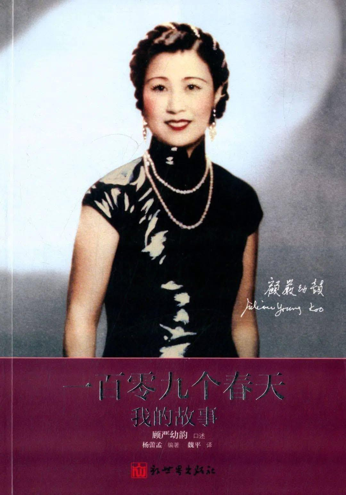

Cuộc đời của bà hầu như đã được ghi chép đầy đủ trong cuốn tự truyện kể chuyện “Một trăm lẻ chín mùa xuân: Câu chuyện của tôi”. Đúng như tên gọi, đây là cuốn sách được xuất bản khi bà tròn 109 tuổi.

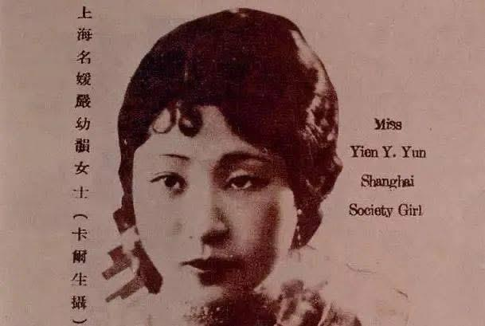

Nghiêm Ấu Vận thời trẻ.

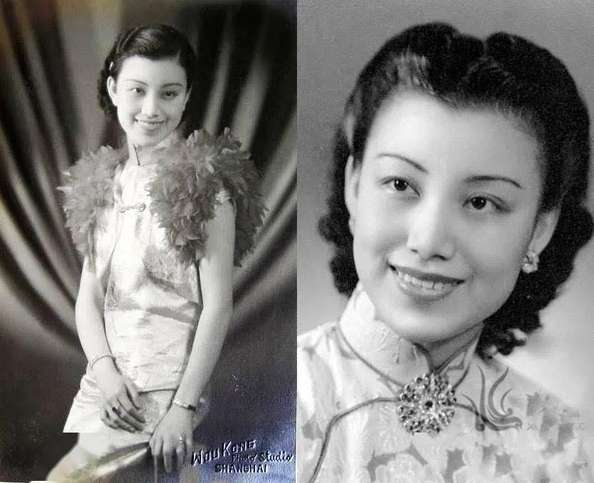

Người trong ảnh là Nghiêm Nhân Mỹ, con gái trưởng của Nghiêm Trí Đa — con trai cả của Nghiêm Tử Quân, cũng chính là cháu gái của Nghiêm Ấu Vận. Quả thực rất xinh đẹp… Câu chuyện của bà xin để dịp khác sẽ kể tiếp.
Nghiêm Tử Quân có 5 con trai và 7 con gái.
Nghiêm Tử Quân vô cùng cưng chiều các con gái. Theo lời ông, con gái trước khi lấy chồng thì cứ nên sống tùy ý tận hưởng, bởi sau khi kết hôn chưa chắc còn được thong dong, thoải mái như vậy nữa.
Vì thế, thời sinh viên của Nghiêm Ấu Vận có thể nói là hào hoa rực rỡ: mặc váy áo Tây phương, dự dạ tiệc và vũ hội, sống một cuộc đời thượng lưu. Là tiểu thư nhà giàu, bà đương nhiên được tiếp nhận nền giáo dục tân tiến nhất. Ban đầu, Nghiêm Ấu Vận theo học Đại học Hỗ Giang, đến năm thứ 3 thì chuyển sang Đại học Phục Đán, khi trường vừa bắt đầu nhận nữ sinh, và trở thành lứa nữ sinh tốt nghiệp đầu tiên của Phục Đán.
Mỗi ngày, tài xế lái chiếc xe Buick mang biển số 84 đưa đón bà đi học, khiến sinh viên trong trường đặt cho bà biệt danh “cô 84”, còn cố ý đọc theo tiếng Thượng Hải.
Không lâu sau khi tốt nghiệp Phục Đán, bà kết hôn với Dương Quang Sinh, người hơn bà 5 tuổi, có bằng tiến sĩ Đại học Princeton, và sau đó

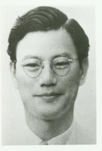

trở về Đại học Thanh Hoa giảng dạy.
Dương Quang Sinh xuất sắc đến mức nào, chỉ cần xem lời kể của các con ông là đủ hiểu…
Ngày 8 tháng 9 năm 1929, hôn lễ long trọng của hai người được tổ chức tại khách sạn Đại Hoa, Thượng Hải. Hơn 1000 khách mời tham dự, gây chấn động khắp Thượng Hải thời bấy giờ.

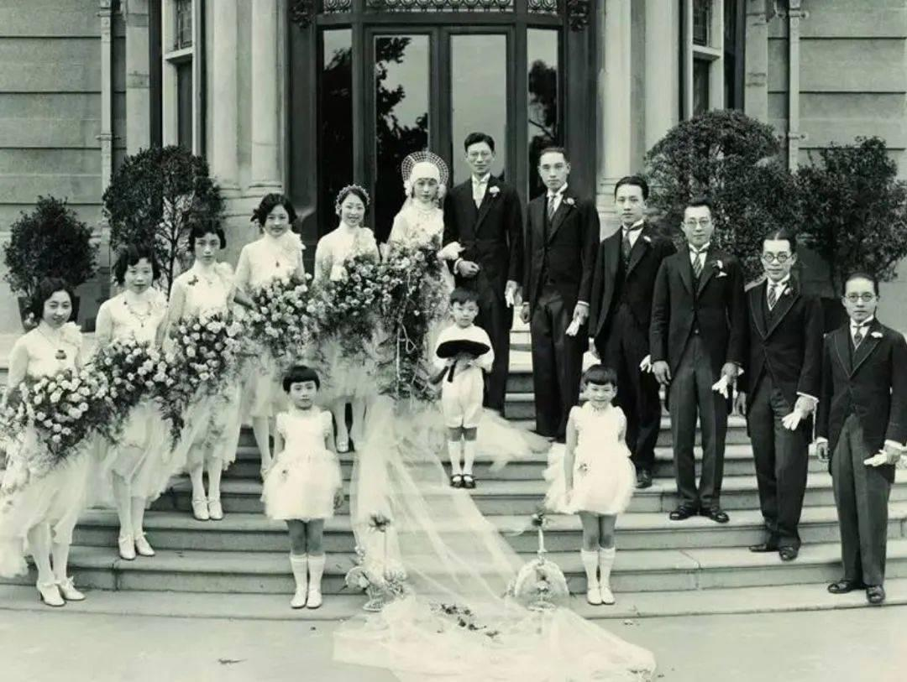

Áo cưới của Nghiêm Ấu Vận do nhà thiết kế người Pháp Garnet, rất nổi tiếng tại Thượng Hải lúc đó, thực hiện.

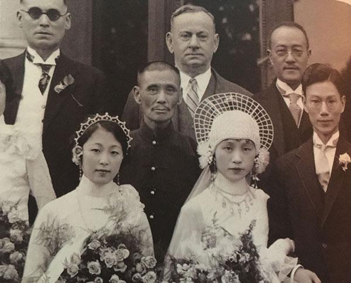

Phóng to ảnh cô dâu chú rể có thể thấy đứng phía sau là người chủ hôn — Vương Đình Chính, khi ấy là Bộ trưởng

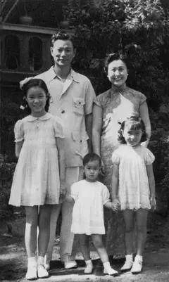

Ngoại giao.
Sau khi kết hôn, công việc ngoại giao của Dương Quang Sinh khiến gia đình nhỏ của họ chu du khắp thế giới, đến mức nơi sinh của 3 cô con gái đều khác nhau: ❥ Con gái cả Dương Lôi Mạnh (Genevieve Young) sinh tại Geneva, nên lấy tên tiếng Anh Genevieve theo âm đọc. ❥ Con gái thứ Dương Tuyết Lan (Shirley Young) sinh tại Thượng Hải, tên gọi xuất phát từ Shirley Temple, ngôi sao nhí rất nổi tiếng khi đó. ❥ Con gái út Dương Tỉ Ân (Frances Young) sinh tại Pháp, nên dùng tên Frances.

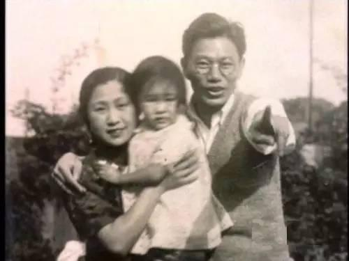

Đầu thập niên 1930, vợ chồng họ định cư lâu dài tại London, và ngôi nhà của họ từng đón tiếp rất nhiều người Hoa sống ở nước ngoài. Cha của Đường Lưu Thiên — Đường Tinh Hải — cũng từng lui tới trong thời gian đó. Và chính trong bối cảnh ấy, Nghiêm Ấu Vận đã gặp Cố Duy Quân, khi ông được bổ nhiệm làm Công sứ Trung Hoa tại Pháp.
Trong sách của Nghiêm Ấu Vận, bà từng viết nguyên văn: “Khi ấy, tôi tuyệt đối không ngờ rằng sau này ông lại trở thành một người quan trọng đến vậy trong cuộc đời mình.”
Cố Duy Quân là ai?
Ông là nhân vật được ghi vào sách giáo khoa lịch sử, được tôn vinh là “nhà ngoại giao số một thời Dân Quốc”. Thời trẻ, ông khá tuấn tú, phong độ.

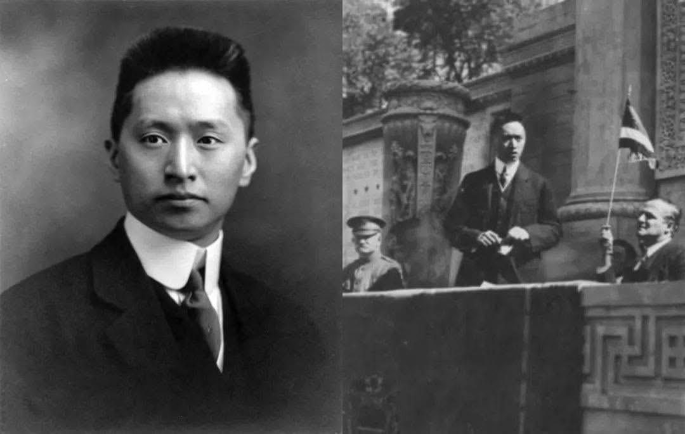

Bức ảnh bên phải là Cố Duy Quân tại Hội nghị Hòa bình Paris năm 1919.
Trong xã hội Trung Quốc lúc bấy giờ, đàn ông có thể tam thê tứ thiếp, còn phụ nữ thì bị ràng buộc phải chung thủy tuyệt đối. Tuy nhiên, trong giới thượng lưu, sự trói buộc đối với phụ nữ tương đối nhẹ hơn so với tầng lớp trung và hạ lưu. Hơn nữa, quan hệ hôn nhân của giới quý tộc châu Âu vốn dĩ cởi mở hơn. Những nhân vật như con dâu của Churchill hay mẹ kế của Công nương Diana — đều là những phụ nữ quý tộc sống khá tự do, phóng khoáng.
Sống tại châu Âu, mối quan hệ giữa hai cặp vợ chồng họ Dương và họ Cố trở nên khá phức tạp. Theo cách nói phổ biến, Nghiêm Ấu Vận và Cố Duy Quân đã nảy sinh tình cảm từ thời điểm đó, dù thực tế là cả hai khi ấy đều đã có gia đình.

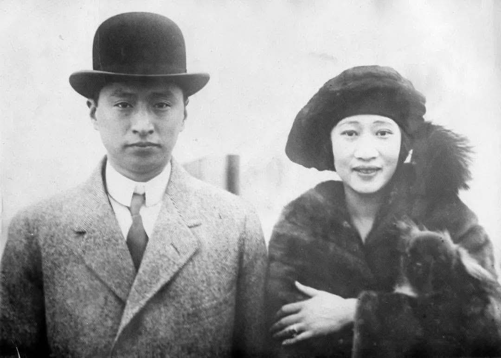

Cố Duy Quân và Hoàng Huệ Lan trong ảnh chụp năm 1947. Bên cạnh Cố Duy Quân lúc đó là người vợ thứ 3 của ông — Hoàng Huệ Lan, thiên kim tiểu thư của một đại gia Indonesia. Cha bà là Hoàng Trọng Hàm, được mệnh danh là “ông trùm ngành đường châu Á”, một thương nhân Hoa kiều lừng danh tại Indonesia. Những câu chuyện huyền thoại về Hoàng Huệ Lan và bộ sưu tập châu báu đồ sộ của bà từng được nhắc đến rất nhiều.
Nhân tiện tám chuyện đôi điều về 2 đời vợ trước của Cố Duy Quân:
Người vợ đầu tiên là Trương Nhuận Nga, kết hôn theo sự sắp đặt của cha mẹ. Cuối cùng, khi Cố Duy Quân chủ động đề nghị ly hôn, bà đã xuống tóc xuất gia tại Quan Âm Đường họ Lục. Nguyên nhân ly hôn chính là vì ông muốn cưới người vợ thứ hai — Đường Bảo Nguyệt, thứ nữ của Đường Thiệu Nghi, Thủ tướng đầu tiên thời Dân Quốc.
Sau khi sinh con trai Cố Đức Xương và con gái Cố Cúc Trân, Đường Bảo Nguyệt không may qua đời vì nhiễm cúm.

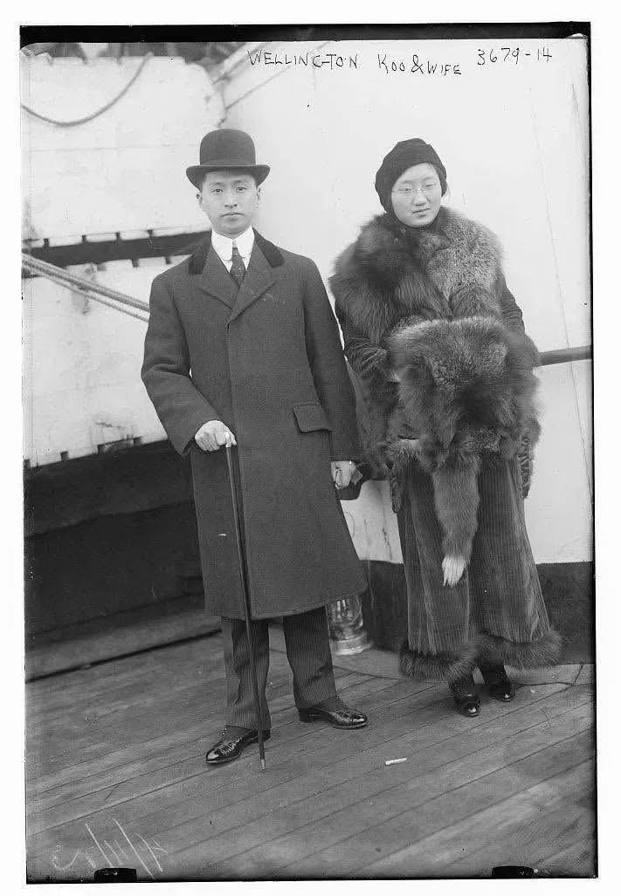

Cố Duy Quân và người vợ thứ hai Đường Bảo Nguyệt.
Năm 1920, Hoàng Huệ Lan — khi ấy đã từng ly hôn — gặp Cố Duy Quân, lúc đó vừa góa vợ, tại Paris. Chỉ 2 tháng sau, hai người đã nhanh chóng đính hôn rồi kết hôn. Khối tài sản khổng lồ của gia đình họ Hoàng, cùng với việc Hoàng Huệ Lan thông thạo nhiều thứ tiếng, yêu thích thời trang, giỏi giao tế, ở một mức độ nhất định đã trở thành trợ lực lớn cho sự nghiệp ngoại giao của Cố Duy Quân.

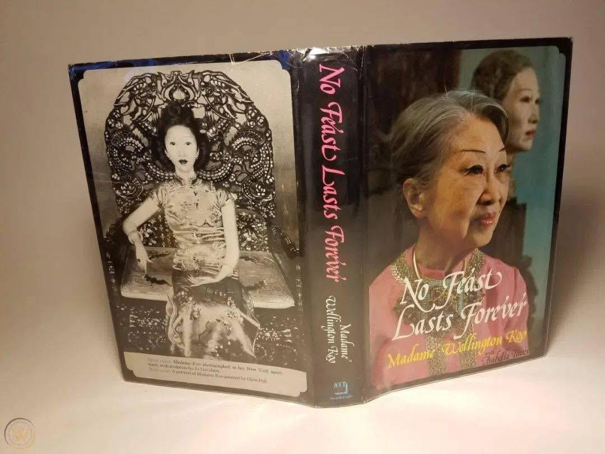

Trong hồi ký “Không có yến tiệc nào là không tàn”, Hoàng Huệ Lan đã ghi chép rất chi tiết việc Cố Duy Quân dùng tiền của gia đình bà để “làm đẹp mặt mũi” cho các hoạt động ngoại giao, cũng như cuộc hôn nhân thiếu vắng tình yêu giữa hai người.
Cuốn sách chỉ rõ rằng Cố Duy Quân có quan hệ tình cảm với vợ của 2 cấp dưới, trong đó một người chính là Nghiêm Ấu Vận. Hoàng Huệ Lan tỏ ra nghi ngờ không biết chồng của Nghiêm Ấu Vận — Dương Quang Sinh — có hay biết sự thật này hay không.
Hồi ký còn viết rằng Hoàng Huệ Lan đã khóc lóc tâm sự với Tống Ái Linh, Tống Ái Linh lại kể với chồng là Khổng Tường Hy. Sau đó, Khổng Tường Hy sắp xếp lệnh điều động, chuyển Dương Quang Sinh rời khỏi châu Âu — cũng nhằm tách Nghiêm Ấu Vận khỏi Cố Duy Quân, người lúc đó cũng đang ở châu Âu.
Không ngờ rằng Dương Quang Sinh bị điều sang Philippines, và chính sự điều chuyển này gián tiếp dẫn đến cái 𝗰𝗵𝗲̂́𝘁 sau cùng của ông.
Năm 1942, khi quân Nhật chiếm Manila, Dương Quang Sinh đã không lựa chọn rút lui sớm, bị bắt giữ và cuối cùng bị 𝘀𝗮́𝘁 𝗵𝗮̣𝗶 cùng 7 đồng nghiệp khác.

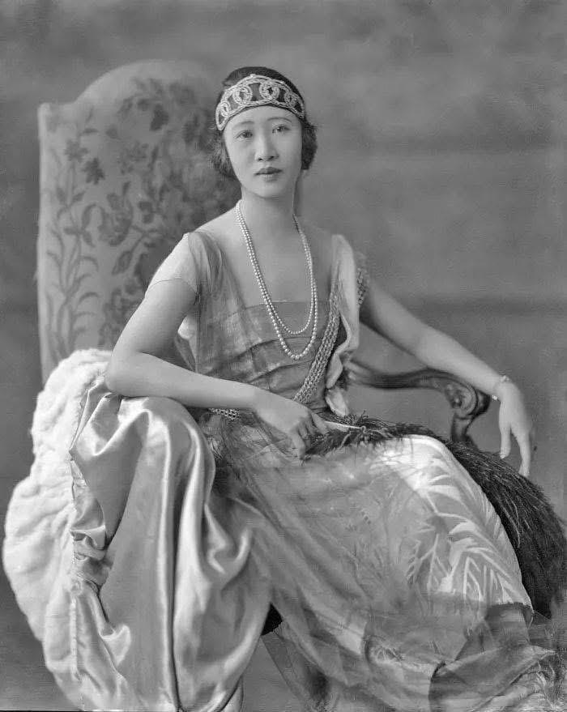

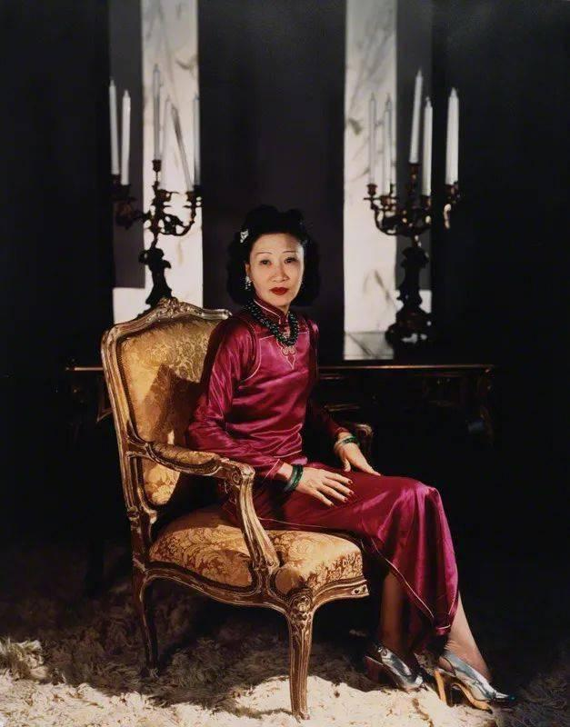

Tạp chí Vogue nhiều lần đưa Hoàng Huệ Lan vào danh sách mặc đẹp nhất; Vogue Ý thậm chí còn có bài viết riêng so sánh phong cách thời trang của bà và Tống Mỹ Linh.

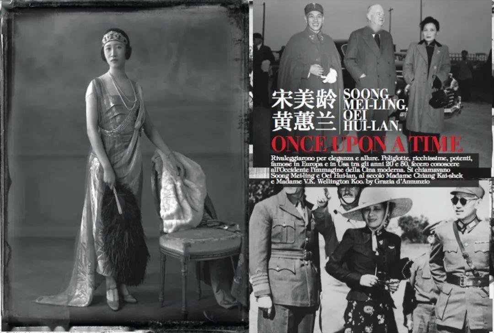

Trong sách của Hoàng Huệ Lan có viết rằng, từ khi sang Mỹ năm 1946, Cố Duy Quân liên tục chạy đi chạy lại giữa Washington và New York chỉ để gặp Nghiêm Ấu Vận, đồng thời nôn nóng muốn ly hôn với bà.
Theo tự truyện của Nghiêm Ấu Vận, Cố Duy Quân và Hoàng Huệ Lan đã ly thân hơn 20 năm, chỉ là Hoàng Huệ Lan không nỡ từ bỏ danh phận phu nhân đại sứ nên từ chối ly hôn trước khi ông nghỉ hưu. Mãi đến năm 1956, sau khi Cố Duy Quân thôi chức Đại sứ Mỹ, hai người mới chính thức ký giấy ly hôn.
Mối quan hệ giữa Nghiêm Ấu Vận và Cố Duy Quân cũng được Trương Học Lương xác nhận trong hồi ký kể chuyện bằng lời của ông.
Trương Học Lương nói rằng chuyện giữa Cố Duy Quân và Nghiêm Ấu Vận từ lâu đã là bí mật công khai. Hoàng Huệ Lan thậm chí còn tìm đến tận nhà, hắt cả một cốc trà lên đầu Nghiêm Ấu Vận.
Còn Dương Quang Sinh thì sao? Ông nói với bên ngoài rằng bản thân không nhận ra vợ mình có quan hệ với Cố Duy Quân, nhưng chính ông cũng có một cô bạn gái là phi công.
Riêng Hoàng Huệ Lan, đừng nghĩ rằng Trương Học Lương tung tin này là để bênh vực bà. Ông nói bản thân ghét bà nhất, vì bà “tự dát vàng lên mình”. Trương Học Lương còn mỉa mai chuyện bà gian lận khi đánh bài, ngầm châm chọc nhân phẩm không tốt.
Nghiêm Ấu Vận cũng từng nhắc đến Trương Học Lương trong hồi ký của mình. Bà kể rằng trước sự kiện

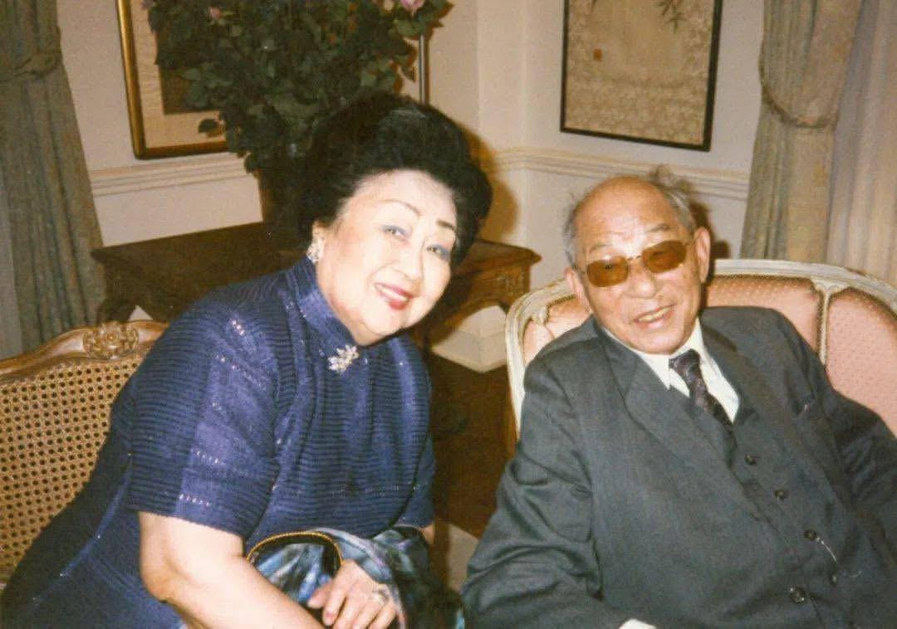

Tây An, chồng bà từng đi đánh golf cùng Trương Học Lương, và ông ấy còn tặng bà một con búp bê Tây. Tuy nhiên, phần liên quan đến Cố Duy Quân thì được kể khá mơ hồ. Chỉ nói rằng năm 1943, sau khi chồng qua đời, Nghiêm Ấu Vận dẫn theo 3 con gái rời Philippines sang Mỹ, và định cư lâu dài tại New York.

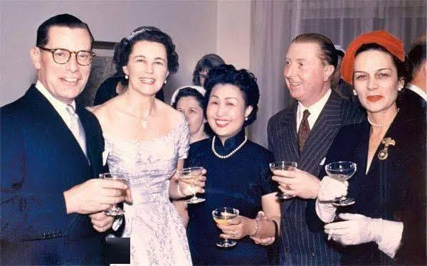

Năm 1991, bức ảnh chụp chung của Nghiêm Ấu Vận với Trương Học Lương, sau khi ông được trả tự do và sang Mỹ.
Nhờ khả năng giao thiệp khéo léo, bà trở thành một trong những nhân viên đầu tiên của Bộ Lễ tân và Liên lạc Liên Hợp Quốc, và làm việc tại đó suốt 10 năm. Chính tại đây, bà tái ngộ Cố Duy Quân, khi ông giữ chức Đại sứ Trung Quốc tại Mỹ, và hai người nối lại tình xưa.
Sau khi không còn đảm nhiệm cương vị đại sứ, Cố Duy Quân được bổ nhiệm làm thẩm phán, rồi Phó Chủ tịch Tòa án Công lý Quốc tế tại The Hague. Nghiêm Ấu Vận cũng nghỉ hưu khỏi Liên Hợp Quốc, theo ông sang Hà Lan bắt đầu cuộc sống nơi đất khách.

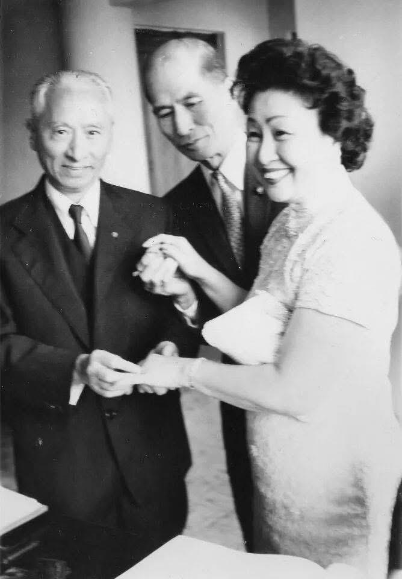

Hà Phượng Sơn (ở giữa) chủ trì hôn lễ của Cố Duy Quân và Nghiêm Ấu Vận. Ngày 3 tháng 9 năm 1959, sau nhiều năm gắn bó, hai người tổ chức hôn lễ tại Mexico City, do Hà Phượng Sơn — khi đó là Đại sứ tại địa phương, người được Liên Hợp Quốc tôn vinh là “Schindler của Trung Quốc” — chủ trì.

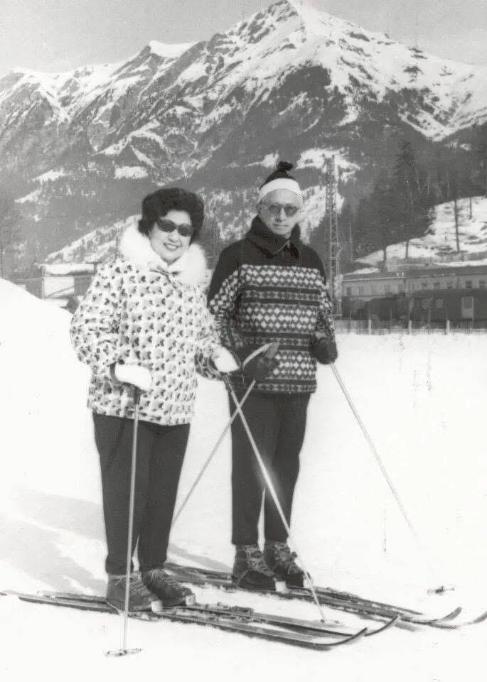

Năm 1960, Nghiêm Ấu Vận và Cố Duy Quân đi trượt tuyết tại Áo.
Năm 1966, sau khi Cố Duy Quân hoàn toàn nghỉ hưu, hai người trở về Mỹ, sinh sống tại số 1185 Park Avenue, không xa Công viên Trung tâm New York. Kể cả sau khi Cố Duy Quân qua đời, Nghiêm Ấu Vận vẫn luôn sống tại đây.
Dù dư luận bên ngoài có nhiều đánh giá trái chiều về mối quan hệ giữa Nghiêm – Cố, nhưng các con của Cố Duy Quân vẫn dành cho người mẹ kế này sự biết ơn, cho rằng Nghiêm Ấu Vận quả thực đã giúp ông kéo dài tuổi thọ ở một mức độ nhất định.

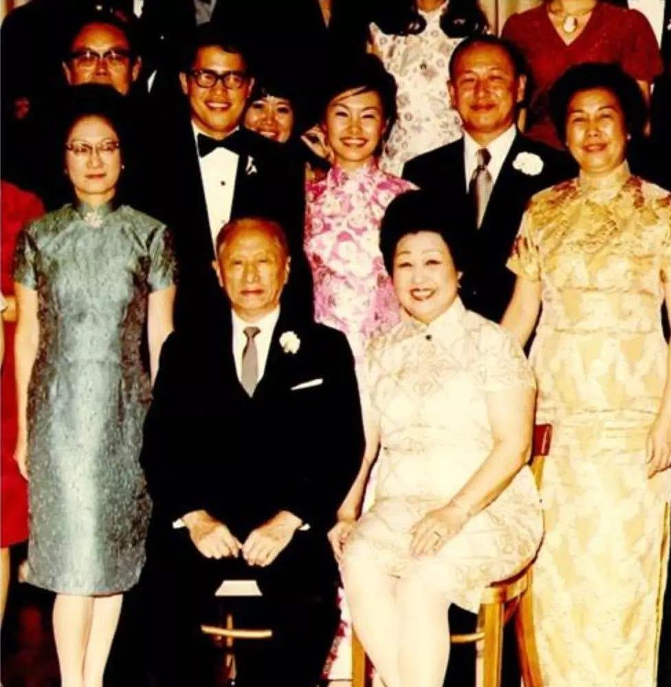

Ảnh chụp chung Cố Duy Quân, Nghiêm Ấu Vận và các con của gia đình họ Cố. Người đứng ngoài cùng bên trái là con gái của Cố Duy Quân – Cố Cúc Trân.
Trong bức ảnh chụp chung này, Cố Duy Quân và Nghiêm Ấu Vận đứng ở hàng sau. Hàng trước, người thứ hai từ bên phải là con gái thứ hai của Nghiêm Ấu Vận – Dương Tuyết Lan. Còn người đứng ngoài cùng bên trái hàng trước là Tưởng Sĩ Vân, mẹ kế của Bối Duật Minh, cũng là người phụ nữ được Trương Thiếu Soái yêu thương nhất. Bản thân Tưởng Sĩ Vân cũng là một nhân vật có câu chuyện đời vô cùng phong phú… Hôm nay tạm không bàn sâu.

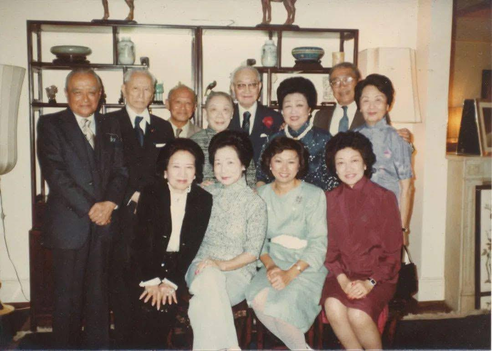

Từ sau khi hai người kết hôn, cuộc sống của Nghiêm Ấu Vận gần như xoay quanh chồng, chăm sóc ông tỉ mỉ, chu toàn, tạo cho ông một tuổi già yên ấm, hạnh phúc. Dù điều kiện rất sung túc, trong nhà không thiếu người hầu, bảo mẫu, nhưng mỗi tối bà vẫn đích thân chuẩn bị bữa khuya và đồ ăn nhẹ cho Cố Duy Quân, ngày nào cũng vậy, chưa từng gián đoạn.

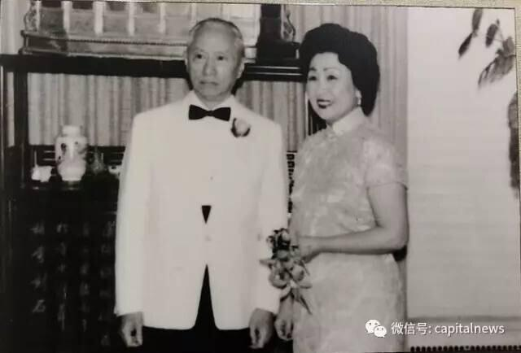

Tại New York, họ vẫn duy trì mối quan hệ mật thiết với giới thượng lưu như trước kia, khách khứa trong nhà lúc nào cũng tấp nập.
Ngày 14/11/1985, Nghiêm Ấu Vận đứng bên ngoài phòng tắm trông chừng Cố Duy Quân đang ngâm mình. Hai người còn đang bàn bạc ngày mai mời ai đến đánh mạt chược, vậy mà Cố Duy Quân cứ thế chìm vào

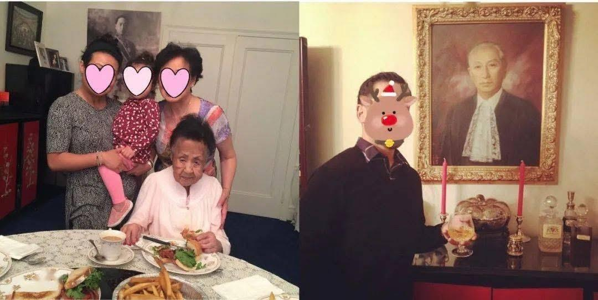

giấc ngủ và không bao giờ tỉnh lại, hưởng thọ 97 tuổi.
Thông qua tài khoản Instagram của một người họ hàng thuộc thế hệ trẻ của bà (khuôn mặt đã được che mờ), có thể phần nào thấy được cách bài trí trong nhà. Trên tường luôn treo ảnh Cố Duy Quân thời trẻ trong quân phục và chân dung ông khi làm thẩm phán.
Trong sách, Nghiêm Ấu Vận viết rằng sự ra đi của chồng khiến bà như mất đi chỗ dựa tinh thần, suy sụp suốt một thời gian dài, mãi sau mới dần lấy lại sinh khí như trước.
Năm 1997, trong tiệc mừng thọ 100 tuổi của Tống Mỹ Linh, Nghiêm Ấu Vận dẫn theo hai con gái đến dự. Khi đó, bà đã 92 tuổi.

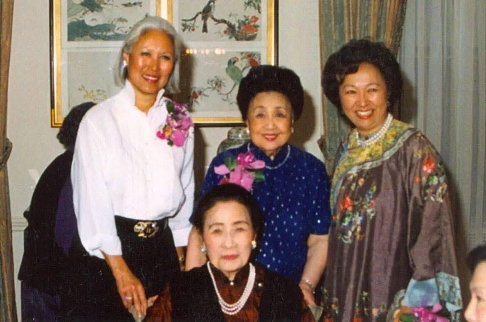

Hàng trên từ trái sang phải: Dương Lôi Mạnh, Nghiêm Ấu Vận, Dương Tuyết Lan. Hàng dưới là Tống Mỹ Linh, khi ấy đã 100 tuổi.
Vì sao không có hình cô con gái út Dương Tỉ Ân? Bởi từ năm 1992, Dương Tỉ Ân đã không may qua đời vì ung thư đại tràng, hưởng dương 53 tuổi.
Trong hồi ký, Nghiêm Ấu Vận hết lời khen con rể Đường Lưu Thiên là người tình nghĩa sâu nặng: ông tạm gác toàn bộ công việc, dành trọn một năm trời ở bên vợ, chăm sóc từng li từng tí, tiếc rằng vẫn không thể giữ lại sinh mệnh của bà. Từ những lời khen không chút tiếc rẻ ấy, có thể thấy bà đối đãi với Đường Lưu Thiên chẳng khác gì con ruột.
Một năm sau khi vợ qua đời, Đường Lưu Thiên đã bán Reich & Tang cho Công ty Đầu tư New England với giá 350 triệu USD. Có lẽ sau cú sốc mất đi người bạn đời, ông đã cảm nhận sâu sắc nỗi bi thương của đời người và quyết định rút lui khỏi thương trường.
Đường Lưu Thiên vẫn hết lòng chăm lo cho gia đình bên vợ. Hằng năm, ông đều đặn tham dự tiệc sinh nhật của mẹ vợ Nghiêm Ấu Vận, thậm chí còn khiêu vũ giao tế cùng bà. Về sau, khi mẹ vợ sống bằng khoản lương hưu khiêm tốn, ông đã vận dụng khả năng quản lý tài chính của mình để giúp họ đầu tư tiền hưu trí vào thị trường chứng khoán, thu được kết quả rất tốt, giúp họ có một tuổi già an nhàn và đầy đủ.
Cuộc đời không phải lúc nào cũng lao về phía trước với tốc độ cao, có lẽ sự ra đi của người vợ yêu dấu đã giúp Đường Lưu Thiên ngộ ra nhiều điều. Từ sau thập niên 1990, ông dần lui về hậu trường, dành phần lớn tâm sức cho các hoạt động từ thiện, giúp đỡ người khác và đền đáp xã hội.
Ông trở thành ủy viên người Hoa đầu tiên của Bảo tàng Nghệ thuật Metropolitan, đồng thời cũng là nhà tài trợ lớn nhất của trường cũ Học viện Phillips. Tại Skidmore College — trường đại học nơi Dương Tỉ Ân từng theo học — Đường Lưu Thiên cũng đã quyên góp xây dựng một bảo tàng và phòng trưng bày nghệ thuật mang tên người vợ quá cố của mình.
Sau khi Dương Tỉ Ân qua đời, Đường Lưu Thiên từng có một cuộc hôn nhân ngắn ngủi khác, nhưng rất ít tư liệu ghi chép và người ngoài hầu như không rõ. Mãi đến năm 2013, ông mới gặp gỡ Từ Tâm Mi, một nhà khảo cổ học người Hoa kém ông 33 tuổi. Gia tộc của Từ Tâm Mi là hậu duệ của nhà khoa học thời Minh Từ Khải[^5]. Quang Bà di cư sang Mỹ từ nhỏ.

[^5]: Từ Quang Khải là học giả lớn vào cuối thời Minh, hoạt động trên nhiều lĩnh vực như Nho học, Tây học, thiên văn học, toán học, thủy lợi, nông học và quân sự học; đồng thời là nhà khoa học, nhà tư tưởng, chính trị gia và quân sự gia. Dưới triều Sùng Trinh, Từ Quang Khải giữ chức Thượng thư Bộ Lễ, kiêm Đại học sĩ Văn Uyên Các. Ông qua đời vì bệnh khi đang tại chức ở Bắc Kinh và được truy tặng thụy hiệu Văn Định.
Từ Quang Khải là một trong những người tiên phong của giao lưu văn hóa Đông – Tây và sự nghiệp khoa học – kỹ thuật cận đại Trung Quốc. Ông ủng hộ thực học, đóng vai trò then chốt trong quá trình Tây học truyền vào phương Đông: từ việc đưa và sử dụng vũ khí kiểu Tây, phát triển pháo binh nhà Minh để chống lại Hậu Kim, cho đến việc du nhập và phổ biến các loại cây trồng năng suất cao, chịu hạn tốt như khoai lang và các giống lúa cải tiến.
Một trong những đóng góp nổi tiếng nhất của Từ Quang Khải là việc hợp tác với Maeo Ricci để dịch sang tiếng Hán 6 quyển đầu của “Cơ sở Hình học” của Euclid. Nhiều thuật ngữ khoa học do ông xác lập khi đó vẫn được sử dụng cho đến ngày nay. Ngoài ra, ông còn trực tiếp hoặc tổ chức người khác cùng các giáo sĩ Công giáo đến Trung Quốc biên soạn, dịch thuật một loạt tác phẩm Tây học bằng tiếng Hán. Là một học giả mang tầm vóc bách khoa, những công trình lớn dồn nhiều tâm huyết nhất vào cuối đời của ông gồm “Nông chính toàn thư” — tập đại thành của nông học cổ đại Trung Quốc — và “Sùng Trinh lịch thư”, bộ sách hệ thống hóa lý thuyết và phương pháp của thiên văn học cổ điển phương Tây (chủ yếu là hệ thống Tycho Brahe). Ngoài ra, ông còn để lại “Từ thị bào ngôn”, một tập trước tác về quân sự, cùng số lượng đáng kể các bài viết truyền giáo và hộ giáo Công giáo.

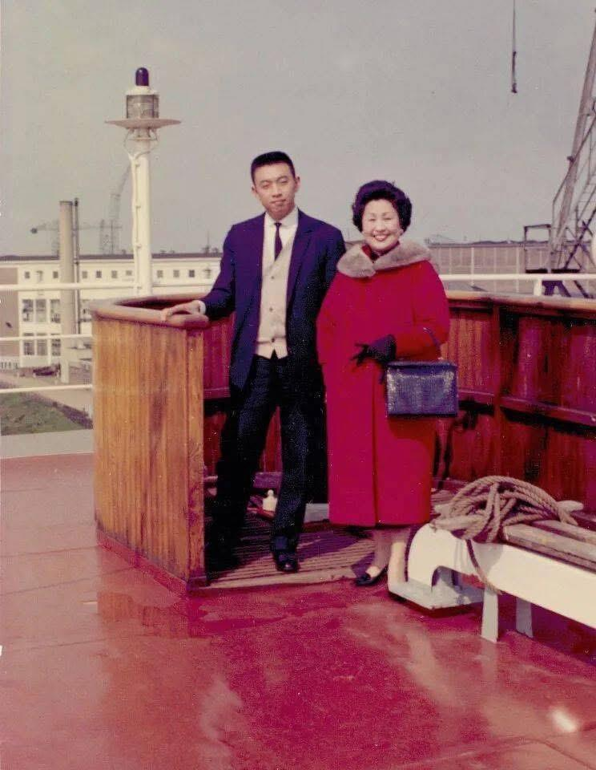

Nghiêm Ấu Vận chụp ảnh cùng Đổng Kiến Hoa, con trai của Đổng Hạo Vân – người bạn giao hảo lâu năm của gia đình (sau này trở thành Trưởng Đặc khu đầu tiên của Hong Kong). Chiếc túi xách với họa tiết da cá sấu lờ mờ hiện rõ trên tay bà toát lên vẻ sang trọng, đắt giá.

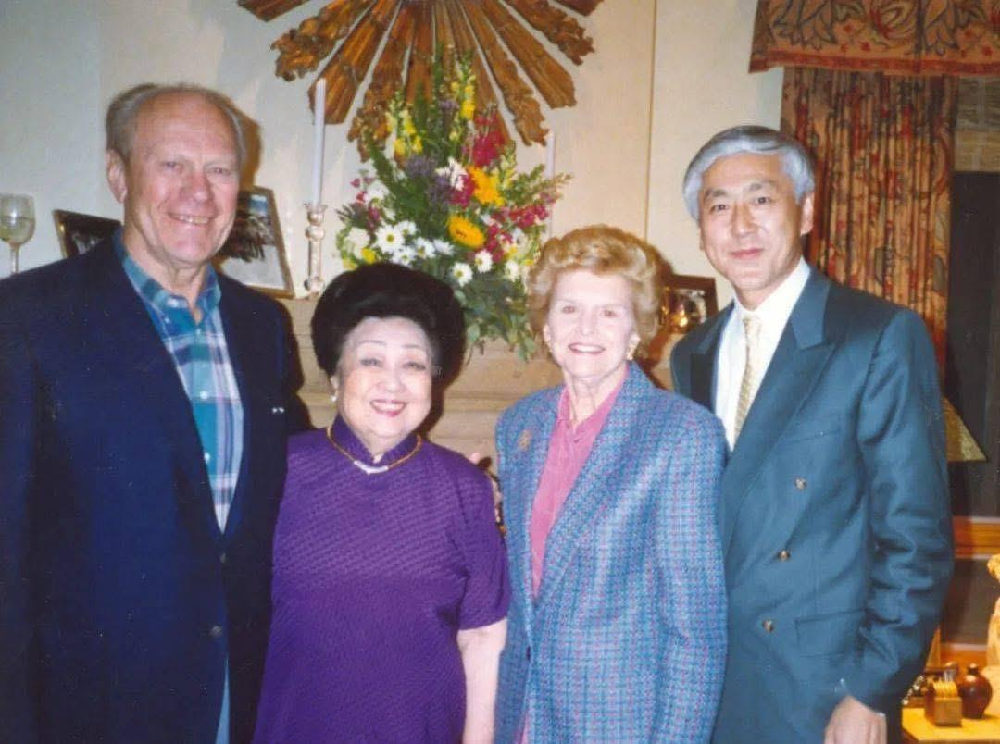

Trong ảnh là Nghiêm Ấu Vận (thứ hai từ trái sang) và Đường Lưu Thiên khi còn trẻ (ngoài cùng bên phải) gặp gỡ Tổng thống thứ 38 của Hoa Kỳ Gerald Ford (ngoài cùng bên trái) cùng phu nhân Bey Ford (thứ hai từ phải sang).

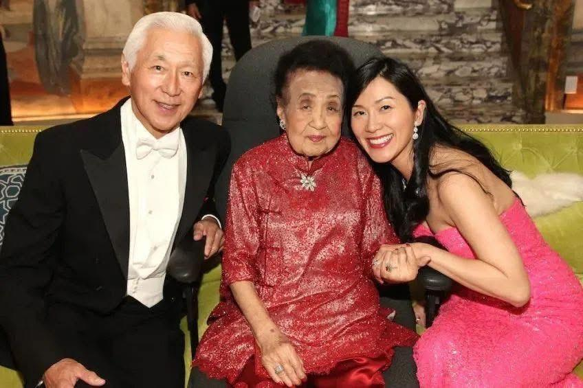

Từ trái sang phải: Đường Lưu Thiên, Nghiêm Ấu Vận, Từ Tâm Mi.
Thực ra, năm 2003, Nghiêm Ấu Vận cũng được chẩn đoán ung thư đại tràng, nhưng may mắn hơn con gái: khi đó đã 98 tuổi, bà phẫu thuật thành công và vượt qua cửa tử.
Cũng từ đó, mỗi năm gia đình đều tổ chức cho bà một buổi tiệc sinh nhật long trọng tại khách sạn 5 sao sang trọng The Pierre ở Manhaan, New York.

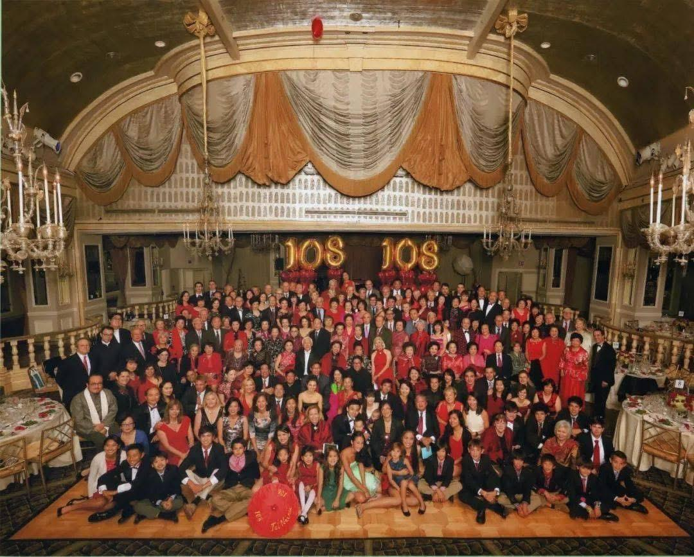

Sinh nhật 108 tuổi của Nghiêm Ấu Vận.

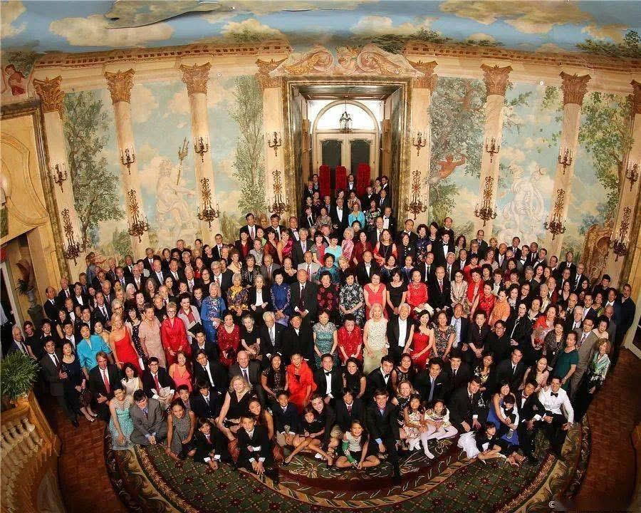

Sinh nhật 110 tuổi của Nghiêm Ấu Vận.

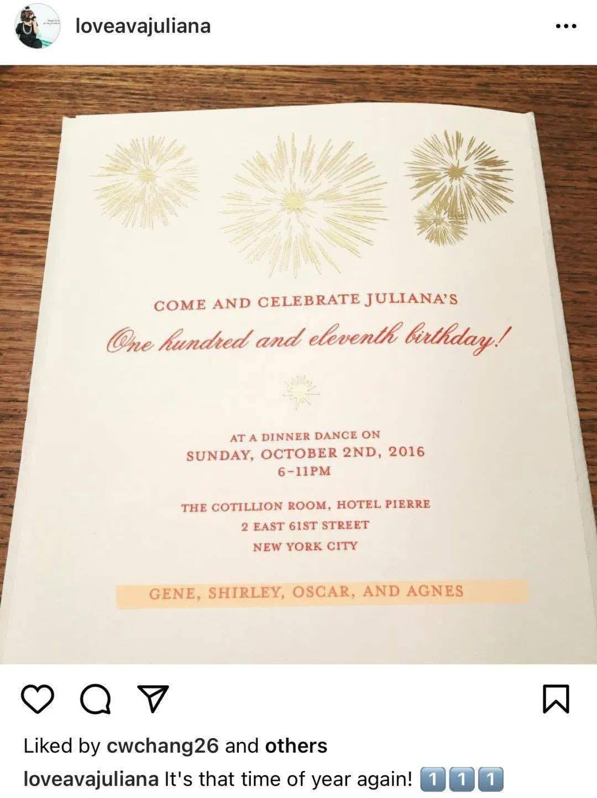

Đường Lưu Thiên thậm chí còn là bạn nhảy cố định trong tiệc sinh nhật hằng năm của bà.
Sinh nhật của bà giống như một bữa tiệc lớn, nơi bạn bè thân hữu tụ họp đông đủ.
Khách mời không chỉ có hậu duệ nhà họ Dương, họ Cố, họ Đường, mà còn có họ hàng xa và bạn bè thân thiết, chẳng hạn Sarina — con gái của Đường Diệp Như được nhắc ở trên — cũng có mặt trong danh sách khách mời.
Nhìn vào thiệp mời có thể thấy, những bữa tiệc về sau đều do 2 con gái Dương Lôi Mạnh (Gene), Dương Tuyết Lan (Shirley) cùng người con rể cũ Đường Lưu Thiên (Oscar) và người vợ mới của ông – Từ Tâm Mi (Agnes) đứng ra tổ chức.

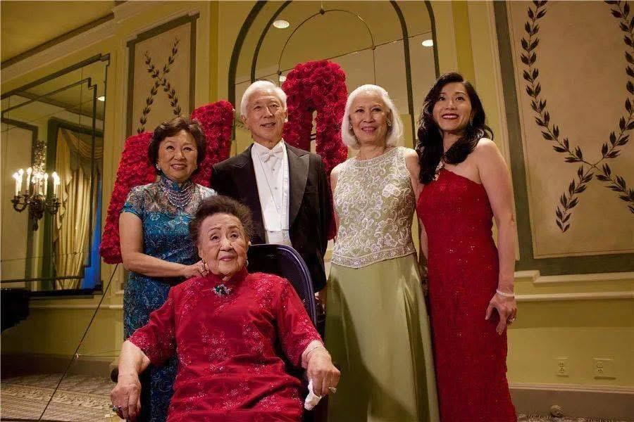

Hàng sau, từ trái sang phải: Dương Tuyết Lan, Đường Lưu Thiên, Dương Lôi Mạnh, Từ Tâm Mi.

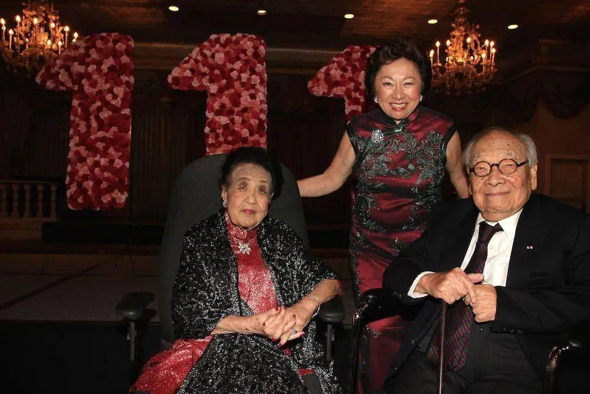

Năm 2016, tại bữa tiệc mừng 111 tuổi, Nghiêm Ấu Vận chụp ảnh cùng Bối Duật Minh, khi đó đã 99 tuổi.

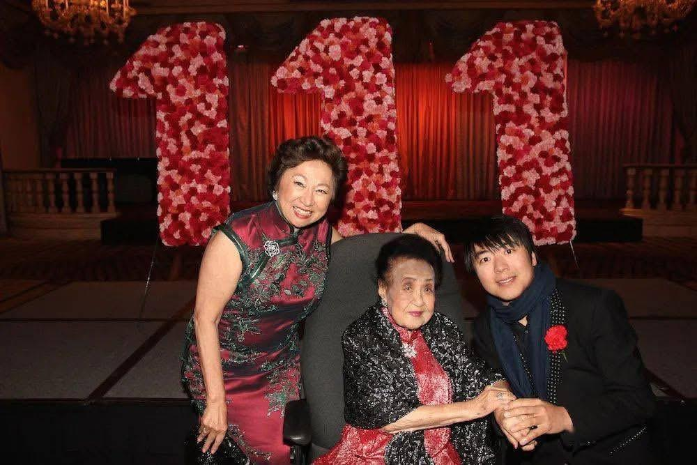

Tiệc mừng sinh nhật 111 tuổi của Nghiêm Ấu Vận (giữa): bên trái là con gái thứ hai Dương Tuyết Lan, bên phải là nghệ sĩ Lang Lang.

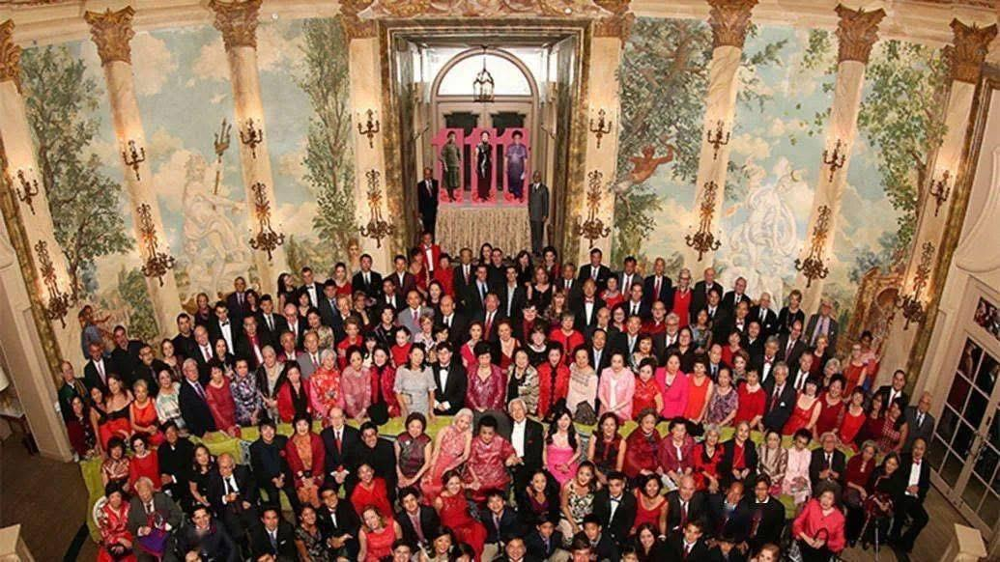

Ở tuổi 111, trong bữa tiệc sinh nhật cuối cùng của Nghiêm Ấu Vận, người con rể cũ Đường Lưu Thiên ngồi bên tay trái, cẩn thận dìu đỡ bà.
Ngày 24/5/2017, Nghiêm Ấu Vận qua đời tại nhà riêng, hưởng thọ 111 tuổi 240 ngày.
Điều khiến người ta không khỏi bùi ngùi là tháng 2 năm 2020, con gái cả Dương Lôi Mạnh (Genevieve Young) cũng qua đời, hưởng thọ 89 tuổi.
Parks[^6], Dương Lôi Mạnh từng kết hôn 2 lần. Người chồng thứ 2 là nhiếp ảnh gia nổi tiếng Gordon tiếc rằng cuộc hôn nhân này chỉ kéo dài vỏn vẹn 6 năm.

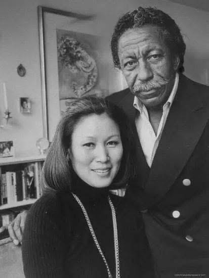

Dương Lôi Mạnh (trái) và người chồng thứ 2 – nhiếp ảnh gia Gordon Parks.

[^6]: Gordon Roger Alexander Buchanan Parks (30/11/1912 – 7/3/2006) là nhiếp ảnh gia, nhà soạn nhạc, nhà văn, nhà thơ và đạo diễn điện ảnh người Mỹ. Ông nổi bật trong lĩnh vực nhiếp ảnh báo chí tư liệu tại Hoa Kỳ từ thập niên 1940 đến thập niên 1970, đặc biệt với các chủ đề về quyền dân sự, nghèo đói và cộng đồng người Mỹ gốc Phi, đồng thời cũng hoạt động trong mảng nhiếp ảnh thời trang – chân dung. Ông được nhớ đến nhiều nhất qua những bức ảnh mang tính biểu tượng về người nghèo ở Mỹ trong thập niên 1940 (thực hiện cho một dự án của chính phủ liên bang), các loạt phóng sự ảnh đăng trên tạp chí Life, cũng như vai trò đạo diễn của các bộ phim Shaft, Shaft’s Big Score và bộ phim mang màu sắc bán tự truyện The Learning Tree.

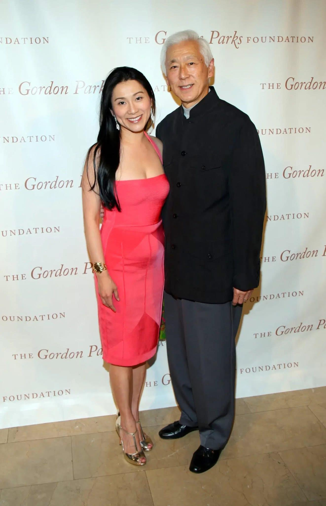

Từ Tâm Mi và Đường Lưu Thiên trong 1 sự kiện của Quỹ Gordon Parks. Gordon Parks là nhiếp ảnh gia nổi tiếng và cũng là chồng cũ của Dương Lôi Mạnh – chị gái của Dương Tỉ Ân, mà Dương Tỉ Ân chính là người vợ đầu quá cố của Đường Lưu Thiên.
Dương Lôi Mạnh gắn bó phần lớn cuộc đời với nghề biên tập sách, bà rất yêu khiêu vũ. Ngoài 80 tuổi vẫn có thể bắt cặp với vũ công trẻ để tham gia các cuộc thi nhảy.
Tháng 12 năm 2020, con gái thứ hai Dương Tuyết Lan (Shirley Young) cũng qua đời vì biến chứng của ung thư vú, hưởng thọ 85 tuổi.
Dương Tuyết Lan từng giữ chức Phó Chủ tịch phụ trách phát triển thị trường tiêu dùng của General Motors. Giống như chị gái, bà cũng có 2 cuộc hôn nhân, nhưng đều kết thúc bằng ly hôn.
Trong nhiều hoạt động của mẹ là Nghiêm Ấu Vận, bà thường xuyên ở bên tháp tùng.
Câu chuyện đến đây đã bao trùm quá nhiều nhân vật, tựa như xem lại một bộ biên niên sử kéo dài suốt cả thế kỷ.
So với nhiều gia tộc khác từng di cư, con cháu đã sớm thất lạc không còn dấu vết, thì nhà họ Đường, họ Dương, họ Cố — sức sống được tiếp nối qua các thế hệ — vẫn khiến người ta khâm phục.
Nhìn lại hành trình phát tích của gia tộc họ Đường ở Vô Tích, có thể nhận ra đây là một gia tộc vừa kỳ lạ vừa đồ sộ. Các thế hệ tiền nhân có tầm nhìn xa, không ngại gian khó, dựa vào đầu óc kinh doanh sắc bén cùng đạo đức buôn bán lấy chữ tín làm đầu, đã viết nên một chương dày dặn trong lịch sử trỗi dậy của kinh tế tư nhân thời cận đại. Con cháu họ Đường thì “trò giỏi hơn thầy”, dường như luôn kế thừa và phát huy những “gen” kinh doanh — từ bản lĩnh, khí phách đến tầm nhìn và sự quả cảm — khiến thế hệ sau luôn vượt trội hơn thế hệ trước.
Dường như, thời đại đầy biến động này và gia tộc họ Đường mang màu sắc huyền thoại đã cùng nhau tạo nên và nâng đỡ lẫn nhau, gắn bó không thể tách rời.
Sự hưng thịnh lâu dài của một gia tộc, suy cho cùng, nằm ở 2 điểm: con cháu đông đúc và tuổi thọ cao, ra đi trọn vẹn. Dường như chỉ khi hội đủ hai điều ấy, danh tiếng và vinh quang của dòng họ mới có thể truyền lại bền bỉ theo năm tháng.
Và không thể không nói rằng, Nghiêm Ấu Vận, người sống đến 111 tuổi, chứng kiến bao biến thiên lịch sử, đã đóng vai trò như một sợi dây kết nối con người, duy trì những cuộc hội ngộ thường niên của người thân và bạn bè — công lao ấy thực sự không nhỏ.
Có lẽ, sau khi bà rời đi, trọng trách ấy đã được trao lại cho thế hệ của Đường Lưu Thiên.
