> © Bài dịch gốc của Facebook page [Hôm nay giới thượng lưu có gì?](https://www.facebook.com/Homnaygioithuongluucogi "Hôm nay giới thượng lưu có gì?")
---

Cuộc đời truyền kỳ của Hà Hồng Sân

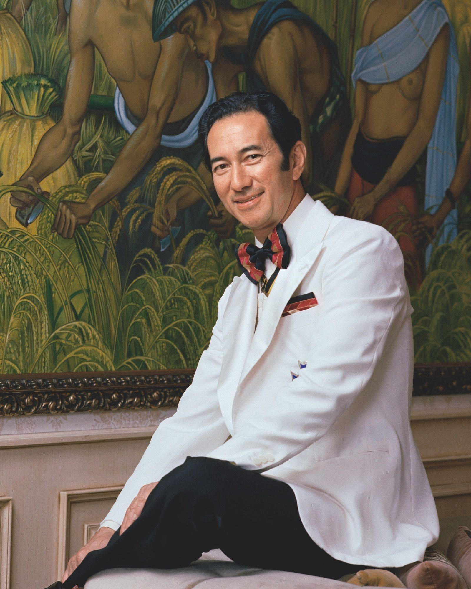

Trùm sòng bạc Hà Hồng Sân.
Đến tận bây giờ, thành tựu của Hà Hồng Sân vẫn xếp vào hàng “tiền vô cổ nhân, hậu vô lai giả” (trước đây không có ai, sau này cũng không có ai được như vậy).
Sau khi Hà Hồng Sân qua đời, có vô số người muốn trở thành “trùm sòng bạc” tiếp theo. Ngành kinh doanh sòng bạc là miếng bánh béo bở mà ai cũng muốn chia phần. Nhưng không phải ai cũng có bản lĩnh được như Hà Hồng Sân. Nhìn vào hai “tấm gương” Châu Trác Hoa và Trần Vinh Luyện là rõ.
Để có được sự nghiệp như hôm nay, không thể phủ nhận Hà Hồng Sân rất có bản lĩnh. Nhưng ngoài bản lĩnh ra còn phải kể đến thiên thời - địa lợi - nhân hòa.
Nói trước về “nhân” đi.
Chuyện tình cảm gia đình của Hà Hồng Sân ngốn không biết bao giấy mực của báo chí, hẳn mọi người đã không còn lạ gì với câu chuyện xoay quanh 4 người vợ và các con của Hà Hồng Sân. Cuộc chiến tranh giành tài sản nhà họ Hà xưa nay vẫn luôn thu hút người đọc.
Từ chuyện bà cả Lê Uyển Hoa dựa vào thế lực của gia tộc trợ giúp Hà Hồng Sân kinh doanh phát đạt, cho đến khi bà hai bà ba xuất hiện, nhánh bà cả suy tàn rồi đến sự xuất hiện của bà tư.
Năm xưa, nếu không gặp Lê Uyển Hoa, nếu không nhờ gia đình họ Lê trợ giúp, có lẽ Hà Hồng Sân đã không phát triển sự nghiệp thuận lợi được như vậy.
Rồi Lam Quỳnh Anh xuất hiện. Tuy gia đình họ Lam khi đó đã sa cơ thất thế, nhưng ông nội Lam Quỳnh Anh dù sao cũng là thiếu tướng về hưu, cha lại là cựu quân nhân từng tham gia kháng chiến chống Nhật. Thất thế vì chuyển sang kinh doanh nhưng thất bại, nhưng quan hệ xã hội dù sao vẫn còn đó.
Ngay lúc bà cả đau ốm cần người chăm sóc thì bà ba xuất hiện. Đối với bà cả và bà hai, đây không phải chuyện vui, nhưng với Hà Hồng Sân khi đó lại chẳng khác gì một cơn mưa đúng lúc. Thậm chí, chính nhờ Trần Uyển Trân mà Hà Hồng Sân thắt chặt mối quan hệ với Lâm Phượng Nga hơn.
Đoạn này xin phép nói qua một chút về Lâm Phượng Nga trước khi tiếp tục chủ đề chính.
Lâm Phượng Nga là ai?
Lâm Phượng Nga là nữ doanh nhân tài ba kiêm từ thiện gia nổi tiếng, nằm trong danh sách những tỷ phú người Hoa do Forbes thống kê, có đóng góp trong nhiều lĩnh vực. Bà đảm nhiệm vị trí Chủ tịch HĐQT Tập đoàn Lục Phúc Macau, là đảng viên kiêm nghiên cứu viên cấp bốn của Cục Khoa học và Công nghệ Châu Tây Nam, tỉnh Quý Châu. Bà đã đóng góp rất nhiều cho sự nghiệp giáo dục tại quận Lệ Loan, thành phố Quảng Châu thông qua việc thành lập quỹ học bổng và tài trợ xây dựng trường học.
Năm 1996, bà được trao tặng danh hiệu “Công dân danh dự thành phố Quảng Châu”.
Năm 2006, bà cùng con trai Chu Cẩm Huy lần lượt nhận các giải thưởng “Mười nhân tài giáo dục Trung Hoa” và “Mười nhân tài xây dựng Trung Hoa”.
Chi tiết hơn về Lâm Phượng Nga, mình sẽ nói trong bài viết riêng về bà. Còn bây giờ quay lại chủ đề chính.
Sau này, bà tư xuất hiện, Hà Hồng Sân lại có thêm một trợ thủ đắc lực trong việc kinh doanh. Bởi vì Lương An Kỳ không những biết thời biết thế, nhìn xa trông rộng mà còn là một nhân tài đáng để bồi dưỡng. Lương An Kỳ cũng chính là quý nhân đã nâng đỡ Châu Trác Hoa - người được mệnh danh là “trùm sòng bài thứ hai” sau Hà Hồng Sân (chuyện này mình cũng sẽ nói chi tiết trong bài viết riêng, bài này chỉ tập trung về Hà Hồng Sân).
Qua đây có thể thấy cả 4 người phụ nữ được Hà Hồng Sân công khai thừa nhận đều mang lại cho ông những giá trị nhất định.
Hà Hồng Sân có 17 người con với 4 người vợ. Trong đó, nổi bật nhất phải kể đến nhánh bà hai. 3 cái tên Hà Siêu Quỳnh, Hà Siêu Phượng và Hà Du Long là 3 người con xuất sắc nhất của trùm sòng bạc, ai nấy đều có sự nghiệp riêng nổi trội.
Nhánh bà cả sớm suy tàn, con cái bà ba lại chẳng ai nổi trội. Bà tư có bản lĩnh, tính đường dài nên đã đầu tư vào giáo dục cho các con, nhìn vào học vấn của Hà Siêu Doanh, Hà Du Quân và Hà Siêu Hân là thấy. Thậm chí, con dâu con rể của bà tư không phải nhân tài bước ra từ Harvard thì cũng người mẫu nổi tiếng.
Nhưng nếu chỉ nói riêng về sự nghiệp và vợ con thì chưa đủ. Khi tìm hiểu về gia phả của Hà Hồng Sân, mình mới thực sự wow.
Cái này bắt nguồn từ việc Hà Hồng Sân là anh em họ hàng xa với Lý Tiểu Long, gia tộc họ Hà từ thời ông cố nội của Hà Hồng Sân đã được xem như một trong tứ đại gia tộc của Hong Kong - bao gồm gia tộc của La Văn Cẩm, gia tộc của Hà Đông, gia tộc của Lợi Hi Thận và gia tộc của Cao Khả Ninh.
Đặc biệt là Hà Hồng Sân có liên quan đến 2 trong số 4 gia tộc, chính là La gia và Hà gia. Thậm chí, ngoài 2 gia tộc trên, Hà Hồng Sân còn có quan hệ họ hàng với 1 gia tộc hiển hách khác ở Hong Kong là Thi gia (gia tộc Zimmern), thường được biết đến với tên gọi khác là “gia tộc của Thi Bỉnh Quang”.
Vì quan hệ dây mơ rễ má nói ra cũng hơi rối, mình sẽ cố liệt kê thành từng phần sao cho dễ hiểu nhất.
Bắt đầu từ ông bà nội của Hà Hồng Sân đi.

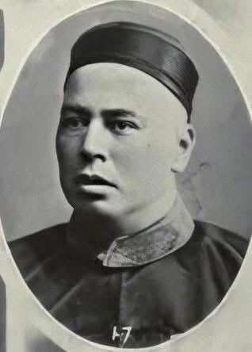

Hà Khải Phúc (ông nội Hà Hồng Sân).
Hà Khải Phúc (hay còn gọi là Hà Phúc) nhiều năm giữ chức Nghị viên Hội đồng Lập pháp Hong Kong, đặt nền tảng chính trị và thương nghiệp cho gia tộc.
Ông nội của Hà Hồng Sân là Hà Khải Phúc, bà nội là La Thuỵ Thải - chị gái của nhà tư sản La Trường Triệu, mà La Trường Triệu là cha của La Văn Cẩm.

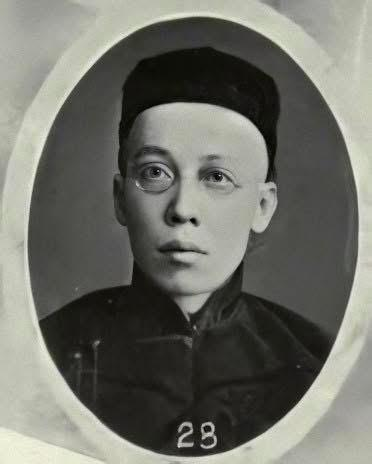

La Trường Triệu (em trai của La Thuỵ Thải - bà nội của Hà Hồng Sân).
Vợ của La Trường Triệu là Thi Tương Khanh - chị gái của Thi Bỉnh Quang. Thi Bỉnh Quang có 4 người con, trong đó:

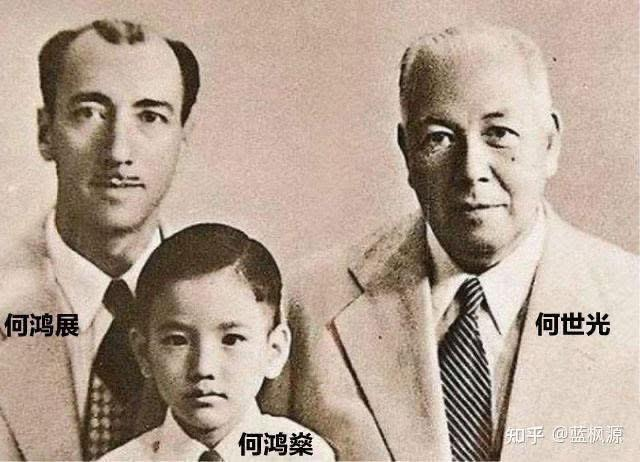

Từ trái sang phải: Hà Hồng Triển, Hà Hồng Sân, Hà Thế Quang. Hà Thế Quang là cha của Hà Hồng Triển, Hà Hồng Sân. Hà Hồng Triển là con thứ 3 của Hà Thế Quang, trong khi Hà Hồng Sân đứng thứ 9 trong số 13 anh chị em.
● Trưởng nữ Thi Yến Phương gả cho Hà Thế Diệu - con trai của La Thuỵ Thải và Hà Khải Phúc, anh trai của Hà Thế Quang (cha của Hà Hồng Sân) ⟹ Thi Yến Phương là bác dâu của Hà Hồng Sân.
● Con gái thứ hai Thi Quỳnh Phương gả cho Tiển Văn Bân - con trai của Tiển Đức Phân. Mà Tiển Đức Phân chính là ông ngoại của Hà Hồng Sân. Tiển Văn Bân là em trai của Tiển Hưng Vân (mẹ của Hà Hồng Sân) ⟹ Hà Hồng Sân gọi vợ chồng Tiển Văn Bân × Thi Quỳnh Phương là cậu mợ.
● Con gái thứ ba Thi Thuỵ Phương gả cho Hà Thế Hoa - con trai của Hà Cam Đường. Mà con gái nuôi của Hà Cam Đường chính là mẹ của Lý Tiểu Long.

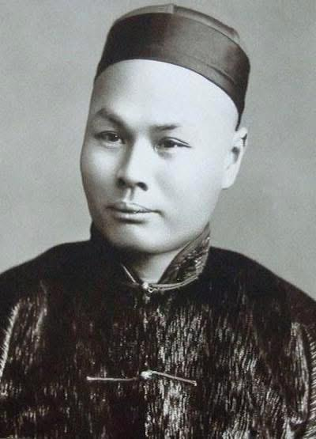

Hà Cam Đường - em trai cùng mẹ khác cha của Hà Đông và Hà Khải Phúc.
Khúc này quan hệ gia tộc hơi lag vì liên hôn qua lại hơi nhiều, mình đã cố diễn giải dễ hiểu nhất rồi chứ nhìn 🥹 vào phả hệ của 3 gia tộc này rất hack não luôn, có gì khó hiểu mong mọi người thông cảm
Nói thêm một chút về thân phận của những người họ hàng này của Hà Hồng Sân.
● Hà Khải Phúc (ông nội Hà Hồng Sân) là doanh nhân và nhà từ thiện nổi tiếng của Hong Kong, xuất thân từ gia tộc lai Âu – Á danh giá họ Hà (gia tộc của Hà Đông). Hà Khải Phúc là người Hoa đầu tiên tham gia Hội đồng Lập pháp Hong Kong và được xếp vào hàng “Ngũ đại Hoa thương” — 5 thương gia người Hoa quyền lực nhất Hong Kong thời bấy giờ.
● Hà Đông là một nhà tư sản mại bản kiêm từ thiện gia thời thuộc địa Anh, có đóng góp to lớn cho sự phát triển kinh tế của Hong Kong đồng thời gián tiếp hỗ trợ phong trào lật đổ triều đình Mãn Thanh và được phong tước hiệp sĩ. Tuy nhiên, việc ông từng tham gia quản lý hoạt động kinh doanh thuốc phiện cũng gây nên nhiều tranh cãi. Nhờ vào tầm ảnh hưởng sâu rộng, Hà Đông và thương gia Châu

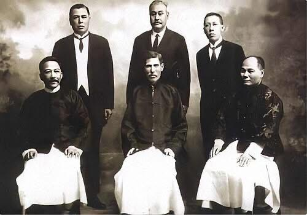

Thọ Thần là 2 người duy nhất được mệnh danh “Ông trùm xứ Cảng Thơm” trong giai đoạn đầu của lịch sử Hong Kong (thập niên 1950).
● Tiển Đức Phân (ông ngoại Hà Hồng Sân) từng giữ chức Chủ tịch Đông Hoa Tam Viện, là người sáng lập dòng họ Tiển - một trong những gia tộc danh giá của Hong Kong.
● Thi Bỉnh Quang cùng em trai Thi Xán Quang là người đã sáng lập ra dòng họ Thi, thuộc thế hệ con lai Âu - Á đầu tiên tại Hong Kong. Thi Bỉnh Quang cũng là bạn thân của Tiển Đức Phân, Trương Đức Huy và Trương Khải Minh, 4 người kết nghĩa huynh đệ. Thi Bỉnh Quang từng hỗ trợ công tác ngoại giao cho triều Thanh tại Triều Tiên với tư cách phụ tá cho Tham tán Hải quan Anh. Ngoài ra, Thi Bỉnh Quang còn giao hảo với Hà Đông (con rể của Trương Đức Huy). Mà con gái của Hà Đông - Hà Cẩm Tư - chính là vợ của La Văn Cẩm và cũng là con dâu cả của La Trường Triệu và Thi Tương Khanh.
● La Trường Triệu là một thương nhân giàu có thời kỳ đầu của Hong Kong, là bạn thân của Hà Đông, từng giữ chức Chủ tịch Đông Hoa Tam Viện. La Trường Triệu từng cùng Lưu Chú Bá, Hà Đông, Hà Khải Phúc, Hà Cam Đường và Trần Khải Minh đồng sáng lập Ngân hàng Đại Hữu - ngân hàng thứ hai do người Hoa góp vốn thành lập tại Hong Kong, chỉ sau Ngân hàng Quảng Đông.
● La Văn Cẩm là con trai cả của La Trường Triệu, là người đã đặt nền móng sự nghiệp cho cả gia tộc họ La, là người Hong Kong gốc Hoa đầu tiên được cấp phép hành nghề luật sư. Sau này, ông gia nhập giới chính trị và được phong tước hiệp sĩ sau khi bị giam giữ trong Thế chiến II do từ chối hợp tác với quân Nhật. La Văn Cẩm cũng là người đồng sáng lập Liên đoàn Bóng đá châu Á (AFC).
● Hà Cam Đường (còn có tên khác là Hà Khải Đường) là em trai cùng mẹ khác cha của Hà Đông – người giàu có nhất Hong Kong thời kỳ khai thương.
Hàng trên, từ trái sang phải: Hà Khải Phúc, Trần Khải Minh, La Trường Triệu.
Hàng dưới, từ trái sang phải: Lưu Chú Bá, Hà Đông, Hà Cam Đường.
6 người này đã cùng nhau sáng lập Ngân hàng Đại Hữu - ngân hàng thứ hai do người Hoa góp vốn thành lập tại Hong

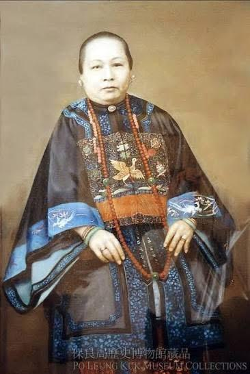

Kong, sau Ngân hàng Quảng Đông.
Trong này, Hà Đông & Hà Khải Phúc là anh em một mẹ đẻ ra, Hà Cam Đường là em trai cùng mẹ khác cha của Hà Đông & Hà Khải Phúc.
La Trường Triệu là bạn thân của Hà Đông. Hà Đông gả con gái Hà Cẩm Tư cho con trai cả của La Trường Triệu là La Văn Cẩm.
Nói về nguồn gốc của gia tộc Hà Hồng Sân thì không thể không nói đến Thi Đệ - mẹ đẻ của Hà Đông, Hà Khải Phúc, Hà Cam Đường và cũng là bà cố nội của Hà Hồng Sân.
Bà Thi Đệ là người Đản gia vùng hạ lưu sông Châu Giang, sống lâu năm trên thuyền và mưu sinh bằng nghề đánh cá. Sau khi Hong Kong được khai mở, cư dân ven biển cùng người Đản gia lần lượt đổ về Hong Kong tìm
kế sinh nhai. Trong thời gian này (khoảng năm 1859), bà gặp gỡ Hà Sĩ Văn - một thương nhân Do Thái gốc Hà

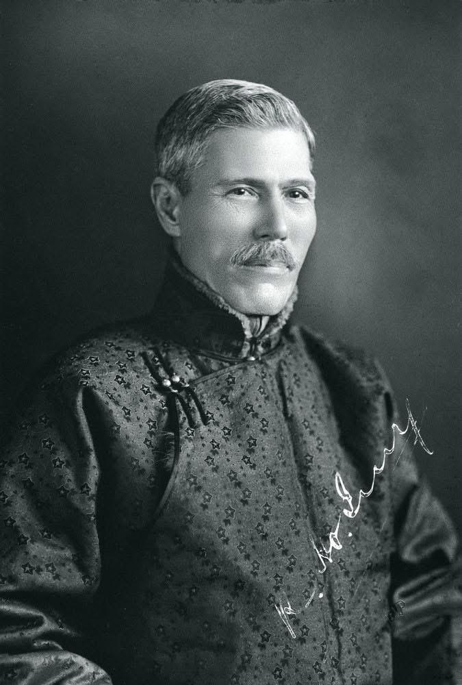

Lan đến Hong Kong buôn bán.
Trong giai đoạn 1859 – 1873, Thi Đệ và Hà Sĩ Văn duy trì mối quan hệ chung sống không hôn thú, sinh ra Hà Đông và Hà Khải Phúc.
Thi Đệ đã kiên cường sống sót giữa cảnh nghèo khó và nhục nhã tột cùng, sinh ra những người con xuất chúng và từ đó thay đổi vận mệnh của cả gia tộc.
Con trai trưởng của Thi Đệ - Hà Đông - từ một đứa con lai không địa vị, bị xã hội khinh rẻ, nhưng lại vô cùng chăm chỉ, thông minh và khéo léo, từng bước trèo lên đỉnh cao để trở thành người giàu nhất Hong Kong thời kỳ đó.
Hà Đông là người sáng lập công ty tư nhân lớn nhất Hong Kong – Jardine Matheson, được xem là người đặt nền móng cho “gia tộc số một Hong Kong”.
Hà Đông có hai người vợ, gồm nguyên phối phu nhân Mạch Tú Anh và bình thê Trương Liên Giác (còn 1 tên khác là Trương Tĩnh Dung, là em họ bên ngoại của Mạch Tú Anh). Ngoài ra, ông còn 1 người thiếp tên Chu Ỷ Văn và 1 nhân tình tên Chu Xuân Lan.
Nguyên phối phu nhân của Hà Đông, Mạch Tú Anh, không có con ruột nên đã nhận Hà Thế Vinh (cháu dòng bên của Hà Đông) làm con thừa tự.
Bình thê Trương Tĩnh Dung sinh cho Hà Đông 10 người con, 7 gái 3 trai, lần lượt là: Hà Cẩm Tư, Hà Thế Cần, Hà Tuệ Tư, Hà Thế Kiệm, Hà Nhàn Tư (tên khác là Hà Ỷ Hoa), Hà Kỳ Tư (tên khác là Hà Ngải Linh), Hà Thế Lễ, Hà Văn Tư, Hà Nghiêu Tư, Hà Hiếu Tư.
Tiểu thiếp Chu Ỷ Văn sinh được 1 cô con gái là Hà Thuần Tư, còn nhân tình Chu Xuân Lan sinh ra cậu con trai ngoài giá thú Hà Thế Nghĩa (tên khác là Hà Tá Chi).
Số phận khác nhau giữa hai người vợ và hai người tình của Hà Đông đã hé lộ bức tranh đời sống thâm sâu của lớp phu nhân hào môn đầu tiên ở Hong Kong — cũng như thân phận đặc biệt của người phụ nữ trong thời đại ấy.
Hôm nay, chúng ta sẽ nói về những người vợ và con của Hà Đông.
Các con của Hà Đông là thế hệ thứ hai của một gia tộc tỷ phú, họ không có những câu chuyện huy hoàng như cha ông mình. Thế hệ trước từng dùng đôi bàn tay trắng để leo lên đỉnh cao — một hành trình không thể tái hiện.
Thế hệ con cái, tuy sinh ra trong nhung lụa, lại mang thân phận đặc biệt: con lai của giới siêu giàu trong thời thuộc địa, vừa được sống sung túc, vừa chịu nặng nề gánh nặng danh tiếng và trách nhiệm gia tộc. Họ là những người “sinh ra đã đứng trên đỉnh”, nhưng cũng bị trói buộc trong cái bóng quá lớn của cha mẹ mình.
Qua câu chuyện về họ, ta có thể thấy rõ cả cái dễ và cái khó khi sinh ra trong nhà một người giàu nhất.
₊˚ෆ༉‧₊˚☁ ༄
Vợ cả Mạch Tú Anh gả cho Hà Đông 10 năm mà vẫn không sinh được con. Sau đó, Hà Đông cưới tiểu thiếp Chu Ỷ Văn nhưng vẫn không có một mụn con nào. Mãi đến khi cưới bình thê Trương Tĩnh Dung (em họ bên ngoại của Mạch Tú Anh), đường con cái của nhà họ Hà mới thực sự nở rộ.
Tháng 6 năm 1897, khi Hà Đông đã 35 tuổi, Trương Tĩnh Dung hạ sinh đứa con đầu lòng — là một bé gái, đặt tên Hà Cẩm Tư.

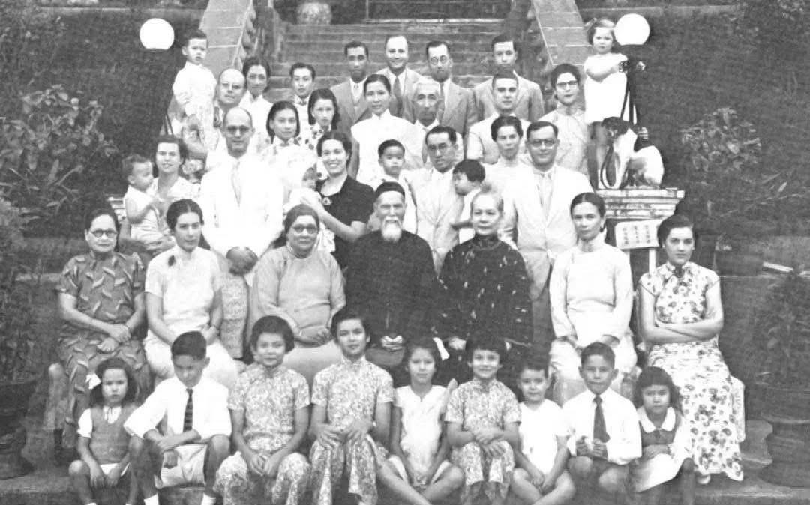

Ảnh chụp đại gia đình Hà Đông tháng 10 năm 1937.
Đứa con này đến với gia đình thật không dễ dàng, mà đúng năm ấy lại trùng với lễ kỷ niệm 60 năm đăng quang của Nữ hoàng Anh, nên Hà Đông đặt cho con gái một cái tên tiếng Anh quý phái: Victoria Jubilee.
Cả nhà họ Hà đều vô cùng nâng niu Hà Cẩm Tư, ngay cả người làm cũng thân mật gọi Hà Cẩm Tư là “Đại tiểu thư A Cẩm”.
Thực ra, tình cảm của Hà Đông dành cho con gái rất phức tạp — bởi chính ông cũng là một người phức tạp. Ông yêu con, nhưng trong sâu thẳm vẫn mang tư tưởng truyền thống “trọng nam khinh nữ” của người Hoa, nên dẫu vui mừng, ông cũng không biểu lộ quá rõ.
Sau khi Hà Cẩm Tư ra đời, Hà Đông vẫn canh cánh vì chưa có con trai — nỗi trăn trở kéo dài suốt nhiều năm. Sau đó, Trương Tĩnh Dung sinh người con trai đầu tiên là Hà Thế Cần, nhưng đứa trẻ mất sớm. Tiếp theo, bà sinh thêm con gái Hà Tuệ Tư, Hà Đông chỉ thở dài: “Lại là con gái.”
Rồi tiểu thiếp Chu Ỷ Văn sinh con gái Hà Thuần Tư, còn Trương Tĩnh Dung sinh con trai thứ hai Hà Thế Kiệm, nhưng đứa trẻ sức khỏe yếu ớt khiến Hà Đông vô cùng lo lắng. Mãi đến ngày 15 tháng 5 năm 1906, Trương Tĩnh Dung mới sinh ra một bé trai khỏe mạnh — Hà Thế Lễ — khi đó nhà họ Hà mới thật sự vui mừng khôn xiết, ước nguyện “có người nối dõi” cuối cùng cũng thành.
Dẫu vậy, Hà Cẩm Tư vẫn là một người may mắn. Dù Hà Đông giữ tư tưởng truyền thống, nhưng nhờ xuất thân nửa Hoa nửa Tây, ông có tầm nhìn cởi mở và phương pháp giáo dục hiện đại.

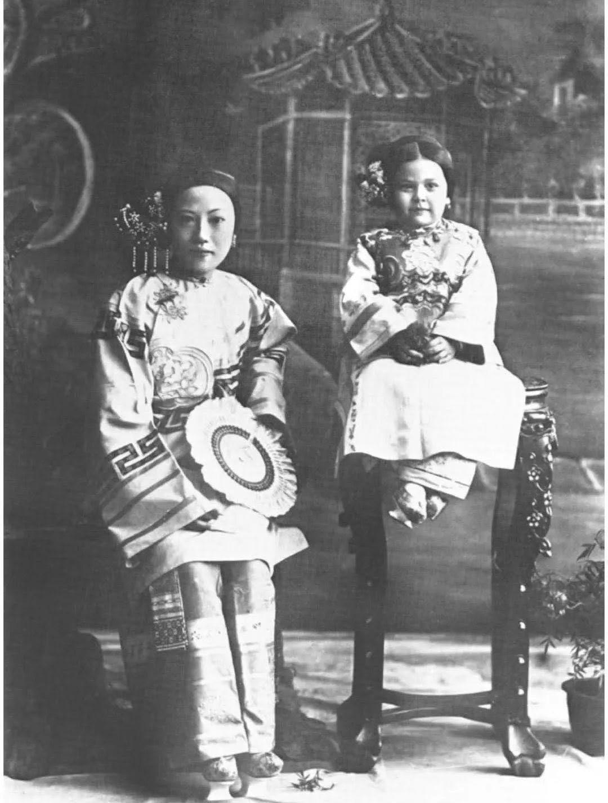

Gia sư Lương Đình Ngọc (trái) bên đại tiểu thư Hà Cẩm Tư (phải).
Rõ nhất là ở việc học hành: trước khi lên 5 tuổi, Hà Cẩm Tư đã có 3 gia sư riêng.
Một là phu nhân hiệu trưởng Trường Victoria, dạy tiếng Anh bốn ngày mỗi tuần, mỗi ngày hai giờ. Hai người còn lại là thầy dạy chữ Hán: một vị tú tài triều Thanh tên Triệu Cát Am, người còn lại là nữ giáo sư Lương Đình Ngọc, thường trú tại nhà họ Hà.
Hà Cẩm Tư có nền tảng Hán học vững vàng. Khi còn rất nhỏ, cô đã học Luận Ngữ, mỗi ngày phải viết ba mươi

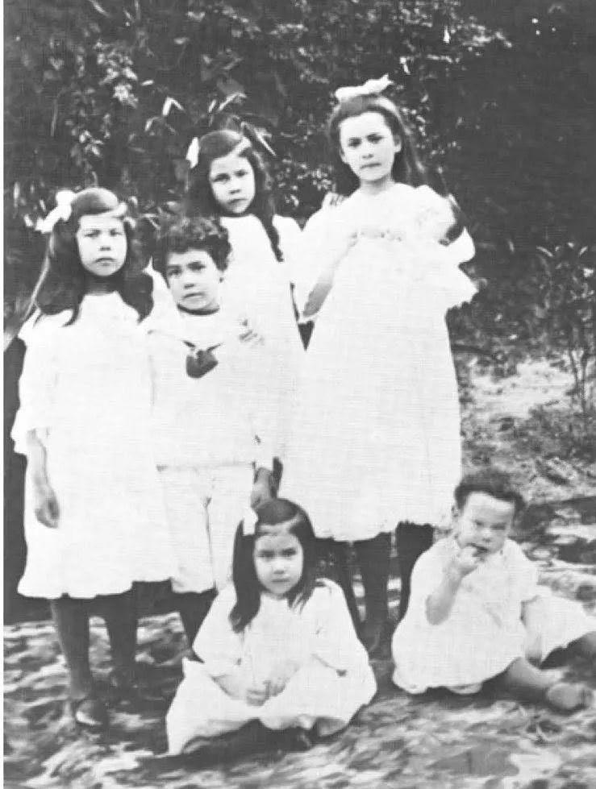

hai chữ lớn, nghe thầy kể chuyện lịch sử, đồng thời học thêm đàn piano, Thái Cực, bơi lội, hí kịch và diễn xuất Trung Hoa.
Năm lên năm, Hà Cẩm Tư vào học tại Trường nữ sinh Diocesan - một trong những trường nữ sinh lâu đời nhất của Giáo hội Anh tại Hong Kong.
Hàng trên từ trái sang phải: Hà Tuệ Tư, Hà Thế Kiệm, Hà Ỷ Hoa, Hà Cẩm Tư. Hàng dưới: Hà Ngải Linh (trái), Hà Thế Lễ (phải).
Em gái của Hà Cẩm Tư, Hà Ngải Linh, từng kể lại:
“Để đến được trường Diocesan, mỗi ngày chúng tôi phải ngồi xe kéo từ nhà ra trạm cáp treo, rồi đi cáp treo xuống Trung Hoàn, sau đó đi bộ chừng nửa dặm — đôi khi được ngồi kiệu đến bến phà Thiên Tinh, rồi đi phà qua bờ bên kia. Mẹ tôi còn nhờ bạn mình là bà Thái đón chúng tôi ở bến.”
“Chúng tôi phải rời nhà từ rất sớm, nhất định phải đến cổng trường trước khi tiếng chuông đầu tiên reo.”
Qua đó có thể thấy, nhà họ Hà cực kỳ coi trọng giáo dục — truyền thống này còn được duy trì qua nhiều thế hệ.
Đến đời thứ tư, thứ năm của họ Hà, việc học hành và đỗ đạt vẫn là tiêu chuẩn cao nhất để người cha đánh giá con cái.
Chính vì vậy, bà tư Lương An Kỳ có thể giữ vị thế vững vàng trong lòng trùm sòng bạc Hà Hồng Sân cũng phần nào nhờ vào thành tích học tập xuất sắc của các con bà.
Con trai bà tư, Hà Du Quân, nổi tiếng là học sinh xuất sắc, từ nhỏ đã đoạt vô số cúp. Và đó cũng chính là cách những đứa con mang lại vinh quang lớn nhất cho mẹ mình trong cuộc đua giành vị thế giữa các nhánh.
Hai người con của bà tư Lương An Kỳ, Hà Du Quân và Hà Siêu Hân, đều tốt nghiệp Học viện Công nghệ Massachuses (MIT). Dĩ nhiên, năm 2016, Lương An Kỳ từng quyên góp 3 triệu USD cho MIT, sau đó cô con gái Hà Siêu Hân cũng chuyển từ Anh sang Mỹ để học tại đây.
Quay lại chuyện nhà họ Hà hơn trăm năm trước.
Dù là con gái thế hệ thứ hai của dòng họ, được hưởng nền giáo dục vượt trội hơn hẳn đa số phụ nữ cùng thời, Hà Cẩm Tư vẫn không thoát khỏi số phận gò bó trong khuôn mẫu xã hội.
Khi trưởng thành, do cha Hà Đông bận rộn công việc, mẹ Trương Tĩnh Dung lại luôn phải theo sát chồng, thêm vào đó con cái trong nhà ngày càng nhiều, nên với vai trò chị cả, Hà Cẩm Tư dần gánh vác việc chăm sóc các em và quản lý nội vụ. Cô trở thành “vị quản gia” thực thụ của đại gia đình họ Hà.

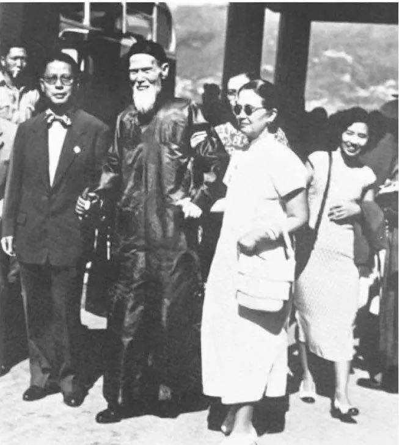

Hà Cẩm Tư đi sự kiện cùng cha, ông Hà Đông.
Trong cuốn “Sự dung hợp Đông – Tây: La Hà Cẩm Tư”, có ghi chép lại cảnh cả nhà chuẩn bị đi Mỹ du lịch — cũng là lúc thể hiện sự tháo vát của Hà Cẩm Tư khi còn trẻ:
“Cẩm Tư chỉ đạo người làm đóng gói hành lý: nấm đông cô, tôm khô, rau khô, táo tàu… đều phải phơi khô rồi cho vào hộp bánh quy rỗng hoặc lọ thủy tinh Horlicks, đóng gói kỹ, bỏ vào thùng gỗ, đóng đinh, buộc dây,
dán nhãn ghi rõ và đánh số thứ tự, sau đó tự tay ghi chép lại. Vì cả đàn piano cũng được mang theo, nên hành lý hơn trăm thứ, tất cả đều phải qua tay Cẩm Tư lập danh sách kiểm kê.”
Nhờ nhiều năm đảm nhiệm vai trò quản gia cùng trí tuệ linh hoạt, Hà Cẩm Tư rèn luyện được khả năng viết lách nhanh nhạy — cầm bút là thành văn. Nhờ đó, cô trở thành người con hiếm hoi có thể gặp cha mà không cần hẹn trước, rồi dần đảm nhiệm luôn vai trò thư ký riêng của ông.

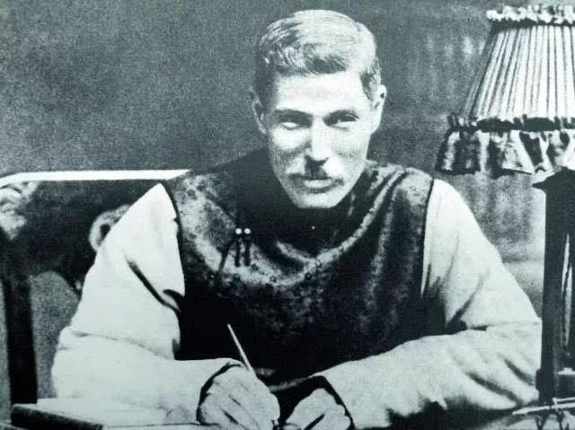

Hà Đông thời trẻ.
Hà Đông là người cực kỳ lý trí, chủ trương rằng tình thân không nên ảnh hưởng đến công việc kinh doanh, nên đối với con cái ông luôn nghiêm khắc như với cấp dưới — không hẹn trước thì không được gặp. Duy chỉ có Hà Cẩm Tư là ngoại lệ, vì cô là trợ lý, thư ký, người ghi sổ đáng tin cậy nhất của cha.
Tuy nhiên, cho dù có giỏi giang đến đâu, thì một ngày nào đó người thư ký ấy vẫn phải lấy chồng.
Người cha tinh tường như Hà Đông đã suy tính kỹ lưỡng, cuối cùng chọn cho con gái cả một mối hôn nhân “một mũi tên trúng hai đích” — vừa tốt cho con, vừa có lợi cho mình.
Đại gia đình Hà Đông trong hôn lễ của La Văn Cẩm × Hà Cẩm Tư. Hàng trên cùng, từ trái sang phải: Hà Tuệ Tư, Mạch Tú Anh, Hà Đông, Hà Ỷ Hoa. Hàng giữa, từ trái sang phải: La Văn Cẩm, Hà Cẩm Tư, Trương Tĩnh Dung, Hà Ngải Linh.

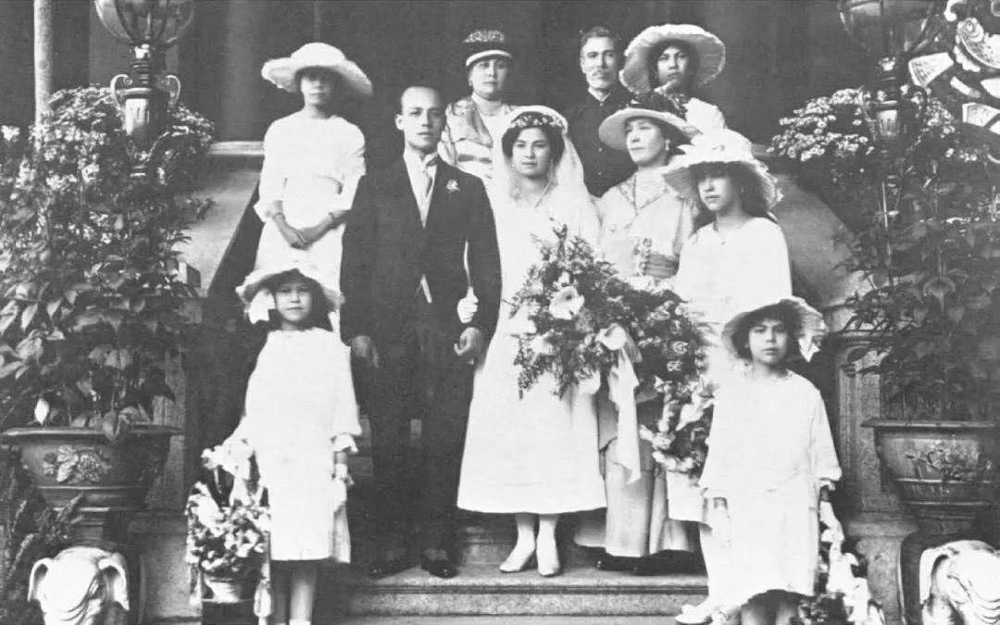

Hàng dưới cùng, từ trái sang phải: Hà Văn Tư, Hà Nghiêu Tư.
Chàng rể ấy là La Văn Cẩm, con trai của La Trường Triệu, thuộc dòng dõi lai Âu – Á đời đầu. Nhà họ La cũng là một gia tộc lai điển hình, có xuất thân và nền tảng gần như giống hệt họ Hà.
Hồi đó trong giới lai có câu nói vui: “Hà – La – Thi – Tiển – Thái, gả con chẳng lo ngoài.”
Năm họ lớn này (Hà, La, Thi, Tiển, Thái) thường xuyên thông hôn với nhau, gần như khép kín trong cộng đồng.
La Trường Triệu, cũng như Hà Đông, luôn tự xem mình là người Hoa và không ưa người Tây. Ông từng nói: “Đi cùng đầu người còn hơn theo đuôi quỷ.”
Tư tưởng của Hà Đông và La Trường Triệu rất hợp nhau, vì thế hai gia đình Hà – La là hai gia tộc thân thiết nhất trong giới con lai Hong Kong. Trên thương trường, người được Hà Đông nâng đỡ nhiều nhất ngoài con cháu nhà họ Hà thì chỉ có gia tộc họ La.
Vì vậy, cuộc hôn nhân này thật sự là môn đăng hộ đối hoàn hảo.
Đại gia đình họ La trong hôn lễ của La Văn Cẩm × Hà Cẩm Tư. Hàng dưới cùng, từ trái sang phải: La Trường Triệu, La Văn Cẩm, Hà Cẩm Tư, Thi Tương Khanh.

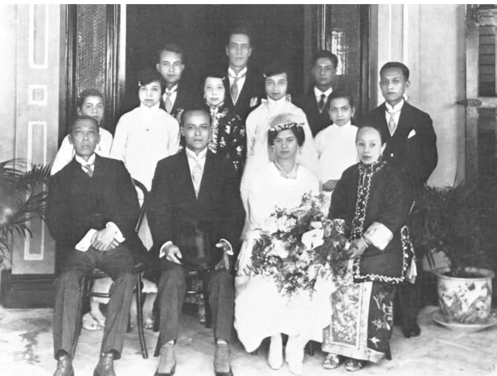

Hàng giữa, từ trái sang phải: La Kỳ Trinh, La Bảo Trinh, La Tuyết Trinh, La Kiều Trinh, La Đức Trinh. Hàng trên cùng, từ trái sang phải: La Văn Huệ, Hà Lượng (chồng của La Tuyết Trinh), La Văn Hạo.
Gia đình lai thường rất đông con. Mẹ chồng của Hà Cẩm Tư — Thi Tương Khanh (người phụ nữ ngồi ngoài cùng bên phải ở hàng dưới cùng) — cả đời sinh 10 người con, quả là một người phụ nữ truyền kỳ.
Ngoài việc “môn đăng hộ đối”, Hà Đông gả con gái cho La Văn Cẩm còn có một ẩn ý thực tế hơn cả: La Văn Cẩm là luật sư người Hoa đầu tiên ở Hong Kong, trong khi Hà Đông cực kỳ coi trọng pháp luật trong kinh doanh. Khi ông kết nạp chàng rể tài giỏi này về dưới trướng, chẳng khác nào như hổ thêm cánh.

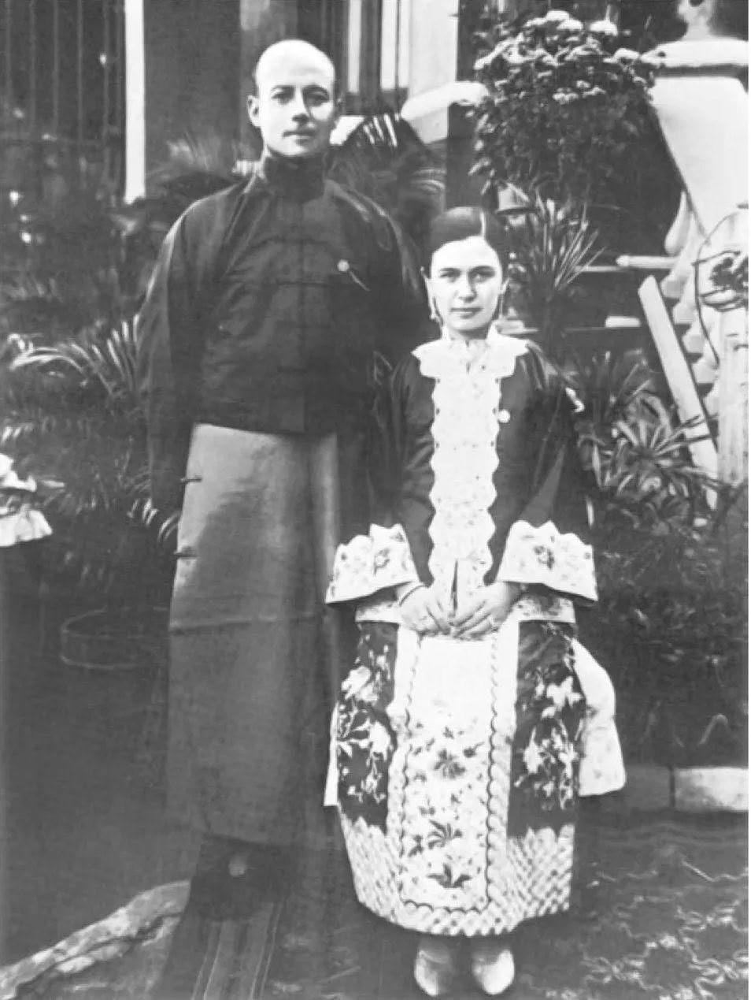

Vợ chồng La Văn Cẩm × Hà Cẩm Tư.
Từ khi kết hôn năm 1918 cho đến suốt gần 39 năm sau, Hà Đông nhận được từ con rể không biết bao nhiêu lời tư vấn pháp lý miễn phí — quả là tính toán cao tay.
Cuộc hôn nhân giữa Hà Cẩm Tư và La Văn Cẩm là điển hình của “cha mẹ đặt đâu con ngồi đấy”. Trong ảnh cưới, trên khuôn mặt cô dâu không hề có nụ cười. Nhưng may mắn thay, sau khi cưới, hai người sống với nhau hòa thuận, sinh được 4 người con, gia đình thường xuyên chụp ảnh chung, cả đời êm đềm trôi qua.

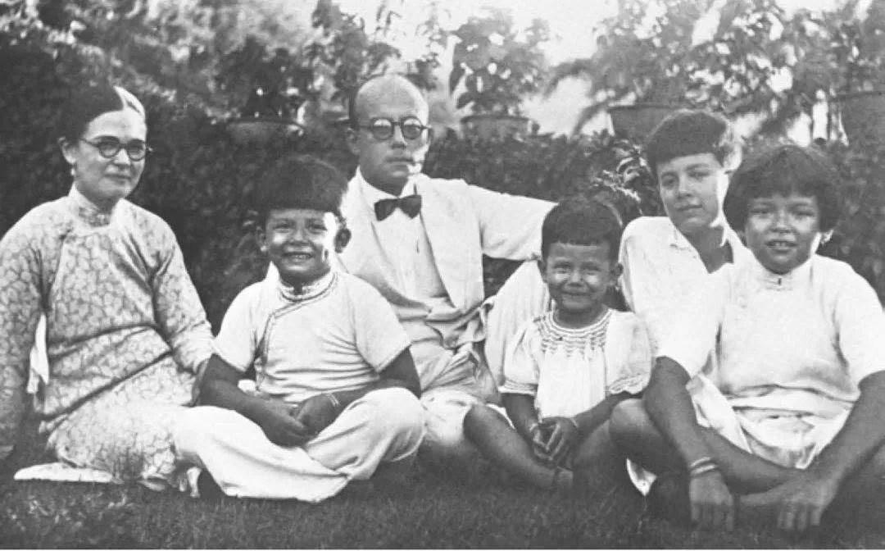

Gia đình La Văn Cẩm × Hà Cẩm Tư. Từ trái sang phải: Hà Cẩm Tư, La Bội Kiên, La Văn Cẩm, La Bội Hiền, La Đức Thừa, La Bội Nghiêu.
Trong số các con của La Văn Cẩm × Hà Cẩm Tư, La Đức Thừa nổi tiếng nhất — tốt nghiệp Đại học Oxford, là luật sư danh tiếng, được gọi là “Đại La”. La Đức Thừa từng ra tranh cử Trưởng Đặc khu Hành chính Hong Kong nhiệm kỳ đầu tiên, nhưng không thành công.
La Văn Cẩm sống rất điều độ — sáng dậy lúc 7 giờ rưỡi, tối ngủ 10 giờ rưỡi. Nếu buổi tối có tiệc, Hà Cẩm Tư sẽ ở nhà đan áo len chờ chồng, thậm chí còn đan cả áo cho búp bê của các con. Khi rảnh rỗi, La Văn Cẩm thích đọc tiểu thuyết trinh thám. Cả hai vợ chồng đều không thích giao du xã hội.
Trong số các con của La Văn Cẩm × Hà Cẩm Tư, La Đức Thừa nổi tiếng nhất — tốt nghiệp Đại học Oxford, là luật sư danh tiếng, được gọi là “Đại La”. La Đức Thừa từng ra tranh cử Trưởng Đặc khu Hành chính Hong Kong nhiệm kỳ đầu tiên, nhưng không thành công.
La Đức Thừa có quan hệ thân thiết với giới văn nghệ sĩ. Trong bức ảnh nổi tiếng chụp lễ đính hôn đêm Giao thừa năm 1989 giữa Lâm Yến Ni và Hoàng Triêm, người đứng cạnh Lý Gia Hân chính là La Đức Thừa.
6 người trong ảnh này, nay chỉ còn Nghê Chấn và Lý Gia Hân còn sống, 4 người còn lại đã qua đời.
Ngày 11 tháng 12 năm 2006, La Đức Thừa qua đời tại Bệnh viện Mary, Hong Kong, hưởng thọ 71 tuổi. Biển số xe “18” mà La Đức Thừa thừa hưởng từ cha mình (La Văn Cẩm) được trả lại cho chính phủ Hong Kong. Đến
năm 2008, biển số “18” (đọc lái là “thật phát”) được doanh nhân điện tử Trương Trình Quang mua lại với giá kỷ lục 16,5 triệu HKD, trở thành một trong những biển số đắt nhất trong lịch sử Hong Kong.
Sau này, khi mẹ của Hà Cẩm Tư — Trương Tĩnh Dung — qua đời, các con của Hà Cẩm Tư cũng đã trưởng thành, thì người phụ nữ ấy, khi tuổi đã xế chiều, lại dần quay trở về nhà họ Hà, tiếp tục đảm nhiệm vai trò quản gia như thuở trước.
Hà Cẩm Tư còn tiếp quản hai ngôi trường do mẹ để lại — Trường Tiểu học Bảo Giác và Trung học Bảo Giác. Hà Cẩm Tư dành trọn đời mình để phát triển sự nghiệp giáo dục nữ sinh, và trở thành nữ Thân sĩ Hoà bình đầu tiên của Hong Kong.
Cả đời Hà Cẩm Tư, có thể nói, vừa may mắn vừa trọn nghĩa. Sinh ra trong một gia đình quyền quý, được hưởng những điều kiện mà phần lớn phụ nữ cùng thời không thể có — được học hành, được mở mang tri thức, được sống không phải lo toan cơm áo.
Thế nhưng, tông màu chủ đạo của cuộc đời Hà Cẩm Tư vẫn luôn gói gọn trong hai chữ: “cống hiến” và “hi sinh”.
Là người phụ nữ sống trong xã hội do nam giới chi phối, Hà Cẩm Tư đã làm tròn vai trò của mình — dành cả đời để phụ giúp cha, nâng đỡ chồng, nuôi dạy con.
Người ta vẫn không khỏi tưởng tượng: Nếu cô gái xuất thân cao quý, được giáo dục tốt, lại thông minh như Hà Cẩm Tư sinh ra trong thời hiện đại, có lẽ cuộc đời ấy đã tự do và rực rỡ hơn nhiều.
Hà Thế Lễ - người con được Hà Đông yêu thương nhất
Nếu nói cuộc đời của Hà Cẩm Tư có thể được khái quát bằng hai chữ “hi sinh”, thì qua Hà Thế Lễ, ta sẽ thấy rõ sự khác biệt giữa làm con gái và làm con trai trong một gia tộc như họ Hà.
Là người con trai được cưng chiều nhất nhà, Hà Thế Lễ nhận được từ người cha — Hà Đông — gần như mọi sự kỳ vọng và lo toan.

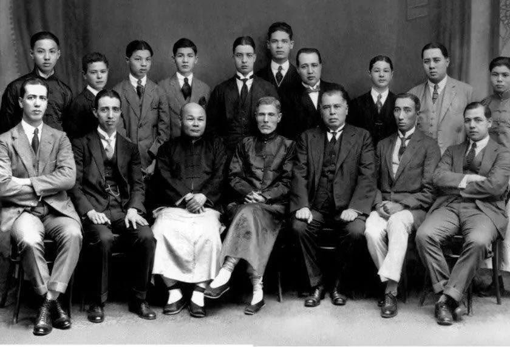

Trong hình, Hà Đông ngồi giữa hàng dưới. Bên phải của Hà Đông là em trai ông, Hà Phúc, cũng là ông nội của Hà Hồng Sân. Bên trái Hà Đông là Hà Cam Đường, còn xung quanh là các con cháu trong gia tộc. Hà Thế Lễ đứng hàng sau, thứ hai từ trái sang.
Hà Đông vì đứa con trai này mà bận lòng, tính toán và chăm chút đến mức cạn kiệt tâm sức.
Năm Hà Thế Lễ chào đời cũng chính là năm rực rỡ nhất trong cuộc đời của Hà Đông. Bởi năm đó, ông dẫn theo cả gia đình chuyển lên sống tại biệt thự trên đỉnh núi ở Hong Kong.
Đây không chỉ đơn thuần là một sự kiện dọn nhà của họ Hà, mà còn là cột mốc mang tính lịch sử đối với toàn bộ cộng đồng người Hoa.
Trước thời điểm ấy, Hong Kong từng có một đạo luật mang tên “Quy định về khu dân cư dành riêng tại khu vực đỉnh núi” (Ordinance for the Reservation of a Residential Area in the Hill District), trong đó nghiêm cấm người Hoa sinh sống tại khu vực có không khí trong lành và phong cảnh đẹp trên đỉnh núi — nơi ấy chỉ dành riêng cho người châu Âu.
Vì vậy, vào đầu năm 1906, khi tin tức Hà Đông mua lại một biệt thự trên đỉnh núi từ tay người châu Âu lan ra, toàn bộ xã hội Hong Kong đều chấn động.
Cũng trong năm ấy, tháng 5, Hà Thế Lễ cất tiếng khóc chào đời. Mẹ của ông, Trương Tĩnh Dung, đã viết trong “Danh sơn du ký” với niềm phấn khởi:
“Năm Quang Tự thứ ba mươi hai, tháng tư, lại sinh được con trai Thế Lễ. Khi ấy, ngôi nhà trên đỉnh núi vừa mới mua xong, tu sửa hoàn tất. Phu quân (Hà Đông) chọn ngày lành dọn đến ở, cũng chính là ngày lễ đầy tháng của con trai Lễ.”
Hà Thế Lễ là một bé trai khỏe mạnh, được Hà Đông xem như con trai trưởng thực sự của mình, vì vậy từ nhỏ đã được cưng chiều hết mực.
Hà Đông chọn đúng ngày đầy tháng của Hà Thế Lễ để dọn về nhà mới — một quyết định mang ý nghĩa vô cùng sâu xa.

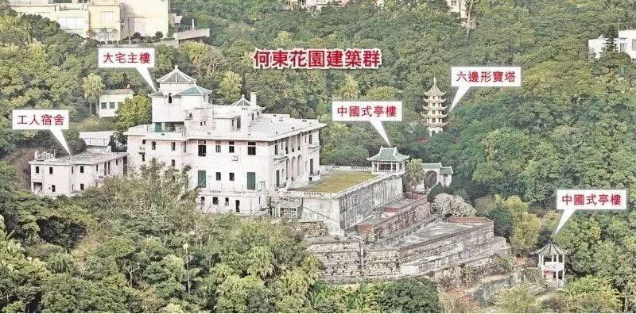

Biệt thự trên đỉnh núi của gia đình Hà Đông.
Theo truyền thống của giới thượng lưu Anh, Hà Đông còn đặt cho con trai cái tên tiếng Anh là “Robert Ho Tung Junior”, trong đó “Robert Ho Tung” chính là tên tiếng Anh của ông. Điều đó thể hiện rằng Hà Thế Lễ được xem là người thừa kế chính thống của dòng họ Hà.
Năm 1916, Hà Thế Lễ bắt đầu đi học tiểu học, trước tiên theo học Trường nữ sinh Diocesan vài năm, sau đó chuyển sang Trường Trung ương - nơi Hà Đông từng theo học.
Trong hồ sơ lưu trữ của Trường Trung ương, vẫn còn ghi lại những chi tiết về cậu thiếu niên Hà Thế Lễ: một chàng trai tươi sáng, thẳng thắn và rất điển trai.
Trong báo trường thời đó còn đăng một mẩu chuyện cười nhỏ về Hà Thế Lễ như sau:
“Tại sao Robert Ho Tung Junior (Hà Thế Lễ) chẳng bao giờ cần dùng quạt điện? Vì anh ấy lúc nào cũng thấy ‘rất lạnh’ — ‘ho tung’ (好冻)!”
(Chữ “Ho Tung” trong tiếng Quảng Đông phát âm gần giống “好冻” nghĩa là “rất lạnh”, nên được đem ra trêu đùa.)
Ngoài ra, Hà Thế Lễ còn là đội trưởng đội quần vợt của trường, đủ cho thấy cậu là một nam sinh rất được yêu mến và nổi tiếng.
Một chàng trai sinh ra đã ngậm thìa vàng, vừa đẹp trai, vóc dáng chuẩn, lại được giáo dục bài bản, xuất thân danh giá, và được cả nhà yêu thương hết mực — có thể nói Hà Thế Lễ là hình mẫu hoàn hảo, con đường tương lai dường như đã được trải sẵn bằng ánh vàng rực rỡ.
Thế nhưng, đời không có gì là tuyệt đối “hoàn mỹ”. Ở nơi mọi điều đều tốt đẹp, Hà Thế Lễ lại mang trong mình một nét bướng bỉnh đặc trưng — cậu không muốn tuân theo sắp đặt của gia đình để nối nghiệp kinh doanh, mà nhất quyết muốn đi… nhập ngũ.
Về sau, khi đã ở tuổi xế chiều, Hà Thế Lễ từng chia sẻ trong một cuộc phỏng vấn:
“Tôi từ nhỏ đã có chí hướng theo con đường quân ngũ. Mẹ tôi rất lo lắng, sợ tôi gặp nguy hiểm nên cực lực phản đối. Vì chuyện đó mà bà giận tôi suốt một thời gian dài. Tôi cũng không trách mẹ — câu ‘Con trai ngoan không làm lính’ khi ấy là quan niệm ăn sâu trong đầu của người xưa.”
Nhà họ Hà trước nay chưa từng có ai theo con đường quân ngũ, nên quyết định của Hà Thế Lễ đã thay đổi hoàn toàn số phận cuộc đời cậu.
Có lẽ chính Hà Thế Lễ cũng không ngờ rằng, lựa chọn đầy nhiệt huyết năm ấy lại khiến mình bị cuốn vào dòng chảy dữ dội nhất của lịch sử cận đại Trung Quốc.
Nhờ mối quan hệ thân thiết giữa Hà Đông và Trương Tác Lâm, để ủng hộ con trai theo đuổi giấc mơ quân nhân, Hà Đông đã nhờ Trương Tác Lâm tiến cử và giới thiệu, giúp Hà Thế Lễ lần lượt sang Pháp và Anh học khoa học quân sự hiện đại.
Dù đã thực hiện được ước mơ trở thành quân nhân, Hà Thế Lễ lại rất phản cảm với người nước ngoài — có lẽ vì từ nhỏ đã chứng kiến sự khinh miệt và xa lánh mà người Tây dành cho con lai.
Khi khóa huấn luyện quân sự ở Anh kết thúc, mọi học viên đều mặc quân phục Anh, chỉ riêng Hà Thế Lễ mặc quân phục Trung Quốc.
Hành động khác người ấy thể hiện rõ tính cách bốc đồng, cứng cỏi và kiên quyết của tuổi trẻ, một chàng trai ngang tàng, không sợ hậu quả.
Thế nên, thời trẻ Hà Thế Lễ thường khiến cha mình phải đau đầu không ít.
Lúc bấy giờ, Hà Đông đã là một trong những người giàu có bậc nhất Hong Kong, địa vị vô cùng đặc biệt — vừa am hiểu Đông Tây, lại có quan hệ sâu rộng trong cả giới chính trị, quân sự và thương nghiệp.
Bởi vậy, mọi hành động của Hà Đông đều phải thận trọng, đúng mực, trong khi con trai lại thường xuyên hành xử bốc đồng, khiến ông nhiều lần phải đứng ra dọn dẹp hậu quả.

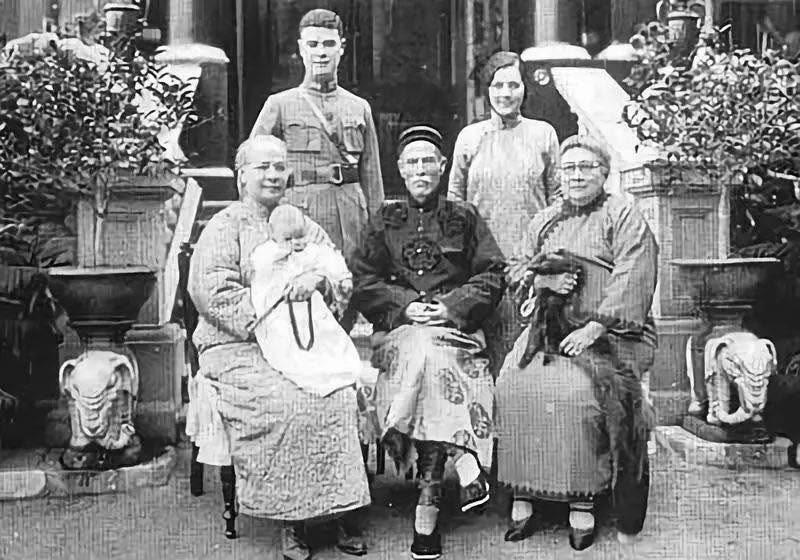

Ảnh chụp Hà Thế Lễ (đứng bên trái) và vợ Hồng Kỳ Phân (đứng bên phải). 3 người đang ngồi từ trái sang phải là Trương Tĩnh Dung, Hà Đông, Mạch Tú Anh.
Ví dụ rõ nhất là khi Hà Thế Lễ tổ chức đám cưới, báo Công Thương Nhật Báo ngày 7 tháng 6 năm 1928 đã mô tả:
“Nhà họ Hà dựng một giàn hoa lớn trong vườn, trước cổng còn xây cả cổng chào, treo cao quốc kỳ của Anh và Trung Quốc, bày biện chậu cảnh, hoa tươi, trang trí vô cùng lộng lẫy.”
Việc “treo cờ Trung – Anh song song” là thông điệp thiện chí mà Hà Đông cố tình gửi tới phía Anh, nhằm giữ thế cân bằng và thể hiện thái độ ôn hòa.
Trong bức thư Hà Đông gửi cho con trai nhân dịp này, lời lẽ vừa thấu tình vừa thấu lý, cho thấy ông quả thực là một người cha mẫu mực, biết cách dạy con bằng lý trí lẫn tình cảm.
“Cha hy vọng con có thể nhìn nhận mọi việc từ một góc nhìn rộng hơn, bao dung hơn với chính quyền Anh, và hãy thấu hiểu hành động của họ bằng sự cảm thông, chứ không phải bằng thái độ thù địch.”
“Cha mong rằng, một ngày nào đó, con không chỉ có thể cống hiến cho Trung Quốc, mà còn có thể gián tiếp phục vụ cho nước Anh, để chứng minh rằng con không phải là người vong ân bội nghĩa.”
“Chúng ta phải biết đặt mình vào vị trí của người khác, nhìn sự việc từ nhiều góc độ. Cha mong con đừng vì thế mà thất vọng hay phiền lòng, bởi sự vấp ngã và thất bại thường là mẹ của tiến bộ trong tư tưởng và hành động. Hãy để người đời sau thấy con là một người khoáng đạt, chính trực, vô tư, không nuôi lòng thù hận với nước Anh — như vậy, tên tuổi của con sẽ càng thêm trong sáng và được tôn trọng hơn.”
Sau khi hoàn thành việc học ở Anh và Pháp, Hà Thế Lễ trở về Trung Quốc để tìm một vị trí trong quân ngũ. Hà Đông suy tính kỹ lưỡng, cuối cùng chọn gửi gắm con trai vào quân đội Đông Bắc của Trương Học Lương.
Một mặt, nhờ mối giao tình thân thiết giữa Hà Đông và Trương Tác Lâm, mặt khác, Trương Học Lương khi ấy đã nổi danh là “Thiếu soái”, còn quân đội Đông Bắc thì thanh thế lừng lẫy, nên Hà Đông muốn con trai đi theo một vị lãnh đạo trẻ, có tiền đồ xán lạn, để sau này có thể thăng tiến thuận lợi.
Vẫn là người cha đích thân ra mặt, Hà Đông viết một bức thư xin việc đầy chân thành gửi cho Trương Học Lương. Sau khi đọc xong, Trương Học Lương chỉ phê một dòng ngắn gọn nhưng dứt khoát: “Mời cậu ấy tới ngay.”
Trong thư, Hà Đông viết:
“Năm ngoái tôi du ngoạn Liêu Thẩm, gặp được ngài, vô cùng cảm kích trước sự tiếp đãi long trọng… Nay con trai thứ của tôi, Thế Lễ, sau khi tốt nghiệp Học viện Lục quân Anh quốc, lại sang Pháp nghiên cứu sâu về pháo binh. Nay đã mãn khóa trở về Hương Cảng. Thế Lễ vốn trung thành, ngay thẳng, từ lâu đã mong được vì nước cống hiến.”
“Trước đây con trai tôi may mắn được lệnh tiên soái (Trương Tác Lâm) cất nhắc dìu dắt, vẫn luôn ghi lòng tạc dạ, mong có ngày được đền đáp. Nay việc học đã tạm thành, dự định sẽ đem chút sở trường nhỏ bé ra phục vụ nơi tiền tuyến. Tuy nhiên, nghĩ đến ngài mưu trí như mây, sáng suốt như mưa, mà con trai tôi kiến thức nông cạn, thật không biết liệu có may mắn được phụng sự dưới trướng hay không… Nếu được ngài thương tình thu nhận, xin vui lòng điện báo, tôi sẽ lập tức cho Thế Lễ đến yết kiến và nghe lệnh chỉ huy.”
(Trích từ tài liệu của Phủ tỉnh trưởng Phụng Thiên, hồ sơ số JC10/14128.)
Và thế là, cậu công tử nhà giàu Hong Kong — Hà Thế Lễ, bỗng chốc bước vào vùng đất phương Bắc mênh mông phủ đầy tuyết trắng.
Nhưng khi đến Đông Bắc, Hà Thế Lễ lập tức cảm thấy vô cùng khó chịu. Cậu không được giao trọng trách gì lớn, chức vụ ban đầu chỉ là “Phó tùy tùng của văn phòng Đại soái, hàm Thượng úy thuộc Bộ Tư lệnh Biên phòng Đông Bắc” — nói nôm na thì chính là “người canh cổng trong phủ của Đại soái”.
Hơn nữa, với vẻ ngoài lai Tây, vốn tiếng Trung chưa thật sự lưu loát, lại có học vấn cao, Hà Thế Lễ hoàn toàn khác biệt với phần lớn binh sĩ Đông Bắc quân — những người xuất thân dân dã, thô mộc, quen kỷ luật kiểu nhà binh. Vì thế, những ngày đầu ở Đông Bắc, cậu đã cảm thấy vô cùng lạc lõng và chán nản.

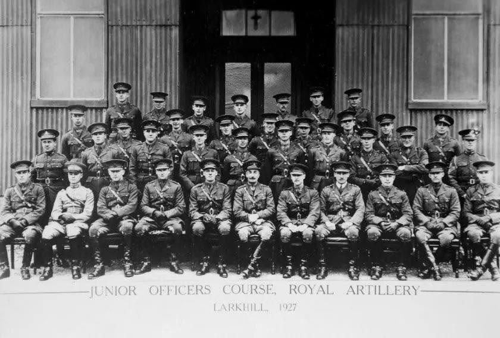

Khi khóa huấn luyện quân sự ở Anh kết thúc, mọi học viên đều mặc quân phục Anh, chỉ riêng Hà Thế Lễ mặc quân phục Trung Quốc.
Cuộc sống cũng đầy khó khăn.
Ăn kê, ngủ giường đất — Hà Thế Lễ vẫn còn chịu được, nhưng đi vệ sinh giữa trời tuyết giá thì là cực hình. Ở Đông Bắc không có bồn cầu xả nước mà chỉ có hố đất, nhưng Hà Thế Lễ lại không quen ngồi xổm, không biết khụy gối, nên mỗi lần đi vệ sinh đều trở thành vấn đề nan giải nhất trong ngày.
Dẫu vậy, thời gian ở Đông Bắc vẫn là quãng đời đặc biệt nhất của Hà Thế Lễ.
Đến tận khi về già, Hà Thế Lễ vẫn thường mơ thấy mình quay lại nơi ấy.

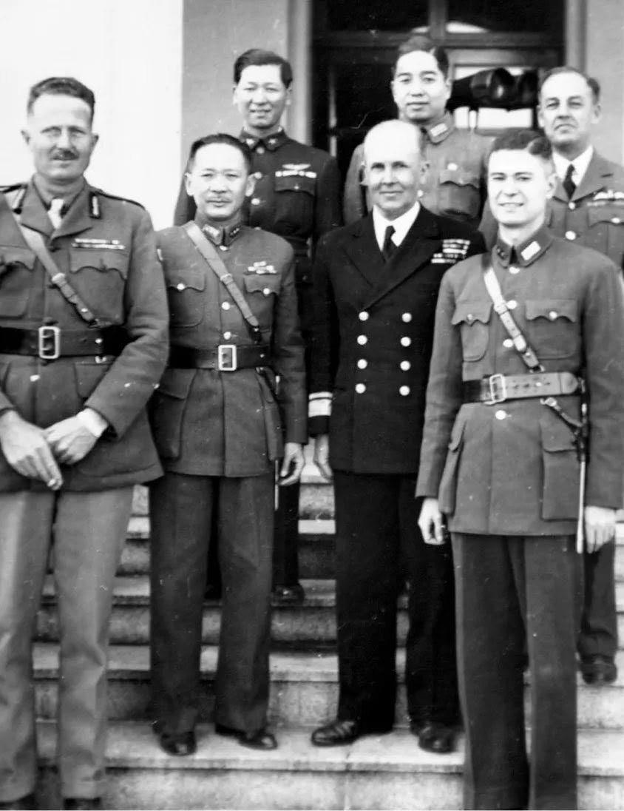

Hà Thế Lễ (ngoài cùng bên phải) và Trương Học Lương (thứ hai từ trái sang).
Một phần lớn nguyên nhân là vì tình bạn sâu đậm với Thiếu soái Trương Học Lương — người mà Hà Thế Lễ có nhiều cơ hội tiếp xúc và cuối cùng trở thành bạn thân trọn đời của vị tướng huyền thoại này.
Tuy trong quân đội Hà Thế Lễ không có nhiều cơ hội để thể hiện tài năng nhưng lại là một người vô cùng may mắn — mỗi lần gặp biến cố đều thoát hiểm kỳ diệu.
Khi xảy ra sự kiện 18 tháng 9 (1931), quân đội Đông Bắc liên tiếp thất thủ, tan rã, nhưng Hà Thế Lễ đang ở Bắc Bình (Bắc Kinh) nên thoát nạn.
Khi ấy một tin đồn tai tiếng lan truyền khắp nơi: “Đêm 18/9, Trương Học Lương đang ở Bắc Kinh khiêu vũ với minh tinh Hồ Điệp, say mê hoa rượu, quên cả an nguy quê nhà ở Đông Bắc.”
Trước làn sóng dư luận ấy, Hà Thế Lễ đã đứng ra đính chính, tuyên bố rằng đêm hôm đó cậu cùng Trương Học Lương đang ở Bắc Bình bàn về một số dự án tài chính trọng đại, chứ không hề ăn chơi sa đọa như lời đồn.
Sau biến cố Tây An (1936) gây chấn động trong ngoài nước, vận mệnh của Trương Học Lương thay đổi đột ngột — bị Tưởng Giới Thạch bắt giam và quản thúc suốt đời, đồng thời ra lệnh thanh trừng toàn bộ thân tín và tùy tùng của Thiếu soái.
Nhưng khi ấy, Hà Thế Lễ chưa đạt đến cấp bậc đoàn trưởng, nên không nằm trong danh sách bị xử lý, và nhờ vậy một lần nữa thoát nạn.
Điều kỳ lạ hơn cả là — dù từng là thuộc hạ cũ của Trương Học Lương, Hà Thế Lễ sau này lại giành được sự tin tưởng của chính phủ Tưởng Giới Thạch, và được bổ nhiệm giữ nhiều chức vụ quan trọng.
Tất nhiên, điều này không thể tách rời khỏi nỗ lực của người cha — Hà Đông, người đã tận tâm lo toan cho con trai.
Trong hồi ký của Hà Ngải Linh có ghi lại việc Hà Đông từng đến gặp Tưởng Giới Thạch:
“Khi cha đến Nam Kinh thăm viếng, Chủ tịch Tưởng Giới Thạch — lúc ấy vừa dần hồi phục sau vết thương ở lưng trong ‘Sự kiện Tây An’ — đã mời cha đến tư dinh ở Nam Kinh gặp mặt. Anh Thế Kiệm và tôi cùng đi theo cha, vừa từ Thượng Hải đến để hội ngộ. Tôi vẫn còn nhớ đôi ‘mắt sắc lạnh như dao’ của ông ấy.”
“Vì vừa mới khỏi bệnh, nên khi gặp, ông Tưởng ngồi trên một chiếc ghế bành ở phòng khách ngay ngoài phòng ngủ; cha tôi ngồi đối diện trên một chiếc ghế bành khác, còn anh Thế Kiệm và tôi thì ngồi trên ghế tựa lưng thẳng bên cạnh cha. Tôi vẫn nhớ rõ, khi ấy phu nhân Tống Mỹ Linh không có mặt.”
Không chỉ đích thân đến gặp, Hà Đông còn hào phóng quyên góp một khoản tiền khổng lồ.
Mẹ của Hà Thế Lễ, Trương Tĩnh Dung, cũng hưởng ứng lời kêu gọi của Tống Mỹ Linh, gia nhập “Hội Phụ nữ Trung Quốc”, tích cực quyên góp, vận động và đóng góp rất nhiều công sức.
“Trong thời gian cha đến Nam Kinh và cả sau đó, ông đã thực hiện nhiều khoản quyên tặng lớn liên quan đến tình hình Trung Quốc. Ví dụ, phu nhân Tưởng Giới Thạch (Tống Mỹ Linh) sáng lập một cô nhi viện chuyên chăm sóc con cái của những binh sĩ tử trận, cha đã quyên góp một số tiền rất lớn cho cơ sở này. Đồng thời, ông còn ủng hộ thêm 10,000 đô la Hong Kong cho quỹ cứu trợ nạn đói tại Tứ Xuyên, Vân Nam và Giang Tô.”
Nhờ những nỗ lực và quan hệ đó, Hà Đông đã giữ được đường lui cho con trai, giúp Hà Thế Lễ thoát khỏi nghi kỵ, dần lấy lại được lòng tin của Tưởng Giới Thạch, và từ đó từng bước quay lại con đường thăng tiến, trở thành quan chức cao cấp trong chính quyền.

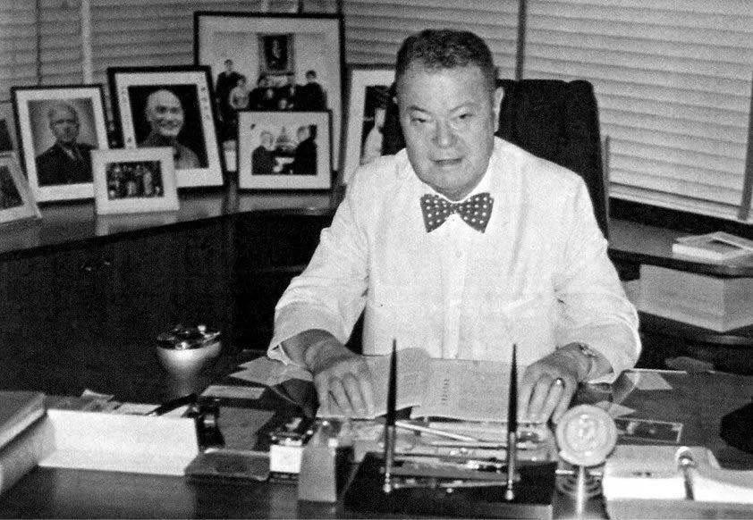

Chức vụ cuối cùng của Hà Thế Lễ trong giới chính trị là Trưởng đoàn đại diện quân sự của Đài Loan tại Liên Hiệp Quốc.
Thú vị là khi còn trẻ, Hà Thế Lễ từng day dứt vì thân phận “con lai” của mình, cảm thấy đó là điều khiến bản thân bị xem thường. Thế nhưng, đến khi về già, chính thân phận lai ấy lại trở thành lợi thế lớn nhất, giúp Hà Thế Lễ có thể tự nhiên giao tiếp và làm việc với cả phương Đông lẫn phương Tây, trở thành một cầu nối tự nhiên giữa hai thế giới, đóng vai trò quan trọng trong việc kết nối, hiểu biết và hợp tác giữa Đông và Tây.
Đến năm 1962, Hà Thế Lễ từ chức, rời khỏi toàn bộ các chức vụ trong chính quyền, và tiếp quản tờ Công Thương Nhật Báo do cha mình sáng lập, chính thức bước vào con đường kinh doanh.
Hà Thế Lễ suốt đời giữ thói quen rèn luyện thể thao, và cũng thể hiện phong cách kỷ luật, nghiêm ngặt như trong quân đội khi quản lý doanh nghiệp.
Tuy nhiên, đã dành cả đời làm một người lính, Hà Thế Lễ rõ ràng không thật sự thích hợp với thương trường.
Cùng với sự thay đổi của thời đại, một thế hệ doanh nhân mới đầy tham vọng như Lý Gia Thành, Hoắc Anh Đông, Quách Đắc Thắng, Trịnh Dụ Đồng… lần lượt trỗi dậy, nắm quyền chi phối nền kinh tế Hong Kong.
Trước làn sóng đó, tờ Công Thương Nhật Báo do Hà Thế Lễ điều hành cuối cùng buộc phải ngừng xuất bản, và cuộc đời của Hà Thế Lễ cũng dần khép lại trong lặng lẽ, khi sự nghiệp không còn rực rỡ như xưa.
Điều xúc động nhất là Hà Thế Lễ suốt đời vẫn giữ liên lạc với cấp trên cũ của mình, Trương Học Lương.
Khi Trương Học Lương bị quản thúc ở Đài Loan, Hà Thế Lễ là người duy nhất được phép đến thăm. Hai người thường ngồi trò chuyện về những năm tháng cũ, tình cảm vô cùng sâu đậm.
Theo hồ sơ lưu trữ, “sự xuất hiện của Hà Thế Lễ luôn là niềm vui lớn nhất của Trương Học Lương”, thậm chí Trương Học Lương còn chủ động đề nghị xóa bỏ mối quan hệ chủ – tướng năm xưa, nói rằng:
“Không được gọi tôi là ‘tư lệnh’ nữa, hãy gọi tôi là ‘đại ca’.”
Năm 1990, nhân dịp Trương Học Lương tròn 90 tuổi, Hà Thế Lễ đã tổ chức tiệc mừng thọ linh đình tại Khách sạn Viên Sơn ở Đài Loan, khiến Trương Học Lương vô cùng xúc động.
Đến năm 1995, Trương Học Lương cuối cùng được phép rời Đài Loan, sang Hawaii (Hoa Kỳ) sinh sống.
Năm 1996, khi Trương Học Lương tròn 96 tuổi, Hà Thế Lễ lại đích thân bay sang Mỹ để chúc thọ đại ca của mình.
Cả hai người luôn mang trong lòng nỗi nhớ về vùng đất Đông Bắc năm xưa.
Năm 1995, Hà Thế Lễ quyên góp một khoản tiền lớn để xây dựng một tòa giảng đường tại Đại học Đông Bắc.
Đến năm 1998, khi tòa nhà chính thức khánh thành, Hà Thế Lễ đã là một cụ già tuổi xế chiều nhưng vẫn kiên quyết trở lại Đông Bắc, đặt chân lên mảnh đất kỷ niệm của đời mình một lần nữa.
Chuyến đi Đông Bắc lần ấy, chẳng ngờ lại trở thành hồi ức cuối cùng trong cuộc đời của Hà Thế Lễ. Sau vài ngày ở lại Đông Bắc, Hà Thế Lễ trở về Hong Kong, và ra đi thanh thản ở tuổi 92 một tháng rưỡi sau đó.
Khi tin Hà Thế Lễ qua đời truyền đến bên kia Thái Bình Dương, Trương Học Lương đau buồn tột độ.
Theo Liên Hợp Báo đưa tin: “Thời gian gần đây, tâm trạng của Trương Học Lương rõ ràng u sầu hơn hẳn những năm trước. Nguyên nhân chủ yếu là do người bạn lâu năm, Hà Thế Lễ, đã qua đời. Trương Học Lương buồn đến mức không còn hứng thú chơi bài như thường lệ. Dù Hà Thế Lễ mất đã lâu, nhưng Trương Học Lương vẫn không thể nguôi ngoai, thậm chí nhiều lần rơi nước mắt.”
3 năm sau, Trương Học Lương cũng qua đời tại Hoa Kỳ, hưởng thọ 101 tuổi.
Hai con người ấy — một đến từ Hong Kong, một sinh ra ở Đông Bắc — lại vì những xoay vần của định mệnh mà gặp gỡ, kết giao, rồi cùng chứng kiến những biến động dữ dội của lịch sử Trung Hoa. Tình bạn giữa họ, tuy chỉ là một chú thích nhỏ trong kho tàng sử đồ sộ, dễ dàng bị thời gian che khuất, nhưng lại vô cùng chân thành và lay động lòng người.
Đó chính là câu chuyện cuộc đời của Hà Thế Lễ, con trai của Hà Đông. Sinh ra trong một gia đình thượng lưu, có được những đặc quyền mà người khác không thể sánh, nhưng cũng trải qua một cuộc đời nhiều khúc quanh, vừa thăng hoa vừa sóng gió.
Có lẽ, đó cũng là định mệnh chung của những nhân vật lịch sử, bởi số phận của một con người — dù rực rỡ đến đâu cũng vẫn chỉ là một phần vạn trong cơn biến chuyển khôn lường của thời đại.
Nhìn tổng thể, Hà Đông giống như một con thuyền khổng lồ, bằng sức mạnh và tài năng của mình, ông đã nâng đỡ toàn bộ cuộc đời của các con.
Quan sát thế hệ con cái của ông, ai nấy đều được hưởng nền giáo dục bậc cao, lại kết hôn với những gia đình môn đăng hộ đối, và giữ được cuộc sống sang trọng, đĩnh đạc suốt đời.

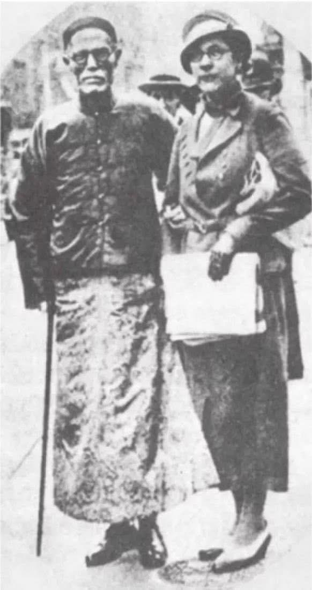

Hà Đông và con gái Hà Ngải Linh.
Chẳng hạn như Hà Ngải Linh, người từ nhỏ đã được trong nhà gọi đùa là “nhà học giả” — cô sinh ra tại Nagasaki, Nhật Bản, tên khai sinh là Hà Kỳ Tư. Từ bé đã say mê đọc sách, học rộng hiểu nhiều, sau này đỗ Tiến sĩ Triết học tại Đại học Luân Đôn.

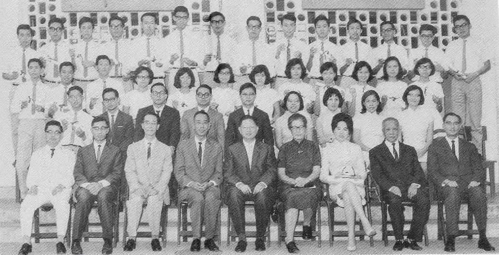

Hà Ngải Linh (người phụ nữ đeo kính ở hàng đầu) luôn được kính trọng như một hiệu trưởng mẫu mực.

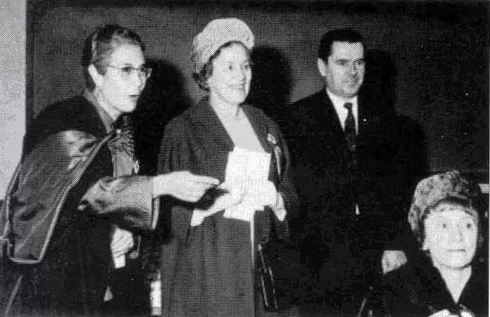

Hà Ngải Linh (ngoài cùng bên trái).
Cả đời Hà Ngải Linh cống hiến cho sự nghiệp giáo dục, từng làm việc trong ngành giáo dục, sáng lập Trường Trung học Khổng giáo Đại Thành, và có những đóng góp xuất sắc — được xem là một trong 20 phụ nữ tiêu biểu đại diện cho Hong Kong.

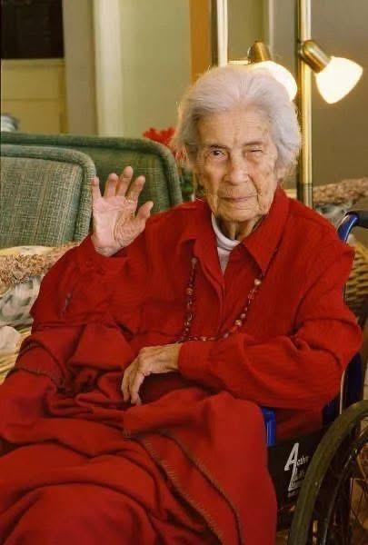

Hà Ngải Linh về già.
Hà Ngải Linh cũng là người con gái duy nhất của họ Hà không kết hôn với gia tộc lai Âu, mà lấy chồng là Trịnh Tương Tiên — chắt ngoại của Lâm Tắc Từ.
Sau khi quân Nhật chiếm Hong Kong, Trịnh Tương Tiên mắc bệnh thận nhưng không thể chữa trị, cuối cùng qua đời. Từ đó, Hà Ngải Linh một mình nuôi con gái, và không bao giờ tái giá.
Những người vợ và con rể của Hà Đông

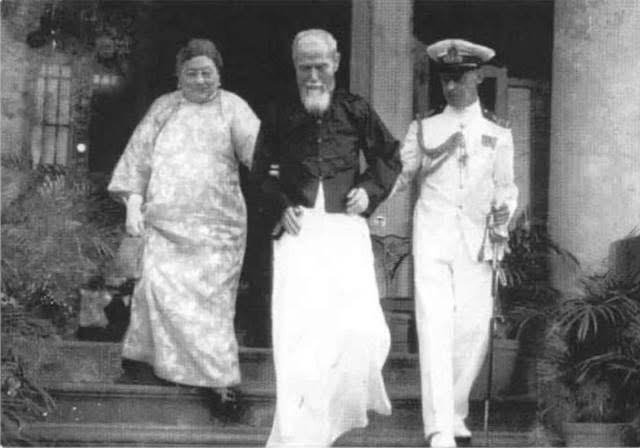

Hà Thế Lễ được xem như “con trai trưởng” của Hà Đông, cũng là người con được ông đặc biệt yêu thương và dốc lòng bồi dưỡng.
Ngọn nguồn của chuyện này là do người con trai trưởng của Hà Đông (do bình thê Trương Tĩnh Dung sinh hạ) yểu mệnh mất sớm, lại phải giao người con trai thứ hai cho chính thất phu nhân Mạch Tú Anh (cũng là chị họ của Trương Tĩnh Dung) nuôi dưỡng, mẹ con xa cách, không thể sống cùng nhau.
Giữa Mạch Tú Anh và Trương Tĩnh Dung, tuy bề ngoài địa vị ngang nhau, nhưng dưới mặt hồ yên tĩnh là những cơn sóng ngầm không ngừng dâng lên. Trong đại gia tộc họ Hà, không điều gì có thể thật sự công bằng tuyệt đối, và thứ bậc giữa hai người phụ nữ này luôn là vấn đề nhạy cảm, khó nói thành lời.
Ví dụ, con cái trong nhà đều phải kính trọng gọi cả hai người là “mẹ”, nhưng cách gọi lại khác nhau: họ gọi Trương Tĩnh Dung là “mama”, còn Mạch Tú Anh là “mother”.
Trong các dịp xuất hiện bên cạnh Hà Đông, cả hai đều được xem là vợ chính danh. Tuy nhiên, khi tiếp xúc với người phương Tây thì người đi cùng thường là Mạch Tú Anh; còn khi đối diện với người Trung Hoa, người xuất hiện bên cạnh ông lại là Trương Tĩnh Dung.
Hà Đông (giữa) và Mạch Tú Anh (trái).
Trong các tờ báo của Anh lúc bấy giờ, người ta cũng thường nhầm lẫn giữa hai người vợ của Hà Đông. Họ hay gọi Mạch Tú Anh là Lady Ho Tung, “phu nhân của Hà Đông”; còn Trương Tĩnh Dung lại bị ghi là Miss Clara Ho Tung, thậm chí bị hiểu lầm là con gái của ông.
Sự nhầm lẫn này một phần đến từ chênh lệch tuổi tác (Trương Tĩnh Dung trẻ hơn), nhưng không thể phủ nhận rằng phong thái, cách cư xử và mức độ thể hiện quyền uy của hai người phụ nữ cũng rất khác nhau.
Ngay cả Hà Đông cũng không thể thật sự duy trì sự cân bằng tuyệt đối giữa hai người vợ. Điều duy nhất ông có thể làm là dùng tiền để thể hiện sự công bằng. Tháng 12 năm 1931, khi ông bước sang tuổi 70, để cảm tạ hai người vợ đã cùng ông trải qua bao năm tháng, Hà Đông quyết định tặng cho mỗi người 100,000 đồng, tùy họ tự do sử dụng.
Hà Đông được xem như cao nhân trong việc giữ hòa khí gia đình, chuyện ông “dỗ vợ bằng đạo lý và tiền bạc” từng được xem là giai thoại nổi tiếng trong thành phố.
Tuy nhiên, số phận của hai người vợ về sau lại rẽ theo hai hướng hoàn toàn khác nhau.
Trước khi Hong Kong rơi vào tay phát xít Nhật, Trương Tĩnh Dung cùng Hà Đông sang Macau để tránh chiến loạn, còn Mạch Tú Anh thì ở lại Hong Kong để trông coi dinh thự và việc kinh doanh của gia đình.
Kết quả là khi Hong Kong thất thủ, Mạch Tú Anh rơi vào cảnh vô cùng khốn đốn. Toàn bộ tài sản và biệt thự của Hà Đông bị quân Nhật chiếm đoạt, bà cô độc không nơi nương tựa, căn bệnh u xơ tử cung lâu năm cũng không được chữa trị. Cuối cùng, Mạch Tú Anh qua đời giữa cơn đau đớn và loạn lạc chiến tranh.
Sau khi chiến tranh kết thúc, Hà Đông tổ chức cho bà một tang lễ trọng thể để tỏ lòng tưởng nhớ. Các tờ báo lớn khi đó đều tường thuật chi tiết nỗi đau mất vợ của người đàn ông đã ở tuổi 80: Hà Đông “đứng lặng bên linh cữu suốt lễ viếng”, tự mình cảm ơn từng người đến phúng điếu.
Tờ Công Thương Nhật Báo ngày 26 tháng 1 năm 1938 ghi lại: “Sắc mặt ông trầm uất, nước mắt già nua không ngừng rơi, bi thương khôn xiết, chẳng thể kìm nén nổi.”
Sau khi Hà Đông qua đời, ông chọn được an táng cùng Mạch Tú Anh tại nghĩa trang Hong Kong, còn bình thê Trương Tĩnh Dung thì được chôn cất một mình ở nghĩa trang Chiêu Viễn.

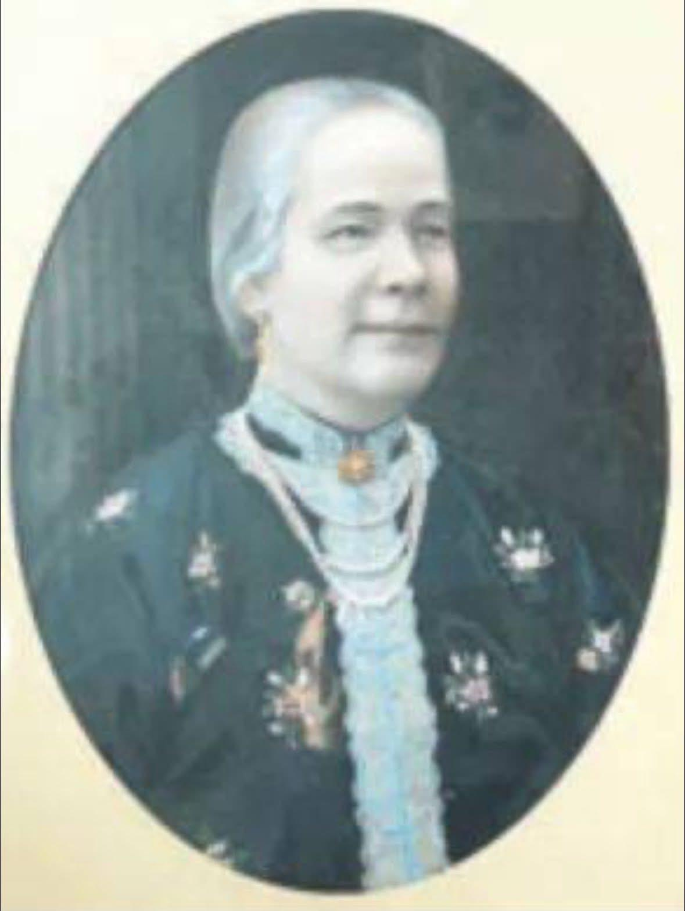

Trương Tĩnh Dung.
Cuộc đời của hai người vợ ấy hoàn toàn khác biệt, nhưng đều phủ lên một lớp buồn bi thương. Dù thế nào đi nữa, họ cũng không thể được gọi là hạnh phúc — bởi trong thời đại ấy, đối với phụ nữ, số phận vốn đã là một điều tàn nhẫn.
Hà Đông từng nạp một tiểu thiếp tên là Chu Ỷ Văn. Trong tư liệu lịch sử không hề lưu lại bức chân dung hay tấm ảnh nào của bà, các ghi chép về bà cũng rất ít, và hậu nhân gần như không nhắc đến. Nguyên nhân chủ yếu là vì Chu Ỷ Văn luôn đứng ngoài cuộc sống dòng chính của đại gia tộc họ Hà.
Sau khi được gả làm tiểu thiếp của Hà Đông, Chu Ỷ Văn không sinh được con trong suốt thời gian dài. Do xuất thân nghèo hèn, không có chỗ dựa, cũng có lẽ do chịu áp lực từ Mạch Tú Anh nên Hà Đông chẳng mấy để tâm đến bà. Mãi về sau, khi Hà Đông đã cưới Trương Tĩnh Dung làm bình thê và có nhiều con cái, Chu Ỷ Văn mới sinh được một cô con gái duy nhất tên Hà Thuần Tư. Nhưng chỉ có một người con gái, Chu Ỷ Văn rõ ràng không thể sánh được với chính thất và bình thê.
Cuối đời, Chu Ỷ Văn sống lặng lẽ một mình trong một căn hộ nhỏ, Hà Đông hiếm khi đến thăm. Vài năm sau, bà qua đời trong cô quạnh.
Cô con gái mà Chu Ỷ Văn để lại, Hà Thuần Tư, sau này kết hôn với Hoàng Tích Lâm (con trai của Hoàng Kim Phúc). Là một người phụ nữ nhỏ bé trong đại gia tộc, tin tức về Hà Thuần Tư dần dần phai nhạt theo thời gian. Tư liệu cho thấy Hà Thuần Tư có con, nhưng thông tin được giữ “riêng tư”, vì thế câu chuyện của Chu Ỷ Văn có lẽ cũng sẽ mãi chìm vào dòng chảy lịch sử.
Ngoài Chu Ỷ Văn, Hà Đông còn có một tình nhân khác — chính là người chăm sóc thân cận của ông, Chu Xuân Lan.
Chu Xuân Lan sinh ngày 2 tháng 3 năm 1889, mang quốc tịch Anh. Năm 1941, bà chuyển đến Hong Kong và vào nhà họ Hà làm người chăm sóc, từ đó gắn bó trọn đời, không rời đi nơi nào khác.
Chu Xuân Lan may mắn hơn Chu Ỷ Văn đôi chút, bởi vì bà chịu trách nhiệm chăm sóc sinh hoạt hằng ngày của Hà Đông, nên Mạch Tú Anh cũng đành “mắt nhắm mắt mở”không can thiệp. Nhờ vậy, Chu Xuân Lan có nhiều cơ hội tiếp xúc gần gũi với Hà Đông.
Hơn nữa, Chu Xuân Lan còn may mắn sinh ra một người con trai rất xuất sắc — Hà Tá Chi, người sau này trở thành ông trùm sáng lập Đài Phát thanh Thương mại Hong Kong.
Dù sinh được con trai, nhưng suốt đời Chu Xuân Lan vẫn không có danh phận — không phải vợ, cũng chẳng phải thiếp. Trong giấy chứng tử của bà, tình trạng hôn nhân vẫn ghi là “độc thân”.
Thái độ của Hà Đông đối với bà cũng rất tế nhị. Trong di chúc, ông chỉ viết: “Trao tặng cô Chu Xuân Lan — thư ký riêng của tôi — 50,000 đồng, như một lời cảm ơn vì sự trung thành và cống hiến tận tụy suốt bao năm qua.”
Chính 50,000 đồng ấy sau này trở thành vốn khởi nghiệp cho con trai bà — Hà Tá Chi, người đã dùng khoản thừa kế này để sáng lập nên Đài Phát thanh Thương mại Hong Kong.
Dư Tranh - Phó Chủ tịch Đài Phát thanh Thương mại, xem Hà Tá Chi như ân sư của mình.
Ảnh hưởng của Hà Tá Chi đối với ngành truyền thông và giải trí Hong Kong là vô cùng to lớn.
Khi Hà Tá Chi qua đời, Hà Hồng Sân nói: “Ngũ thúc qua đời, thật thương tiếc và xót xa.”
Dư Tranh thì nghẹn ngào: “Bi thương khôn tả, chẳng nói nên lời.”
Toàn bộ logo của Đài Phát thanh Thương mại Hong Kong khi ấy đều được đổi sang tông đen trắng để tưởng niệm Hà Tá Chi.
Nhờ những thành tựu vĩ đại ấy, cả dòng họ Hà không còn coi Hà Tá Chi là “con riêng” nữa, mà công nhận ông như một thành viên chân chính của gia tộc. Chu Xuân Lan cũng được hưởng phúc từ người con trai ấy — tuổi già an yên, sống thọ trăm tuổi. Bà qua đời năm 1991 tại Bệnh viện Dưỡng Hòa Hong Kong, hưởng thọ 102 tuổi.
Sau khi mất, Chu Xuân Lan cũng “mẹ quý nhờ con”. Mộ phần của bà được đặt trong khu mộ Chiêu Viễn của gia tộc họ Hà, nằm gần phần mộ của Hà Cẩm Tư — con gái cả của Hà Đông. Ngôi mộ của Chu Xuân Lan có quy mô lớn, kiến trúc trang trọng và uy nghi, xứng đáng với địa vị “mẹ của người sáng lập đài phát thanh thương mại Hong Kong.”
Trên bia mộ của bà khắc dòng chữ: “Mộ phu nhân họ Chu, mẹ của ngài Hà – Chu Xuân Lan Thái phu nhân chi mộ.”
Bên phải bia ghi: “Con trai Tá Chi, cháu trai Kỵ, chắt trai Chí Kiên kính lập.”
Khi còn sống, Chu Xuân Lan không có danh phận; nhưng sau khi qua đời, người ta đã khắc trên bia mộ bà là “Hà mẫu” — mẹ của ngài Hà. Từ “người chăm sóc riêng” trở thành “thái phu nhân”, có thể nói Chu Xuân Lan đã ra đi trong sự viên mãn.
Còn một chi tiết nhỏ nhưng khiến người ta xúc động: mỗi năm vào ngày giỗ của Hà Đông (26 tháng 4), tờ báo sớm Nam Hoa thường đăng danh sách những người quyên góp tưởng niệm. Trong một năm nọ, có một người ký tên “Chu Xuân Lan (Katie Archee)” đã gửi một khoản tiền để tưởng nhớ Ngài Hà Đông. Hành động ấy tuy nhỏ, nhưng chan chứa ý nghĩa — có lẽ, với tư cách là người tình, Chu Xuân Lan thực sự đã dành cho Hà Đông một tình cảm chân thành.
Đó chính là câu chuyện của bốn người phụ nữ, cùng xoay quanh một người đàn ông, mỗi người đều có một bi kịch, một niềm vui, một đoạn đời riêng — hợp lại thành một bản giao hưởng buồn vui lẫn lộn của thế kỷ ấy.
Về tiểu thiếp Chu Ỷ Văn và người tình Chu Xuân Lan, tư liệu lịch sử ghi chép lại không nhiều, nên chúng ta khó có cơ hội thực sự tìm hiểu sâu về tính cách, tâm tư cũng như cuộc sống của họ trong chốn hào môn ấy rốt cuộc là như thế nào. Tuy nhiên, hai người vợ — chính thất Mạch Tú Anh và bình thê Trương Tĩnh Dung — lại là những nhân vật vô cùng thú vị. Dù cùng bước chân vào giới thượng lưu và bị gò bó trong chế độ “một chồng nhiều vợ”, thậm chí là hai chị em thờ chung một chồng, nhưng cả hai đều sống theo cách riêng của mình, mạnh mẽ và rực rỡ. Có thể nói, họ là “làn gió trong lành” giữa thế giới phu nhân nhà giàu.
Mạch Tú Anh cả đời không có con, nhưng bà chưa bao giờ buông bỏ bản thân. Ngoài việc thường xuyên đi du lịch khắp nơi, bà còn đặc biệt say mê nông nghiệp, tự mình sáng lập Nông viên Đông Anh, nơi được xem là khu nông nghiệp thử nghiệm tiên tiến nhất Hong Kong thời bấy giờ.
Trong khu Nông viên Đông Anh, ngoài việc trồng lúa, rau củ, hoa quả và chăn nuôi gà, vịt, heo, bà còn tiến hành thử nghiệm trồng nhiều loại cây khác nhau qua từng giai đoạn như đậu phộng, cà chua, mía, thuốc lá, cây chè và vải thiều. Đặc biệt, hoạt động trồng dâu nuôi tằm, rút tơ se kén còn trở thành một nét đặc trưng nổi tiếng của nông viên này. Do vào thời điểm đó, phần lớn khu vực Tân Giới vẫn còn lạc hậu, chưa có điện, nên Mạch Tú Anh đã tự cho lắp đặt máy phát điện trong khu nông viên. Bà còn trang bị đèn điện, quạt máy và lò sưởi điện trong hai tòa nhà lớn, biến nơi đây thành “một trung tâm thực nghiệm nông nghiệp tiên tiến bậc nhất vùng Tân Giới” thời bấy giờ, thu hút rất nhiều nhân sĩ và quan chức thuộc chính quyền Anh – Hong Kong đến tham quan.
Nông viên Đông Anh không chỉ là một cơ sở trồng trọt, mà còn trở thành trung tâm sinh hoạt, giao lưu và giải trí của Mạch Tú Anh. Tại đây thường xuyên tổ chức các trận bóng đá, mở lớp thể thao, hội họa, nghệ thuật, thậm chí còn định kỳ tổ chức các buổi tranh biện — trong thời đại đó, quả thật là một biểu tượng tiên phong và vượt thời gian.
Có lần, Nông viên Đông Anh tổ chức một trận bóng đá, Mạch Tú Anh ngồi bên sân “theo dõi” trận đấu, không ngớt bật cười thích thú trước những pha rượt đuổi ngộ nghĩnh của các học sinh. Sau trận bóng, cả nhóm học sinh lại tụ tập trong phòng vẽ của tòa nhà chính để tổ chức một buổi tranh luận đặc sắc, rồi cùng nhau hát ca, vui chơi và dùng bữa. Họ đã trải qua một buổi tối tràn đầy niềm vui, mãi đến sáng hôm sau mới bịn rịn rời đi, trở về nơi ở trên đảo Hong Kong.
(Trích từ “Truyền kỳ 3 thế hệ phụ nữ họ Hà”.)
Trương Tĩnh Dung thì lại càng đặc biệt hơn. Trước hết, bà là một người đam mê du lịch cuồng nhiệt, thường xuyên ra nước ngoài, cả đời chu du khắp danh sơn thắng cảnh và ghé thăm rất nhiều quốc gia.
Thậm chí, một trong những người con gái của Trương Tĩnh Dung được sinh ra trong chuyến du lịch tại Nagasaki, Nhật Bản, nên bà đã đặt tên con là Hà Kỳ Tư — trong đó chữ “Kỳ” lấy từ “Nagasaki”.

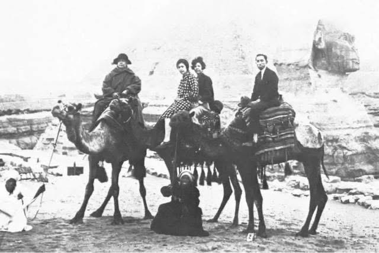

Trương Tĩnh Dung đi du lịch cùng các con.
Vào cuối thế kỷ 19, phụ nữ hầu như không có tư cách, càng không được xem là cần thiết để ra nước ngoài mở mang hiểu biết. Nhưng Trương Tĩnh Dung lại là một ngoại lệ hiếm có. Nhờ sinh ra trong một gia đình lai Âu – Á, từ nhỏ bà đã theo cha đi nhiều nơi, mở rộng tầm mắt. Sau này khi kết hôn với Hà Đông, bà lại càng có cơ hội chu du khắp thế giới.
Trương Tĩnh Dung từng ghi lại: “Thuở nhỏ theo cha chu du dọc sông Trường Giang, khi trưởng thành cùng chồng đi qua Âu, Mỹ, Đức, Pháp, Ý, Bỉ, Bồ Đào Nha, Nhật Bản… mỗi nơi đều để lại dấu chân.”
Không chỉ dừng lại ở đó, Trương Tĩnh Dung còn xuất bản sách — tác phẩm có tên 《Danh Sơn Du Ký》, trong đó không chỉ ghi chép vẻ đẹp của non sông bà từng đi qua, mà còn thể hiện nhân sinh quan và thế giới quan của chính bà.
Ở một góc độ nào đó, Trương Tĩnh Dung có thể xem là người phụ nữ đầu tiên của Hong Kong viết sách, lập ngôn và ghi dấu tư tưởng của mình — một điều vô cùng hiếm thấy trong thời đại ấy.
Về sau, khi bước vào tuổi xế chiều, bà dốc lòng hoằng dương Phật pháp, sáng lập Đông Liên Giác Viện, và toàn bộ 100.000 đồng di sản do Hà Đông để lại đều được bà quyên tặng làm quỹ hoạt động cho Giác Viện.
Bà từng viết: “Cả đời tôi sùng tín Phật giáo, xót thương vì Hong Kong chưa có một cơ sở hoằng pháp hiện đại và bền vững, lại thương cảm những thiếu nữ thất học, nên mong lập một trường nữ nghĩa học để đào tạo, dưỡng dục họ.”
Nhờ những đóng góp to lớn trong việc truyền bá và phát triển Phật học, hậu thế thường gọi Trương Tĩnh Dung bằng pháp danh “Trương Liên Giác” hoặc “Liên Giác Cư sĩ” — như một cách tôn kính người phụ nữ đã dành trọn đời mình cho đạo pháp và giáo dục.
Vì thế, hai người phụ nữ ấy, dù không thể tự quyết số phận khi rơi vào cuộc sống đa thê của chốn hào môn, vẫn dùng sức mạnh tiềm ẩn bên trong mình để tỏa ra một nguồn sinh lực bền bỉ. Cả đời họ có lẽ không thể gọi là hạnh phúc, nhưng chắc chắn vẫn rực rỡ và đáng nhớ.
Đó là về vợ con của Hà Đông, vậy còn con dâu con rể của ông thì sao?
Các con rể của Hà Đông đều là những nhân vật kiệt xuất, mỗi người một lĩnh vực, ai nấy đều có chỗ đứng riêng.
● Con rể trưởng La Văn Cẩm thì không cần nói nhiều — luật sư người Hoa đầu tiên của Hong Kong, sau này còn giữ chức nghị viên trong cả Hội đồng Hành chính và Lập pháp.
● Con rể thứ ba Hoàng Tích Lâm từng kinh doanh ngành đường sắt trong thời kỳ kháng chiến chống Nhật, về sau trở thành Chủ tịch Hội Hoa Thương.
● Con rể thứ sáu Cát Diên Sĩ là giảng viên Khoa Kỹ thuật Xây dựng của Đại học Hong Kong, một người làm học thuật nghiêm túc, đáng tiếc là sau khi Hong Kong thất thủ đã bị quân Nhật bắt giam rồi đưa sang Nhật, qua đời nơi đất khách.
● Con rể thứ bảy La Văn Hạo (em trai La Văn Cẩm) là thẩm phán của Tòa án Sơ thẩm Hong Kong.
● Con rể thứ tám Dương Quốc Chương từng là Cục trưởng Cục Y tế và Dịch vụ Y tế, sau này còn đảm nhiệm chức Chủ tịch Hội đồng Thành phố.
Đến thế hệ cháu của Hà Đông, như Hà Hồng Chương và Hà Hồng Khanh, vẫn tiếp tục sống trong giới thượng lưu.
Trong đó, Hà Hồng Chương chính là người từng đem lòng yêu cô em họ Hà Uyển Kỳ (em gái ruột của Hà Hồng Sân), khiến giới truyền thông xôn xao suốt một thời gian dài, thậm chí còn dính vào vụ rối rắm ồn ào với trùm sòng bạc Hà Hồng Sân.
Cách đây không lâu, báo chí cũng từng đưa tin về người con trai thứ tư của Hà Hồng Chương — Hà Du Bưu, kết hôn với “nàng dâu mạnh mẽ nhất” — Ông Tĩnh Tinh.
Khi lần theo hành trình của các con và con rể của Hà Đông, ta dễ dàng nhận ra một quy luật: Hà Đông luôn mong thế hệ thứ hai có được địa vị chính trị cao, được trọng dụng trong bộ máy quyền lực, chứ không kỳ vọng họ trở thành thương nhân.
Điều này có lẽ bắt nguồn từ nỗi mặc cảm sâu kín trong suốt cuộc đời ông — dù giàu có bậc nhất Hong Kong, Hà Đông vẫn không bao giờ được giới thượng lưu phương Tây thực sự công nhận. Ông luôn sống trong tình thế lưng chừng về thân phận, và cái bóng ấy chưa bao giờ rời khỏi cuộc đời Hà Đông.
Hà Ngải Linh từng hồi tưởng:
“Dù cả nhà đã chuyển lên biệt thự trên đỉnh núi, được sống ngang hàng với người châu Âu, nhưng bọn trẻ châu Âu vẫn không ai chịu chơi với chúng tôi, thậm chí còn nhìn bằng ánh mắt khinh miệt — điều đó khiến tâm hồn chúng tôi tổn thương sâu sắc.”
Chính vì vậy, khát vọng tìm kiếm sự công nhận, địa vị và vị thế xã hội đã trở thành nỗi khao khát lớn nhất của Hà Đông và cả thế hệ con cháu sau này.
Thế nhưng, sau khi Hà Đông và con rể trưởng La Văn Cẩm qua đời, “con thuyền vĩ đại” ấy mất đi người cầm lái, các con cháu lần lượt di cư sang Úc, Mỹ và nhiều nơi khác.
Về sau, cháu nội Hà Hồng Chương còn bán đi căn biệt thự trên đỉnh núi — biểu tượng quan trọng nhất của dòng họ Hà.
Từ đó, sợi dây gắn kết cuối cùng của đại gia tộc này cũng tan biến hoàn toàn.
Không ngờ rằng nhiều năm sau, nhánh gia tộc của người em trai Hà Phúc (còn có tên gọi khác là Hà Khải Phúc) lại trỗi dậy mạnh mẽ, và đến thế hệ thứ 5 do Hà Hồng Sân đại diện, nhà họ Hà một lần nữa vươn lên đỉnh cao, trở thành người dẫn đầu thời đại mới.
Cảm thán thay — lịch sử luôn thay đổi nhanh chóng và tàn khốc đến vậy, vài chục năm trôi qua, thế gian đã là một câu chuyện khác.
Câu chuyện rực rỡ của gia tộc Hà Đông phản chiếu tiến trình phát triển trăm năm của Hương Cảng, giữa những biến động lịch sử và ánh sáng lấp lánh của thời cuộc. Cuộc đời họ luôn bị cuốn trong dòng chảy khổng lồ của thời đại — và chính vì thế mà trở nên huyền thoại.
Chuyện về gia đình Hà Đông đến đây coi như tạm khép lại. Trăm năm Hong Kong, muôn sắc thăng trầm. Những câu chuyện về các đại gia tộc nơi đây giống như một cuốn sách bất tận, đầy những mảnh ghép rời rạc giữa dòng lịch sử và thời gian.
Cho đến tận hôm nay, khi huyền thoại của Hà Hồng Sân đã khép lại, những câu chuyện về gia tộc của ông vẫn thu hút sự chú ý của đông đảo mọi người.

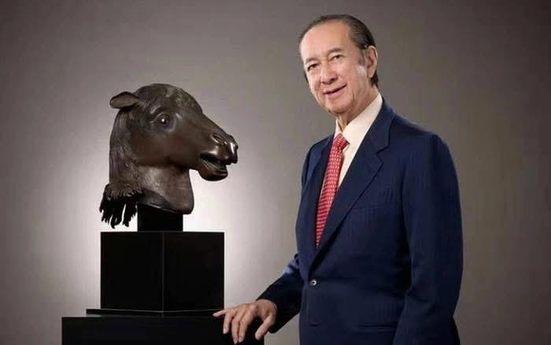

Hà Hồng Sân bên tượng đồng đầu ngựa.
Tháng 11 năm 2019, trùm sòng bạc Hà Hồng Sân quyên tặng quốc gia pho tượng đồng đầu ngựa – một món cổ vật thất lạc của Viên Minh Viên. Tượng đồng đầu ngựa đã trở về Viên Minh Viên, gây chấn động trong và

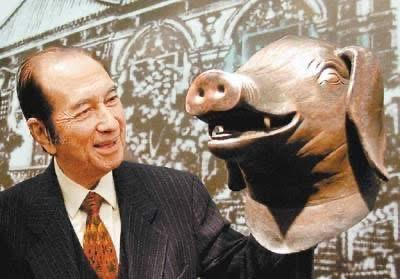

ngoài nước.
Năm 2007, Hà Hồng Sân đã chi 69,1 triệu đô la Hong Kong để mua lại pho tượng đồng đầu ngựa này và luôn giữ tại Macau. Nhân dịp kỷ niệm 70 năm Quốc khánh nước Cộng hòa Nhân dân Trung Hoa và 20 năm Macau trở về với Tổ quốc, gia tộc họ Hà đã quyết định hiến tặng tượng đầu ngựa cho Nhà nước.
Hà Hồng Sân bên tượng đồng đầu heo.
Đáng nói là trước đó, trùm sòng bạc cũng từng tặng tượng đầu heo bằng đồng cho quốc gia.
Nhân sự kiện trọng đại này, hiếm hoi lắm mới thấy toàn bộ gia tộc họ Hà cùng xuất hiện. Cả ba nhánh – nhánh bà hai, nhánh bà ba, nhánh bà tư – đều có mặt. Dĩ nhiên, người đại diện cho nhà họ Hà vẫn là đại tiểu thư của nhị phòng, Hà Siêu Quỳnh, xuất hiện với phong thái đĩnh đạc, khí chất hơn người.
Dẫn đầu là Hà Siêu Quỳnh diện trang phục Chanel, theo sau là bà ba mặc đồ đen và bà tư mặc đồ đỏ. Hai người con gái khác của bà hai là Hà Siêu Phượng và Hà Siêu Hà cũng tháp tùng chị cả tham dự. Tuy nhiên, cô út Hà Siêu Nghi và con trai duy nhất của bà hai – Hà Du Long – đều vắng mặt. Bên phía bà ba, Hà Siêu Vân không đến. Riêng phía bà tư thì cả nhà cùng góp mặt.
Hà Hồng Sân có 4 người vợ và 17 người con, ai nấy đều là nhân vật nổi bật, và câu chuyện về họ suốt từ thập niên 1990 đến nay luôn chiếm sóng các trang giải trí và chuyên mục người nổi tiếng.
Hà Sĩ Văn và Thi Đệ
Hà Đông là người sáng lập nên cơ nghiệp của cả nhà họ Hà, từng là người giàu nhất Hong Kong và cũng là người được toàn bộ gia tộc tôn kính nhất. Nhân vật này cũng giúp ta phần nào hình dung được bức tranh rực rỡ của Hong Kong trong suốt trăm năm.
Dĩ nhiên, qua lời kể và hồi ký của nhiều người con trong nhà họ Hà, cùng những tư liệu lịch sử phong phú như biển trời, ta còn có thể khám phá vô số câu chuyện thú vị chưa từng được kể hết.
Vì vậy, hôm nay chúng ta sẽ nói đến một vài “chuyện bên lề” của gia tộc vua sòng bạc — những mảnh vụn tưởng nhỏ bé ấy biết đâu lại là dấu vết giúp giải mã quy luật thịnh suy của một dòng họ, và hé mở truyền kỳ về một gia tộc trăm năm ở Hương Cảng.
Nói đến đây thì không thể không nhắc đến người phụ nữ bí ẩn đã khai sinh cả dòng tộc: Thi Đệ.
Trong hầu hết các bài viết truy ngược gốc rễ của gia tộc Hà Hồng Sân, người ta đều nhắc đến một người phụ nữ — có nơi gọi bà là Thi Đệ, có nơi chỉ gọi đơn giản là bà Thi.
Bà Thi Đệ.
Trong những tư liệu đó, phần viết về bà Thi Đệ thường rất ít, hầu như chỉ đóng vai trò phông nền hoặc đoạn dẫn nhập. Câu chuyện của bà thường được tóm gọn trong hai dòng ngắn ngủi: “Bà Thi, người Quảng Đông,

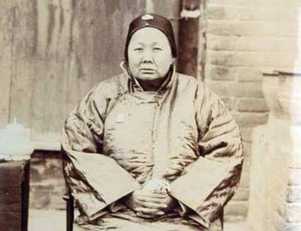

sống tại Hong Kong với một người đàn ông ngoại quốc tên Hà Sĩ Văn, sinh được một con gái và bốn con trai; con cả chính là “người giàu nhất Hong Kong thời kỳ đầu” sau này — Hà Đông.”
Thế nhưng, nếu chịu khó lần giở kỹ cuộc đời của Thi Đệ, người ta sẽ nhận ra rằng sau hai dòng chữ vắn tắt ấy là một cuộc đời vừa kiên cường vừa bi thương. Đó là một người phụ nữ phi thường, sống sót giữa những kẽ hở nghiệt ngã của thời đại. Cả đời bà nếm trải cay đắng, chịu cảnh thấp hèn, nhưng lại tỏa ra nghị lực bền bỉ và tinh thần kiên định đến đáng kinh ngạc.
Thực ra, Thi Đệ không phải người Quảng Đông, mà là người đảo Sùng Minh (Thượng Hải). Gia đình họ Thi vốn làm nghề nuôi tằm, cuộc sống trước kia cũng khá ổn. Nhưng vào những năm 1850, cây dâu trên đảo bị khô héo hàng loạt, nhà họ Thi lâm vào cảnh nợ nần. Cha mất sớm, lại không có anh em trai, chỉ còn ba mẹ con cô đơn nương tựa nhau.
Trong thời đại ấy, một người con gái không cha không anh chẳng khác nào cánh bèo trôi giữa dòng. Vì vậy, Thi Đệ bị các bác chú bán vào Thượng Hải, rồi từ đó lại bị chuyển bán tiếp sang Hong Kong.
Nhà văn Đài Loan Thi Thúc Thanh từng viết một tiểu thuyết có tên “Hong Kong Tam Bộ Khúc”, trong đó có nhân vật Hoàng Đức Vân — một cô gái bị bán từ đại lục sang Hong Kong làm kỹ nữ, sau này sinh ra một người con trai thành đạt, rồi nhờ con mà thân phận được nâng lên. Nhân vật này chính là lấy nguyên mẫu từ Thi Đệ.
Còn việc Thi Đệ sau khi bị bán sang Hong Kong có từng làm kỹ nữ hay không, nay đã không thể xác minh; hậu nhân họ Hà tất nhiên cũng sẽ không chủ động nhắc đến.
Nhưng nếu đặt mình vào hoàn cảnh của bà mà nghĩ, ta sẽ hiểu phần nào: một cô gái trẻ bị bán sang đất khách, không biết tiếng, không có nghề nghiệp, không người thân, không bạn bè — bà còn có thể làm gì khác để sinh tồn?
Trong lịch sử, có một cách gọi riêng dành cho những người phụ nữ như vậy — họ được gọi là “đản phụ” (phụ nữ Đản Gia). Phần lớn họ sinh sống ven biển, cả đời lênh đênh trên thuyền, hiếm khi đặt chân lên đất liền, sống trong cảnh nghèo khó và bấp bênh.
Đó chính là xuất thân của người phụ nữ khai sáng dòng họ Hà — Thi Đệ.

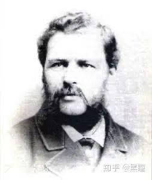

Tạm gác lại câu chuyện của Thi Đệ, bởi tiếp theo, chúng ta cần nhắc đến cha của Hà Đông và Hà Phúc (ông nội của Hà Hồng Sân) — người đàn ông “ngoại quốc” mang tên Hà Sĩ Văn.
Hà Sĩ Văn.
Người đàn ông gốc Do Thái – Hà Sĩ Văn (Mozes Hartrg Bosman, 1839-1892) – cũng có một cuộc đời không mấy suôn sẻ. Cha ông vốn là người bán thịt, mất khi ông mới mười tuổi; mẹ sau đó tái giá.
Ở Hà Lan thời bấy giờ, người Do Thái có địa vị xã hội rất thấp, đặc biệt là những ai sinh ra trong tầng lớp nghèo khó. Hà Sĩ Văn mang trong mình tâm trạng chán chường, nên đã quyết định rời quê hương, đến phương Đông xa xôi để tìm vận may.
Vào thế kỷ XIX, Hong Kong đầy rẫy người ngoại quốc. Họ đến đây với mong muốn kiếm tiền ở phương Đông rồi quay về phương Tây để sống sung túc. Nhưng điều đó cũng kéo theo một thực tế: những người đàn ông xa xứ này, để giải tỏa nỗi cô đơn, thường tìm phụ nữ Trung Hoa làm bạn tạm thời.
Trong xã hội người Hoa, con gái nhà khá giả tuyệt đối không thể chung sống với người ngoại quốc, nên nhóm “Robinson” này chỉ còn cách tìm đến các “đản phụ” – những phụ nữ sống trên thuyền. Thời đó, sự kết hợp giữa người Tây và đản phụ rất phổ biến, và người ta gọi hiện tượng này là “hôn nhân có yếu tố ngoại quốc”.
Thế là, Hà Sĩ Văn (người đàn ông đến từ Hà Lan) và Thi Đệ (người phụ nữ đến từ Thượng Hải) đã vội vã gắn kết trong một “cuộc hôn nhân có yếu tố ngoại quốc”.
Nói là “hôn nhân”, nhưng thực chất không hề có giá trị pháp lý, chỉ có thể xem như chung sống tạm thời. Những người phụ nữ sống chung với người Tây như vậy càng bị xã hội khinh rẻ hơn. Họ bị người Hoa miệt thị, gọi bằng những lời cay nghiệt như “heo mẹ với chó” hay “chỉ tiếp khách Tây”.
Hơn thế nữa, một khi sinh ra con lai, những người đàn ông ngoại quốc ấy thường lập tức bỏ rơi, không còn sống cùng, cũng chẳng đoái hoài. Bởi trong quan niệm đạo đức của phương Tây thời bấy giờ, việc kết hôn hay sinh con với người Trung Hoa bị xem là điều đáng xấu hổ.
Sau khi lần lượt sinh cho Hà Sĩ Văn 1 con gái và 4 con trai, cuộc sống của Thi Đệ vẫn chẳng hề khá hơn. Người ta kể lại rằng mỗi cuối tháng, bà thường dắt theo con trai cả Hà Đông và con trai thứ Hà Phúc, đứng ngoài cửa văn phòng Hà Sĩ Văn cầu xin ông đưa tiền sinh hoạt.
Cuộc sống của những người đản phụ vốn đã vô cùng cơ cực và thấp hèn. Xui xẻo hơn, năm 1869, công ty của Hà Sĩ Văn bị phá sản. Ông ta chẳng để lại thứ gì, một mình trốn về Anh, bỏ mặc Thi Đệ cùng năm đứa con bơ vơ tại Hong Kong.
Công ty mà Hà Sĩ Văn từng lập ở Hong Kong chủ yếu hoạt động trong lĩnh vực “mua bán nhân công” — hay nói trắng ra là buôn bán nô lệ lao động (gọi nôm na là “bán heo con”).
Sau khi bị Hà Sĩ Văn bỏ rơi, Thi Đệ, mang theo 5 đứa con, lại một lần nữa phải nương nhờ người khác, trở thành thiếp của một thương nhân Hoa kiều tên Quách Tùng (cũng có tài liệu ghi là Quách Hưng Hiền). Với người này, bà tiếp tục sinh thêm 4 người con: Quách Mậu Siêu (mất sớm), Hà Cam Đường (ông ngoại của Lý Tiểu Long), 2 con gái Quách Bách Bân và Quách Bách Quyên.
So với Hà Đông – người mang dòng máu lai, thì Hà Cam Đường là người Trung Hoa thuần chủng, nên diện mạo cũng hoàn toàn khác biệt.
4 người con này vốn mang họ Quách, nhưng về sau đều đổi sang họ Hà. Đó là điều kiện do Hà Đông đặt ra: muốn được hưởng phú quý vinh hoa của nhà họ Hà thì phải mang họ Hà. Từ chi tiết ấy có thể thấy Hà Đông rất coi trọng huyết thống và tông tộc, tin tưởng sâu sắc vào tư tưởng gia tộc.
Dĩ nhiên, về đoạn quá khứ cay đắng của người mẹ, Hà Đông cùng các hậu nhân đều cố gắng làm mờ nhạt, thậm chí né tránh nhắc tới.
Thi Đệ, người phụ nữ xuất thân từ tầng lớp thấp nhất ấy, cả đời lấy hai chồng, sinh chín người con, tự tay nuôi nấng tất cả khôn lớn, cho con đi học, đi làm. Trong một thời đại mà phụ nữ hầu như không có quyền gì, việc bà làm được điều đó thực sự phi thường.
Thế nhưng, cuối đời, dù đã từng hưởng vinh hoa phú quý, Thi Đệ vẫn có một kết cục khiến người ta xót xa.
Bà không may mắc phải bệnh dịch hạch. Khi ấy, chính quyền Hong Kong quy định mọi người nhiễm bệnh phải bị cưỡng chế cách ly và trục xuất, dù là người thuộc gia đình giàu có nhất cũng không được ngoại lệ. Hà Đông không còn cách nào khác, đành thuê một con thuyền, đưa mẹ lênh đênh ra ngoài khơi, để bà chờ chết giữa biển.
Đôi khi người ta nghĩ, có lẽ đó chính là số phận đã được định sẵn cho bà — đến từ biển, rồi lại trở về với biển.
Sau khi Thi Đệ qua đời, Hà Đông tổ chức tang lễ long trọng cho mẹ. Trong chân dung thờ, bà mặc quan phục, dung mạo đoan trang, khí chất phi phàm. Trên bia mộ, người ta khắc dòng chữ: “Hoàng Thanh cáo phong Nhị phẩm phu nhân Hiển Tỷ Thi thị Thái phu nhân*.” — một danh vị mà suốt đời bà chưa từng dám mơ đến, cũng là dấu son cuối cùng rực rỡ nhất trong cuộc đời nhiều bi thương ấy.
*Nguyên văn là 皇清诰封二品夫人显妣施氏太夫人, là một danh hiệu truy phong – tức tước hiệu danh dự được ban sau khi qua đời, thường dùng trong triều nhà Thanh để biểu dương công đức hoặc thân phận của người đã khuất, đặc biệt là mẹ của quan lại có công lớn.
Trong đó: ● Hoàng Thanh (皇清) chỉ triều đại nhà Thanh, thể hiện đây là sắc phong chính thức dưới thời Thanh. ● (诰封) Cáo phong nghĩa là được triều đình ban chiếu phong tặng danh vị, thường dùng để tôn vinh thân nhân của quan lại. ● Nhị phẩm phu nhân (二品夫人) là tước bậc phu nhân hàng nhị phẩm – tương đương vợ (hoặc mẹ) của quan chức cấp rất cao trong triều, chỉ sau Nhất phẩm. ● (显妣) Hiển Tỷ là cách xưng tôn kính đối với mẹ đã mất; “Hiển” nghĩa là đã qua đời, “Tỷ” là mẹ. ● Thi thị (施氏) là họ của người được phong – bà Thi Đệ. ● Thái phu nhân (太夫人) là cách gọi tôn quý dành cho mẹ của đại quan hoặc quý nhân, tương tự như “Mệnh phụ phu nhân” trong tiếng Việt cổ.
Danh hiệu này có thể được hiểu nôm na là “Bà Thi, mẹ đẻ của ngài Hà Đông, được triều đình nhà Thanh truy phong tước vị Nhị phẩm Thái phu nhân.”
Nói cách khác, đây là vinh dự cao nhất mà Thi Đệ đạt được sau khi qua đời — một người phụ nữ từng sống ở tầng đáy xã hội, cuối cùng lại được an táng với danh vị tương đương mẹ của quan lớn trong triều đình.
Còn người cha ngoại quốc vô tình kia — Hà Sĩ Văn — thì sao?
Sau khi trở về Anh, Hà Sĩ Văn nhanh chóng mở lại công ty và cuộc sống của ông từ đó rất thuận lợi. Năm 1877, ông kết hôn với một phụ nữ da trắng người Mỹ có địa vị, người vợ này cũng sinh cho ông 4 con trai và 1 con gái.
Ngày 19 tháng 11 năm 1892, Hà Sĩ Văn qua đời vì u não ác tính, hưởng thọ 53 tuổi.
Một năm trước khi ông qua đời, Hà Đông từng sang Anh gặp cha. Khi ấy, Hà Đông đã là chủ mua chính của công ty Jardine Matheson. Cuộc trò chuyện giữa hai cha con không được ghi chép lại, nên không ai biết họ đã nói những gì.
Sau này, tại nghĩa trang Chiêu Viễn ở Hong Kong, có một ngôi mộ tượng trưng (mộ áo quan) của Hà Sĩ Văn, được xây ngay bên cạnh mộ của Thi Đệ.
Cái tên “Hà Sĩ Văn” thực ra do chính Hà Đông đặt cho cha mình. Vì ông là người Hà Lan, nên Hà Đông đã chọn cho cha họ “Hà”, có lẽ bản thân Hà Sĩ Văn chưa bao giờ biết rằng mình từng có một cái tên Trung Hoa như vậy.
Cứ như thế, giữa thời thế đầy chênh vênh, từ một cuộc gắn kết vội vã giữa hai con người nhỏ bé và tầm thường, dòng máu họ Hà được khai sinh — mở ra hành trình của một đại gia tộc, nơi số phận bắt đầu dần dần trải rộng như một bức tranh đang được vẽ ra.
“Thập cô nương” Hà Uyển Kỳ

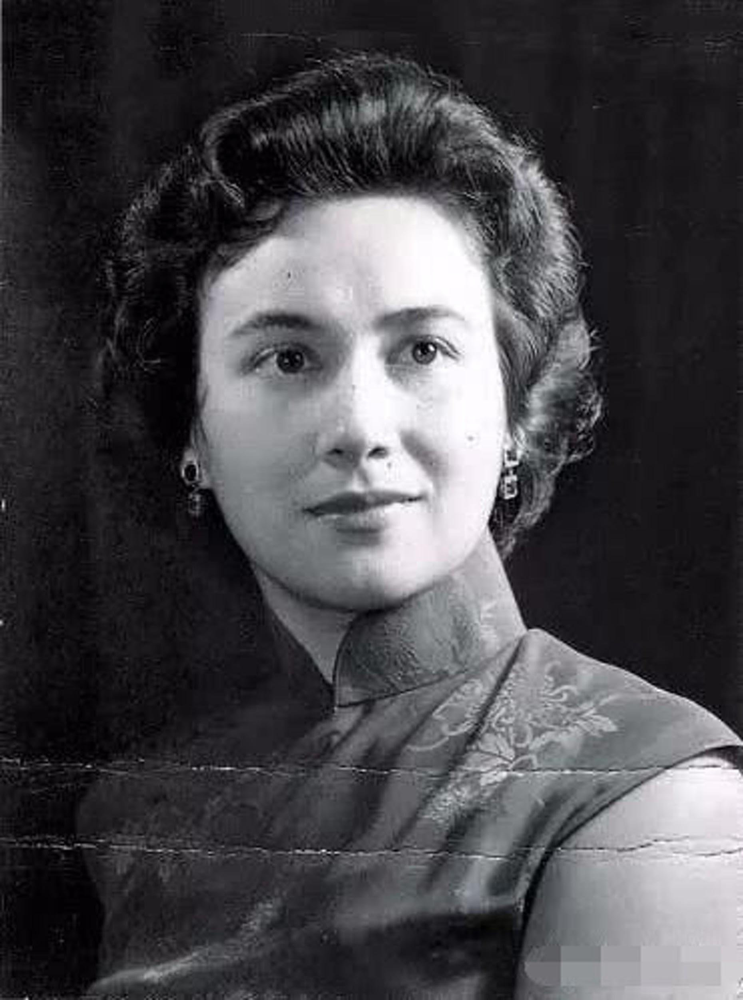

> © Dịch từ bài viết có tiêu đề là “‘Thập cô nương’ Hà Uyển Kỳ: Yêu đương với anh em họ, cùng anh trai là ‘Vua sòng bạc’ gây dựng cơ đồ, nhưng cuối cùng lại vì ông mà rơi vào cảnh bị mọi người quay lưng” của @何小爆忆 影视 trên Baidu.
> ‧₊˚❀༉‧₊˚

“Vua sòng bạc” Hà Hồng Sân có một cuộc đời đầy tính huyền thoại, từ sự nghiệp, tình cảm đến gia đình đều trở thành đề tài bàn tán không ngớt. Trong số rất nhiều anh chị em, chỉ có một người có thể sánh ngang với ông, đó chính là em gái ruột Hà Uyển Kỳ, được gọi là “Thập cô nương”.
“Thập cô nương” cũng giống anh trai, thừa hưởng gen ưu tú của gia tộc, vừa xinh đẹp vừa thông minh, đặc biệt là nhan sắc nổi bật đến mức được ca ngợi là “đẹp nhất Macau”. Chính vì vẻ đẹp ấy mà bà đã nảy sinh một

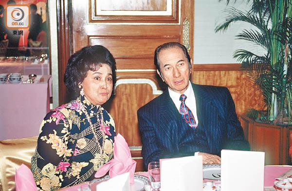

mối tình nghiệt duyên hiếm có với người anh em họ của mình. Gọi là “nghiệt duyên” bởi giữa họ tồn tại quan hệ huyết thống rất gần, nhưng chính họ lại khẳng định: “Đây không phải 𝗹𝗼𝗮̣𝗻 𝗹𝘂𝗮̂𝗻, mà là tình yêu.”
Mối tình ấy kéo dài hàng chục năm, nhưng cũng chính kết tinh tình yêu đó — Hà Đông Thuấn Minh — đã khiến “Thập cô nương” Hà Uyển Kỳ, người từng khiến bao người ngưỡng mộ, trở mặt với anh ruột và chấm dứt tình cảm với người anh em họ.
Hà Uyển Kỳ sinh ra tại Hong Kong, là người con thứ 10 trong gia đình của Hà Thế Quang – con trai của Hà Phúc. Mà Hà Phúc là em trai của ngài Hà Đông (gia tộc đứng đầu trong tứ đại gia tộc xứ Cảng Thơm thế kỷ trước). Vậy nên, Hà Uyển Kỳ được gọi là “Thập cô nương”. Từ nhỏ bà đã là một mỹ nhân bẩm sinh, đồng thời rất được cha và người anh thứ 9 – Hà Hồng Sân – yêu thương hết mực.
Hà Uyển Kỳ và anh trai Hà Hồng Sân.
Sau khi cha và các chú bác đầu tư chứng khoán thất bại, một người trong số họ đã 𝘁𝘂 ̛̣𝘀𝗮́𝘁, gia đình sa sút. Cha của Hà Uyển Kỳ buộc phải đưa cả nhà chạy sang Việt Nam lánh nạn. Có lời đồn rằng vị hoàng đế cuối cùng của Việt Nam khi đó cũng bị nhan sắc của bà mê hoặc, người theo đuổi rất nhiều, nhưng Hà Uyển Kỳ đều không để vào mắt.
Những năm sống ở Việt Nam, bà đã sớm tiếp xúc và hiểu được sự phát triển của ngành 𝗰𝗼 ̛̀𝗯𝗮̣𝗰, điều này đặt nền tảng cho việc sau này cùng người anh thứ 9 Hà Hồng Sân kề vai sát cánh, thống lĩnh ngành casino ở Macau.

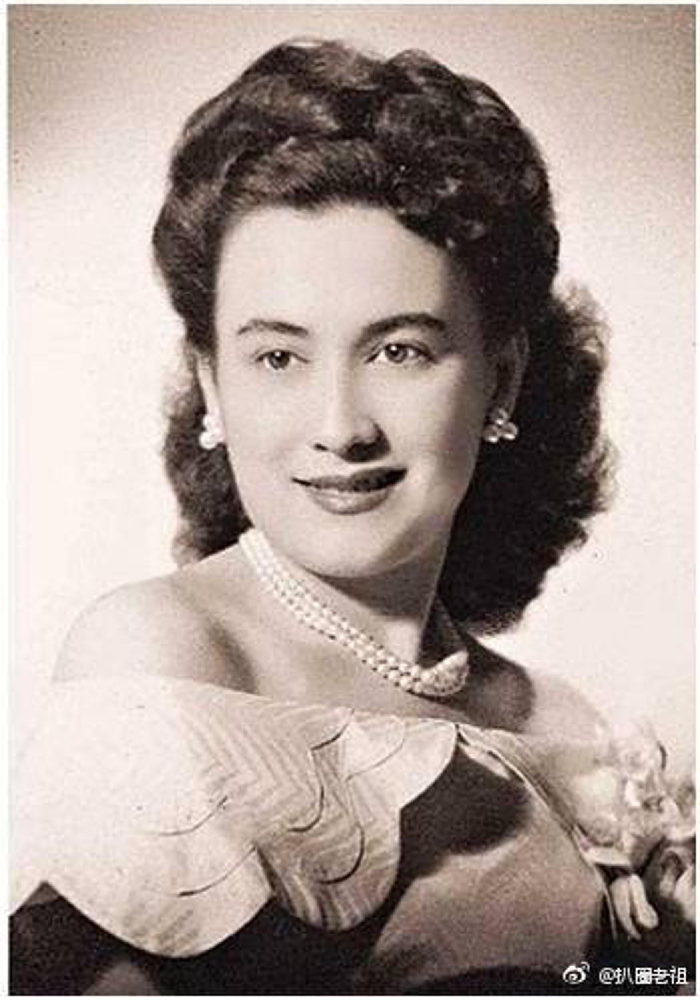

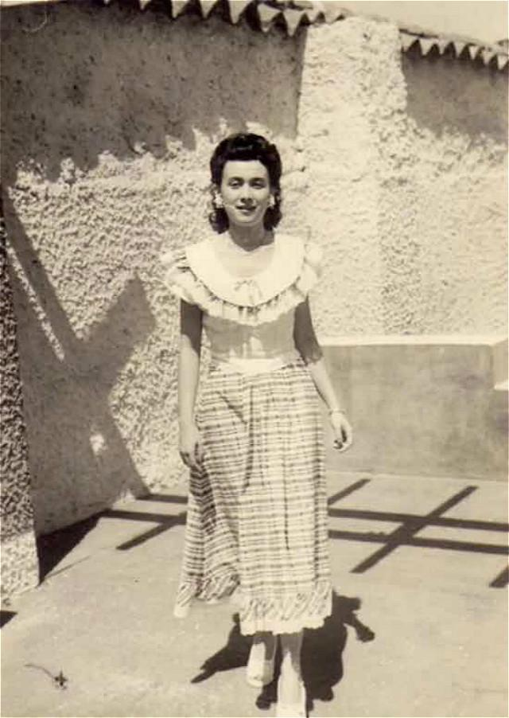

Hà Uyển Kỳ thời trẻ.
Sau khi trở lại Macau, trong buổi tiệc kỷ niệm ngày cưới của ngài Hà Đông, Hà Uyển Kỳ gặp lại người anh em họ Hà Hồng Chương (cháu nội của Hà Đông). Chính buổi gặp gỡ ấy đã khiến hai người yêu nhau từ cái nhìn đầu tiên — khi đó một người 18 tuổi, người kia mới 16.
Hà Hồng Chương (trái) và Hà Uyển Kỳ (phải) thời trẻ.
Sau này nhớ lại lần hội ngộ đầu tiên khi đã trưởng thành, Hà Hồng Chương từng nói: “Trong buổi tiệc kỷ niệm của ông bà tôi có đến vài trăm người, nhưng tôi lại trúng tiếng sét ái tình với cô ấy. Cô ấy thực sự là một đại mỹ nhân.”

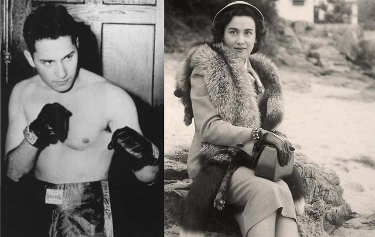

Tuy nhiên, mối quan hệ của họ bị gia tộc xem là 𝗹𝗼𝗮̣𝗻 𝗹𝘂𝗮̂𝗻, bởi Hà Hồng Chương là anh em họ của Hà Uyển Kỳ, thuộc cùng huyết thống gần. Vì vậy, gia đình nhanh chóng can thiệp mạnh mẽ.
Dù Hà Uyển Kỳ rất kiên quyết, bà vẫn không thể chống lại ý chí của các bậc trưởng bối trong gia tộc. Hà Hồng Chương bị gửi sang Mỹ du học, còn bà thì bị ép gả cho Mạch Chí Vĩ.
Mạch Chí Vĩ tuy là cháu họ bên phía chính thất của ngài Hà Đông, bề ngoài xem như môn đăng hộ đối, nhưng thực chất chỉ là kiểu “hào môn giả” — bề ngoài hào nhoáng, bên trong rỗng tuếch.
(Chính thất của Hà Đông là Mạch Tú Anh, cả đời không có con. Mạch Chí Vĩ xuất thân từ gia tộc họ Mạch này.)
Từ nhỏ sống trong nhung lụa, ngay cả khi phải chạy nạn cũng có hơn chục gia nhân hầu hạ (điều này hoàn toàn trái ngược với con đường tay trắng dựng nghiệp của Hà Hồng Sân), nhưng sau khi kết hôn, cuộc sống của Hà Uyển Kỳ lại khá đạm bạc. Dù sinh cho nhà họ Mạch 1 trai 1 gái, trong lòng bà vẫn vô cùng bất mãn với cuộc hôn nhân không có tình yêu này.
Mãi đến năm 1953, Hà Uyển Kỳ tình cờ gặp lại Hà Hồng Chương vừa du học trở về. Hai người phát hiện tình cảm dành cho nhau không hề phai nhạt, thậm chí còn sâu đậm hơn, từ đó bắt đầu mối quan hệ ngoài luồng kéo dài hàng chục năm.
Hà Hồng Chương chờ mãi không thấy Hà Uyển Kỳ ly hôn, lại không chịu nổi áp lực từ gia đình, nên đã kết hôn với một phụ nữ ngoại quốc tên là Xa An Ni. Không ngờ đúng vào thời điểm Hà Hồng Chương kết hôn, Hà Uyển Kỳ lại mang thai. Sau này, Hà Hồng Chương từng nói: “Biết trước vậy thì tôi đã không kết hôn.”
Vì đây là mối tình không thể công khai, Hà Uyển Kỳ không hề lên tiếng, lặng lẽ sinh đứa con với người tình Hà Hồng Chương và đặt tên là Mạch Thuấn Minh (để tránh bị phát hiện nên mang họ của chồng).

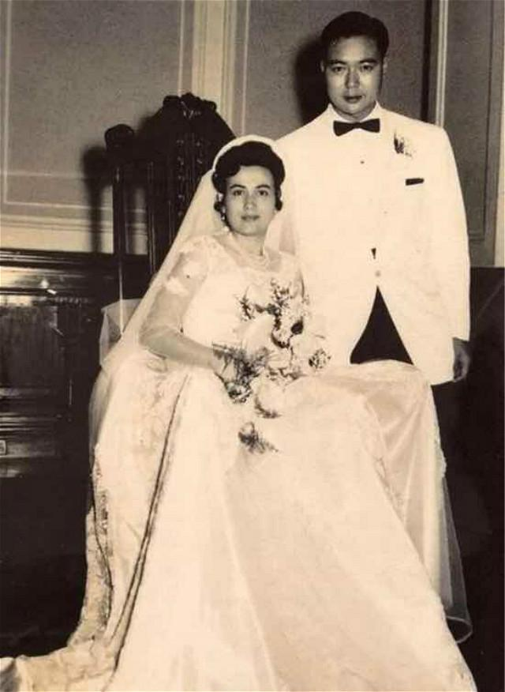

Hà Uyển Kỳ và Mạch Chí Vĩ.
Khi đứa trẻ lớn lên, ai tinh ý đều có thể nhận ra Mạch Thuấn Minh không phải con của nhà họ Mạch, bởi cậu mang gương mặt lai giống hệt Hà Hồng Chương. Đây cũng là một trong những lý do khiến Hà Uyển Kỳ đặc biệt thiên vị người con trai này.
Sau đó, bà còn sinh thêm 1 cô con gái ngoài giá thú với Hà Hồng Chương là Mạch Huệ Ngọc. Tuy nhiên, do tư tưởng trọng nam khinh nữ, người con gái này khi nhớ lại tuổi thơ vẫn mang trong lòng nhiều oán trách mẹ.
Cô từng nói: “Mỗi bữa ăn đều có món cá mà Mạch Thuấn Minh thích, còn những đứa con khác thì không. Ngay cả chuyện chia bút chì nhỏ nhặt cũng dựa theo mức độ được mẹ yêu thích: Mạch Thuấn Minh có 10 cây, Mạch Huệ Trinh có 5 cây, Mạch Gia Hưng có 2 cây, còn tôi thì không có cây nào.”

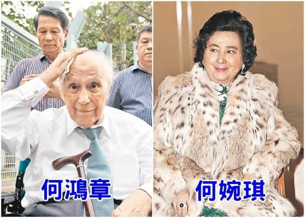

Dù là anh chị em ruột thịt, nhưng sự thiên vị quá mức của người mẹ cũng khiến tâm lý mất cân bằng, vì vậy tình cảm giữa các con với nhau cũng rất nhạt nhòa.
Hà Uyển Kỳ có một cuộc hôn nhân không hạnh phúc, mối quan hệ ngoài luồng với người anh em họ lại không thể công khai. Thứ duy nhất bà có thể đường đường chính chính đứng ra làm, chính là cùng người anh thứ 9 Hà Hồng Sân gây dựng sự nghiệp 𝗰𝗼 ̛̀𝗯𝗮̣𝗰, thể hiện bản lĩnh không thua kém nam nhi.
Sau khi Hà Hồng Sân bắt tay với Diệp Hán và Hoắc Anh Đông để lật đổ Phó Lão Dung (người đã thống trị ngành 𝗰𝗼̛̀ 𝗯𝗮̣𝗰 Macau hơn 20 năm), 1 kỷ nguyên mới đã bắt đầu.
Thời điểm đó, Hà Uyển Kỳ dùng 2 triệu do Hà Hồng Chương “tặng” (đặt trong ngoặc kép vì sau này ông phủ nhận việc tặng, còn đòi lại cả vốn lẫn lãi) để góp vốn vào sự nghiệp 𝗰𝗼̛̀ 𝗯𝗮̣𝗰 của Hà Hồng Sân dưới danh nghĩa giả.
Hà Hồng Chương và Hà Uyển Kỳ.
Nhưng “một núi không thể có hai hổ”. Sau khi gây dựng được cơ đồ, quyền lực lại rơi vào tay Diệp Hán. Hà Hồng Sân không cam tâm đứng dưới người khác, nên sau đó đã bắt tay với em gái ruột Hà Uyển Kỳ, từng bước gạt Diệp Hán sang một bên, tự mình nắm giữ vị trí số một trong ngành 𝗰𝗼̛̀ 𝗯𝗮̣𝗰 Macau.
Kể từ đó, hai anh em bắt đầu xây dựng đế chế giải trí của gia tộc họ Hà tại Macau. Khi ấy, Hà Uyển Kỳ có thể nói là “dưới một người, trên vạn người”. Với đầu óc kinh doanh nhạy bén, bà đã lập nên không ít công lao to lớn, góp phần đưa Hà Hồng Sân trở thành “Vua sòng bạc”.
Bản thân Hà Uyển Kỳ cũng trở thành một thành viên trong hội đồng quản trị. Từ quyền quyết sách ở cấp cao cho đến quyền kinh doanh những cửa hàng nhỏ trong casino như quầy quà lưu niệm, tiệm bánh,… gần như

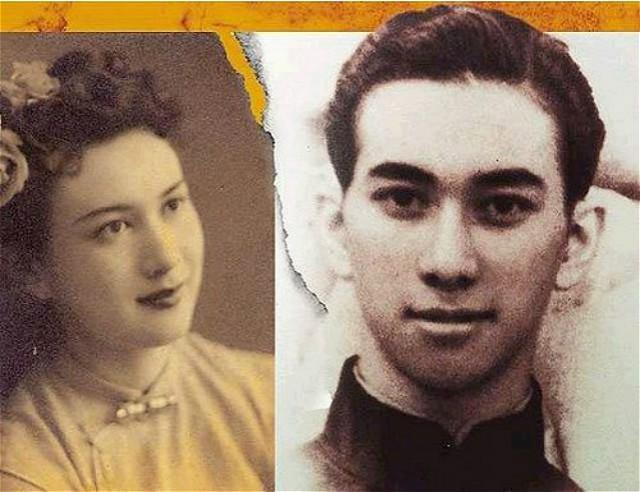

đều nằm trong tay bà.
Anh em đồng lòng thì sức mạnh như chẻ tre. Nhờ nỗ lực của hai người, sự nghiệp nhanh chóng mở rộng ra khắp Macau, gần như bao trùm phần lớn các ngành kinh tế tại đây.
Hà Uyển Kỳ và anh trai Hà Hồng Sân.
Nhưng dù là anh em ruột, khi lợi ích không còn đồng nhất thì cũng khó tránh khỏi rạn nứt, và Hà Uyển Kỳ với Hà Hồng Sân cũng không ngoại lệ.
Hà Hồng Sân không hài lòng khi con trai của Hà Uyển Kỳ là Mạch Thuấn Minh 𝗻𝗴𝗵𝗶𝗲̣̂𝗻 𝗰𝗼 ̛̀𝗯𝗮̣𝗰, tiêu xài hoang phí, khiến bà gánh khoản nợ 20 triệu và còn bị kiện ra tòa. Ông thậm chí từng cho Hà Uyển Kỳ vay 150 triệu để trả nợ thay cho con trai.
Trong hồi ký của mình, Hà Uyển Kỳ lại viết rằng việc bà tham gia ngành 𝗰𝗼̛̀ 𝗯𝗮̣𝗰 ban đầu là do anh trai dùng thân phận của Mạch Thuấn Minh (con ngoài giá thú) để ép bà đứng ra tranh giành quyền lực cho ông.

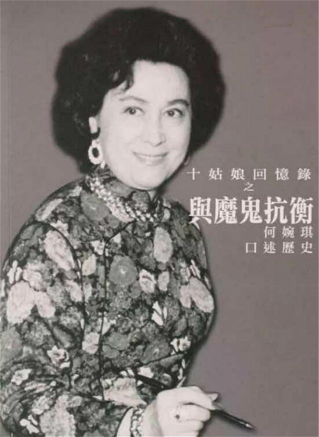

Tuy nhiên, cách nói này chưa chắc hoàn toàn là sự thật, bởi cuốn hồi ký của bà mang tính định hướng rõ ràng, ngay từ tên sách đã thể hiện — «Đối đầu với ác quỷ». “Ác quỷ” ở đây chính là ám chỉ người anh ruột của bà. Nhưng thực tế, bà không chỉ giúp anh trai gây dựng sự nghiệp, mà cũng là vì chính bản thân mình. Khi ngành giải trí – 𝗰𝗼 ̛̀𝗯𝗮̣𝗰 phát triển mạnh, bà cũng trở thành một nữ tỷ phú, có thể nói là vừa có danh vừa có lợi.

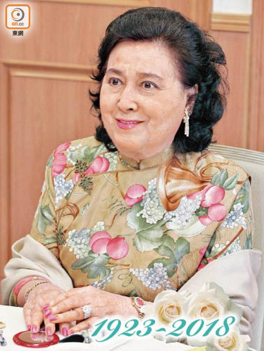

Hà Uyển Kỳ.
Về phía “Vua sòng bạc” Hà Hồng Sân, vì không ưa Mạch Thuấn Minh, lo ngại em gái và cả cơ nghiệp của mình bị liên lụy, cộng thêm việc bà tư Lương An Kỳ được ông yêu chiều, muốn lên nắm quyền, nên ông bắt đầu từng bước gạt bỏ quyền lực của Hà Uyển Kỳ, thậm chí còn yêu cầu em gái bán lại cổ phần cho Lương An Kỳ.

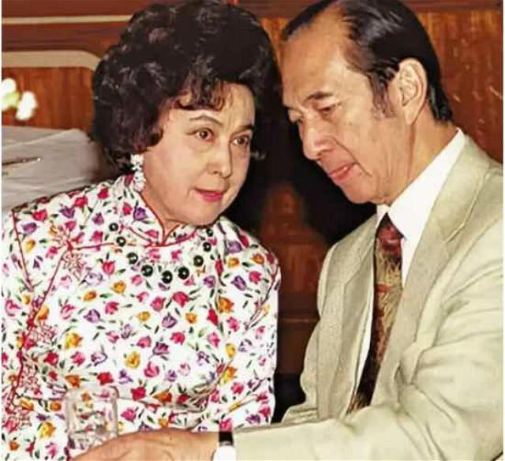

Hà Uyển Kỳ và anh trai Hà Hồng Sân.
Hà Uyển Kỳ không đồng ý, còn muốn đưa con trai mình là Mạch Thuấn Minh vào hội đồng quản trị. Nhưng với việc từ trước đến nay luôn không ưa người này, Hà Hồng Sân đương nhiên không thể chấp nhận, nên cuối cùng hai bên không đạt được thỏa thuận.
Sau đó, Hà Uyển Kỳ quyết định kiện anh trai Hà Hồng Sân, đòi lại cả tiền gốc lẫn cổ tức từ 2 triệu cổ phần ban đầu. Tuy nhiên, bà đã thua kiện, và “Vua sòng bạc” thẳng tay loại bà khỏi hội đồng quản trị.
Cơ nghiệp do chính tay mình gây dựng lại phải chắp tay nhường người khác, Hà Uyển Kỳ dĩ nhiên không cam lòng. Hơn nữa, bà cho rằng người con trai mà mình yêu thương nhất bị đối xử bất công, nên quyết định nói cho con biết thân thế thật sự.

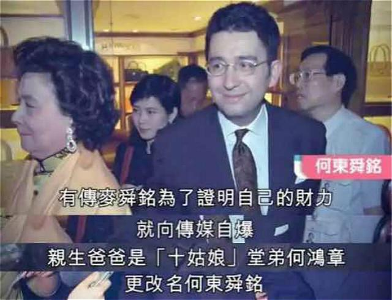

Hà Uyển Kỳ và con trai Hà Đông Thuấn Minh.
Không ngờ, Mạch Thuấn Minh lại không hề xấu hổ vì thân phận “con ngoài giá thú”, trái lại còn tổ chức họp báo, công khai tuyên bố mình là con của Hà Hồng Chương và Hà Uyển Kỳ, thậm chí còn đổi tên thành Hà Đông Thuấn Minh. Hành động này khiến người ta không khỏi đặt câu hỏi: Rốt cuộc đây là người như thế nào? Tự mình đứng ra xác nhận mối quan hệ trái luân thường giữa mẹ và cậu, đúng là một màn “đào hố cho mẹ” điển hình.
Sau khi đổi tên, Hà Đông Thuấn Minh còn trực tiếp lên tiếng với Hà Hồng Sân, khẳng định mình thuộc dòng dõi Hà Đông (do Hà Hồng Chương đã kế thừa tài sản của Hà Đông), cha ruột là Hà Hồng Chương, không thiếu tiền nên hoàn toàn không thể có chuyện nợ 𝗰𝗼 ̛̀𝗯𝗮̣𝗰.

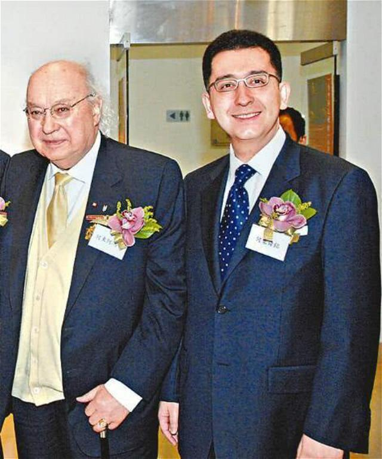

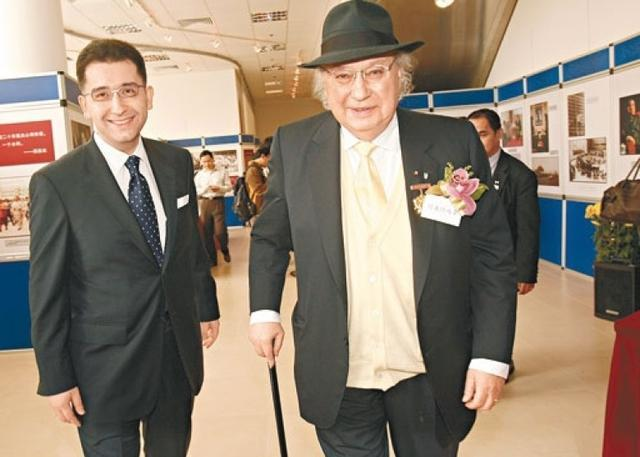

Hà Hồng Chương và con trai Hà Đông Thuấn Minh.
Về phía Hà Hồng Chương, ông cũng tỏ ra rất có trách nhiệm, nhanh chóng thừa nhận người con trai này, đồng thời đứng ra bảo vệ người tình Hà Uyển Kỳ.

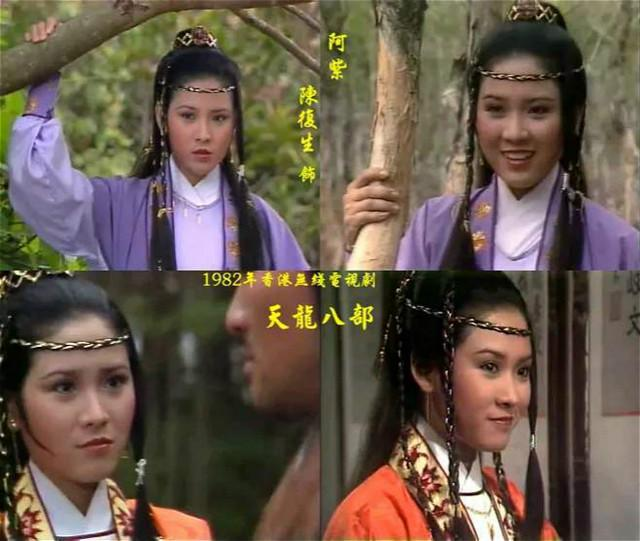

Sự việc lần này khiến mối quan hệ anh em giữa Hà Uyển Kỳ và Hà Hồng Sân hoàn toàn rạn nứt, kéo theo chuỗi kiện tụng dai dẳng như một cuộc chiến kéo co.
Dù trong giai đoạn khó khăn nhất của 2 mẹ con, Hà Hồng Chương đã đưa tay giúp đỡ nhưng vẫn không thể cứu vãn mối tình kéo dài hàng chục năm của hai người. Và nguyên nhân sâu xa, rốt cuộc vẫn xoay quanh cậu con trai cưng này.
Trong cuộc chiến kéo dài giữa “Vua sòng bạc” Hà Hồng Sân và em gái Hà Uyển Kỳ, có một người không thể không nhắc đến, đó chính là Trần Phục Sinh — người vợ kết tóc của Hà Đông Thuấn Minh.
Trần Phục Sinh.
Trần Phục Sinh từng là sao nhí tại Hong Kong, vai diễn nổi tiếng nhất của cô là A Tử trong phiên bản 1982 của “Thiên Long Bát Bộ”. Sau một thời gian nổi tiếng, cô cho rằng nữ minh tinh khó tránh khỏi quy luật nhan sắc
phai tàn nên đã sớm rút lui khỏi làng giải trí. Sau đó, thông qua bạn bè giới thiệu, cô quen biết Hà Đông Thuấn Minh, nhanh chóng kết hôn và lui về làm người vợ hiền, mẹ đảm.
Trần Phục Sinh cũng là một người phụ nữ rất nhanh nhạy, từ trước đến nay luôn hết lòng hiếu thuận với gia đình chồng. Mỗi khi mẹ chồng Hà Uyển Kỳ tham dự sự kiện, cô đều kề cận bên cạnh, thậm chí đảm nhận vai trò phiên dịch. Do về sau Hà Uyển Kỳ bị suy giảm thính lực hoặc đôi khi diễn đạt không rõ, Trần Phục Sinh luôn ở bên hỗ trợ.
Trong thời gian Hà Uyển Kỳ và Hà Hồng Sân kiện tụng, cô cũng góp không ít công sức.
Đối với cha chồng Hà Hồng Chương, cô cũng tận tâm chăm sóc, thậm chí còn cùng ông ra Bắc Kinh xem lễ thượng cờ. Hà Hồng Chương rất yêu quý người con dâu này.
Thế nhưng, người con trai không nên thân này lại liên tục dính vào bê bối tình ái, lại còn là kiểu người phủi tay làm lơ. Trong nhiều năm, Trần Phục Sinh hầu như không gặp được chồng, thậm chí còn không có cả số điện thoại trực tiếp của chồng, muốn liên lạc cũng phải thông qua nhiều lớp trung gian mới được.
Cuối cùng, Trần Phục Sinh hoàn toàn tuyệt vọng, lấy lý do “đối phương có hành vi không hợp lý” để đơn phương tuyên bố ly hôn. Sau đó, hai người còn đưa nhau ra tòa vì tranh chấp tiền cấp dưỡng. Cần biết rằng Hà Đông Thuấn Minh là người cực kỳ đam mê sưu tầm siêu xe, bộ sưu tập khiến nhiều người phải choáng váng.
Chính Trần Phục Sinh là người từng công khai những điều này, nhưng sau khi ly hôn, Hà Đông Thuấn Minh lại không chịu chu cấp tiền nuôi con, khiến cô vô cùng chạnh lòng và tức giận. Dù sao các con vẫn cần được nuôi dưỡng, nhưng Hà Đông Thuấn Minh chỉ lo cho bản thân, bỏ mặc con ruột, bị xem là quá lạnh nhạt.
Hà Hồng Chương và Trần Phục Sinh.

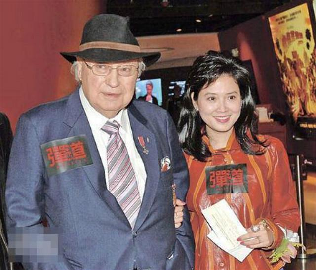

Vụ ly hôn giữa Hà Đông Thuấn Minh và Trần Phục Sinh đã khiến Hà Hồng Chương nổi giận. Ông cho rằng con trai mình bỏ vợ bỏ con, lại còn ăn chơi lêu lổng, nên quay sang ủng hộ Trần Phục Sinh, thậm chí từ chối nhận người con trai này.
Trước đây, khi Hà Đông Thuấn Minh và Hà Uyển Kỳ bị công kích, ông là người đầu tiên đứng ra bảo vệ, vậy mà giờ lại không nhận con, đủ thấy ông đã tức giận đến mức nào.
Nguyên nhân cũng vì ông luôn giữ gia huấn của nhà họ Hà — phải đối xử tử tế với vợ con. Dù bản thân từng ngoại tình với Hà Uyển Kỳ (điều này không có nghĩa là cổ súy cho việc ngoại tình), nhưng ông vẫn luôn đối xử rất tốt với người vợ chính thức.
Nếu không, năm xưa khi ông thừa nhận đứa con ngoài giá thú này, khiến 2 người con trai với vợ cả tức giận đến mức liên kết kiện cha ra tòa, thì chính người vợ là Xa An Ni vẫn đứng ra cùng ông ra tòa, đối đầu với 2 con trai.

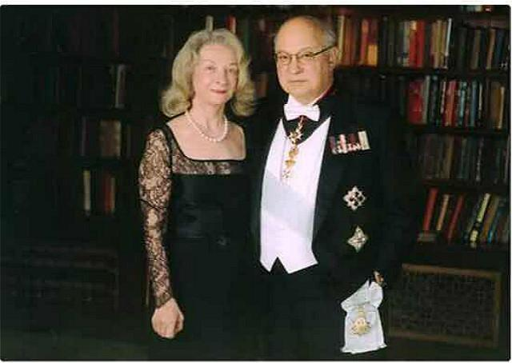

Xa An Ni và Hà Hồng Chương.
Điều này hoàn toàn trái ngược với cách Hà Uyển Kỳ nuông chiều Hà Đông Thuấn Minh vô điều kiện. Khi thấy Hà Hồng Chương không nhận con trai mình, bà vô cùng tức giận, ủng hộ con khởi kiện cha ruột vì tội phỉ báng, thậm chí còn đòi khoản bồi thường danh dự lên tới 600 triệu đô la Hong Kong.
Từ đó, Hà Uyển Kỳ bắt đầu xa lánh Hà Hồng Chương, từ chối nhận quà và không cho ông đến thăm. Cũng có ý kiến cho rằng việc này một phần là do Hà Đông Thuấn Minh ngăn cản.
Trước khi hai người hoàn toàn rạn nứt, Hà Hồng Chương từng nói rằng Hà Đông Thuấn Minh rất biết cách lấy lòng mẹ, vì vậy Hà Uyển Kỳ gần như chiều theo con trai vô điều kiện.
Về phía Hà Hồng Chương, không thể gặp người tình khiến ông vô cùng tức giận, liền đòi lại khoản 2 triệu năm xưa đã đưa cho Hà Uyển Kỳ. Nhưng bà lại cho rằng: “Số tiền đó là vì tôi là mẹ của Hà Đông Thuấn Minh, anh vì yêu tôi mà cho, chứ không phải cho vay.”
Hà Uyển Kỳ (trái) và Hà Hồng Chương (phải).
Thực ra, với mức độ tình cảm mà Hà Hồng Chương dành cho Hà Uyển Kỳ, việc ông đòi lại 2 triệu đó không hẳn

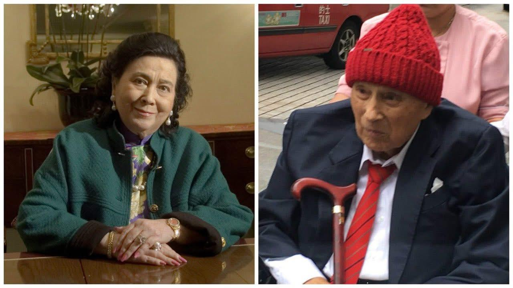

là vì tiền. Nếu thực sự muốn lấy lại, ông đã làm từ lâu, tất cả chỉ là vì không nuốt trôi cơn tức.
Thế nhưng, chính chuyện này đã trở thành giọt nước tràn ly, cắt đứt mối tình kéo dài hàng chục năm giữa hai người.

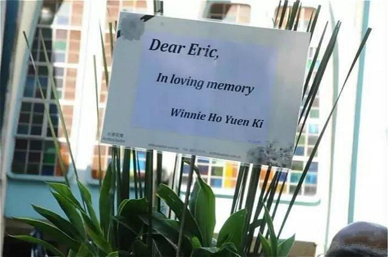

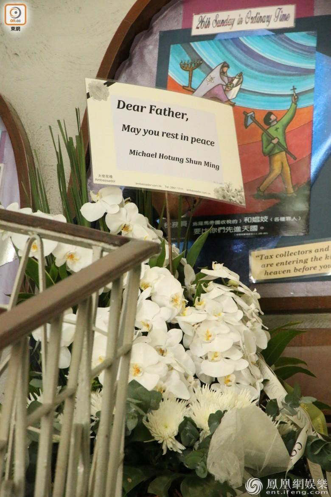

Nguyện vọng cuối đời của Hà Hồng Chương là mong Hà Uyển Kỳ và Hà Đông Thuấn Minh có thể đến dự tang lễ của mình nhưng cuối cùng vẫn không thành. Hai mẹ con chỉ gửi vòng hoa và thiệp chia buồn.

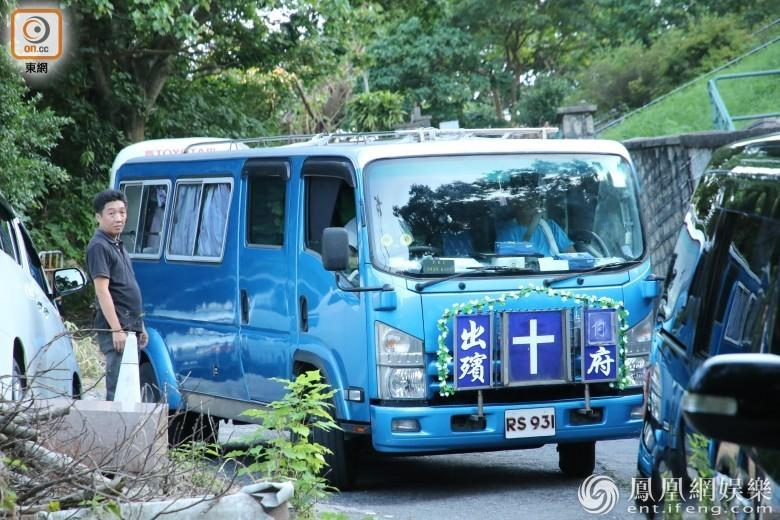

Còn Hà Uyển Kỳ cũng không hề may mắn hơn. Nửa đời trước tuy sống trong hào quang, nhưng chỉ bản thân bà mới hiểu hết những khổ tâm bên trong. Nửa đời sau, bà gần như vì con trai Hà Đông Thuấn Minh mà đối đầu với cả thế giới — trở mặt với người anh ruột từng kề vai chiến đấu, cắt đứt mối tình kéo dài nửa thế kỷ, và suốt hơn 10 năm không qua lại với chính những người con còn lại của mình.
Thậm chí đến lúc Hà Uyển Kỳ lâm chung, ngoài Hà Đông Thuấn Minh, các con khác đều không có mặt (thực tế việc Hà Đông Thuấn Minh có ở đó hay không cũng không chắc chắn). Mãi 2 tháng sau khi bà qua đời, tin tức mới được tiết lộ.
Cả một đời Hà Uyển Kỳ từng rực rỡ đến nhường nào — sinh ra đã ngậm thìa vàng, có cha mẹ và anh trai hết mực yêu thương, lại có một người tình yêu bà suốt đời, sự nghiệp cũng thuận buồm xuôi gió, gần như muốn gì được nấy.
Thế nhưng, tất cả lại dần tan vỡ, phần lớn cũng vì sự nuông chiều quá mức dành cho con trai Hà Đông Thuấn Minh, khiến bà rơi vào cảnh bị người thân quay lưng. Không biết giờ đây, ở một thế giới khác, bà có từng hối hận về sự nuông chiều đó hay không?
Lễ tang của Hà Hồng Chương

> © Lược dịch từ bài viết được đăng tải ngày 4 tháng 10 năm 2017 trên ifeng với tiêu đề “Em họ của ‘Vua sòng bạc’ được đưa tang, không thấy tình cũ ‘Thập cô nương’ xuất hiện, con trai ngoài giá thú gửi vòng hoa phúng viếng.”
> Đoàn xe đưa tang.
> Ngày 3/10/2017, tại Hong Kong, Hà Hồng Chương – cháu trưởng của cố tước sĩ Hà Đông – qua đời vào ngày 20/9, hưởng thọ 91 tuổi. Lễ tưởng niệm được tổ chức vào chiều hôm qua tại Nhà thờ Thánh Giuse, sau đó linh cữu được đưa đến nghĩa trang gia tộc họ Hà ở Chiêu Viễn để an táng.
> Con trai thứ tư của Hà Hồng Chương là Hà Bưu (Sean) có mặt từ sớm để lo liệu. Bạn gái của Hà Bưu – cũng là người được Hà Hồng Chương xem như con dâu, Ông Tĩnh Tinh – ở bên hỗ trợ.
> Con trai trưởng Hà Hạo (Michael) cùng vợ là Hà Miêu Xuân Huy và con gái út Sophia, con trai thứ năm Hà Báo (Anthony) và con gái cả Hà Mỹ Vân (Mara) cũng có mặt để tiễn biệt cha.
> Về phía chị họ kiêm người tình cũ của Hà Hồng Chương là “Thập cô nương” Hà Uyển Kỳ, cùng con trai ngoài giá thú của hai người là Hà Đông Thuấn Minh, chỉ gửi vòng hoa phúng viếng mà không xuất hiện.
> Hơn 100 người thân và bạn bè đã đến chia buồn, trong đó có nhân vật nổi tiếng trong giới quan hệ công chúng Trương Chỉ Sân.
> Sau khoảng 1 giờ, nghi thức kết thúc. Khi mọi người tập trung tại bãi đỗ xe tầng hầm, ban nhạc bắt đầu cử hành nhạc lễ, Hà Bưu ôm di ảnh đi theo linh cữu lên xe tang. Vòng hoa do Hà Uyển Kỳ và Hà Đông Thuấn Minh gửi cũng được đưa lên xe cùng linh cữu. Mara ôm chồng là Ilyas khóc nức nở, Hà Miêu Xuân Huy cũng tiến đến an ủi cô. Trong ảnh là con trai trưởng Hà Hạo cùng vợ Hà Miêu Xuân Huy và con gái út Sophia đến dự lễ.
> Hà Mỹ Vân ôm chồng, Ilyas, bật khóc nức nở.
> Hà Miêu Xuân Huy và con gái.
> Hà Hồng Chương (Sir Eric Edward Hotung) là doanh nhân giàu có kiêm nhà từ thiện tại Hong Kong, sinh năm 1926 trong một gia đình lai Á – Âu. Gia tộc họ Hà bắt đầu từ những năm 1890, là một trong 4 gia tộc lớn nhất Hong Kong, với khối tài sản ước tính hàng chục tỷ đô la Hong Kong, trong đó có Tập đoàn Tứ Hải Quốc Tế.
> Là cháu trưởng của Hà Đông, địa vị trong gia tộc của ông thậm chí còn cao hơn cả “Vua sòng bạc” Hà Hồng Sân lừng danh Hong Kong và Macau. Bản thân ông sở hữu hơn 200 bất động sản trên toàn thế giới, và năm 1965 đã thành lập “Quỹ Tín thác Hà Hồng Chương” nhằm hỗ trợ sinh viên Hong Kong du học nước ngoài.
> Năm 1941, Hà Hồng Chương nảy sinh tình cảm với chị họ Hà Uyển Kỳ (Thập cô nương), sau đó sinh ra con trai ngoài giá thú là Mạch Thuấn Minh (nay là Hà Đông Thuấn Minh).
> Năm 1978, ông lập quỹ tín thác cho con trai, chỉ định tình nhân bí mật “Thập cô nương” làm người quản lý.
> Năm 2001, 2 con trai của ông là Hà Bưu và Hà Báo đã kiện người quản lý là “Thập cô nương” liên quan đến vấn đề cổ phần của 2 công ty gia tộc.
> Đến năm 2005, Hà Hồng Chương đứng ra cùng “Thập cô nương” đối chất trước tòa với các con nhưng cuối cùng thất bại. Trong ảnh là Hà Bưu ôm di ảnh.
> Hà Uyển Kỳ là em gái ruột của “Vua sòng bạc” Hà Hồng Sân tại Macau, đứng thứ 10 trong gia đình nên được gọi là “Thập cô nương”. Bà từng kết hôn với Mạch Chí Vĩ, nhưng sau đó lại có quan hệ ngoài hôn nhân với người em họ cùng cụ tổ là Hà Hồng Chương, sinh ra 2 người con ngoài giá thú là Mạch Thuấn Minh và Mạch
> Huệ Ngọc. Bà từng vay một khoản tiền lớn từ Hà Hồng Sân để trả nợ cho con trai. Về sau, mâu thuẫn giữa bà và “Vua sòng bạc” tiếp tục leo thang.
> Truyền thông Hong Kong cho biết bà từng đề xuất mua lại cổ phần của Hà Hồng Sân trong Công ty Du lịch Giải trí Macau (SJM).
> Tháng 1/2002, Hà Hồng Sân bất ngờ gửi thông báo viết tay đến toàn thể nhân viên, tuyên bố cách chức toàn bộ vai trò quản lý của “Thập cô nương” tại công ty, khép lại hàng chục năm quyền lực của bà trong ngành sòng bạc. Trong lễ tang lần này, “Thập cô nương” chỉ gửi vòng hoa mà không xuất hiện.
> “Vũ Hậu” của “Vua sòng bạc” Hà Hồng Sân
> © Lược dịch từ bài viết của @瓜姐的眼 trên Sohu.
> Bài gốc được đăng tải ngày 13 tháng 1 năm 2022 với tiêu đề “Khi cưới Lam Quỳnh Anh, bộ luật Đại Thanh ở Macau vẫn chưa bị bãi bỏ, vì vậy hai người là vợ chồng hợp pháp. Bà cũng được xem là ‘Vũ Hậu’ của ‘Vua sòng bạc’.”
> ‧₊˚❀༉‧₊˚

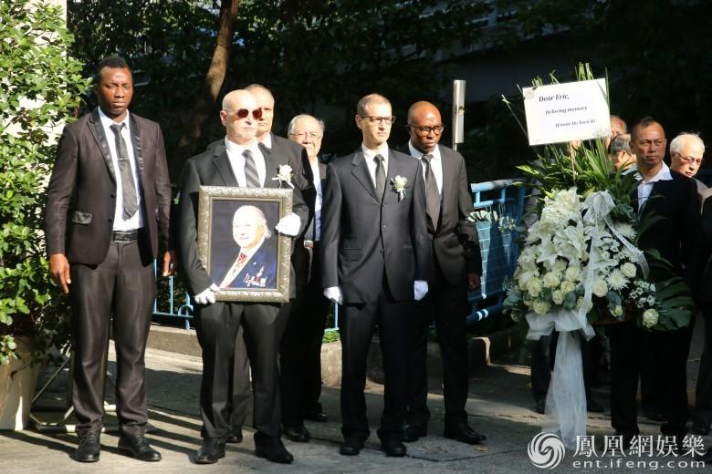

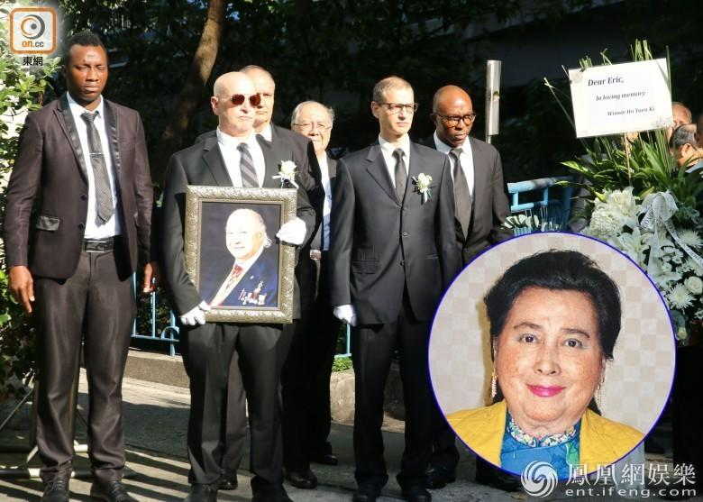

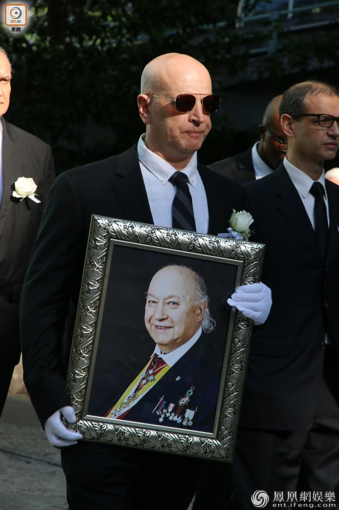

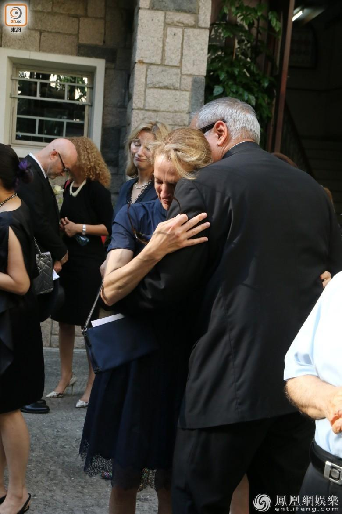

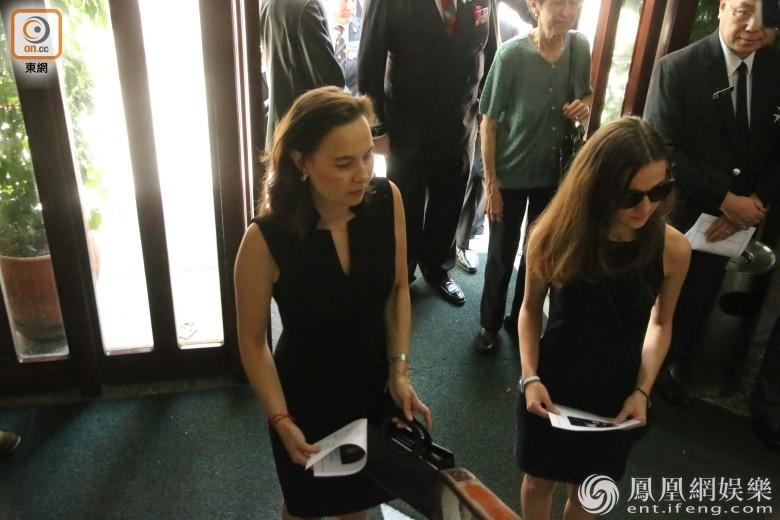

Ở Trung Quốc, người có thể được gọi là “Vua sòng bạc” thực ra chỉ có một, đó là Hà Hồng Sân. Có thể nói rằng sản nghiệp của ông trải khắp toàn cầu, khối tài sản cực kỳ khổng lồ. Trong suốt cuộc đời, ông cũng đã làm rất nhiều hoạt động từ thiện.
Tuy nhiên, so với thành công trên thương trường, đời sống tình cảm của ông còn phong phú và nhiều màu sắc hơn. Từng có tin đồn cho rằng Viên Vịnh Nghi và Lợi Trí đều có thời gian qua lại với ông.
Nhưng những người vợ được công nhận chính thức của Hà Hồng Sân thực ra chỉ có 4 người.

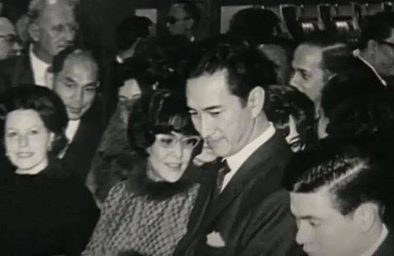

Lê Uyển Hoa và Hà Hồng Sân.
Người thứ nhất là bà cả Lê Uyển Hoa, cũng là nhân chứng số 1 chứng kiến quá trình ông từ một chàng trai nghèo tích lũy được xô vàng đầu tiên trong đời.

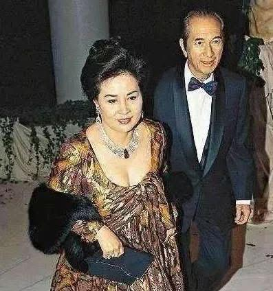

Lam Quỳnh Anh và Hà Hồng Sân.
Người thứ hai là Lam Quỳnh Anh.
Hà Hồng Sân và Trần Uyển Trân.

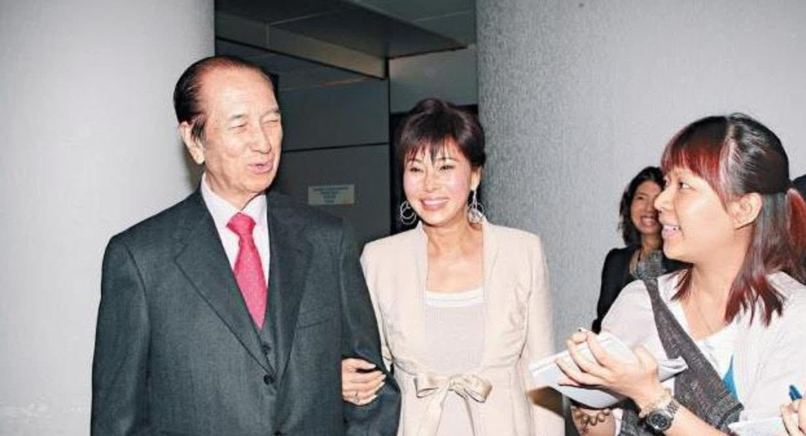

Người thứ ba là Trần Uyển Trân, từng là y tá chăm sóc riêng cho Lê Uyển Hoa trong những năm đầu.
Người thứ tư chính là Lương An Kỳ.
So với 3 người trước, có lẽ công chúng quen thuộc với Lương An Kỳ hơn. Thứ nhất, bà là người trẻ tuổi nhất. Thứ hai, bà cũng là người gần gũi với truyền thông nhất. Bà còn được gọi là người phụ nữ được Hà Hồng Sân nuông chiều nhất lúc sinh thời. Trước khi Hà Hồng Sân nghỉ hưu, Lương An Kỳ được xem là “Vũ Hậu” của ông. Bản thân bà xuất thân là vũ công, có gương mặt xinh đẹp và vóc dáng nổi bật.
Thêm vào đó là trí tuệ cảm xúc cao và đầu óc kinh doanh nhạy bén, nên bà nhanh chóng thay thế Trần Uyển Trân trở thành người thường xuyên tháp tùng Hà Hồng Sân tham dự các sự kiện. Dĩ nhiên, bà cũng nhiều lần khiêu vũ cùng ông, vì vậy được xem là “Vũ Hậu cuối cùng” của “Vua sòng bạc”.
Vì sao lại nói như vậy? Bởi vì “Vũ Hậu” của Hà Hồng Sân không chỉ có một người. Ở mỗi giai đoạn khác nhau trong cuộc đời, ông lại có những bạn nhảy nổi bật khác nhau.
Người vợ cả Lê Uyển Hoa xuất thân từ gia đình danh giá, thuộc một gia tộc Bồ Đào Nha có thế lực, và từng giúp Hà Hồng Sân gây dựng sự nghiệp tại Macau trong những năm đầu.

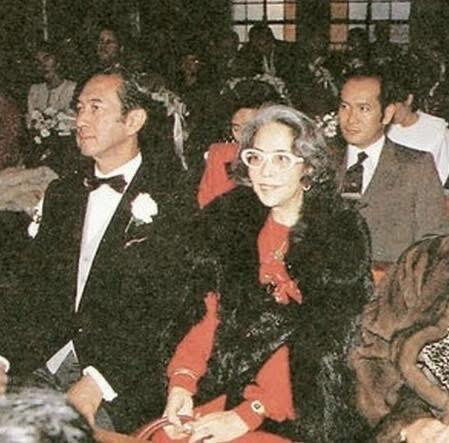

Hà Hồng Sân và Lê Uyển Hoa.
Hà Siêu Hiền (con gái của Hà Hồng Sân × Lê Uyển Hoa) từng tiết lộ rằng khi Hà Hồng Sân còn là chàng trai nghèo theo đuổi Lê Uyển Hoa, ông đã đặc biệt đi học tiếng Bồ Đào Nha để có thể giao tiếp với gia đình bà. Mỗi khi Lê Uyển Hoa tan học, ông lại đạp xe đến khu Sơn Thủy Viên nơi bà ở để hẹn hò, rồi sau giờ làm việc lại rủ bà đi uống trà.
Chính sự theo đuổi nhiệt tình của Hà Hồng Sân năm đó đã khiến Lê Uyển Hoa chọn ông giữa rất nhiều người theo đuổi xuất sắc. Sau khi hai người kết hôn, Hà Hồng Sân quả thực nhận được sự giúp đỡ từ gia đình vợ, từ đó bắt đầu từng bước xây dựng và mở rộng đế chế kinh doanh của mình.
Nhưng sau khi Lê Uyển Hoa gặp tai nạn xe hơi, ông lại cưới Lam Quỳnh Anh.
Gia đình Lam Quỳnh Anh cũng có thế lực khá mạnh. Khi ấy bà mới 14 tuổi. Trước khi cưới Lam Quỳnh Anh, Hà Hồng Sân còn chủ động nói rõ tình hình với gia đình nhà họ Lê, rằng Lê Uyển Hoa đã phải nằm liệt giường, không thể sống như người bình thường, đồng thời nhấn mạnh rằng bản thân không thể sống như một hoà thượng. Vì vậy, cô gái mới 14 tuổi Lam Quỳnh Anh trở thành nhị phu nhân.
Vì sao khi đó pháp luật lại cho phép ông cưới 2 vợ? Nguyên nhân là tuy nhà Thanh đã không còn, nhưng luật lệ Đại Thanh ở Macau khi ấy vẫn chưa bị bãi bỏ. Do đó, thân phận của Lam Quỳnh Anh không phải là người thứ 伉俪, ba mà là chính thất hợp pháp. Trong nhiều năm, Hà Hồng Sân vẫn gọi bà là ý chỉ vợ chồng hợp pháp. Ở điểm này, Lam Quỳnh Anh khác với Trần Uyển Trân và Lương An Kỳ.
Sau khi cưới Lam Quỳnh Anh, cô gái trẻ này nhanh chóng thể hiện sự lanh lợi và quyết đoán, dần thay thế Lê Uyển Hoa tháp tùng Hà Hồng Sân tham dự nhiều buổi tiệc và sự kiện xã hội. Bà xinh đẹp, EQ cao, lại nhảy rất giỏi. Vì thế, trong nhiều dạ tiệc từ thiện và vũ hội, bà thường cùng Hà Hồng Sân khiêu vũ. Khi ấy, Hà Hồng Sân được gọi là “Vũ Vương”, còn Lam Quỳnh Anh được gọi là “Vũ Hậu”.

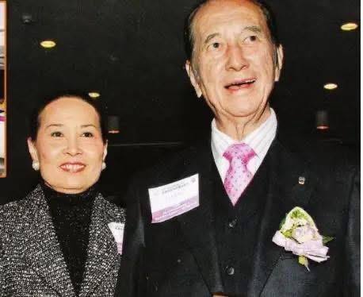

Lam Quỳnh Anh và Hà Hồng Sân.
Có thể nói, đế chế kinh doanh của Hà Hồng Sân không thể thiếu những năm tháng Lam Quỳnh Anh bôn ba giúp đỡ phía sau. Bà cũng là người vợ độc chiếm sự ưu ái của Hà Hồng Sân suốt gần 30 năm.
Sau này, khi cha của Lam Quỳnh Anh di cư sang Canada và cần người chăm sóc, bà đã sang đó sinh sống. Trong lúc vừa chăm sóc cha, bà còn quản lý ngành kinh doanh thời trang của Hà Hồng Sân tại Canada. Chính trong khoảng thời gian này, Trần Uyển Trân — người trước đó chăm sóc cho bà cả Lê Uyển Hoa — được Hà Hồng Sân để ý và ưu ái. Sau đó bà chính thức thay thế Lam Quỳnh Anh trở thành “Vũ Hậu” của một giai đoạn mới.
Trong những sự kiện về sau, Trần Uyển Trân thường thanh lịch sánh bước cùng Hà Hồng Sân khiêu vũ. Bà rất tích cực tham gia các hoạt động từ thiện, tính cách lại dịu dàng, vì vậy có thể xem là người kế nhiệm Lam Quỳnh Anh khá suôn sẻ.
Lương An Kỳ và Hà Hồng Sân.
Thế nhưng khoảng thời gian ấy cũng không kéo dài quá lâu, bởi sau đó lại xuất hiện Lương An Kỳ. Hai người quen nhau cũng tại một buổi dạ tiệc khiêu vũ. Lương An Kỳ từng kể lại rằng khi ấy “Vua sòng bạc” vừa gặp đã nắm tay bà, và trong đêm hôm đó hai người liên tiếp nhảy với nhau nhiều bản nhạc. Sau đó đúng như mọi người dự đoán, Lương An Kỳ lại trở thành người thay thế Trần Uyển Trân, trở thành “Vũ Hậu” mới.

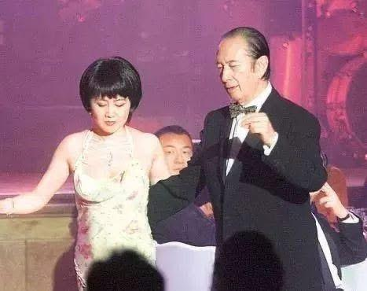

“Vũ Hậu” cuối cùng của Hà Hồng Sân chính là Lương An Kỳ. Hiện nay trên mạng vẫn có rất nhiều video ghi lại cảnh Lương An Kỳ và Hà Hồng Sân khiêu vũ cùng nhau. Nhưng thực ra, vào thời điểm Lam Quỳnh Anh thường xuyên tháp tùng ông khiêu vũ, đó chính là giai đoạn Hà Hồng Sân còn trẻ trung và phong độ nhất, và thời gian bà giữ vị trí “Vũ Hậu” cũng không hề ngắn hơn Lương An Kỳ.
“Vũ Vương” thì cố định, còn “Vũ Hậu” thì thay hết người này đến người khác.
Kể cả vào những năm cuối đời của Hà Hồng Sân, Lam Quỳnh Anh cũng luôn sống tại Canada. Có lẽ trong nửa đầu cuộc đời, bà cũng từng phải tranh giành tình cảm, ghen tuông như bao người khác. Nhưng giờ đây, khi người thân sống bình yên và thoải mái, có lẽ đó cũng được xem là một cái kết khá tốt.
Melanie Susan Potier (Suki Potier) – vợ của Hà Du Quang

> @不八卦会死星人 © Dịch từ bài viết của trên QQ.
> Bài gốc được đăng tải ngày 29 tháng 5 năm 2020 với tiêu đề “Vợ của con trai trưởng ‘Vua sòng bạc’ có số phận quá trắc trở! Trải qua 3 mối tình thì cả 3 người cô yêu đều qua đời, từ người mẫu bước chân vào hào môn trở thành phu nhân danh giá nhưng cuối cùng lại yểu mệnh.”
> ‧₊˚❀༉‧₊˚

Sau khi Hà Hồng Sân qua đời, trên mạng tràn ngập những tin đồn về chuyện hôn nhân của con cái nhà họ Hà. Nhưng nếu nói đến chuyện cưới gả trong gia đình này, thì câu chuyện của con trai trưởng Hà Du Quang và người vợ của anh thực sự ly kỳ, đầy màu sắc.
Hà Du Quang từ khi sinh ra đã là đích trưởng tử của “Vua sòng bạc”, từ nhỏ đã được cha định hướng trở thành người kế nghiệp. Ngay cả tên tiếng Anh cũng được đặt là “Robert”, trùng với tên của người bác họ mà Hà Hồng Sân kính trọng nhất – ngài Hà Đông, người đứng đầu gia tộc họ Hà và cũng là vị tỷ phú đầu tiên của Hong Kong.
Không chỉ vậy, Hà Du Quang còn được xem là người có ngoại hình nổi bật nhất và năng lực xuất sắc nhất trong số các con của Hà Hồng Sân. Thế nhưng số phận trớ trêu, năm 1981, khi mới 33 tuổi, anh cùng vợ đã qua đời trong một vụ 𝘁𝗮𝗶 𝗻𝗮̣𝗻 xe hơi tại Bồ Đào Nha.
Vì vậy, tác giả đã tìm hiểu thêm về người vợ của Hà Du Quang, phát hiện cô đúng chuẩn nữ chính ngôn tình ngoài đời thực. Cuộc đời cô thăng trầm dữ dội, vận mệnh trắc trở đến mức phim truyền hình cũng khó mà dám xây dựng như vậy.
Có lẽ nhiều người chưa từng nghe qua cái tên Suki Potier. Theo tư liệu, cô là người Anh, xuất thân trong một gia đình bình thường. Khi trưởng thành, để mưu sinh, cô đã đến khu Chelsea ở London làm người mẫu.
Dù bản thân Suki Potier khá bình thường, nhưng 2 người bạn trai trước đó của cô lại không hề tầm thường — một người là người thừa kế gia tộc giàu có, người còn lại là ngôi sao nhạc rock nổi tiếng.
Người bạn trai đầu tiên của cô là Brown, người thừa kế của Kỷ lục Thế giới Guinness. Đáng tiếc, trong một lần cả hai lái xe đi dạo, chiếc xe do Brown điều khiển đã đ𝗮̂𝗺 vào một chiếc xe tải đang đỗ bên đường. Brown 𝗯𝗶 ̣ 𝘁𝗵𝘂̛𝗼̛𝗻𝗴 𝗻𝗮̣̆𝗻𝗴 và qua đời vào ngày hôm sau vì 𝘃𝗲̂́𝘁 𝘁𝗵𝘂̛𝗼̛𝗻𝗴 quá nghiêm trọng.
Không lâu sau vụ 𝘁𝗮𝗶 𝗻𝗮̣𝗻, Suki Potier bắt đầu mối quan hệ với Jones – bạn thân của Brown. Sau khi Brown qua đời, Jones luôn ở bên cạnh chăm sóc, an ủi cô, hai người dần nảy sinh tình cảm trong quá trình gắn bó lâu dài, rồi nhanh chóng xác nhận quan hệ yêu đương.
Sau khi đến với nhau, Suki Potier và Jones rất hạnh phúc. Họ không ngại thể hiện tình cảm nơi công cộng, thường xuyên hôn nhau và gần như lúc nào cũng kề cận, khiến người khác không khỏi ngưỡng mộ.

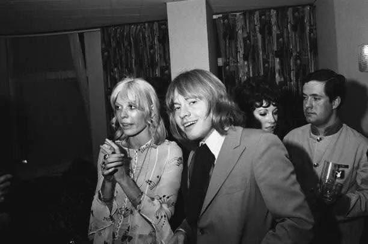

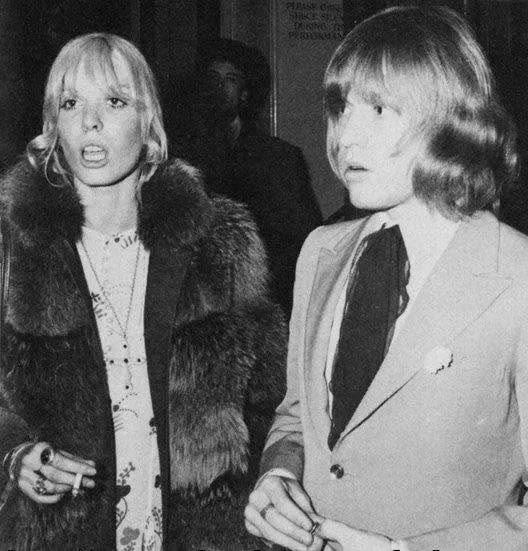

Suki Potier và Jones.
Tuy nhiên, việc Suki Potier nhanh chóng đến với bạn của người yêu cũ ngay sau khi người đó qua đời cũng khiến không ít người bất ngờ. Không rõ vào thời điểm đó, cô và Jones có phải chịu những lời bàn tán hay chỉ trích hay không.
Nhưng cuộc đời vốn khó lường, cặp đôi tưởng chừng hạnh phúc ấy cuối cùng vẫn không thoát khỏi sự trêu ngươi của số phận.
Ngay trong năm Suki Potier và Jones chia tay, Jones lại qua đời do đuối nước trong hồ bơi tại nhà khi đang say rượu. Cũng có nguồn tin cho rằng Jones vốn nóng tính, 𝗻𝗴𝗵𝗶𝗲̣̂𝗻 𝗿𝘂̛𝗼̛̣𝘂, thậm chí có khả năng bị công nhân

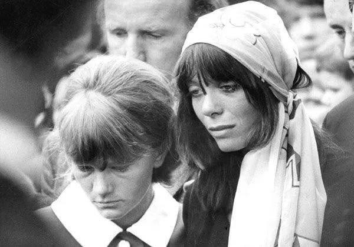

sửa chữa 𝗱𝗶̀𝗺 𝗰𝗵𝗲̂́𝘁.
Tại tang lễ của Jones, Suki Potier vô cùng đau buồn. Cô đội khăn trắng, gương mặt đầy vẻ u sầu, phải nhờ bạn bè dìu đỡ mới đứng vững, đủ để thấy cú sốc tinh thần lớn đến mức nào.
Người ta vẫn nói khi một cánh cửa khép lại, sẽ có một cánh cửa khác mở ra. Với Suki Potier, vận may dường như lại mỉm cười. Không lâu sau khi Jones qua đời, cô gặp được tình yêu đích thực của đời mình – Hà Du Quang.

Hà Du Quang và Suki Potier.
Hai người quen nhau tại Đại học London, vừa gặp đã trúng tiếng sét ái tình, nhanh chóng kết hôn. Sau khi cưới, Suki Potier còn sinh cho Hà Du Quang 2 cô con gái.

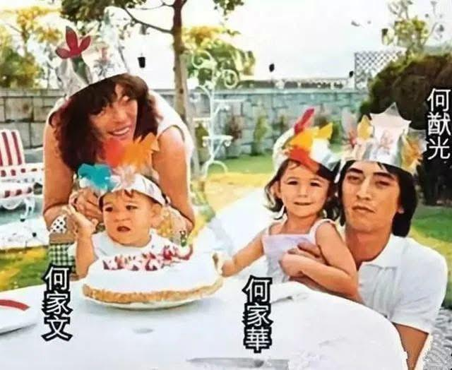

Vợ chồng Hà Du Quang × Suki Potier bên 2 con gái Hà Gia Hoa (phải), Hà Gia Văn (trái).
Dù trong giới có không ít tin đồn rằng gia đình họ Hà không đồng ý cuộc hôn nhân này, nhưng nhờ sự kiên quyết của Hà Du Quang, cuối cùng hai người vẫn đến được với nhau.
Sau khi kết hôn, Suki Potier theo chồng về Hong Kong sinh sống.
Cả hai không tổ chức hôn lễ quá rình rang, nhưng cuộc sống sau hôn nhân lại vô cùng hạnh phúc. Hà Du Quang cũng không hề đào hoa như cha mình là Hà Hồng Sân, ngược lại suốt nhiều năm kết hôn không dính bất kỳ tin đồn tình ái nào, một lòng một dạ với vợ.
Thế nhưng không biết có phải vận may cả đời của Suki Potier đều đã dùng hết vào việc gặp gỡ những người bạn trai giàu có hay không, mà sau vài năm hạnh phúc bên Hà Du Quang, trên đường trở về từ Bồ Đào Nha, hai người lại không may gặp 𝘁𝗮𝗶 𝗻𝗮̣𝗻 xe hơi và cùng qua đời.
Suki Potier trải qua 3 mối tình, cả 3 người đàn ông đều lần lượt qua đời. Cũng không lạ khi chính con gái cô từng than thở rằng mẹ mình “số không may”. Cuộc đời cô có thể nói là hiếm có khó tìm — xuất thân bình thường nhưng lại liên tiếp quen 3 người bạn trai thuộc giới thượng lưu, chẳng khác nào phiên bản đời thực của câu chuyện “chim sẻ hóa phượng hoàng”.
Những trải nghiệm như vậy vốn chỉ thường xuất hiện trong tiểu thuyết. Giờ đây, khi Hà Hồng Sân qua đời, chuyện tình cảm của Suki Potier – người từng là con dâu trưởng – cũng bị khui lại. Phải nói rằng, mỗi thành viên trong gia tộc “Vua sòng bạc” đều là một huyền thoại.
Hà Thiến Hành – con gái của Hà Siêu Phượng × Hà Chí Kiên

> © Lược dịch từ bài viết của @树娃 trên Sohu.
> Bài gốc được đăng tải ngày 15 tháng 8 năm 2023 với tiêu đề “Cháu ngoại 26 tuổi của ‘Vua sòng bạc’ tốt nghiệp thạc sĩ, sắp vào làm tại hãng luật ở New York, sản nghiệp của nhánh bà hai e rằng không có người kế thừa”.
> ‧₊˚❀༉‧₊˚

Khi còn sống, Hà Hồng Sân rất coi trọng việc học của con cái. Một trong những tâm nguyện của ông là hy vọng tất cả các con đều có thể hoàn thành chương trình đại học.
Trong 4 nhánh của gia đình, những học sinh xuất sắc hầu như đều tập trung ở con cái của nhánh bà tư. Ví dụ như cậu con trai út Hà Du Quân và cô con gái út Hà Siêu Hân đều là những học sinh xuất sắc.
Người khiến gia tộc tự hào nhất phải kể đến Hà Siêu Hân: không chỉ hoàn thành trước thời hạn 2 bằng tại Viện Công nghệ Massachuses (MIT) mà còn sang Đại học Thanh Hoa học nâng cao thêm 1 năm, thành tích vô cùng nổi bật.
Thực tế, ngoài nhánh bà tư thì trong các thành viên của nhánh bà hai cũng có những người học rất giỏi. 2 con gái của Hà Siêu Phượng đều là những học sinh xuất sắc khá kín tiếng. Đặc biệt là cô con gái út Hà Thiến Hành, chỉ mất 1 năm đã hoàn thành chương trình tại Trường Luật Đại học Columbia, và sắp tới sẽ gia nhập một trong những hãng luật hàng đầu nước Mỹ.

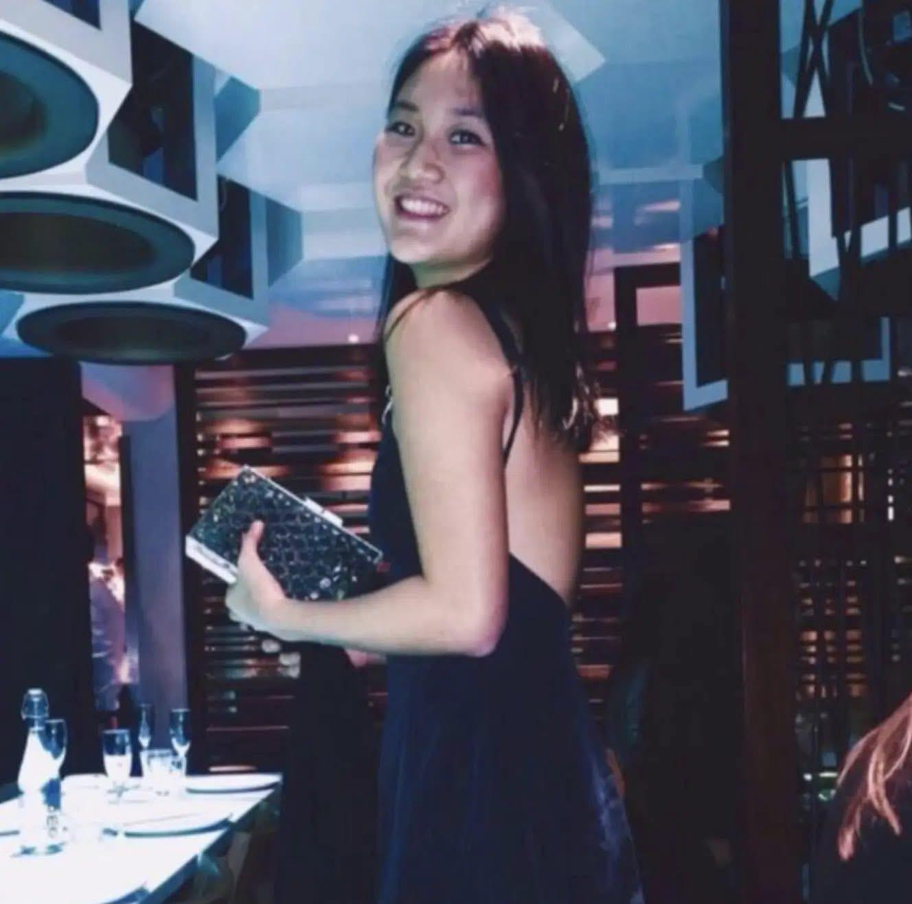

Hà Thiến Hành (Gillian Ho).
Năm nay 26 tuổi, Hà Thiến Hành là cháu ngoại thuộc nhánh bà hai của Hà Hồng Sân. So với chị gái Hà Tư Hành, cô sống kín tiếng hơn nhiều. Dù đôi khi cũng xuất hiện trong một vài sự kiện xã hội, nhưng tần suất rất thấp, tính cách cũng không phô trương. Nhiều năm qua cô gần như chỉ âm thầm tập trung hoàn thành việc học.
Thực ra Hà Thiến Hành đã tốt nghiệp Đại học Columbia từ năm 2020. Sau khi tốt nghiệp, cô không vội tìm việc cũng không có ý định vào làm trong doanh nghiệp của gia tộc, mà tiếp tục chuẩn bị cho việc học lên cao hơn và nộp đơn vào các trường danh tiếng.

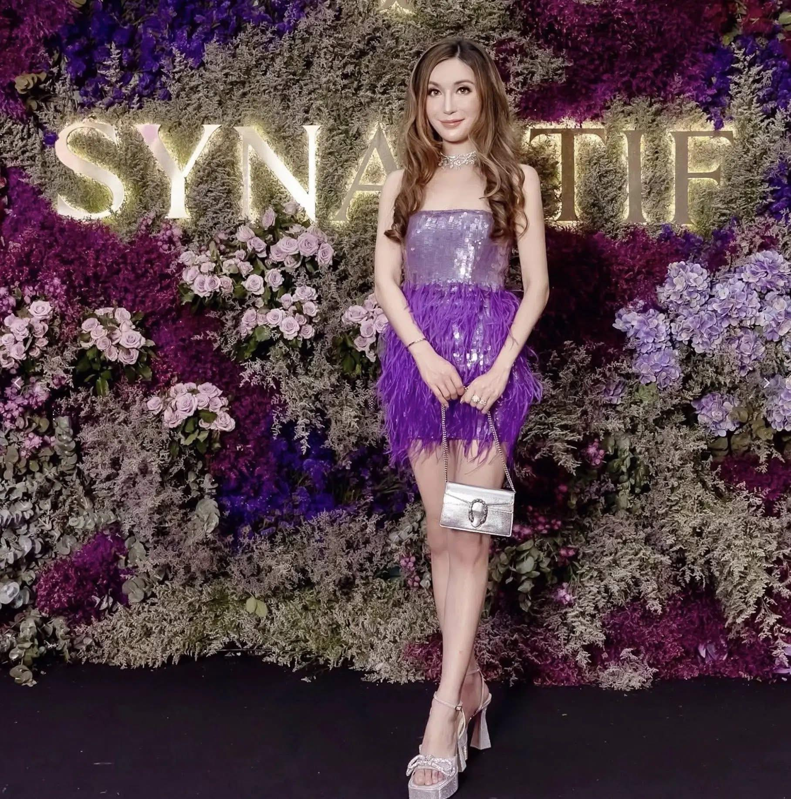

Hà Tư Hành (Beatrice Ho).
Năm 2022, chị gái Hà Tư Hành tiết lộ rằng em gái đã nhận được thư báo trúng tuyển của Đại học Duke, khi đó cô còn tỏ ra rất ngưỡng mộ vì tỷ lệ trúng tuyển của trường này cực kỳ thấp. Đồng thời, Hà Thiến Hành cũng nhận được thư mời từ khoa luật của Đại học Columbia, và cuối cùng cô quyết định ở lại chính ngôi trường cũ để tiếp tục học lên.
Lúc đó, Hà Thiến Hành nhận được thư mời nhập học từ cả 2 trường với cùng chuyên ngành luật. Có thể thấy rõ rằng sau khi tốt nghiệp, cô đã có ý định theo con đường trở thành luật sư. Quả đúng như vậy, chỉ mất 1 năm, cô đã hoàn thành chương trình tại trường luật và thuận lợi tốt nghiệp.
Sau 1 năm, chị gái Hà Tư Hành một lần nữa bày tỏ niềm tự hào về em mình khi đăng tin vui này trên trang cá nhân. Cô không chỉ chia sẻ ảnh tốt nghiệp của em gái mà còn tiết lộ rằng Hà Thiến Hành sắp gia nhập một trong những hãng luật danh tiếng nhất tại New York, đó là hãng luật Simpson Thacher & Bartle.

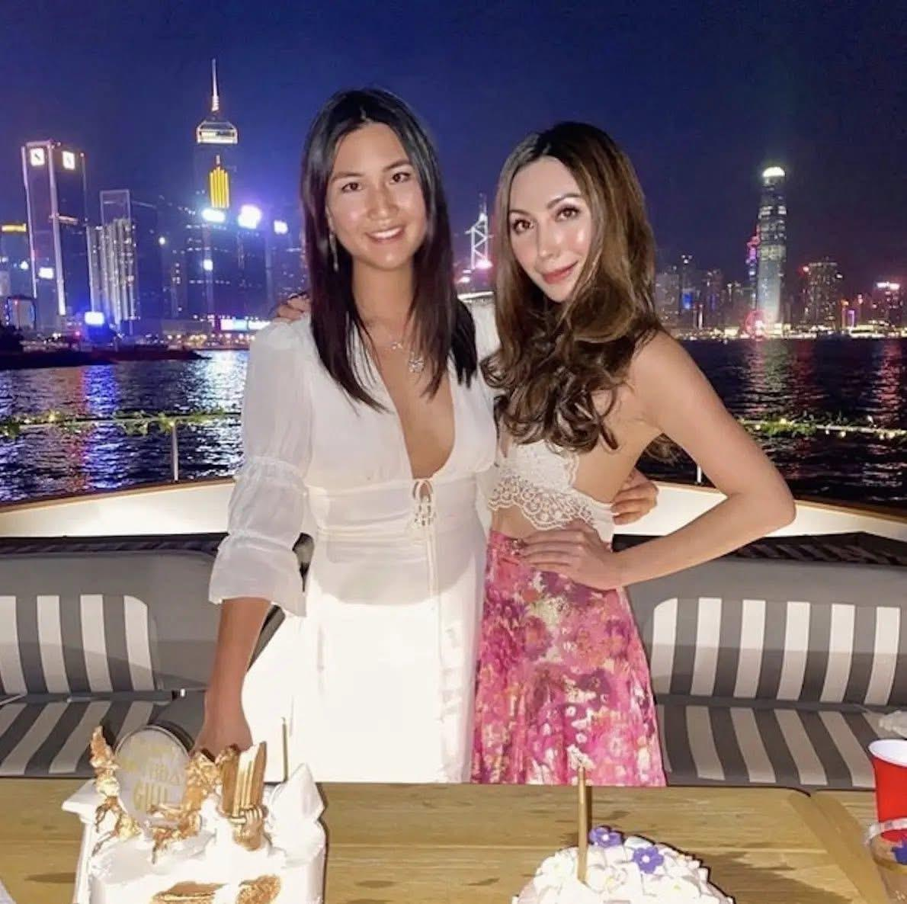

Hà Thiến Hành (trái) và chị gái Hà Tư Hành (phải).
Trước hết nói về Trường Luật Đại học Columbia – nơi Hà Thiến Hành theo học. Cùng với Trường Luật Đại học Duke, đây đều là những trường luật có danh tiếng hàng đầu thế giới, thường xuyên nằm trong top 5 các bảng xếp hạng toàn cầu. Trong đó, Trường Luật Đại học Columbia từ lâu luôn dẫn đầu về tỷ lệ sinh viên tìm được việc làm sau khi tốt nghiệp. Vì vậy việc Hà Thiến Hành vừa tốt nghiệp đã có thể vào làm tại một hãng luật hàng đầu cũng không phải điều quá bất ngờ.

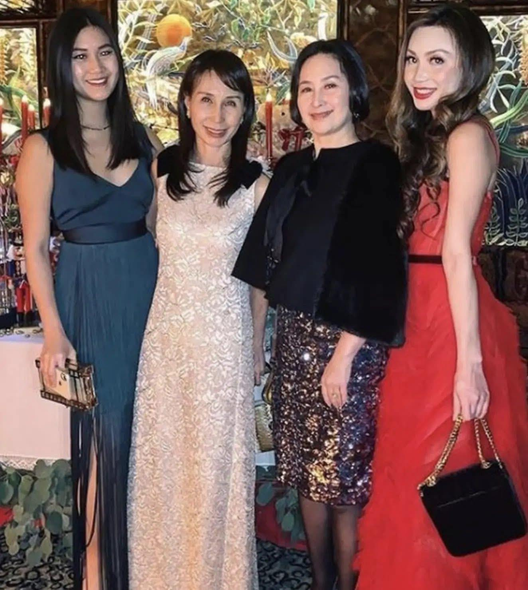

Tiếp theo là hãng luật Simpson Thacher & Bartle của Mỹ. Đây là một trong những hãng luật lâu đời và danh tiếng nhất nước Mỹ, đồng thời cũng được xem là nơi làm việc mà sinh viên luật khó gia nhập nhất. Trong bảng xếp hạng toàn cầu năm 2023, hãng luật này đứng thứ 8.
Có thể nói, cả ngôi trường luật khó vào lẫn hãng luật khó tuyển dụng đều đã được Hà Thiến Hành chinh phục, đủ để thấy thực lực học tập của cô không hề tầm thường.
Quay lại với Hà Thiến Hành, thực ra trước khi vào Trường Luật Đại học Columbia, cô theo học chương trình cử nhân văn học. Trong 3 năm học, cô liên tục nhận được học bổng suốt 3 năm. Điều này rõ ràng không liên quan trực tiếp đến xuất thân gia đình — nếu không có năng lực thực sự, dù gia đình có giàu đến đâu cũng khó có thể giành được học bổng, càng không thể dễ dàng nhận được thư mời từ những trường luật khó vào nhất hay cơ hội làm việc tại các hãng luật danh tiếng. Vì vậy, Hà Thiến Hành hoàn toàn đạt được thành tích bằng chính thực lực của mình.
Từ trái sang phải: Hà Thiến Hành, Hà Siêu Phượng, Hà Siêu Quỳnh, Hà Tư Hành.
2 cô con gái của Hà Siêu Phượng thực ra đều rất xuất sắc. Hà Thiến Hành là vậy, còn Hà Tư Hành cũng không hề kém cạnh. Đừng nhìn Hà Tư Hành với phong thái của một tiểu thư danh giá, thường xuyên xuất hiện tại các sự kiện xã hội lớn nhỏ trong và ngoài nước mà nghĩ rằng cô chỉ thích vui chơi. Thực tế, cô cũng có học vấn rất cao.
Hà Tư Hành tốt nghiệp Đại học Princeton – một trường danh tiếng tại Mỹ. Trong thời gian học đại học, cô theo chuyên ngành tiếng Anh, sau khi tốt nghiệp còn tiếp tục học thạc sĩ chuyên ngành marketing.
Từ tình hình hiện tại có thể thấy, 2 cô con gái của Hà Siêu Phượng dường như không hề có ý định quay về giúp đỡ doanh nghiệp gia tộc. Sau khi tốt nghiệp đại học, Hà Tư Hành bắt đầu hoạt động sôi nổi trong giới quan hệ công chúng tại Hong Kong và Mỹ. Có vẻ cô hứng thú với công việc trong lĩnh vực PR hơn, thường xuyên xuất hiện tại nhiều sự kiện xã hội lớn nhỏ. Nhờ đó, cô dần trở thành gương mặt mới nổi trong giới thượng lưu Hong Kong và ngày càng được nhiều người biết đến.
Trong khi đó, Hà Thiến Hành hiện đã gia nhập hãng luật Simpson Thacher & Bartle tại New York và trở thành một luật sư hành nghề. Tương lai cô nhiều khả năng sẽ sinh sống lâu dài tại Mỹ, cũng không có ý định quay về Hong Kong tham gia công việc kinh doanh của gia tộc.
Hà Siêu Phượng tỏ ra tôn trọng lựa chọn của 2 con gái, để họ tự do theo đuổi con đường mà mình mong muốn.
Tuy nhiên, điều này cũng khiến nhiều người lo ngại rằng nhánh bà hai có thể thiếu người kế thừa trong tương lai. Thế hệ thứ 3 của nhánh bà hai vốn không nhiều, ngoài 2 con gái của Hà Siêu Phượng thì chỉ còn con gái của Hà Du Long. Nhưng nếu sau này kế thừa, con gái Hà Du Long nhiều khả năng cũng sẽ tiếp quản tập đoàn Melco International của cha mình.
Nếu 2 con gái của Hà Siêu Phượng đều không quan tâm đến sự nghiệp gia tộc, thì nhiều năm sau, phần sản nghiệp của Hà Hồng Sân thuộc nhánh bà hai e rằng sẽ không tìm được người kế thừa phù hợp. Khi đó, rất có thể quyền tiếp quản sẽ rơi vào tay thế hệ thứ 2 hoặc thứ 3 của nhánh khác.
Dĩ nhiên, đó vẫn là câu chuyện của tương lai.
