> © Lược dịch từ bài viết của @潮新闻 trên QQ, kết hợp cùng bài viết của @老路如是观 trên Sohu.

> Bài viết của @潮新闻 trên QQ được đăng tải ngày 16 tháng 8 năm 2024 với tiêu đề “Nghiêm Nhân Mỹ: 109 tuổi vẫn thanh nhã như xưa”.

> Bài viết của @老路如是观 trên Sohu được đăng tải ngày 13 tháng 10 năm 2022 với tiêu đề “Nghiêm Nhân Mỹ: Danh viện cuối cùng của Thượng Hải phồn hoa: từng bị sĩ quan Nhật Bản quấy rối nhưng thà chết không gả, nay 107 tuổi vẫn giữ trọn khí chất”.

> ⍟ Danh viện (名媛) chỉ những người phụ nữ danh giá, có địa vị, có năng lực và sắc đẹp trong xã hội.

> © Bài dịch gốc của Facebook page [Hôm nay giới thượng lưu có gì?](https://www.facebook.com/Homnaygioithuongluucogi "Hôm nay giới thượng lưu có gì?")

> ‧₊˚❀༉‧₊˚

Tìm kiếm sự trường sinh bất lão luôn là ước mơ của loài người.
Trong «Cương giám hợp biên» của học giả đời Thanh Khâu Quỳnh Sơn có chép: “Tần Thủy Hoàng sau khi bình định 6 nước, suốt đời chí nguyện không điều gì không đạt được, chỉ có một điều không thể toại nguyện, đó là tuổi thọ.” Lại có phương sĩ mê hoặc Tần Thủy Hoàng rằng ngoài Đông Hải có tiên sơn, trên núi có thuốc trường sinh, uống vào có thể sống mãi. Thế là mới có câu chuyện Từ Phúc dẫn theo 500 đồng nam, 500 đồng nữ vượt biển tìm thuốc tiên. Thế nhưng Tần Thủy Hoàng mất năm 51 tuổi, tuổi thọ chẳng dài.
Năm 2024, Nghiêm Nhân Mỹ đã 109 tuổi mà vẫn giữ trọn vẻ thanh nhã. 3 người cô của Nghiêm Nhân Mỹ, ai nấy đều trường thọ hơn người: Nghiêm Thái Vận thọ 91 tuổi, Nghiêm Liên Vận sống đến 100 tuổi, còn Nghiêm Ấu Vận thọ 112 tuổi. Chẳng lẽ 4 danh viện nhà họ Nghiêm thật sự đã uống thuốc trường sinh?
3 chị em họ Nghiêm: Nghiêm Thái Vận, Nghiêm Liên Vận và Nghiêm Ấu Vận.
Nghiêm Nhân Mỹ sinh năm 1915, quê gốc ở Từ Khê, Ninh Ba, Chiết Giang.
Hậu[^1], Chương[^2], Cụ cố là Nghiêm Tín từng làm mưu sĩ cho Lý Hồng tham gia sáng lập ngân hàng đầu tiên của Trung Quốc — Ngân hàng Thông Thương Trung Quốc — tại Thượng Hải và giữ chức Tổng giám đốc đầu tiên; đồng thời còn sáng lập Thương hội Thượng Hải cùng nhiều doanh nghiệp công tư khác, được tôn xưng là “ông tổ khai sáng” của bang Ninh Ba.

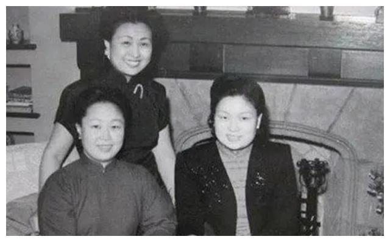

Nghiêm Tín Hậu (1838-1907), tên khai sinh là Nghiêm Kinh Bang, hiệu Thạch Tuyền Cư Sĩ. Ông là nhà thực nghiệp, nhà thư pháp và họa sĩ nổi tiếng vào cuối thời Thanh, người huyện Từ Khê, tỉnh Chiết Giang. Ông là một trong những đại diện tiêu biểu của tầng lớp tư bản dân tộc Trung Quốc thời kỳ cận đại sơ khai, đồng thời cũng có những đóng góp quan trọng đối với quá trình hiện đại hóa giáo dục Trung Quốc. Nghiêm Tín Hậu cùng với Thi Tắc Kính, Bàng Lai Thần, Dương Đình Cảo, Chu Bảo Tam và những người khác sáng lập Tế Cấp Thiện Cục, tiền thân của Hội Thiện Phổ Tế Chữ thập đỏ tại 3 tỉnh Đông Bắc. Ngoài ra, ông còn trợ, giúp đỡ Chu Ân Lai cùng nhiều thanh niên, học sinh khác. 2 Lý Hồng Chương (15 tháng 2 năm 1823 — 7 tháng 11 năm 1901), thường được gọi là Lý Trung Đường, Lý phó tướng. Người Hợp Phì, Lư Châu, tỉnh An Huy (nay thuộc thành phố Hợp Phì), là trọng thần cuối thời Thanh, đồng thời là một trong những chính trị gia, quân sự gia, nhà ngoại giao, nhà thực nghiệp và nhà cải cách quan trọng của Trung Quốc cận đại.
Nghiêm Tín Hậu (trái) và Nghiêm Tử Quân (phải).
Ông nội Nghiêm Tử Quân là con trai duy nhất của Nghiêm Tín Hậu, được đời gọi là “đa tài, giỏi buôn bán, phong thái rất giống cha”, nổi tiếng với nghề kinh doanh tiền trang.

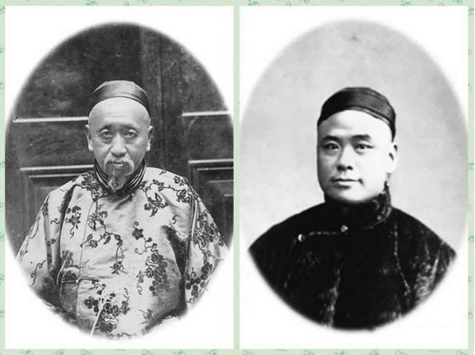

Cha là Nghiêm Trí Đa, cháu đích tôn của nhà họ Nghiêm, cưới Lưu Thừa Nghị làm vợ. Mà Lưu Thừa Nghị là Dung3 Trang[^4], Tầm[^5], cháu gái của Lưu — chủ nhân Tiểu Liên đứng đầu “Tứ Tượng” Nam Hồ Châu.
Sinh ra đã ngậm thìa vàng nhưng Nghiêm Nhân Mỹ lại là một trẻ sinh non. Mới 8 tháng đã chào đời, có lẽ vì (仁美), đến quá vội, khi sinh ra trên đầu không có lấy một sợi tóc. Ông nội đặt cho cái tên “Nhân Mỹ” mong sau này cháu gái lớn lên vừa nhân hậu vừa xinh đẹp.

[^3]: Lưu Dung (1826 – 1899), tên Giới Khang, tự Quán Quân, còn có tự khác là Quán Kinh, người Nam Tầm, huyện Ô Trình, phủ Hồ Châu, tỉnh Chiết Giang. Ông là đại thương nhân cuối thời Thanh, phất lên nhờ kinh doanh và xuất khẩu lụa Tập Lý. 4 Tiểu Liên Trang, còn gọi là Lưu Viên, nằm bên bờ suối Chim Cuốc ở phía Nam trấn cổ Nam Tầm, miền Bắc tỉnh Chiết Giang, Trung Quốc. Đây là khu vườn tư gia và nơi đặt gia miếu của Lưu Dung — quan hàm Thanh Quang Lộc Đại Phu, chủ nhân Gia Nghiệp Đường, người đứng đầu “Tứ Tượng Nam Tầm” cuối thời Thanh. Tiểu Liên Trang là một trong 5 khu danh viên lớn của Nam Tầm, đồng thời là đơn vị bảo vệ di tích văn hóa trọng điểm cấp quốc gia của Trung Quốc. 5 “Tứ Tượng” Nam Tầm là cách gọi tứ đại gia tộc ở cổ trấn Nam Tầm, tỉnh Chiết Giang, Trung Quốc vào cuối thời Thanh đầu thời Dân quốc, gồm các họ Lưu, Trương, Bàng, Cố. Nhờ kinh doanh tơ lụa và thương mại, họ tích lũy được khối tài sản khổng lồ và được xem là đại diện tiêu biểu của giới siêu giàu Nam Tầm. Dân gian có câu: “Nhà họ Lưu có bạc, nhà họ Trương có nhân tài, nhà họ Bàng có thể diện, nhà họ Cố có nhà cửa.”
Dân gian có câu: tóc càng cạo càng mọc dày. Thế nhưng Nghiêm Nhân Mỹ cạo trọc đầu tới 7 lần mà trên đỉnh đầu vẫn không mọc nổi một sợi tóc nào.
Giữa đám trẻ con, Nghiêm Nhân Mỹ chẳng hề xinh xắn, hoàn toàn là một “vịt con xấu xí” đúng nghĩa.
Năm 1917, em trai của bà ngoại — tức ông cậu — từ nước ngoài về nước thăm thân, ghé nhà họ Nghiêm thăm chị gái. Khi nhìn thấy “vịt con xấu xí”, ông chau mày nói: “Nuôi con kiểu này thì hỏng mất! Cứ tiếp tục thế này, đứa trẻ sẽ bị bỏ phế.”
Ông cậu từng du học Anh từ sớm, sau đó định cư tại London, là bác sĩ nhi khoa; phu nhân của ông học chuyên ngành sản phụ khoa. Ông đề nghị: “Chi bằng để cháu theo ta sang Anh sống một thời gian.”
Sau một thời gian được điều dưỡng, điều kỳ diệu đã xảy ra: tóc của Nghiêm Nhân Mỹ bắt đầu mọc trở lại từng chút một, vừa đen vừa dày. Khi cô út Nghiêm Ấu Vận từ nước ngoài trở về, đã đưa Nghiêm Nhân Mỹ về nước. Bà nội sờ lên đầu Nghiêm Nhân Mỹ rồi nói: “Cuối cùng cũng trông ra dáng con người.”
Thế nhưng đời người khó lường. Năm Nghiêm Nhân Mỹ lên 6 tuổi, mẹ qua đời vì băng huyết khi sinh đứa con thứ 5. Không lâu sau, bà nội cũng lâm bệnh rồi mất.
Mất đi mẹ và bà nội, Nghiêm Nhân Mỹ thường lẽo đẽo theo sau cụ cố. Cụ cố bị lãng tai, gần như không thể trò chuyện, khiến Nghiêm Nhân Mỹ cảm thấy cô độc vô cùng.
Cụ cố bèn đưa cháu ngoại gái của mình là Ngô Tĩnh6 về ở cùng để bầu bạn với Nghiêm Nhân Mỹ. Xét theo vai vế, Ngô Tĩnh là chị họ xa của Nghiêm Nhân Mỹ, nhưng hai người chỉ hơn kém nhau 3 tuổi. Người chị họ ấy trở thành “bạn thân chốn khuê phòng”, hai người không chuyện gì không nói, tuổi thơ của Nghiêm Nhân Mỹ lại ngập tràn niềm vui.
Dì của mẹ kế Nghiêm Nhân Mỹ là hiệu trưởng Trường Nữ học Khải Tú. Khi lên 8 tuổi, Nghiêm Nhân Mỹ theo học tại đây. Nhờ mối quan hệ này, cô không ở ký túc xá học sinh mà sống ngay trong tòa nhà văn phòng của hiệu trưởng.

[^6]: Ngô Tĩnh (sinh năm 1911), danh viện nổi tiếng thời Dân Quốc, nguyên quán An Huy, huyện Vụ Nguyên, sinh ra tại đại viện họ Ngô ở Thiên Tân. Ông nội là Ngô Điệu Khanh, từng làm môi giới cho chi nhánh Ngân hàng HSBC tại Thiên Tân, có quan hệ thân thiết với Lý Hồng Chương. Ông ngoại là Nghiêm Tín Hậu, nhân vật tiêu biểu của bang Ninh Ba tại Thượng Hải.
Năm 1928, bà thi đỗ vào Khoa Văn học phương Tây của Đại học Thanh Hoa, là một trong những nữ sinh khóa đầu tiên. Do đồng thời tham gia các đội thể thao như bóng rổ, bóng chuyền cùng tổng cộng năm môn thi đấu, bà được trao áo vinh dự thể thao của Thanh Hoa.
Ngô Tĩnh và bạn học cùng trường Thanh Hoa là Triệu Yến Sinh tự do yêu đương; từng dưới sự trợ giúp của Hoàng Trung Phu bỏ trốn khỏi cuộc hôn nhân sắp đặt sẵn để phản kháng chế độ hôn nhân bao biện.
Sau khi kết hôn, bà trở thành chị dâu của Triệu tứ tiểu thư Triệu Nhất Địch. Năm 1940, hai vợ chồng chuyển đến Thượng Hải, sau đó bà giảng dạy tiếng Anh tại Trường Trung học Nam Dương Mô Phạm. Sau năm 1949, bà ở lại đại lục, cùng chồng dấn thân vào công tác giáo dục trung học.
Nghiêm Nhân Mỹ ở chung phòng với Ngô Tĩnh. Dưới sự chăm sóc của chị họ, Nghiêm Nhân Mỹ học tập rất vui vẻ.
3 năm sau, Ngô Tĩnh rời Thượng Hải về Thiên Tân. Ngày chia tay, hai người ôm chặt lấy nhau không nỡ rời xa, Nghiêm Nhân Mỹ khóc rất nhiều.
Sau khi Ngô Tĩnh đi, cha đón Nghiêm Nhân Mỹ về nhà, cho theo học tại tư thục của gia đình. Nghiêm Nhân Mỹ rất nhớ môi trường nữ học, nhưng vì tuổi còn nhỏ nên không tiện quay lại.
Năm lên 10 tuổi, người cô thứ 5 là Nghiêm Liên Vận7 tốt nghiệp đại học và nhận công tác tại Trường Nữ Tây[^8]. Trung
Năm 1928, khi 13 tuổi, Nghiêm Nhân Mỹ tìm đến cô năm Nghiêm

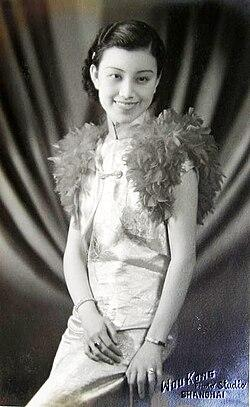

Liên Vận, năn nỉ cô đưa mình vào học tại Trường Nữ Trung Tây. Cô đồng ý, nhưng cha lại phản đối. Nghiêm Nhân Mỹ lại tìm đến ông nội, được ông gật đầu, lúc ấy cha mới chịu buông tay.
Trường Nữ Trung Tây là một trường nổi tiếng. Chị em nhà họ Tống và Trương Ái Linh đều từng theo học tại đây.

[^7]: Nghiêm Liên Vận (1903 – 18/5/2003), người Từ Khê, Chiết Giang, xuất thân từ gia đình danh môn. Ông nội và cha bà lần lượt là 2 nhà thực nghiệp nổi tiếng Nghiêm Tín Hậu và Nghiêm Tử Quân. Mẹ ruột của bà họ Dương, là thiếp của cha. Bà cùng 2 chị em là Nghiêm Thái Vận và Nghiêm Ấu Vận được gọi chung là “3 chị em họ Nghiêm”.
Thời trẻ, Nghiêm Liên Vận từng theo học Trường Nữ trung Trung Tây Thượng Hải, sau đó thi đỗ vào Khoa Hóa học của Học viện Văn lý Nữ Kim Lăng, Nam Kinh. Năm 1924 tốt nghiệp, bà đến Trường Nữ trung Hoài Viễn (An Huy) giảng dạy, dạy các môn Hóa học và tiếng Anh. Năm 1928, bà trở về trường cũ Trung Tây để tiếp tục công tác giảng dạy. Năm 1932, bà kết hôn với nhà ngân hàng Từ Chấn Đông. Sau đó, do mắc bệnh thận, bà phải nằm điều trị trong thời gian dài, kéo dài tới 18 năm.
Sau khi nước Cộng hòa Nhân dân Trung Hoa thành lập, bà từng đảm nhiệm các chức vụ như: Phó Chủ tịch và Chủ tịch danh dự Hội Nữ Thanh niên Cơ Đốc giáo Thượng Hải, Ủy viên chấp hành toàn quốc của Hội Nữ Thanh niên, v.v.
Bà và chồng Từ Chấn Đông có 2 con trai là Từ Cảnh Đạt, Từ Cảnh Càn, và 1 con gái Từ Cảnh Xán. Trong đó, con trai trưởng Từ Cảnh Đạt (A Đạt) là nhà làm phim hoạt hình nổi tiếng, từng đạo diễn các tác phẩm như «3 hòa thượng» và «Na Tra náo hải».

[^8]: Trường Nữ Trung Tây do Giáo hội Giám Lý Cơ Đốc Hoa Kỳ sáng lập năm 1892, trụ sở cũ đặt tại khu vực giao lộ đường Hán Khẩu và đường Tây Tạng Trung, nay thuộc quận Hoàng Phố. Tên tiếng Anh McTyeire School được đặt theo tên Giám mục Holland McTyeire của Giáo hội Giám Lý miền Nam Hoa Kỳ.
Năm 1912, trường mở lớp đặc biệt, tuyển sinh phụ nữ đã lập gia đình. 6 đời hiệu trưởng đầu tiên đều là người Mỹ. Thời kỳ đầu, ngoài môn ngữ văn, các giáo trình đều sử dụng sách tiếng Anh; chương trình học chú trọng tiếng Anh, toán học, âm nhạc, gia chính,… Trong đó, giáo dục gia chính (bao gồm nấu ăn, dinh dưỡng, thêu thùa may vá, quản lý trang phục, vệ sinh, chăm sóc sức khoẻ, quản lý chi tiêu, sổ sách gia đình, kỹ năng nuôi dạy con cái, lễ nghi sinh hoạt) nổi tiếng nhất tại Thượng Hải. Thời gian học là 10 năm, chủ yếu tuyển nữ sinh xuất thân từ các gia đình giàu có.
Giáo viên của trường đều là người nước ngoài, toàn bộ bài giảng đều bằng tiếng Anh. Nền tảng tiếng Anh của Nghiêm Nhân Mỹ rất yếu, việc nghe giảng vô cùng vất vả, nhưng cô không hề lùi bước. Trên lớp không hiểu thì sau giờ học hỏi bạn bè. Nghiêm Nhân Mỹ học ngày học đêm, suốt 1 năm trời, cuối cùng cũng chỉ vừa đủ đạt mức qua môn.
Trường Nữ Trung Tây vốn nổi tiếng nhiều mỹ nữ, trong đó “Nhóm 8 Người” từng vang danh một thời. Ngoài Nghiêm Nhân Mỹ, còn có:

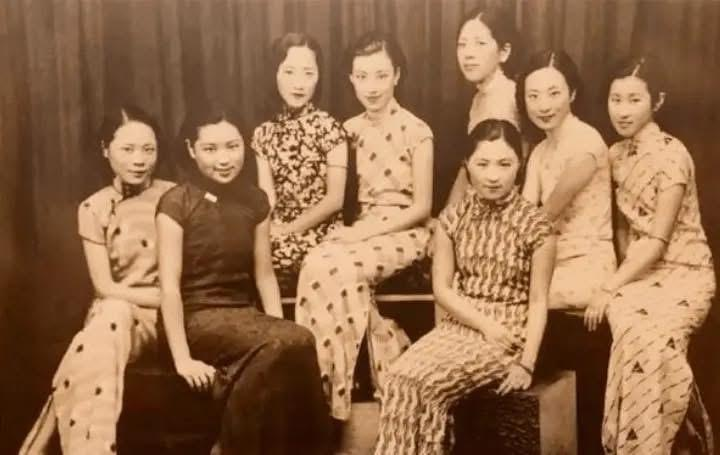

❥ Trương Hàm Phân — con gái Thứ trưởng Bộ Tài chính Trương Thọ Dung9 đương thời. ❥ Cửu10. Hoàng Huệ Bảo — thiên kim của đại gia công nghiệp Thượng Hải Hoàng Sở ❥ Đường Dân Trinh — con gái cưng của Đại sứ Trung Quốc tại Pháp. ❥ Lâm Anh — tiểu thư nhà họ Lâm, thương gia giàu có ở Phúc Kiến. ❥ Thẩm U Phân — cháu ngoại nhà họ Tịch ở Động Đình, Tô Châu. ❥ Thẩm Yến — con gái của Thẩm Côn Sơn, người đứng đầu Công ty Thuốc lá Anh – Mỹ.
Trương Thọ Dung (1876—1945), tự Bá Tụng, hiệu Vịnh Nghê, biệt danh Ước Viên, người huyện Ngân, tỉnh Chiết Giang. Ông là học giả, nhà giáo dục, nhà sưu tầm sách và nhân vật chính trị hoạt động từ cuối triều Thanh đến thời kỳ Trung Hoa Dân Quốc. Ông là người sáng lập và là hiệu trưởng đầu tiên của Đại học Quang Hoa. 10 Hoàng Sở Cửu (1872 – 19/01/1931), tên khai sinh là Thừa Càn, hiệu là Tha Cửu, tự xưng là chủ nhân Tri Túc Lư, người Dư Diêu, Chiết Giang. Ông là doanh nhân Thượng Hải, người tiên phong của ngành dược phẩm mới Trung Quốc. Ông từng được ca ngợi là “kỳ tài thương giới” và “nhà quản lý của trăm nghề”, một thời mang danh “Vua tân dược Thượng Hải” và “Vua ngành giải trí”. Về cuối đời, ông lao vào các hoạt động đầu cơ thương mại, nợ nần chồng chất, kiện tụng bủa vây.
“Nhóm 8 Người” của Nghiêm Nhân Mỹ (hàng trên, thứ 2 từ phải sang). Tất cả đều xuất thân từ những gia tộc danh giá.
“Nhóm 8 Người” thường hẹn nhau du xuân, dự dạ vũ. Dù xuất hiện ở đâu, 8 thiếu nữ yểu điệu ấy cũng luôn là một bức tranh phong cảnh rực rỡ, thu hút mọi ánh nhìn.
Nhờ thấm nhuần triết lý giáo dục của trường nữ học — con gái nhất định phải tự cường, không ngừng vươn lên — Nghiêm Nhân Mỹ dần hình thành tính cách độc lập, tự chủ. Cùng với làn sóng tư tưởng mới từ phương Tây du nhập, cô cũng sớm có kế hoạch rõ ràng cho cuộc đời mình. Thêm vào đó, 3 người cô đều là

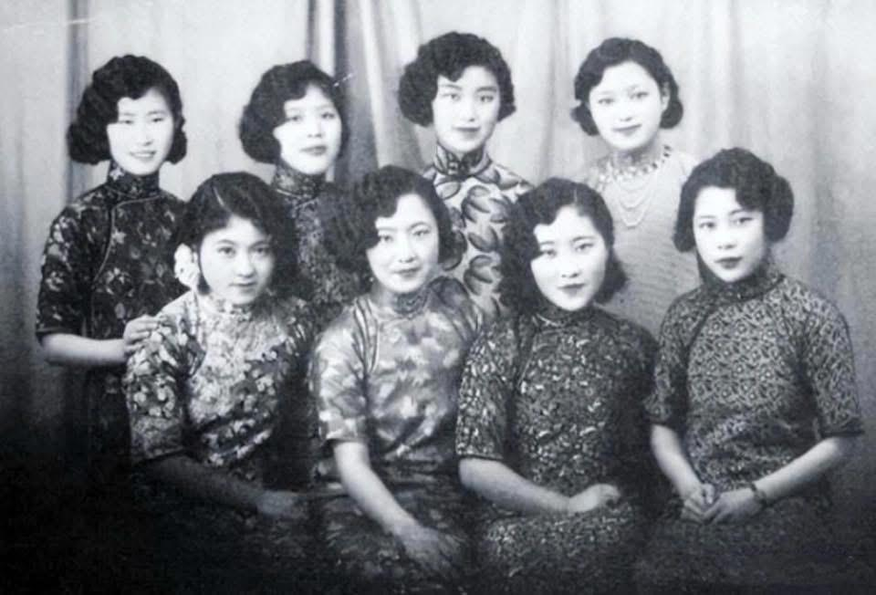

những nhân vật nổi bật trong lĩnh vực riêng, điều này càng ảnh hưởng sâu sắc đến Nghiêm Nhân Mỹ.
Khi bạn bè cùng trang lứa hoặc đắm mình trong chốn phồn hoa rực rỡ, ca múa thâu đêm, hoặc sớm yên bề gia thất, lo việc chồng con, thì Nghiêm Nhân Mỹ lại chọn cách lặng lẽ ngồi trong lớp học, toàn tâm toàn ý hoàn thành con đường học vấn của mình.
Cô út Nghiêm Ấu Vận từng là hoa khôi Đại học Phúc Đán.
Ngày 28 tháng 9 năm 1929, Nghiêm Ấu Vận kết hôn với nhà ngoại giao Dương Quang Sinh11, tổ chức hôn lễ long trọng tại Khách sạn Đại Hoa ở Thượng Hải. Nghiêm Nhân Mỹ khi ấy mới 14 tuổi cũng tham dự hôn lễ. Dung mạo trong trẻo, thuần khiết của cô đã lọt vào mắt xanh của nhà họ Mã — cũng có mặt tại buổi lễ.
11 Dương Quang Sinh (08/08/1900 – 17/04/1942), người Ngô Hưng, Chiết Giang (nay là Lăng Hồ, Hồ Châu). Năm 1916, ông thi đỗ vào ban cao đẳng của Thanh Hoa Học Đường. Năm 1920 sang Mỹ du học, lần lượt nhận bằng cử nhân Đại học Colorado và học vị tiến sĩ triết học về công pháp quốc tế tại Đại học Princeton. Ông từng giữ các chức vụ: giáo sư chính trị học Đại học Thanh Hoa, Phó cục trưởng Cục Tình báo Bộ Ngoại giao, Tổng lãnh sự tại London. Năm 1938 được bổ nhiệm làm Tổng lãnh sự Trung Quốc tại Manila, Philippines.
Nhà họ Mã lập tức ngỏ ý kết thông gia với nhà họ Nghiêm. Hai gia đình môn đăng hộ đối, công tử Mã Quán Lương lại tuấn tú khôi ngô, cha Nghiêm Nhân Mỹ cũng vì vậy mà đồng ý mối hôn sự này.

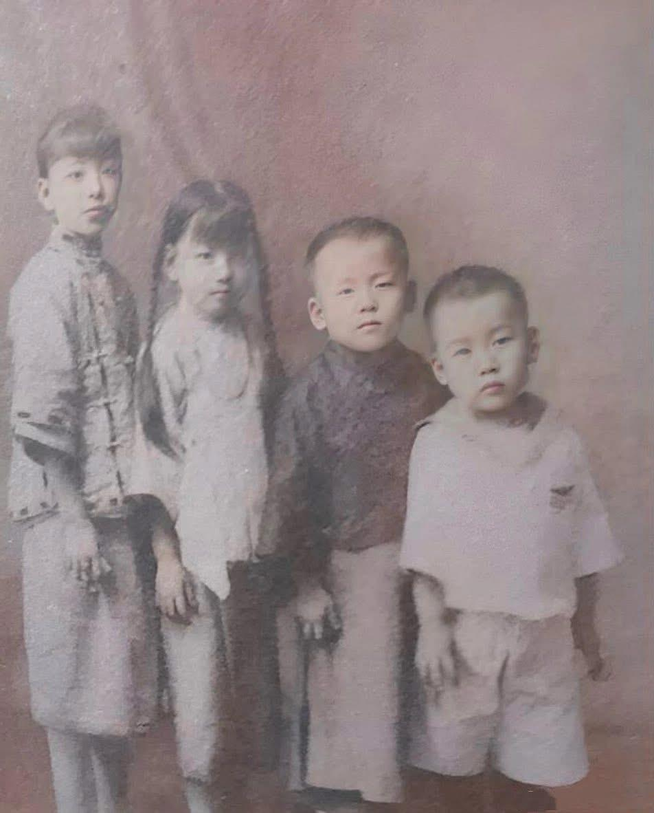

Nghiêm Nhân Mỹ (thứ 2 từ trái sang phải) bên chị họ Ngô Tĩnh (ngoài cùng bên trái) và 2 người em trai. Trong khi đó, chị họ Ngô Tĩnh nghe tin Đại học Thanh Hoa bắt đầu tuyển nữ sinh thì vô cùng phấn khích. Từ lâu, Ngô Tĩnh đã ngưỡng mộ Đại học Thanh Hoa. Thế nhưng lúc ấy Ngô Tĩnh mới học năm nhất trung học, chưa đủ điều kiện dự thi. Ngô Tĩnh kéo chị cả đến Sở Giáo dục xin cấp giấy chứng nhận. Giám đốc Sở Giáo dục đã đặc cách cấp cho cô giấy phép dự thi.
Thành tích học tập của Ngô Tĩnh vô cùng xuất sắc. Năm 1928, cô vượt cấp từ năm nhất trung học, thi đỗ vào ngành Văn học phương Tây của Đại học Thanh Hoa, trở thành một trong những nữ sinh đầu tiên của trường.

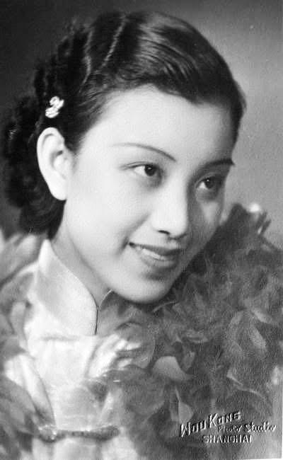

Mùa hè năm 3 đại học, có người thân đến nhà cha mẹ Ngô Tĩnh mai mối cho một cuộc hôn nhân. Đối phương là con trai của một bác sĩ Thượng Hải từng du học Nhật Bản. Ngô Tĩnh cho rằng mình vẫn đang đi học, chưa đến lúc bàn chuyện cưới xin, nhưng mẹ vẫn kéo đi xem mặt. Vừa bước vào nhà trai, hai mẹ con đã thấy mẹ của chàng trai nằm nghiêng trên giường hút thuốc phiện. Ngô Tĩnh, người đã tiếp thu tư tưởng và tri thức mới, vô cùng phản cảm, liền nói thẳng với mẹ: gia đình này không ổn.
Thế nhưng mẹ Ngô Tĩnh không chịu, liên tục nói gia đình kia tốt thế nào. Dù mẹ có nói ra sao, Ngô Tĩnh vẫn kiên quyết không đồng ý. Mẹ dường như mang ý không chịu thì sẽ không rời Thượng Hải. Cứ giằng co như vậy suốt một tháng, cuối cùng Ngô Tĩnh đành tạm thời gật đầu cho qua. Nào ngờ, vừa về đến Thiên Tân, mẹ lại được đằng chân lân đằng đầu: đã đồng ý đính hôn thì không được quay lại Bắc Kinh tiếp tục học nữa.
Lần này, Ngô Tĩnh nhất quyết không nhượng bộ, nhưng lại bị mẹ nhốt trong nhà, không cho ra ngoài.
Điều này khiến Ngô Tĩnh hoàn toàn phẫn nộ. Chỉ còn 1 năm nữa là tốt nghiệp đại học, vậy mà mẹ lại bất chấp tương lai của con gái. Ngô Tĩnh quyết định đối đầu với mẹ đến cùng. Hai mẹ con mâu thuẫn gay gắt, kéo dài suốt nửa năm. Bạn học của Ngô Tĩnh nghe chuyện, liền lén đến Thiên Tân, nửa đêm nhân lúc nhà họ Ngô không chú ý, trèo tường vào đưa Ngô Tĩnh rời khỏi đại viện nhà họ Ngô. Từ đó, Ngô Tĩnh bước lên con đường sống độc lập và tự do của chính mình.
Khi ấy, Nghiêm Nhân Mỹ đang học lớp 8.
Cha Nghiêm Nhân Mỹ, Nghiêm Trí Đa, nghe chuyện Ngô Tĩnh bỏ trốn khỏi hôn nhân, liền càng kiên quyết không cho Nghiêm Nhân Mỹ tiếp tục học ở Trường Nữ Trung Tây. Ông cho rằng, dám chống lại mệnh lệnh của cha mẹ chính là do bị ảnh hưởng bởi những tư tưởng phương Tây như “tự do hôn nhân”. Nghiêm Nhân Mỹ không chịu nghỉ học. Nghiêm Trí Đa bèn ra điều kiện: chỉ khi nào tất cả các môn đều đạt trên 90 điểm thì mới cho học tiếp. Nghiêm Nhân Mỹ vui vẻ đồng ý.
Sự “nhượng bộ” này của người cha thực chất xuất phát từ niềm tin rằng Nghiêm Nhân Mỹ không thể nào trong vòng một năm mà tất cả các môn đều đạt trên 90 điểm.
Nghiêm Nhân Mỹ quyết tâm liều một phen, bắt đầu cắm đầu bù đắp tiếng Anh, các môn học khác cũng tiến bộ vượt bậc. Đến kỳ thi tốt nghiệp lớp 9, tất cả các môn đều đạt điểm A, đứng hạng nhất toàn khối.
Nghiêm Nhân Mỹ mừng rỡ khôn xiết, cầm bảng điểm đưa cho cha. Không ngờ ông lại nuốt lời, vẫn không cho con gái tiếp tục đi học.
Tính khí bướng bỉnh của Nghiêm Nhân Mỹ cũng bùng lên, cô cãi vã kịch liệt với cha. Ông liền nhốt Nghiêm Nhân Mỹ lại, còn cô thì không chịu khuất phục, dùng tuyệt thực để phản kháng.
Tin tức truyền đến nhà ngoại, bà ngoại dẫn theo dì năm đến nhà họ Nghiêm, trực tiếp tìm Nghiêm Trí Đa nói cho ra lẽ. Hai bên vì chuyện này mà cãi nhau một trận lớn, không khí vô cùng căng thẳng. Nghiêm Nhân Mỹ không ăn uống, ngày nào cũng uất ức, chẳng bao lâu thì mắc bệnh phổi. Ông ngoại phải đứng ra, đưa cháu gái đến Hàng Châu dưỡng bệnh. Ông còn đặc biệt cho dựng thêm một phòng kính trên mái

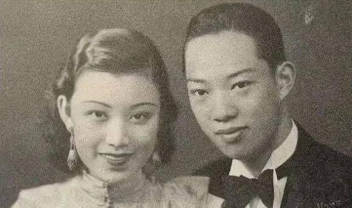

nhà để cháu gái có thể phơi nắng. Nghiêm Nhân Mỹ ở Hàng Châu suốt một năm, sức khỏe mới dần hồi phục.
Lúc này, người cha Nghiêm Trí Đa lại thúc ép chuyện gả chồng. Cuối cùng, hai cha con đạt được thỏa hiệp — có thể kết hôn, nhưng sau đó Nghiêm Nhân Mỹ phải được tiếp tục đi học.
Sở dĩ Nghiêm Trí Đa ép con gái cưới gấp là vì mẹ của Mã Quán Lương lâm bệnh nặng, cha Mã Quán Lương muốn con trai sớm lập gia đình để “xung hỷ” cho phu nhân.
Nghiêm Nhân Mỹ và Mã Quán Lương. Năm 1935, Nghiêm Nhân Mỹ, khi ấy 20 tuổi, chính thức trở thành con dâu nhà họ Mã.
Mã Quán Lương, con trai của một phú thương ở Tô Châu, gia đình sở hữu ngân hàng tư nhân, tiệm cầm đồ, cửa hàng gạo cùng nhiều sản nghiệp khác, gia thế rất vững vàng, hôn lễ được tổ chức vô cùng long trọng. Sau khi kết hôn, Nghiêm Nhân Mỹ quay lại Trường Nữ Trung Tây tiếp tục học tập. Nhưng sang năm sau thì mang thai, buộc phải gián đoạn việc học, và giấc mơ đại học của cô cũng hoàn toàn tan vỡ từ đó.
Thời gian đầu sau khi quay về, cuộc sống của Nghiêm Nhân Mỹ vẫn khá hạnh phúc. Vợ chồng trẻ trai tài gái sắc, nhìn nhau mãi không chán. Trong nhà còn đặc biệt mời giáo viên người Anh đến dạy, nên dù ở nhà, Nghiêm Nhân Mỹ vẫn tiếp tục học tiếng Anh và duy trì các hoạt động giao tế xã hội.
Sau khi hoàn thành chương trình học tại Đại học Thanh Hoa, Ngô Tĩnh nên duyên cùng bạn học đại học Triệu Yến Sinh.
Triệu Yến Sinh là anh thứ 6 của tứ tiểu thư nhà họ Triệu. Khi ấy, tứ tiểu thư nhà họ Triệu đang sống cùng Trương Học Lương trong căn nhà nhỏ số 1 đường Cao Lan, Thượng Hải. Ngô Tĩnh và tứ tiểu thư nhà họ Triệu rất thân thiết, thường tụ họp tại Thượng Hải, lại hay mời Nghiêm Nhân Mỹ và Mã Quán Lương cùng đi chơi.
Thời bấy giờ, cả Thượng Hải chỉ có 2 chiếc xe Buick mui trần kiểu dáng mới và thời thượng nhất: một chiếc thuộc về tứ tiểu thư nhà họ Triệu, chiếc còn lại là của nhà họ Mã.
Ngô Tĩnh và Triệu Yến Sinh đến với nhau vì tình yêu tự do, tâm đầu ý hợp, tình cảm vô cùng mặn nồng. Còn Nghiêm Nhân Mỹ và Mã Quán Lương tuy cũng từng trải qua quãng thời gian ngọt ngào sau hôn nhân, nhưng nhà họ Mã rốt cuộc vẫn là một gia đình kiểu cũ, quy củ rườm rà, lễ nghi rất nhiều.
Sau khi kết hôn, Nghiêm Nhân Mỹ sinh cho nhà họ Mã 3 người con. Mã Quán Lương dần sinh lòng nản, lại thêm bản tính phong lưu, bắt đầu lao vào cuộc sống phóng túng nơi chốn phồn hoa bậc nhất Thượng Hải.
Cho đến một ngày, Nghiêm Nhân Mỹ phát hiện Mã Quán Lương qua lại bất chính với một phụ nữ Nhật Bản. Trước sự phản bội của chồng, Nghiêm Nhân Mỹ tuyệt đối không thể chấp nhận. Trong cơn tức giận, cô quay về nhà mẹ đẻ, quyết tâm ly hôn.
Trong bối cảnh xã hội lúc bấy giờ, ly hôn đối với phụ nữ là điều vô cùng mất mặt. Vì thế, Nghiêm Nhân Mỹ trở thành tâm điểm của mọi lời chỉ trích.
Cha cô lại cho rằng nhà họ Nghiêm cũng là danh gia vọng tộc, con gái ly hôn là chuyện quá mất mặt. Hơn nữa, vào thời điểm đó, đàn ông có tam thê tứ thiếp vẫn được xem là chuyện bình thường, nên ông kiên quyết phản đối.
Nhưng Nghiêm Nhân Mỹ không màng đến điều đó. Cô vẫn kiên định lựa chọn hạnh phúc cho chính mình.
Lúc này, Nghiêm Nhân Mỹ đã không còn là cô bé yếu ớt năm xưa, không đủ sức đối đầu với cha mình nữa.
Nghiêm Nhân Mỹ là bạn học kiêm tri kỷ của Khổng Lệnh Nghi12, thường xuyên đến nhà họ Khổng chơi, lại được Tống Ái Linh13 đặc biệt yêu mến. Bà từng nói với Nghiêm Nhân Mỹ: “Sau này con không cần gọi ta là phu nhân, cứ như Lệnh Nghi, gọi ta là mẹ đi.”
Khổng đại tiểu thư là người cá tính mạnh, rất khác biệt. Trước cuộc hôn nhân bất hạnh của Nghiêm Nhân Mỹ, Khổng Lệnh Nghi cùng cha mẹ đều cảm thấy bất bình thay cho Nghiêm Nhân Mỹ.
Ngoài nhà họ Khổng, Nghiêm Nhân Mỹ còn có một chỗ dựa cứng rắn khác — mẹ nuôi Thịnh Quan Di14. Hoài15, Thịnh Quan Di là con gái của Thịnh Tuyên vị quan thương hàng đầu cuối thời Thanh, xuất thân Linh16 hiển hách, lại là bạn thân của Tống Mỹ (hai người từng cùng du học tại Mỹ, mối quan hệ vô cùng thân thiết).
Có thể nói, khi ấy, cô nhận được sự ủng hộ của các phu nhân thuộc 3 đại tài phiệt lớn nhất Thượng Hải là Khổng – Tống – Thịnh, hậu thuẫn vô cùng vững chắc.
Thậm chí, để khiến cô khuây khỏa, Tống Ái Linh còn gác lại mọi công việc, đưa Nghiêm Nhân Mỹ cùng con gái Khổng Lệnh Nghi sang Hong Kong nghỉ ngơi. Tống Mỹ Linh cũng cho rằng tinh thần của Mã Quán Lương đã sa đọa, cuộc hôn nhân này nhất định phải chấm dứt.
Dẫu có người đứng ra chống lưng, nhưng hôn nhân hào môn liên quan chằng chịt, vụ kiện ly hôn này mãi đến năm 1942 mới được giải quyết dứt điểm.
Nhưng nhà họ Mã cũng không phải hạng vừa. Ly hôn thì được, còn con cái thì tuyệt đối không được mang đi. Nghiêm Nhân Mỹ đành phải rời đi tay trắng, bỏ lại 3 đứa con, đúng nghĩa là ra đi không mang theo gì.
12 Khổng Lệnh Nghi (12/1915 — 22/8/2008), sinh tại Thái Cốc, Sơn Tây (nguyên quán Thái Cốc, Sơn Tây), là trưởng nữ của Khổng Tường Hy và Tống Ái Linh, thường được gọi là “Khổng đại tiểu thư”. Thuở sớm bà thi đỗ vào Đại học Hỗ Giang Thượng Hải, sau đó theo học tại Học viện Văn lý Nữ Kim Lăng Nam Kinh. Trong 4 anh chị em nhà họ Khổng, bà là người duy nhất không du học nước ngoài. Tống Ái Linh (15/7/1889 — 20/10/1973), nguyên quán Văn Xương, Quảng Đông (nay thuộc đảo Hải Nam), sinh tại thành Xuyên Sa, Thượng Hải. Bà là vợ của Khổng Tường Hy, chị cả của Tống Khánh Linh và Tống Mỹ Linh, đồng thời là nhân vật trung tâm của gia tộc họ Tống. 14 Thịnh Quan Di (9/10/1894 — 17/5/1965), người huyện Vũ Tiến, phủ Thường Châu, tỉnh Giang Tô, là con gái thứ 5 của Thịnh Tuyên Hoài, thường được gọi là “Thịnh ngũ tiểu thư”. Năm 1908, bà kết hôn với Lâm Hùng Chinh, một thành viên của gia tộc Lâm Bổn Nguyên. Bà là người sáng lập Vi Các Dục Ấu Viện – tiền thân của Trường Tiểu học tư thục Vi Các. Thịnh Tuyên Hoài (4/11/1844 — 27/4/1916), người Long Khê, huyện Vũ Tiến, phủ Thường Châu, tỉnh Giang Tô. Ông là quan chức kiêm thương nhân lớn cuối thời Thanh, đồng thời là chính trị gia và nhân vật tiêu biểu của phong trào Dương vụ. Thịnh Tuyên Hoài là người sáng lập Bắc Dương Đại học đường (nay là Đại học Thiên Tân) và Nam Dương Công học (nay phát triển thành Đại học Giao thông Tây An, Đại học Giao thông Thượng Hải, Đại học Giao thông Tây Nam và Đại học Giao thông Quốc lập). Ngoài ra, ông còn là nhà thực nghiệp và nhà hoạt động phúc lợi xã hội. Tống Mỹ Linh (4/3/1898 — 23/10/2003) sinh ra tại Khu tô giới công cộng Thượng Hải, quê quán Văn Xương (nay thuộc đảo Hải Nam, thời điểm đó thuộc tỉnh Quảng Đông). Bà là phu nhân thứ hai của Tưởng Giới Thạch, đồng thời là Đệ nhất phu nhân Trung Hoa Dân Quốc, cũng là mẹ kế của Tưởng Kinh Quốc. Bà thường được kính xưng là Tưởng phu nhân. Tống Mỹ Linh từng giữ các chức vụ như Chủ tịch Đoàn Chủ tịch Ủy ban Trung ương Quốc dân đảng Trung Quốc và Chủ tịch Đoàn Chủ tịch Ủy ban Thẩm nghị Trung ương Quốc dân đảng Trung Quốc, Trưởng ban Chỉ đạo Công tác Phụ nữ Trung ương Quốc dân đảng, Chủ tịch và Chủ tịch danh dự Hội đồng quản trị Đại học Công giáo Phụ Nhân; đồng thời là người sáng lập Đại học Sư phạm Quốc lập Chương Hóa, Liên hiệp Phụ nữ Trung Hoa Dân Quốc và Bệnh viện Chấn Hưng.
Khi ấy Nghiêm Nhân Mỹ mới ngoài 20 tuổi. Thoát khỏi sự ràng buộc của hôn nhân, cô lại sống cuộc đời Địch17, phóng khoáng tự do. Cô thân thiết với Ngô Tĩnh, Triệu Nhất Khổng Lệnh Nghi,… thường xuyên lui tới các không gian xã giao cao cấp, nhanh chóng trở thành một danh viện hàng đầu của Thượng Hải.
Nghiêm Nhân Mỹ (ngoài cùng bên phải) và tứ tiểu thư nhà họ Triệu – Triệu Nhất Địch (thứ 3 từ trái sang phải) trong ảnh chụp năm 1938. Năm 1940, do người Nhật truy lùng tứ tiểu thư nhà họ Triệu khắp nơi, vợ chồng Ngô Tĩnh – Triệu Yến Sinh

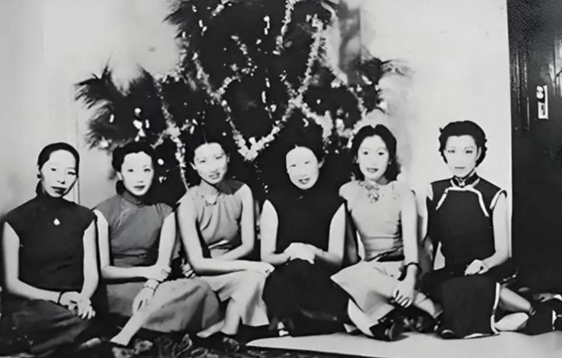

buộc phải chuyển về Thượng Hải. Nghiêm Nhân Mỹ tích cực giúp họ tìm nhà. Nhờ sự sắp xếp của cô, hai vợ chồng chuyển vào sống trong một căn nhà nhỏ trên đường Cao Bưu, khu phía Tây Thượng Hải, và ở đó suốt hơn 60 năm.
Năm 1941, tình hình kháng chiến ở Thượng Hải trở nên vô cùng căng thẳng. Mẹ nuôi của Nghiêm Nhân Mỹ là Thịnh Quan Di chuẩn bị rời Thượng Hải lên Trùng Khánh, bà mời con gái nuôi đi cùng. Nhưng vì vẫn nặng lòng với 3 đứa con ruột còn nhỏ, Nghiêm Nhân Mỹ quyết định ở lại. Trước khi rời đi, Thịnh Quan Di giao lại cho con gái nuôi căn biệt thự xa hoa tại số 15 vườn Tân Khang, nói rằng: “Ta đi Trùng Khánh, không biết bao giờ mới quay về, căn nhà này tặng cho con.”
Căn biệt thự ấy vô cùng đẹp, vốn đã hợp ý Nghiêm Nhân Mỹ. Nay trở thành của mình, cô lại cho sửa sang thêm rồi vui vẻ dọn vào ở. Nhưng chính căn nhà này lại mang đến cho cô tai họa lớn.
Thời đó, người Nhật ở Thượng Hải vô cùng ngang ngược, đặc biệt là các sĩ quan quân đội. Dựa vào vũ khí trong tay, họ làm càn làm bậy, hễ để mắt tới thứ gì là muốn chiếm đoạt cho bằng được. Một sĩ quan tên
Triệu Nhất Địch (28 tháng 5 năm 1912 — 22 tháng 6 năm 2000), còn có tên khác là Ỷ Hà, Hương Sênh. Nguyên quán Lan Khê, tỉnh Chiết Giang, sinh tại Hong Kong, là người vợ thứ 3 của Trương Học Lương. Do đứng thứ tư trong số các chị em (con út) nên được gọi là “Triệu tứ tiểu thư”.
Yamamoto để ý tới căn biệt thự này. Hôm ấy, hắn lấy cớ thuê nhà để gặp vị nữ chủ nhân danh tiếng của Thượng Hải.
Vừa nhìn thấy nữ chủ nhà, Yamamoto sững sờ. Không ngờ nhà đã đẹp, mà chủ nhà còn đẹp hơn. Lòng tham nổi lên, hắn muốn vừa đoạt tài vừa đoạt sắc, liền nói thẳng với Nghiêm Nhân Mỹ rằng hắn rất thích cô và yêu cầu cô gả cho mình.
Nghiêm Nhân Mỹ lập tức nghiêm túc từ chối.
Yamamoto không chịu từ bỏ. Hắn cho người nhắn lời đe dọa Nghiêm Nhân Mỹ, bảo cô “đừng có mà rượu mời không uống lại muốn uống rượu phạt”. Trước sự uy hiếp của quân Nhật, nói không sợ là không thể. Nghiêm Nhân Mỹ phải về nhà mẹ đẻ lánh nạn, nhưng Yamamoto vẫn bám riết không buông. Cô lại buộc phải chuyển sang ở nhà họ hàng, song hắn vẫn không chịu dừng tay.
Thậm chí, Yamamoto còn dò ra quan hệ gia tộc của Nghiêm Nhân Mỹ, cứ vài hôm lại cho người đến quấy rối nhà họ Nghiêm, khiến cả gia đình sống trong cảnh gà chó không yên, ngày nào cũng nơm nớp lo sợ.
Dĩ nhiên, thế lực nhà họ Nghiêm không nhỏ, người Nhật cũng không dám làm bừa. Lúc này, Nghiêm Trí Đa cuối cùng cũng thể hiện khí phách mà một người cha nên có. Không đành lòng nhìn con gái rơi vào cảnh nguy hiểm, để cắt đứt sự quấy nhiễu của Yamamoto, ông buộc phải đưa ra quyết định: gả con gái thêm lần nữa, dập tắt ý đồ của đối phương.
Đó là một lựa chọn bất đắc dĩ. Nghiêm Nhân Mỹ lúc này cũng không còn cách nào chống đối, đành chấp nhận.
May mắn thay, lần này, cô gặp được người phù hợp. Nhà trai tên là Lý Tổ Mẫn, xuất thân từ một gia tộc lớn ở Ninh Ba, gia thế hiển hách. Tuy nhiên, Lý Tổ Mẫn là con thứ, sinh ra từ người thiếp của cha. Nhưng nhà họ Nghiêm lúc này cũng không quá câu nệ, điều họ coi trọng là con người Lý Tổ Mẫn. Hơn nữa, bản thân Lý Tổ Mẫn rất xuất sắc, nhân phẩm đoan chính, tốt nghiệp Đại học Quang Hoa, thông thạo cả Đông lẫn Tây, lại tự mình điều hành doanh nghiệp — đúng nghĩa một thanh niên tài tuấn.
Sau khi gặp gỡ, Nghiêm Nhân Mỹ và Lý Tổ Mẫn nhận ra họ rất hợp tính, không lâu sau quyết định kết hôn chớp nhoáng.
Đêm trước hôn lễ, Nghiêm Trí Đa nói với con gái Nghiêm Nhân Mỹ: “Con gái à, ngày mai, con cứ vui vẻ làm cô dâu của mình. Đến lúc cử hành hôn lễ, cha sẽ cho 10 vệ sĩ bảo vệ con!”
Lý Tổ Mẫn và Nghiêm Nhân Mỹ. Năm 1941, phú thương Thượng Hải Nghiêm Trí Đa gả con gái, khách mời đến dự không ai không giàu sang quyền quý, quy mô long trọng phô bày trọn vẹn phong thái hào môn.
Hôn lễ của người khác, trên sân khấu ngoài cô dâu chú rể thì nhiều lắm cũng chỉ có vài phù rể, phù dâu và mấy em bé rải hoa, khung cảnh vừa đẹp đẽ vừa ấm áp.
Thế nhưng trong hôn lễ của Nghiêm Nhân Mỹ, đứng bên cạnh cô dâu không phải là những người thân đến chúc phúc, mà là 10 vệ sĩ vạm vỡ do cha cô thuê, trên người còn mang theo súng, cảnh giác cao độ, luôn kè kè bảo vệ an toàn cho cô dâu, ngay cả lúc chụp ảnh cưới cũng không rời nửa bước.

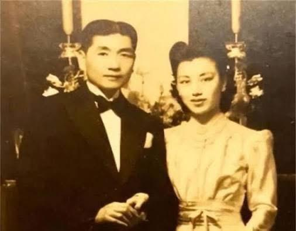

Dù sự xuất hiện của cả nhóm vệ sĩ trong hôn lễ ít nhiều làm mất đi không khí lãng mạn, nhưng biện pháp tỏ ra vô cùng hiệu quả. Thấy tình hình như vậy, phía Nhật cũng không dám đến gây chuyện.
Đám cưới của Nghiêm Nhân Mỹ còn được đăng tải trên báo chí. Trong bức ảnh thời sự, đôi tân lang tân nương dung mạo xuất chúng, đứng hiên ngang giữa vòng vây vệ sĩ, toát lên khí chất ung dung, chính trực, như thể coi thường mọi hiểm nguy trước mắt.
Trong lần bước vào hôn nhân thứ hai, Nghiêm Nhân Mỹ cuối cùng cũng được tình yêu mỉm cười. Dù Lý Tổ Mẫn không giỏi ăn nói nhưng lại vô cùng yêu thương vợ, mang lại cho cô cảm giác bình yên và vững chãi mà trước đó chưa từng có. Sau khi kết hôn, hai vợ chồng sống rất hạnh phúc, có với nhau 1 trai 1 gái.
Kỷ niệm đám cưới vàng của Nghiêm Nhân Mỹ và Lý Tổ Mẫn. Sau khi cuộc kháng chiến chống Nhật bùng nổ, để giành lại quyền nuôi con, cô quyết định ở lại Thượng Hải, sống trong căn biệt thự của Thịnh Quan Di. Với sự ủng hộ của Lý Tổ Mẫn, Nghiêm Nhân Mỹ nhiều lần khởi kiện nhà họ Mã để giành quyền nuôi con. Tuy nhiên, do xã hội khi ấy còn nhiều biến động, mỗi lần cô đều thất bại.
Sau ngày giải phóng, Nhà nước ban hành Luật Hôn nhân mới. Với sự giúp đỡ của chính quyền, Nghiêm Nhân Mỹ cuối cùng cũng đòi lại được công bằng, giành lại quyền nuôi các con. Vì điều này, Nghiêm Nhân Mỹ luôn tràn đầy lòng biết ơn đối với Trung Quốc mới.
Năm 1951, trong phong trào quyên góp máy bay, đại bác thời kỳ Kháng Mỹ viện Triều, cô không chỉ đi đầu trong việc ủng hộ tiền bạc mà còn vận động gia quyến của giới công thương cùng tham gia, quyên góp được số tiền lên đến hàng chục triệu USD. Nhờ thành tích nổi bật, Nghiêm Nhân Mỹ được bầu làm đại biểu Nhân dân khóa đầu tiên của quận Từ Hối, Thượng Hải.
Năm 1956, khi thực hiện công tư hợp doanh, vợ chồng Nghiêm Nhân Mỹ là những người tiên phong tham gia. Cả hai cũng đều là hội viên của Hội Dân chủ Kiến quốc Trung Quốc, có quan hệ thân thiết với các gia

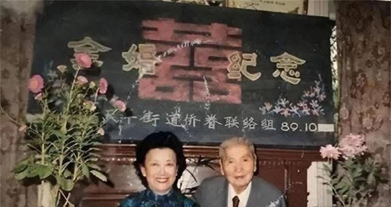

đình trong giới công thương như vợ chồng Lưu Niệm Nghĩa, vợ chồng Vinh Nghị Nhân, vợ chồng Thịnh Khang Niên,… Mọi người thường xuyên họp hành và dùng bữa cùng nhau.
Sau khi cải cách mở cửa, Nghiêm Nhân Mỹ còn trực tiếp sáng lập hai cơ sở kinh doanh là “Hội phục vụ Kiều hữu” và “Nhà trẻ Kiều Tinh”, chủ yếu phục vụ thân nhân kiều bào và kêu gọi đầu tư từ hải ngoại, góp phần thúc đẩy sự phát triển của đại lục.

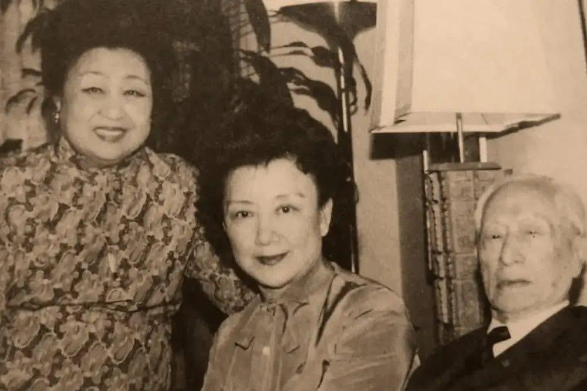

Nghiêm Nhân Mỹ (ở giữa) thăm người cô thứ 6 Nghiêm Ấu Vận và chồng của Nghiêm Ấu Vận là Cố Duy Quân tại New York năm 1980. Khi sang New York, ban đầu, Nghiêm Nhân Mỹ ở nhà người thân, 2 ngày sau được Khổng Lệnh Nghi đón về và lưu trú tại nhà riêng suốt 2 tháng.

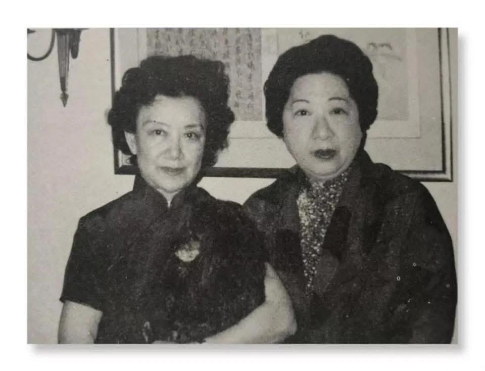

Nghiêm Nhân Mỹ (trái) tái ngộ với Khổng Lệnh Nghi (phải) tại New York năm 1980.
Năm 1995, Trương Học Lương đang dưỡng bệnh tại Hawaii, ngồi trong sân nhỏ nhắm mắt tĩnh dưỡng. Lúc này, thư ký bước vào báo cáo:
“Có một phu nhân từ đại lục muốn đến thăm ngài, có gặp hay không ạ?”
“Là ai?”
“Nghiêm Nhân Mỹ.”

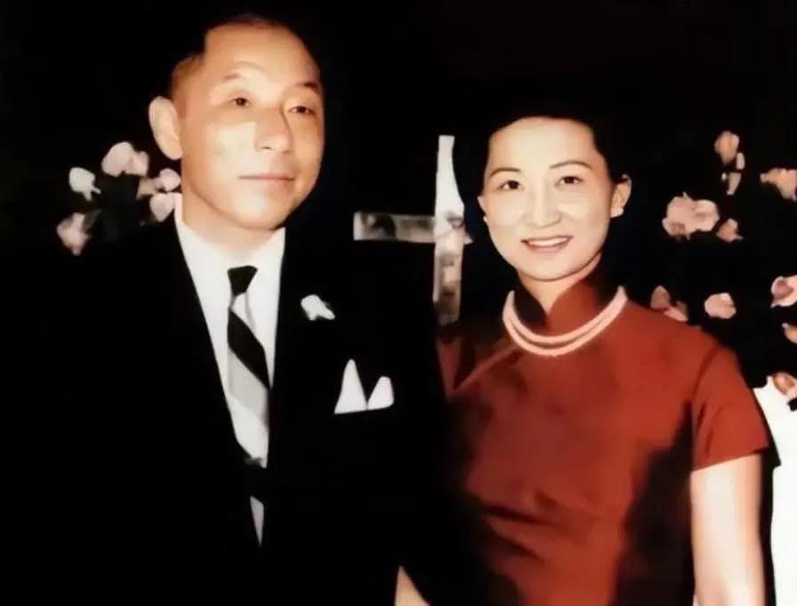

Trương Học Lương — người vì sự kiện Tây An mà bị cha con họ Tưởng quản thúc trong thời gian dài — mãi đến năm 1990 mới thực sự được tự do. Thế nhưng ngày được nhìn lại ánh mặt trời, ông đã không còn là vị thiếu soái khí phách năm xưa, mọi chuyện cũ gắn liền với ông đều đã bị cuốn trôi vào dòng chảy lịch sử.
Trương Học Lương và người vợ thứ ba, Triệu tứ tiểu thư Triệu Nhất Địch.
Có lẽ vì nửa đầu cuộc đời quá nặng nề, hoặc sau khi trải qua bao sóng gió, ông chỉ mong một tuổi già bình ổn, nên năm 1995, ông cùng Triệu Nhất Địch rời Đài Loan, sang định cư tại Hawaii, Hoa Kỳ.
Sau khi an cư nơi đây, thỉnh thoảng vẫn có bạn bè, người thân từ xa đến thăm. Nhưng phần lớn thời gian, ông đều khép cửa từ chối tiếp khách. Thế mà khi nghe đến cái tên “Nghiêm Nhân Mỹ”, đôi mắt đang khép
hờ của Trương Học Lương bỗng ánh lên niềm vui bất ngờ: “Gặp, gặp chứ! Nhất định phải gặp! Không gặp thì e là không còn kịp nữa!”
Khi ấy, vị thiếu soái tuổi đã xế chiều vừa tròn 95, còn tứ tiểu thư nhà họ Triệu bên cạnh ông đã 83 tuổi. Nghiêm Nhân Mỹ, người vượt đại dương đến thăm, cũng đã bước sang tuổi 80.
Khoảnh khắc Nghiêm Nhân Mỹ trong chiếc sườn xám giản dị, chậm rãi tiến về phía hai người, một bức

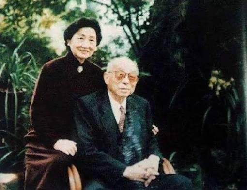

tranh lịch sử vừa như mộng vừa như thực dường như cũng từ đó mà lặng lẽ mở ra…
Năm 1999, Lý Tổ Mẫn — người đã nương tựa, đồng hành cùng Nghiêm Nhân Mỹ suốt hơn 20 năm — qua đời vì bạo bệnh. Hai năm sau, cô con gái út cũng không qua khỏi. Các con lo lắng cho sức khỏe của mẹ nên đón Nghiêm Nhân Mỹ về Thâm Quyến sống cùng gia đình người con trai thứ 2, dành cho Nghiêm Nhân Mỹ sự chăm sóc chu đáo và ấm áp.
Năm 2009, khi đã 94 tuổi, mái tóc của Nghiêm Nhân Mỹ không cần uốn, không cần sấy, vẫn buông rủ tự nhiên, hầu như chẳng có mấy sợi bạc. Chủ tịch Hội Liên hiệp Phụ nữ Thượng Hải còn đích thân đến thăm, xin Nghiêm Nhân Mỹ chia sẻ bí quyết gìn giữ nét trẻ trung.
Năm 2017, Nghiêm Nhân Mỹ tròn 102 tuổi. Ngày 24 tháng 5 năm ấy, người cô thứ 6 là Nghiêm Ấu Vận qua đời, hưởng thọ 112 tuổi. Những tiểu thư tài sắc lừng danh của nhà họ Nghiêm khi xưa, giờ chỉ còn lại một mình Nghiêm Nhân Mỹ.
Nhà văn Ba Kim18 từng nói, sống lâu đôi khi là một sự trừng phạt. Nhưng với Nghiêm Nhân Mỹ, được chứng kiến hơn một thế kỷ biến thiên của thời cuộc lại là ân huệ mà ông trời ban tặng.
Nghiêm Nhân Mỹ không muốn trở thành một “mẫu vật sống” chỉ để người đời chiêm ngưỡng. Trong câu chuyện đời mình, thời đại đủ dài, số phận đủ quanh co, nghịch cảnh đủ ly kỳ, và Nghiêm Nhân Mỹ đã đáp lại tất cả bằng một cuộc đời tròn đầy, rực rỡ và sâu xa.
Khi “sóng dữ vỗ bờ”, Nghiêm Nhân Mỹ ngọc ngà tung bay. Khi “gió mát nhẹ thổi”, Nghiêm Nhân Mỹ nâng chén mời trăng.
Những phồn hoa thấy được, lẫn sương khói mưa lạnh không nhìn thấy, tất cả đều được người phụ

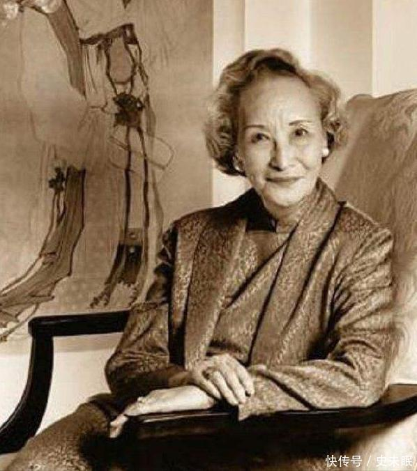

nữ này gom góp, cất giữ trong cuộc đời mình.
Năm 105 tuổi, sức khỏe của Nghiêm Nhân Mỹ vẫn rất tốt. Nhiều người thắc mắc: không hề tập thể dục, lại còn thích ăn thịt, vậy vì sao vẫn trường thọ như thế? Nghiêm Nhân Mỹ mỉm cười, chỉ nói hai chữ: “Tâm thái.” Tâm thái tốt thì lòng nhẹ nhàng, mà lòng nhẹ nhàng thì đời tự khắc dài lâu.
Hàn Sơn19 từng hỏi Thập Đắc: “Người đời có kẻ phỉ báng ta, lừa ta, sỉ nhục ta, cười nhạo ta, coi khinh ta, khinh rẻ ta, ác với ta, gạt ta, thì nên đối xử thế nào?”
Ba Kim người đất Thục, gốc Thành Đô, họ Lý, tên húy là Nghiêu Đường, tự Phất Cam. Sinh năm Quang Tự thứ 30. Thuở nhỏ tiếp nhận gia huấn trong nhà, tư chất lanh lợi, ham học hỏi. Khi trưởng thành, mang sách sang Thượng Hải cầu học, thấm nhuần Tây học, đặc biệt yêu thích trước tác của Rousseau và Tolstoy. Từ đó hun đúc tinh thần nhân đạo, nhìn thấu thời cuộc gian nan, lấy ngòi bút thay gươm giáo, phát dương chính nghĩa. Ngòi bút của ông như cành trúc, từng chữ tựa máu đọng, không cần tô điểm hoa mỹ, chỉ tìm sự chân thành, lời lẽ mộc mạc mà tình cảm thật thà, ý tứ sâu sắc trong sự giản dị. Trong thời biến động, dù nhiều lần gặp gian khó, lòng nhiệt thành vẫn không thay đổi. Tác phẩm đồ sộ, bản dịch cũng phong phú, ảnh hưởng sâu rộng đến văn giới, công lao trong việc khai sáng tri thức. Ông từng nói: “Tôi viết bằng tay, là viết bằng cả trái tim.” 19 Hàn Sơn, người quận Cự Lộc (nay thuộc thành phố Hình Đài), là thiền tăng kiêm thi sĩ thời nhà Đường. Ông hoạt động khoảng từ niên hiệu Đường Đức Tông đến Đường Chiêu Tông.
Thập Đắc20 đáp: “Chỉ cần nhẫn nhịn họ, nhường nhịn họ, mặc kệ họ, tránh xa họ, chịu đựng họ, tôn trọng họ, đừng để tâm đến họ. Đợi vài năm nữa, rồi cứ nhìn xem họ ra sao.”
“Tâm an chính là con đường trường sinh, niềm vui ở đời không gì hơn được sống tự tại.”
Một người có thể sống thọ, yếu tố di truyền của gia đình dĩ nhiên rất quan trọng, nhưng tâm thế của bản thân cũng là điều không thể xem nhẹ. Cuộc đời Nghiêm Nhân Mỹ trăm vòng nghìn ngã, thăng trầm liên tiếp, vậy mà vẫn có thể học cách hòa giải với khổ đau, giữ vững niềm tin và từng bước tiến về phía trước.
Trong mắt có sao trời biển lớn thì đâu lo không gặp được vầng trăng sáng giữa không trung?

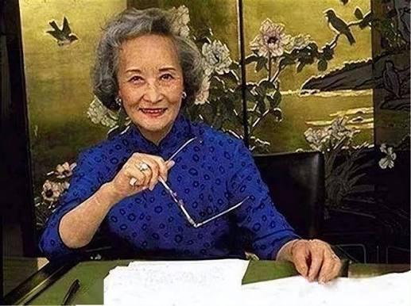

Nghiêm Nhân Mỹ mang theo vẻ đẹp và phong hoa của cả một thế kỷ, ung dung đi qua năm tháng. Đến hôm nay đã tứ đại đồng đường, đại gia đình trên dưới tổng cộng 37 người, người chắt trưởng cũng đã qua tuổi 20.
Cuộc đời Nghiêm Nhân Mỹ không hề uổng phí. Từng nỗ lực vì tự do yêu đương và ý thức độc lập của chính mình, 2 lần từ chối hôn nhân. Lần đầu dù thất bại, phải nhượng bộ trước cha, gả nhầm cho Mã Quán Lương, nhưng lần thứ hai, Nghiêm Nhân Mỹ kiên quyết chống cự sự quấy nhiễu vô lý của người Nhật, thể hiện khí tiết dân tộc đáng quý, hay có thể gọi là phong thái của bậc danh gia.
Cuộc đời không rực rỡ như những người bạn thân nổi tiếng cùng thời như Triệu Nhất Địch, Ngô Tĩnh, Khổng Lệnh Nghi,… Nghiêm Nhân Mỹ sống bình dị, điềm nhiên, nhưng lại sống đúng với bản ngã của mình. Chỉ riêng việc trường thọ, con cháu đầy đàn là đã vượt trội hơn nhiều bạn bè, và đó chẳng phải cũng là một dạng hạnh phúc hay sao?
Năm 2024, ở tuổi 109, Nghiêm Nhân Mỹ vẫn giữ trọn vẻ thanh nhã như thuở nào.
20 Thập Đắc là thiền tăng kiêm thi sĩ thời nhà Đường. Ông cùng Hàn Sơn và Phong Can ẩn cư tại chùa Quốc Thanh trên núi Thiên Đài, được tôn xưng là “Quốc Thanh Tam Ẩn”. Trong dân gian, Thập Đắc và Hàn Sơn được hợp xưng là Hòa Hợp Nhị Tiên và được thờ phụng. Trong các đề tài tranh thiền, Thập Đắc thường xuất hiện cùng Hàn Sơn với hình tượng còn tóc. Nếu Hàn Sơn cầm quyển trục, thì Thập Đắc lại cầm cây chổi.
