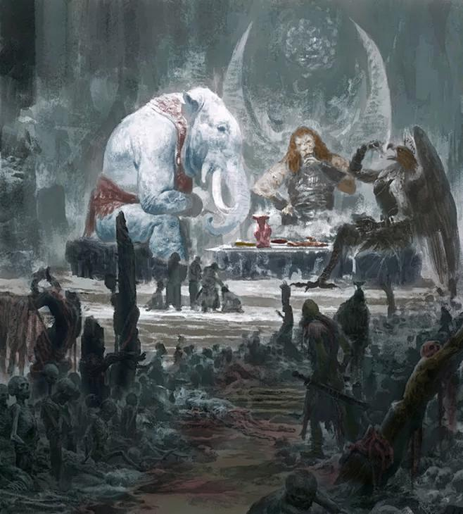
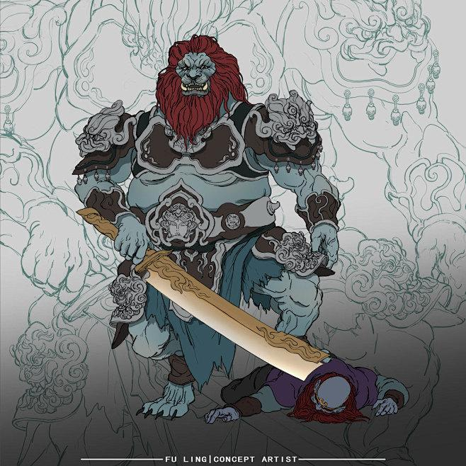
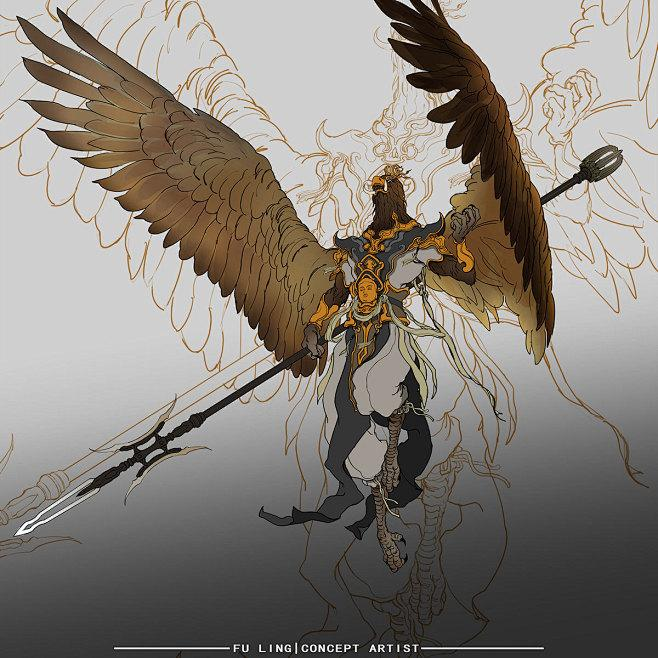
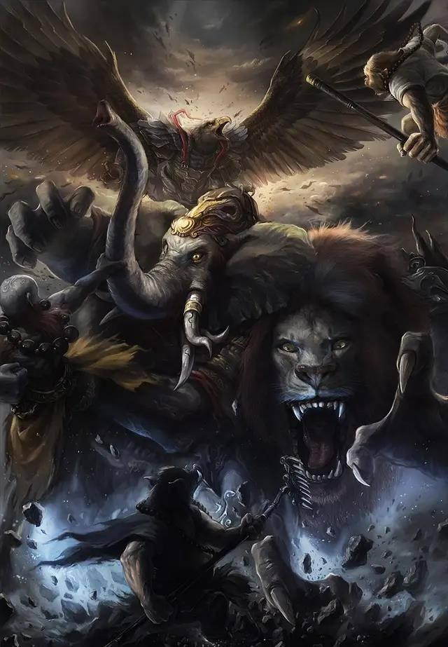
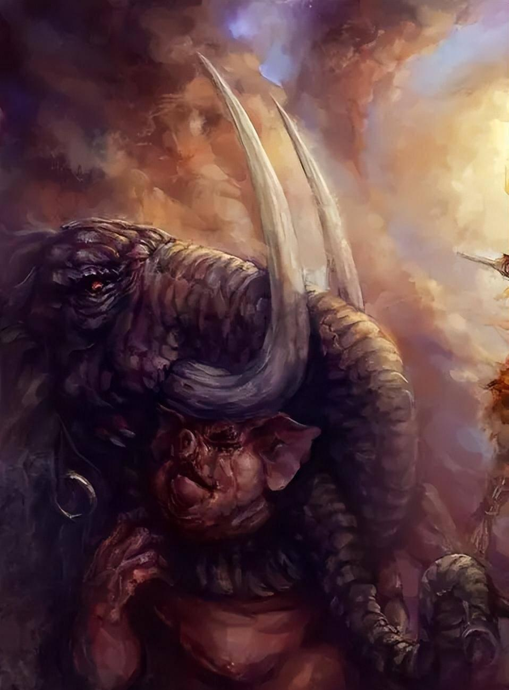
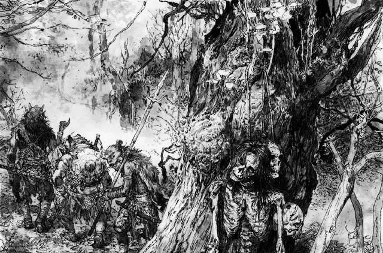
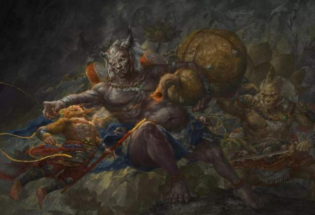
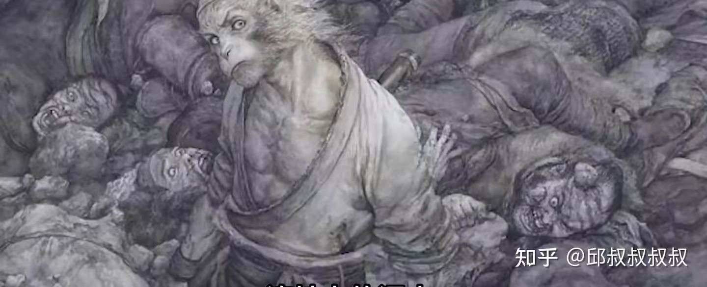

> © Lược dịch từ các bài viết của **@杨角风发作**, **@佳乐爱体育**, **@芹姐爱吃麻**, **@张无远**, **@孙火火** trên Sohu / QQ / Zhihu.

> © Bài dịch gốc của Facebook page [Hôm nay giới thượng lưu có gì?](https://www.facebook.com/Homnaygioithuongluucogi "Hôm nay giới thượng lưu có gì?")
---

## Phần 1: Xác chết trên núi Sư Đà chất đầy 800 dặm — Phật Tổ làm ngơ không thấy?

*Bài gốc: @杨角风发作 — Sohu, 12/10/2021*

Trong *Tây Du Ký* có một quốc gia vô cùng đặc biệt. Sự đặc biệt ấy không nằm ở chỗ quốc gia này yếu hay mạnh, mà ở chỗ toàn bộ đất nước không còn lấy một người sống.

Quốc gia đó chính là **nước Sư Đà**. Vốn dĩ đây từng là một nước khá bình thường, nhưng 500 năm trước lại gặp phải tai họa lớn, bị Chim Đại Bàng tàn phá:

> *"500 năm trước, nó đã ăn thịt quốc vương cùng toàn bộ văn võ bá quan của nước này, nam nữ lớn nhỏ trong thành cũng bị nó ăn sạch, vì thế đoạt lấy giang sơn ấy, nay toàn là yêu quái."*

Điều này quả thật kỳ lạ. Cần biết rằng nước Sư Đà ở rất gần Linh Sơn, mà Chim Đại Bàng lại là người của cửa Phật, vậy cớ sao Phật Tổ Như Lai lại khoanh tay đứng nhìn, mặc cho nó tác oai tác quái như vậy?

### Ba đại vương Sư Đà Lĩnh

Sau khi thầy trò Đường Tăng đến Sư Đà Lĩnh, Tôn Ngộ Không từng hóa thành một tiểu yêu để dò la tin tức từ Tiểu Toàn Phong. Khi Tiểu Toàn Phong giới thiệu bản lĩnh của 3 vị đại vương đã nói:

> *"Tam đại vương của ta không phải quái vật phàm gian, danh hiệu là Vân Trình Vạn Lý Bằng, khi hành động thì cuốn gió dời biển, tung hoành Nam Bắc."*

Chính con quái vật không thuộc nhân gian này, 500 năm trước đã một hơi ăn sạch dân chúng nước Sư Đà rồi chiếm lấy giang sơn ấy.

Tuy nhiên, Chim Đại Bàng và Sư Tử Tinh, Bạch Tượng Tinh vốn không phải bằng hữu từ đầu. Sở dĩ chúng kết minh là vì Chim Đại Bàng nghe ngóng được tin Đường Tăng sẽ đi qua nơi này, nên cố ý chạy tới liên minh:

> *"Chỉ vì sợ một đồ đệ của hắn là Tôn Hành Giả quá lợi hại, một mình khó đối phó, nên mới đến đây kết nghĩa huynh đệ với hai vị đại vương này, đồng lòng hợp sức, cùng bắt Đường Tăng."*

Tôn Ngộ Không trở thành đồ đệ của Đường Tăng cũng chỉ là chuyện vài năm gần đây, từ đó có thể suy ra rằng việc Chim Đại Bàng kết minh với Sư Tử Tinh và Bạch Tượng Tinh cũng chỉ mới xảy ra vài năm.

Điều này thực ra rất dễ hiểu. Nếu Thanh Mao Sư và Bạch Tượng đã ở đây suốt hơn 500 năm thì Văn Thù Bồ Tát và Phổ Hiền Bồ Tát quả thật nên bị hỏi tội. Dù sao thì hai con này vốn là thú cưỡi của Bồ Tát — tương đương với tài xế của quan chức cấp cao Linh Sơn, có biên chế chính thức. Cho dù có nghỉ phép dài hạn, cũng không thể kéo dài đến mức ấy.

### Thế lực của ba yêu quái

Thái Bạch Kim Tinh mô tả 3 con yêu quái nước Sư Đà như sau:

> *"Yêu tinh ấy chỉ cần gửi một phong thư đến Linh Sơn, 500 vị La Hán đều phải ra nghênh đón. Viết một tờ thiệp lên Thiên Cung, 11 vị Đại Diệu tinh quân đều kính nể. Tứ Hải Long Vương từng kết giao với hắn, Bát Động Tiên thường cùng hắn tụ hội, Thập Điện Diêm Quân xưng huynh gọi đệ, các thần Thổ Địa, Thành Hoàng xem nhau như bằng hữu."*

Từ lời mô tả của Thái Bạch Kim Tinh, có thể thấy rằng ông ta biết rõ mọi chuyện. Dù biết chúng tà ác đa đoan, ông ta cũng không dám nói nhiều, thậm chí đối phương chỉ cần gửi thư cho Thiên Đình, ông ta cũng phải đích thân đến nghe sai phái.

Điều này mới thật sự kỳ lạ. Nếu Ngưu Ma Vương mà có được thế lực hùng hậu như vậy, e rằng đã sớm bị Thiên Đình và Linh Sơn bắt tay nhau tiêu diệt sạch sẽ. Vậy tại sao đến nước Sư Đà, Linh Sơn lại hoàn toàn không can thiệp?

### Thỏa thuận giữa Như Lai và Ngọc Đế

Muốn làm rõ vấn đề này, chúng ta phải quay ngược lại 500 năm trước.

Thực ra, năm đó đã xảy ra rất nhiều chuyện lớn, mà trọng tâm nằm ở một **cuộc chính biến trong Thiên Đình**. Đừng tưởng rằng năm xưa đại náo Thiên Cung chỉ có mỗi Tôn Ngộ Không gây ra, sự thật không hoàn toàn là như vậy.

Từ việc Vương Mẫu nương nương lén cất giữ những quả Bàn Đào lớn, có thể thấy bà ta cũng đang ra mặt thách thức Ngọc Hoàng Đại Đế. Chính vì nguyên nhân ấy, mới có việc Ngọc Đế sắp xếp Tôn Ngộ Không trông coi vườn Bàn Đào, và sau đó là chuyện Phật Tổ Như Lai đến "cứu giá". Trên thực tế, **không phải là các đại thần Thiên Đình không đối phó nổi Tôn Ngộ Không, mà là Ngọc Đế đã đạt được một thỏa thuận với Như Lai**.

Thỏa thuận đó là: Như Lai phải vô điều kiện ủng hộ Ngọc Đế, còn Ngọc Đế thì ngầm cho phép Linh Sơn mở rộng ảnh hưởng, thậm chí truyền bá Phật giáo sang Nam Thiệm Bộ Châu, đồng thời tạo mọi điều kiện thuận lợi.

Bề ngoài nhìn vào, dường như Phật Tổ Như Lai được lợi, nhưng thực ra không hẳn vậy. **Người thắng lớn nhất cuối cùng lại chính là Ngọc Hoàng Đại Đế.** Bởi sau khi đoàn thỉnh kinh náo động một phen, Tây Ngưu Hạ Châu — nơi trước kia Ngọc Đế không thể can thiệp — về sau cũng có thể dễ dàng nhúng tay.

### Nước Sư Đà — con bài của Như Lai

Như Lai Phật Tổ muốn truyền bá Phật pháp, thì ít nhất cũng phải khiến người ta thấy được sự "lợi hại" của Phật pháp. Cách làm rất đơn giản: chỉ cần nâng đỡ một con yêu quái tà ác tại địa phương, khuấy đảo khiến dân chúng sống không yên ổn, thì Phật Môn mới có đất dụng võ.

Vì thế, Như Lai Phật Tổ mới nhắm mắt làm ngơ, đồng thời ra sức tuyên truyền cái gọi là "cuộc sống tự do và sung túc" ở Tây Ngưu Hạ Châu:

> *"Tây Ngưu Hạ Châu ta đây không tham, không sát, dưỡng khí tiềm linh. Tuy không có bậc thượng chân[^1], nhưng ai nấy đều sống lâu."*

[^1]: **Bậc thượng chân** (上真) là thuật ngữ Đạo–Phật cổ, dùng để chỉ người tu hành đạt cảnh giới rất cao, đã chứng đạo, thoát khỏi phàm tục, có thần thông, thọ mệnh lâu dài, gần với chân tiên/chân Phật.

Phật gia nói chúng sinh bình đẳng, nhưng trên thực tế, ngay cả trong "thành phố tự do" — tức nước Sư Đà — cũng không hề bình đẳng chút nào:

> *"Kẻ giữ cổng thành đều là binh sói[^2]; kẻ làm đô quản là hổ vằn sặc sỡ[^3]; kẻ làm tổng binh là gấu mặt trắng[^4]; kẻ làm thư lại là nai sừng ngã ba[^5]; còn dân chúng đi lại ngoài phố thì toàn là cáo lanh lợi[^6], đại mãng ngàn thước, trường xà vạn trượng[^7]…"*

[^2]: **Binh sói** (狼兵): yêu quái sói làm lính gác, tượng trưng cho kẻ chỉ biết tuân lệnh, hung hăng, không có đầu óc, chuyên làm công cụ bạo lực cho kẻ cầm quyền.
[^3]: **Hổ vằn sặc sỡ** (斑斓老虎): yêu quái hổ vằn giữ chức đô quản, tượng trưng cho quan võ thị uy, lấy sức mạnh và hình phạt để cai trị.
[^4]: **Gấu mặt trắng** (白面熊彪): tượng trưng cho kẻ giữ binh quyền to xác nhưng chậm chạp, ngu độn, bề ngoài nhân nghĩa, bên trong chỉ biết hưởng lộc và giữ ghế.
[^5]: **Nai sừng ngã ba** (丫叉角鹿): yêu quái nai có gạc chĩa, tượng trưng cho kẻ làm việc giấy tờ, mưu mô, xảo quyệt.
[^6]: **Cáo lanh lợi** (伶俐狐狸): tượng trưng cho kẻ khôn lỏi, luồn lách để sinh tồn, sống trong xã hội bạo tàn nên buộc phải dùng mưu mẹo thay cho đạo đức.
[^7]: **Đại mãng ngàn thước, trường xà vạn trượng** (千尺大蟒、万丈长蛇): tượng trưng cho những kẻ sống bằng bản năng sợ hãi, mạnh hiếp yếu, xã hội đã hoàn toàn thú tính hóa.

Không chỉ yêu quái ở nước Sư Đà được phân chia đẳng cấp cao thấp, mà nơi ở của chúng cũng hoàn toàn khác biệt. Ví dụ như động Sư Đà, tầng ngoài cùng ban đầu trông như thế này:

> *"Xương sọ chất thành núi, hài cốt dày như rừng. Tóc người dệt thành thảm, da thịt người nát rữa hóa thành bùn đất. Gân người quấn trên cây, khô cháy lấp lánh như bạc…"*

Âm u đến cực điểm, kinh hoàng đến tột độ, chẳng khác nào địa ngục trần gian. Thế nhưng, sau khi xuyên qua 2 tầng động, cảnh tượng bên trong lại hoàn toàn trái ngược:

> *"Thanh u kỳ lạ, nhã nhặn tĩnh lặng; đẹp đẽ rộng rãi. Hai bên có cỏ ngọc hoa tiên, trước sau có tùng cao trúc biếc."*

### Kết luận: Nước Sư Đà — con tốt trong ván cờ của Linh Sơn

Vì thế, **nước Sư Đà chính là một ổ yêu quái mà Như Lai Phật Tổ cố ý dung túng**, dùng để cảnh cáo những quốc gia không tin Phật: coi chừng bị Chim Đại Bàng nuốt chửng trong một cú đớp!

Thế Chim Đại Bàng ăn sạch dân cả nước, có bị Phật Tổ trừng phạt hay không?

Tất nhiên là không! Không những không bị phạt, mà còn lập công lớn, bởi Như Lai Phật Tổ trước mặt chư vị thần Phật, đã nói một câu:

> *"Ta cai quản tứ đại bộ châu, vô số chúng sinh ngưỡng vọng. Phàm ai làm việc thiện, ta bảo họ trước hết tế lễ nơi miệng của ngươi."*

Trước khi việc thỉnh kinh bắt đầu, Như Lai Phật Tổ chỉ nói mình quản Tây Ngưu Hạ Châu, vậy mà bây giờ đã bắt đầu quản luôn cả tứ đại bộ châu rồi. Tín đồ khắp nơi, chẳng phải chính là chứng minh rằng sự diệt vong của nước Sư Đà đã tạo ra hiệu ứng răn đe đối với các quốc gia khác hay sao?

Dù sao thì **trong mắt Phật gia, căn bản không nhìn thấy 800 dặm xác chết ở Sư Đà Lĩnh, bởi thứ ông ta nhìn vào, chính là của cải của Đại Đường!**

> *Đổi một góc nhìn để đọc Tây Du Ký, bạn sẽ phát hiện ra những điều thú vị hoàn toàn khác.*

---

## Phần 2: Khó khăn lớn nhất trên đường đi Tây Thiên — Sư Đà Lĩnh đáng sợ đến mức nào?

*Bài gốc: @佳乐爱体育 — Sohu, 24/10/2022*

*Tây Du Ký* có thể nói là một trong những tác phẩm kinh điển được đông đảo mọi người yêu thích nhất, đặc biệt là bộ phim truyền hình *Tây Du Ký* do đạo diễn Dương Khiết thực hiện. Bộ phim này quả thực quá xuất sắc, đến mức chúng ta gần như đã coi nó tương đương với nguyên tác.

Tuy nhiên, phiên bản truyền hình nhằm phù hợp với trải nghiệm xem của khán giả ở mọi lứa tuổi nên đã có rất nhiều xử lý mang màu sắc cổ tích, khiến khi xem chúng ta tràn ngập cảm giác vui vẻ và hiếm khi cảm nhận được sự kinh dị. **Nhưng nguyên tác thì không như vậy: nó u tối hơn rất nhiều và cũng đáng sợ hơn rất nhiều so với những gì chúng ta tưởng tượng.**

Trong đó, nơi đáng sợ nhất không đâu khác ngoài **Sư Đà Lĩnh**.

Tôn Ngộ Không là nhân vật như thế nào? Trời không sợ, đất không sợ, một mình dám thách thức đầy trời thần Phật, đại náo Thiên Cung. Một kẻ không biết sợ hãi là gì, vậy mà trên Sư Đà Lĩnh lại bị dọa đến mức chân mềm nhũn, nhiều lần rơi nước mắt, mấy phen muốn bỏ cuộc.

### Quy mô của Sư Đà Lĩnh

Sư Đà Lĩnh còn gọi là **800 dặm Sư Đà Lĩnh**. Theo miêu tả trong nguyên tác, đường kính của Sư Đà Lĩnh lên tới 800 dặm, còn bề ngang thì rộng đến mức ngay cả khỉ cũng không nhìn thấy ranh giới. Cần biết rằng Hỏa Nhãn Kim Tinh của Tôn Ngộ Không ban ngày có thể nhìn xa ngàn dặm, ban đêm cũng thấy được 300–500 dặm. Tính như vậy, Sư Đà Lĩnh dài 800 dặm, ngang ít nhất cũng phải 1000 dặm, **tổng diện tích hẳn vượt qua 800 nghìn dặm vuông**.

### Cảnh tượng địa ngục

Vậy Sư Đà Lĩnh rốt cuộc đáng sợ đến mức nào? Nguyên tác đã miêu tả như sau:

> *"Sọ chất như núi, xương trắng tựa rừng. Tóc người kết lại thành thảm, da thịt người thối rữa hóa bùn nhơ. Gân người quấn trên cây, khô cháy lấp lánh như bạc. Quả thực là núi thây biển máu, mùi tanh hôi nồng nặc. Phía Đông, lũ tiểu yêu bắt người sống xẻ thịt. Phía Tây, đám ma quái đem thịt người nấu lên, ăn tươi nuốt sống."*

Ý ở đây là khắp Sư Đà Lĩnh, núi non đồng nội đều đầy rẫy thi cốt. Yêu quái lấy tóc người, da người làm đệm ngồi, nước suối ao hồ đều bị máu nhuộm đỏ.

Trên Sư Đà Lĩnh có tổng cộng **4 vạn 7–8 nghìn yêu quái**, là nơi có số lượng yêu quái nhiều nhất trong toàn bộ tiểu thuyết. Trong đó, yêu quái trung cấp có vài nghìn tên, yêu quái cao cấp có vài trăm tên, còn yêu quái siêu cấp có 3 kẻ, lần lượt là **Thanh Mao Sư Tử Quái**, **Hoàng Nha Lão Tượng** và **Đại Bàng Kim Sí Điểu**.

- Thanh Mao Sư Tử Quái được cho là chỉ cần một miệng đã nuốt trọn hàng vạn thiên binh thiên tướng.
- Hoàng Nha Lão Tượng thì sức mạnh vô song, mọi loại phòng ngự kiên cố trước hắn đều chẳng đáng kể.
- Còn Đại Bàng Kim Sí Điểu thì khỏi cần nói, **ngoài Như Lai Phật Tổ ra, không ai là đối thủ của nó**.

---

## Phần 3: 800 dặm Sư Đà Lĩnh — bãi chôn cất hàng triệu người, nhưng lại là "thánh địa hành hương" của Linh Sơn

*Bài gốc: @芹姐爱吃麻 — Sohu, 08/06/2023*

Bạn có biết vì sao Sư Đà Lĩnh trong *Tây Du Ký* lại đáng sợ đến như vậy không? Thì ra nơi đó chính là bãi tha ma lớn nhất dưới chân Linh Sơn, tức thứ mà trong kinh Phật gọi là **"Thi Đà Lâm" (尸陀林)** — âm dịch từ tiếng Phạn. Đây là nơi bỏ xác, cũng là nghĩa địa của tăng nhân.

### Thi Đà Lâm — nguồn gốc thực sự của Sư Đà Lĩnh

Tác giả *Tây Du Ký* sở dĩ đặt tên nơi này là Sư Đà Lĩnh, chính là **mượn âm gần giống của từ Phạn "Thi Đà Lâm"**. "Thi Đà Lâm" còn được gọi là Hàn Lâm, là một khu rừng được người Tây Vực cổ đại chỉ định làm nghĩa địa. Khi đó, rất nhiều tăng nhân Phật giáo và tín đồ Phật giáo, sau khi qua đời, thi thể đều được đưa tới đây, vứt bỏ trong rừng, mặc cho sói, chó hoang, hổ báo gặm nhấm.

Trong *Đại Đường Tây Vực Ký* của pháp sư Huyền Trang, có ghi chép rất rõ ràng về hình thức mai táng của nước Thiên Trúc. Trong các nghi thức tang táng của Phật tông, có một loại là sau 3 ngày thì đem thi thể ra ngoài đồng hoang để thú dữ ăn xác.

Việc bố thí bằng máu thịt tại Sư Đà Lâm, trong rất nhiều câu chuyện Phật giáo chúng ta cũng từng nghe qua những truyền thuyết như vua Thiện Tài (Sư Tỳ Vương) lấy thân mình nuôi hổ, hay Bồ Tát Ma-ha-tát xả thân cứu thú dữ. Tất cả đều tuyên dương tư tưởng Bồ Tát bố thí, và cho rằng cảnh giới tối cao của bố thí chính là hiến dâng cả thân xác. Cho đến ngày nay, **tục thiên táng ở khu vực Tây Tạng** vẫn chịu ảnh hưởng sâu sắc từ những tư tưởng tôn giáo ấy.

Thực chất, đây chẳng phải chính là một "Thi Đà Lâm" sống sờ sờ hay sao?

Phương thức tu hành của Mật Tông lại càng đặc biệt. Những người tu hành thời cổ, sau khi thọ quán đỉnh, còn phải cố ý đến những nơi như "Thi Đà Lâm" để thực tu, hơn nữa còn phải trải qua đủ 108 nơi như vậy.

Rõ ràng, tác giả *Tây Du Ký* đối với kiểu tang táng và tu hành của Phật giáo Tây Tạng này là tỏ rõ sự khinh miệt. Với tư tưởng chịu ảnh hưởng sâu đậm của Nho gia, ông tất nhiên cho rằng "người chết được an táng trong đất" mới là sự tôn trọng lớn nhất dành cho người đã khuất. Chính vì thế, **ông đã dùng bút pháp châm biếm sâu cay để hoàn thành hồi truyện này**.

### Tại sao 3 đại ma đầu nhất định phải là người của Phật gia?

Thế thì vì sao 3 đại ma đầu trấn giữ Sư Đà Lĩnh lại nhất định phải là Thanh Sư, Bạch Tượng và Đại Bàng của Phật gia? **Đó chính là để châm biếm những kẻ tự xưng là người của Phật Môn từng tu hành trong "Thi Đà Lâm"**.

Nước Sư Đà có tới hàng triệu dân, từng ấy máu thịt thật sự đều bị Kim Sí Đại Bàng nuốt trọn trong một hơi sao? Cái gọi là công đức máu thịt ấy, lẽ nào thật sự không chảy vào tay Linh Sơn? Vì thế, **sự diệt vong của hàng triệu dân nước Sư Đà chính là kết cục bi thảm do "Thi Đà Lâm" mang lại**.

---

## Phần 4: Sư Đà Lĩnh đáng sợ đến mức nào? Đường Tăng suýt bị ăn thịt, Tôn Ngộ Không sợ đến mềm nhũn chân

*Bài gốc: @张无远 — QQ, 03/08/2020*

Sư Đà Lĩnh trong Tây Du Ký rốt cuộc đáng sợ ra sao? Nếu bạn chỉ từng xem bản phim Tây Du Ký 1986 của đài CCTV, thì rất có thể bạn sẽ thấy 3 con yêu quái kia giống như đến để gây cười, cứ như một bộ phim thiếu nhi. Còn nếu bạn đã xem bản Tây Du Ký 2011, thì ở phần Sư Đà Lĩnh & Sư Đà Quốc, cảnh quay hoành tráng hơn nhiều, nhưng vẫn chưa thể hiện hết được sự kinh hoàng của Sư Đà Lĩnh.

### Bút pháp dẫn dắt của tác giả

Câu chuyện diễn ra trong **hồi 74–78** của bản trăm hồi *Tây Du Ký*. Trước khi chính thức bắt đầu, tác giả đã dốc sức tô đậm mức độ "địa ngục" của Sư Đà Lĩnh, trước hết sắp xếp một nhân vật tầm cỡ như Thái Bạch Kim Tinh đến báo động cho 4 thầy trò. Theo lời Thái Bạch Kim Tinh, chỉ riêng động Sư Đà ở Sư Đà Lĩnh đã có 3 đại ma đầu và **48.000 tiểu yêu** — quy mô này đứng hàng đầu trong toàn bộ tác phẩm.

Tôn Ngộ Không vốn gan lớn, nghe xong lời Thái Bạch Kim Tinh vẫn tỏ vẻ lơ là. Đây chính là bút pháp của tác giả: thông qua sự chủ quan của 3 huynh đệ, khiến người đọc cũng nghĩ rằng sóng gió nào chưa từng gặp, để rồi khi thật sự nhìn thấy cảnh tượng Sư Đà Lĩnh, tạo nên sự tương phản mạnh mẽ, càng làm nổi bật sự đáng sợ của nơi này.

Rồi Tôn Ngộ Không hóa thành Tiểu Toản Phong, tiến vào động Sư Đà, chỉ thấy:

> *"Xương sọ chất cao như núi, hài cốt ken dày như rừng. Tóc người kết lại thành từng mảng như tấm nỉ, da thịt người thối rữa hóa thành bùn đất. Gân người quấn trên cành cây, khô quắt mà lấp lánh như bạc. Thật đúng là núi xác biển máu, mùi tanh hôi nồng nặc khó ngửi. Phía Đông, đám tiểu yêu bắt người sống về lóc thịt. Phía Tây, lũ yêu quái thì đem thịt người tươi ra nấu nướng ngay tại chỗ. Nếu không phải Tôn Ngộ Không gan dạ như vậy, thì kẻ phàm tục thứ hai tuyệt đối không dám bước chân qua cửa của chúng."*

### Tôn Ngộ Không rơi lệ

Trong 4 thầy trò đi thỉnh kinh, Tôn Ngộ Không cũng như Đường Tăng đều là những người vô cùng kiên định. Gặp chuyện lớn đến đâu thì cứ đánh, đánh không lại thì đi cầu viện, vốn chẳng hề sợ hãi. Thế nhưng tại Sư Đà Lĩnh, **Ngộ Không hiếm hoi lại rơi nước mắt** — đó là khi bị nhốt vào bình Âm Dương:

> *"Chỗ khớp xương đau nhức, vội đưa tay sờ thử, nào ngờ đã bị lửa thiêu đến mềm nhũn. Tự mình hoảng hốt nghĩ: 'Làm sao đây? Khớp xương bị nung mềm rồi! Chẳng lẽ biến thành kẻ tàn phế ư!' Không kìm được mà nước mắt rơi xuống."*

Vì sao Tôn Ngộ Không lại rơi lệ? Bởi vì lúc đó hắn đã cảm nhận được nguy cơ mất mạng, không thể cứu Đường Tăng thoát nạn, cả đoàn thầy trò có thể bị tiêu diệt toàn bộ. Thử nghĩ xem phải tuyệt vọng đến mức nào, Tề Thiên Đại Thánh mới nảy sinh ý nghĩ như vậy:

> *"Thưa sư phụ! Năm xưa con quy chính, nhờ Quan Âm Bồ Tát khuyên răn hướng thiện, mới thoát khỏi tai ương… Nào ngờ hôm nay lại gặp phải ma đầu độc ác này, lão Tôn lầm bước vào đây, e rằng phải bỏ mạng, để người lại giữa lưng núi, không thể tiến lên! Nghĩ lại chắc vì ngày trước danh tiếng quá cao, nên mới có kiếp nạn hôm nay!"*

Đối với tâm trạng của Ngộ Không lúc này, nguyên tác dùng hai chữ **"thê thương"** (凄怆).

### Kết: Tây Du Ký thực sự tràn đầy tính người và những mảng tối

Nhìn lại biểu hiện của Tôn Ngộ Không từ đầu đến cuối: từ lơ là, coi thường, đến sinh lòng cảnh giác, rồi thê lương rơi lệ, cuối cùng bị dọa đến ngã khuỵu. Có thể thấy tác giả đã khắc họa bầu không khí kinh hoàng của Sư Đà Lĩnh không chỉ bằng miêu tả trực tiếp, mà còn thông qua sự biến chuyển tâm lý của Ngộ Không, **từng tầng từng lớp đẩy nỗi sợ hãi lên cao**.

4 hồi về Sư Đà Lĩnh & Sư Đà Quốc không chỉ khiến Tôn Ngộ Không cảm thấy sợ hãi, mà Đường Tăng ở đây cũng là lúc gần kề cái chết nhất, gần như đã bị ăn thịt. **Đây tuyệt đối là phần đáng sợ nhất trong toàn bộ Tây Du Ký.** Nếu hoàn toàn chuyển thể đúng theo nguyên tác thành phim ảnh, e rằng còn có thể bị xếp vào dạng bị cấm chiếu.

Lấy Đường Tăng làm ví dụ: Vị hòa thượng này không phải ngay từ đầu đã là cao tăng, mà cũng từng là một người có phần ích kỷ, cố chấp. Rồi trên con đường thỉnh kinh, từng bước trưởng thành, cuối cùng mới trở thành bậc cao tăng một thời.

**Đó mới chính là ý nghĩa của hành trình 10 vạn 8 nghìn dặm sang Tây Trúc, chứ không đơn thuần chỉ là đi diệt yêu quái.**

---

## Phần 5: Sư Đà Lĩnh chân thực — núi xác biển máu, da người thịt người

*Bài gốc: @孙火火 — Zhihu*

Sư Đà Lĩnh chân thực là **nơi duy nhất trong Tây Du Ký có thể khiến Tôn Ngộ Không phải e sợ**. Nơi đây chất chồng xác chết, máu chảy thành biển, đến cả đất dưới chân cũng là da người thịt người. Trên vùng đất dài 800 dặm ấy, lại có tới hàng vạn yêu quái sinh sống.

Đó chính là Sư Đà Lĩnh — **một địa ngục trần gian nằm ngay dưới chân Linh Sơn**.

- **Lão đại Thanh Sư tinh** từng một miệng nuốt chửng 10 vạn Thiên Binh.
- **Lão nhị Bạch Tượng tinh** chỉ cần vung vòi là có thể khiến người hồn bay phách tán.
- **Còn lão tam Kim Sí Đại Bàng** là kẻ lợi hại nhất, không chỉ tu vi cao thâm mà còn là **cậu ruột của Như Lai Phật Tổ**. Hắn thậm chí một mình ăn sạch toàn bộ dân chúng của một vương quốc, khiến cả quốc gia biến thành thế giới của yêu quái.

Điều thực sự khiến Tôn Ngộ Không kinh hãi là: **ngay dưới chân Linh Sơn lại tồn tại một nơi đen tối đáng sợ như vậy**. Với thần thông vô thượng của Như Lai, sao có thể không biết đến sự tồn tại của Sư Đà Lĩnh?

Hơn nữa, khi Như Lai ra tay thu phục 3 yêu quái, cũng chỉ đưa chúng về Linh Sơn tiếp tục tu hành. Điều này chẳng phải ngầm cho thấy hành vi của 3 yêu quái phần nào được Như Lai mặc nhiên chấp nhận sao?

**Tôn Ngộ Không vì thế mà lạnh lòng.** Hắn không ngờ rằng càng đến gần Linh Sơn lại càng tối tăm, đến mức không phân biệt nổi trên Linh Sơn rốt cuộc là Phật hay là ma.

> *Nếu so sánh phim truyền hình với nguyên tác, thì phim chẳng khác nào câu chuyện một nhà sư dẫn theo 4 "thú cưng" đi du sơn ngoạn thủy mà thôi.*

---

*Tổng hợp & lược dịch từ các bài viết trên Sohu, QQ, Zhihu. Mọi bản quyền thuộc về tác giả gốc.*
